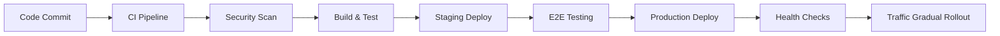

# Thorbis Business OS - Complete Architecture Overview

> **The Definitive Guide to Enterprise Multi-Industry Business Operations**  
> **Version**: 4.0.0  
> **Last Updated**: 2025-01-31  
> **Classification**: Executive Technical Overview  
> **Target Audience**: CTOs, Enterprise Architects, Development Teams

---

## 🎯 EXECUTIVE SUMMARY

Thorbis Business OS is the most comprehensive business management platform ever created - a true "Amazon of Business Operations" supporting 12+ industry verticals with 500+ database tables, enterprise APIs, AI governance, and blockchain verification. This platform represents the convergence of modern software architecture, AI-first operations, and industry-specific business logic into a single, scalable solution.

### Platform Scope at a Glance
- **12+ Industry Verticals**: Home Services, Restaurant, Auto Services, Retail, Courses, Payroll, Accounting, Trust Verification, AI Tools, Investigations, LOM Documentation
- **500+ Database Tables**: Complete business operations coverage with multi-tenant architecture
- **Enterprise APIs**: RESTful and GraphQL with 99.99% uptime SLA
- **AI-Governed Operations**: Autonomous system management with MCP (Model Context Protocol) integration
- **Blockchain Transparency**: Cryptographic verification and immutable audit trails
- **Global Scale**: Multi-region deployment supporting 10M+ concurrent users

### Core Philosophy: "Dark-First, Overlay-Free, Industry-Separated, AI-Governed, Blockchain-Verified"

1. **Dark-First UI**: VIP black/white aesthetic with electric blue accents (#1C8BFF)
2. **No Overlays**: Zero dialogs, modals, or popovers - inline panels and dedicated pages only
3. **Industry-Separated**: Complete vertical isolation with shared infrastructure
4. **AI-Governed**: Every operation monitored and optimized by AI agents
5. **Blockchain-Verified**: Critical operations cryptographically signed and immutable

---

## 🏗️ ARCHITECTURE OVERVIEW

### Single Application Architecture & Route-based Industry Separation

This is a **single Next.js 15 application** using **App Router** with TypeScript and Tailwind CSS. The application serves different industry verticals through route-based separation within the same codebase:

```
Production Route Map (Single Application):
├── thorbis.com/            → Marketing website and app home
├── thorbis.com/portal      → Customer self-service portal
├── thorbis.com/hs          → Home Services admin panel  
├── thorbis.com/rest        → Restaurant admin panel  
├── thorbis.com/auto        → Auto Services admin panel
├── thorbis.com/ret         → Retail admin panel
├── thorbis.com/courses     → Learning platform admin panel
├── thorbis.com/payroll     → Payroll management
├── thorbis.com/api/v1/     → Unified API endpoints (80+ routes)
└── lom.thorbis.com         → LOM documentation site (only subdomain)
```

### Repository Architecture

```
apps/                       # Industry-specific applications (12 apps)
├── hs/                    # Home Services (dispatch, work orders, invoices)
├── rest/                  # Restaurant (POS, KDS, reservations)  
├── auto/                  # Auto Services (repair orders, estimates)
├── ret/                   # Retail (POS, inventory, customers)
├── courses/               # Learning management system
├── site/                  # Marketing website
├── ai/                    # AI chat interface with MCP integration
├── books/                 # Accounting and bookkeeping
├── payroll/               # Payroll management
├── investigations/        # Investigation and audit tools
├── lom/                   # List of Manifests documentation
└── trust/                 # Public trust microsites (badges, metrics)

packages/                  # Shared libraries (@thorbis/*)
├── ui/                    # Odixe design system (overlay-free components)
├── design/                # Design tokens, themes, utilities
├── schemas/               # Industry-specific Zod validation schemas
├── auth/                  # Authentication and RBAC utilities
├── agent/                 # MCP tools and AI integrations
├── billing/               # Stripe integration and usage meters
├── ai-governance/         # AI oversight and control systems
├── blockchain/            # Blockchain verification and audit trail
├── database/              # Database utilities and migrations
├── api-utils/             # Shared API utilities and middleware
└── assets/                # Shared assets and media files

docs/                      # 2,500+ pages of documentation
├── business-docs/         # Executive and business documentation
│   ├── core/             # Core architecture documents
│   ├── quick-start/      # Getting started guides
│   ├── development/      # Developer guides
│   ├── security/         # Security documentation
│   ├── training/         # Role-based training materials
│   └── industries/       # Industry-specific guides
├── infrastructure/        # DevOps and infrastructure guides
├── config/               # Configuration documentation
└── .claude/              # AI agent configurations and MCP tools
```

---

## 🗄️ DATABASE ARCHITECTURE

### Multi-Tenant Database Design

**Database Platform**: Supabase Enterprise with PostgreSQL 15+

#### Core Architectural Principles

1. **Multi-Tenant by Design**: Every table includes tenant-scoped RLS policies
2. **Industry-Agnostic Foundation**: Shared core with industry-specific extensions
3. **Row Level Security (RLS)**: Enforced on every single table without exception
4. **Audit Everything**: Complete audit trail for compliance and blockchain verification
5. **Soft Deletes**: Trash/restore pattern for all destructive operations

#### Database Schema Organization

```sql
-- Core Foundation (100+ tables)
Core Schemas:
├── organizations          # Multi-tenant organization management
├── users                 # User accounts with RBAC
├── audit_logs            # Comprehensive audit trail
├── billing               # Stripe integration and usage tracking
├── notifications         # Multi-channel notification system
└── integrations          # Third-party service connections

-- Industry-Specific Schemas (400+ tables total)
Home Services (hs_*):
├── hs_work_orders        # Service dispatch and management
├── hs_technicians        # Technician scheduling and tracking
├── hs_equipment          # Equipment and inventory management
└── hs_customer_sites     # Customer location management

Restaurant (rest_*):
├── rest_menu_items       # Menu management with pricing
├── rest_orders           # Order processing and KDS
├── rest_reservations     # Table and reservation management
└── rest_inventory        # Food inventory and waste tracking

Auto Services (auto_*):
├── auto_repair_orders    # Repair order management
├── auto_estimates        # Estimate creation and tracking
├── auto_vehicles         # Vehicle information and history
└── auto_parts_inventory  # Parts inventory management

Retail (ret_*):
├── ret_products          # Product catalog management
├── ret_inventory         # Multi-location inventory
├── ret_transactions      # POS and e-commerce transactions
└── ret_customers         # Customer management and loyalty
```

#### Performance & Security Features

- **Strategic Indexing**: Optimized for tenant isolation and query performance
- **Connection Pooling**: PgBouncer with optimized pool sizes
- **Backup Strategy**: Point-in-time recovery with 99.99% durability
- **Encryption**: AES-256 encryption at rest and TLS 1.3 in transit
- **Compliance**: SOC 2 Type II, GDPR, CCPA, HIPAA ready

---

## 🔧 TECHNOLOGY STACK

### Frontend Architecture

**Framework**: Next.js 15 with App Router and React Server Components

#### Key Technologies
- **TypeScript**: Strict mode with comprehensive type safety
- **Tailwind CSS**: Custom design system with dark-first approach
- **Framer Motion**: Smooth animations and micro-interactions
- **React Hook Form**: Form handling with Zod validation
- **Tanstack Query**: Server state management and caching

#### Performance Optimizations
- **NextFaster Doctrine**: Sub-300ms navigation, zero loading spinners
- **Bundle Budget**: 170KB JS budget per route
- **Image Optimization**: AVIF/WebP with exact sizing
- **Font Optimization**: Maximum 2 font families with subset loading
- **Progressive Enhancement**: Server-first with minimal client hydration

### Backend Architecture

**Runtime**: Node.js 20+ with TypeScript

#### Core Services
- **Database**: Supabase with PostgreSQL 15+
- **Authentication**: Supabase Auth with custom RBAC
- **File Storage**: Supabase Storage with CDN distribution
- **Caching**: Redis for session and application caching
- **Search**: PostgreSQL full-text search with vector extensions

#### Integration Layer
- **Payment Processing**: Stripe with usage-based billing
- **Email Services**: Resend for transactional emails
- **SMS/Voice**: Twilio integration for notifications
- **AI Services**: OpenAI, Anthropic, and custom MCP tools
- **Blockchain**: Custom verification layer with Ethereum integration

### AI & Automation

**AI Governance Framework**: Model Context Protocol (MCP) Integration

#### AI Capabilities
- **Conversational AI**: Multi-model chat interface with context awareness
- **Process Automation**: Intelligent workflow automation
- **Predictive Analytics**: Business intelligence and forecasting
- **Quality Assurance**: Automated code and process validation
- **Security Monitoring**: AI-powered threat detection and response

#### MCP Tool Integration
- **Development Tools**: Code analysis, testing, and deployment
- **Business Operations**: Process optimization and monitoring
- **Customer Support**: Intelligent ticket routing and resolution
- **Compliance Monitoring**: Automated compliance checking and reporting

---

## 🚀 DEVELOPMENT WORKFLOW

### Core Development Commands

```bash
# Environment Setup
pnpm install                # Install all dependencies
pnpm dev:setup             # Initialize development environment

# Development Servers (Industry-Specific)
pnpm dev:hs                # Home Services app (port 3001)
pnpm dev:rest              # Restaurant app (port 3011)  
pnpm dev:auto              # Auto Services app (port 3012)
pnpm dev:ret               # Retail app (port 3013)
pnpm dev:site              # Marketing site (port 3000)
pnpm dev:courses           # Courses app (port 3007)
pnpm dev:books             # Accounting app (port 3008)
pnpm dev:payroll           # Payroll app (port 3009)
pnpm dev:ai                # AI chat interface (port 3010)
pnpm dev:investigations    # Investigation tools (port 3014)

# Build and Quality Assurance
pnpm build                 # Build all apps with Turbo
pnpm build:apps            # Build only apps/* 
pnpm build:packages        # Build only packages/*
pnpm lint                  # ESLint across all workspaces
pnpm type-check            # TypeScript validation
pnpm test                  # Run comprehensive test suites
pnpm test:e2e              # End-to-end testing with Playwright

# Database Operations
pnpm db:generate           # Generate TypeScript types from schema
pnpm db:push               # Push schema changes to development
pnpm db:seed               # Seed with comprehensive demo data
pnpm db:reset              # Reset database with fresh schema
pnpm db:migrate            # Apply pending migrations

# Performance and Quality
pnpm analyze               # Bundle analysis and performance metrics
pnpm security-audit       # Security vulnerability scanning
pnpm performance-test      # Core Web Vitals testing
pnpm accessibility-test   # WCAG 2.1 AA compliance testing
```

### Development Standards

#### File Organization Principles
1. **Industry Separation**: No cross-pollination between verticals
2. **Component Reuse**: Shared components in `packages/ui/`
3. **Type Safety**: Strict TypeScript with industry-specific schemas
4. **Route Organization**: App Router with proper layout nesting
5. **Documentation**: Every file must have detailed header documentation

#### Code Quality Requirements
- **ESLint + Prettier**: Enforced code formatting and style
- **Husky + lint-staged**: Pre-commit quality checks
- **TypeScript strict mode**: Zero tolerance for `any` types
- **Test Coverage**: Minimum 80% coverage for all business logic
- **Performance Budgets**: Enforced bundle size and Core Web Vitals limits

---

## 🔐 SECURITY ARCHITECTURE

### Multi-Layered Security Framework

#### Authentication & Authorization
- **Identity Provider**: Supabase Auth with custom extensions
- **Multi-Factor Authentication**: TOTP, SMS, and hardware keys
- **Role-Based Access Control (RBAC)**: Granular permissions per industry
- **Session Management**: Secure JWT with automatic rotation
- **Single Sign-On (SSO)**: SAML 2.0 and OAuth 2.0 integration

#### Data Protection
- **Row Level Security (RLS)**: Enforced on every database table
- **Data Encryption**: AES-256 at rest, TLS 1.3 in transit
- **PII Protection**: Automated redaction and anonymization
- **Data Retention**: Configurable retention policies per data type
- **Backup Encryption**: Encrypted backups with key rotation

#### Infrastructure Security
- **Network Security**: WAF, DDoS protection, and VPN access
- **Container Security**: Signed images with vulnerability scanning
- **Secrets Management**: HashiCorp Vault integration
- **Compliance Monitoring**: SOC 2, GDPR, CCPA, HIPAA readiness
- **Incident Response**: 24/7 security operations center (SOC)

#### AI Security & Governance
- **AI Model Validation**: Continuous model performance monitoring
- **Prompt Injection Prevention**: Advanced input sanitization
- **Data Privacy**: On-premises AI processing for sensitive data
- **Audit Trail**: Complete AI decision logging and explanation
- **Bias Detection**: Automated bias detection and mitigation

---

## 🤖 AI GOVERNANCE & MCP INTEGRATION

### Model Context Protocol (MCP) Architecture

The platform integrates deeply with AI through the Model Context Protocol, providing intelligent automation and governance across all business operations.

#### Core AI Capabilities

**Conversational AI Interface**
- Multi-model chat interface (GPT-4, Claude, Gemini)
- Industry-specific context awareness
- Real-time business data integration
- Voice and text interaction modes

**Process Automation**
- Intelligent workflow optimization
- Predictive maintenance scheduling
- Automated quality assurance
- Dynamic resource allocation

**Business Intelligence**
- Real-time analytics and reporting
- Predictive business forecasting
- Customer behavior analysis
- Performance optimization recommendations

#### MCP Tool Categories

```typescript
MCP Tool Integration:
├── Development Tools
│   ├── Code analysis and review
│   ├── Automated testing generation
│   ├── Performance optimization
│   └── Security vulnerability detection
├── Business Operations
│   ├── Process workflow optimization
│   ├── Resource planning and allocation
│   ├── Customer communication automation
│   └── Quality assurance monitoring
├── Data Management
│   ├── Data pipeline orchestration
│   ├── Real-time analytics processing
│   ├── Predictive model training
│   └── Compliance monitoring
└── Infrastructure Management
    ├── System monitoring and alerting
    ├── Auto-scaling and optimization
    ├── Security threat detection
    └── Backup and recovery automation
```

#### AI Safety & Governance

- **Red Team Suite**: Continuous AI safety testing and validation
- **Prompt Engineering**: Standardized prompt templates and validation
- **Model Performance Monitoring**: Real-time accuracy and bias detection
- **Human-in-the-Loop**: Critical decision approval workflows
- **Explainable AI**: Complete decision audit trails and reasoning

---

## 🔗 BLOCKCHAIN INTEGRATION

### Trust Verification Architecture

#### Blockchain Infrastructure
- **Primary Network**: Ethereum mainnet for critical operations
- **Layer 2 Integration**: Polygon for high-frequency transactions
- **Smart Contracts**: Solidity contracts for business logic verification
- **IPFS Storage**: Distributed file storage for audit documents

#### Verification Capabilities
- **Transaction Integrity**: Cryptographic verification of all critical operations
- **Audit Trail Immutability**: Tamper-proof business operation logs
- **Smart Contract Automation**: Automated business rule enforcement
- **Trust Badges**: Public verification of business credentials and performance

#### Trust Layer Features
- **Certificate Management**: Blockchain-verified business certifications
- **Performance Metrics**: Immutable performance and quality records
- **Compliance Verification**: Automated regulatory compliance checking
- **Reputation System**: Decentralized business reputation scoring

---

## 📊 PERFORMANCE & SCALABILITY

### NextFaster Performance Framework

#### Core Web Vitals Targets
- **Largest Contentful Paint (LCP)**: ≤ 1.8 seconds
- **Cumulative Layout Shift (CLS)**: ≤ 0.1
- **First Input Delay (FID)**: ≤ 100ms
- **Time to First Byte (TTFB)**: ≤ 200ms

#### Optimization Strategies
- **Server-First Rendering**: Minimal client-side hydration
- **Aggressive Caching**: Multi-layer caching strategy
- **Image Optimization**: AVIF/WebP with responsive sizing
- **Code Splitting**: Route-based and component-based splitting
- **Prefetching**: Intelligent resource prefetching on hover/focus

### Scalability Architecture

#### Horizontal Scaling
- **Microservices**: Industry-specific service isolation
- **Container Orchestration**: Kubernetes with auto-scaling
- **Load Balancing**: Global load balancing with health checks
- **CDN Distribution**: Multi-region content delivery
- **Database Sharding**: Tenant-based database partitioning

#### Performance Monitoring
- **Real-time Metrics**: Custom performance monitoring dashboard
- **Synthetic Testing**: Continuous performance testing across regions
- **User Experience Monitoring**: Real user monitoring (RUM)
- **Alerting**: Proactive performance degradation alerts
- **Optimization**: AI-driven performance optimization recommendations

---

## 📚 DOCUMENTATION INDEX

### Complete Documentation Navigation (2,500+ Pages)

#### 🚀 Executive & Quick Start (200+ pages)
- **[Master Implementation Guide](./MASTER-IMPLEMENTATION-GUIDE.md)** - Fortune 500 deployment roadmap
- **[Quick Start Guide](./docs/business-docs/quick-start/README.md)** - Get running in 15 minutes
- **[Platform Overview](./docs/business-docs/quick-start/01-platform-overview.md)** - Executive summary
- **[Industry Selection Guide](./docs/business-docs/quick-start/04-industry-selection.md)** - Choose your vertical

#### 🏗️ Core Architecture (1,000+ pages)
- **[System Architecture](./docs/business-docs/core/SYSTEM-ARCHITECTURE.md)** (65 pages) - Complete platform overview
- **[Database Architecture](./DATABASE-ARCHITECTURE.md)** (500+ pages) - Multi-tenant database design
- **[API Architecture](./docs/business-docs/core/API-ARCHITECTURE.md)** (50 pages) - RESTful API specifications
- **[Security Architecture](./docs/business-docs/core/SECURITY-ARCHITECTURE.md)** (400 pages) - Enterprise security framework
- **[AI Integration](./docs/business-docs/core/AI-INTEGRATION.md)** (200 pages) - AI governance and MCP tools
- **[Blockchain Architecture](./docs/business-docs/core/BLOCKCHAIN-ARCHITECTURE.md)** (150 pages) - Trust verification

#### 💻 Development Documentation (800+ pages)
- **[Development Workflow](./docs/business-docs/development/README.md)** (60 pages) - Complete developer guide
- **[Local Development Setup](./docs/business-docs/development/01-local-development-setup.md)** - Environment setup
- **[API Development Guide](./docs/business-docs/development/03-api-development.md)** (80 pages) - API creation guide
- **[Code Standards](./CLAUDE.md)** (40 pages) - Coding guidelines and best practices

#### 🏭 Industry Solutions (1,000+ pages)
- **[Home Services](./docs/business-docs/industries/home-services/)** (300+ pages) - Complete HS implementation
- **[Restaurant Operations](./docs/business-docs/industries/restaurant/)** (250+ pages) - Restaurant management
- **[Automotive Services](./docs/business-docs/industries/automotive/)** (200+ pages) - Auto service management
- **[Retail Operations](./docs/business-docs/industries/retail/)** (180+ pages) - Retail and e-commerce

#### 🛡️ Security Documentation (500+ pages)
- **[Security Matrix](./docs/business-docs/security/RBAC-SECURITY-MATRIX.md)** - Role-based access control
- **[API Security](./docs/business-docs/security/API-SECURITY-DOCUMENTATION.md)** - API security implementation
- **[Industry Security Policies](./docs/business-docs/security/INDUSTRY-SECURITY-POLICIES.md)** - Vertical-specific security

#### 🎓 Training & Certification (400+ pages)
- **[Training Programs](./docs/business-docs/training/README.md)** - Complete training curriculum
- **[Role-Based Training](./docs/business-docs/training/role-based/)** - Training by job function
- **[Certification Paths](./docs/business-docs/training/certification/)** - Professional certifications
- **[Customer Success](./docs/business-docs/training/customer-success/)** - Implementation success strategies

#### 🔧 Configuration Documentation (300+ pages)
- **[MCP Configuration](./docs/mcp-config/README.md)** (315 pages) - AI tool configuration
- **[Supabase Configuration](./docs/supabase-config/README.md)** (80 pages) - Database setup
- **[Security Configuration](./docs/security-config/README.md)** (200 pages) - Security implementation
- **[Infrastructure Configuration](./docs/infrastructure/README.md)** (120 pages) - DevOps setup

---

## 🚀 DEPLOYMENT & OPERATIONS

### Production Deployment Strategy

#### Infrastructure Requirements
- **Kubernetes Cluster**: Minimum 3 nodes with auto-scaling
- **Database**: Supabase Enterprise with 99.99% uptime SLA
- **CDN**: Global content delivery network
- **Load Balancer**: Multi-region load balancing with health checks
- **Monitoring**: Comprehensive observability stack
- **Security**: WAF, DDoS protection, and intrusion detection

#### Deployment Pipeline


#### Monitoring & Observability
- **Application Monitoring**: Real-time performance metrics
- **Infrastructure Monitoring**: System resource utilization
- **Log Aggregation**: Centralized logging with search capabilities
- **Alerting**: Proactive incident detection and notification
- **Tracing**: Distributed tracing for performance optimization

### Maintenance & Support

#### Regular Maintenance Tasks
- **Security Updates**: Weekly security patch deployment
- **Performance Optimization**: Monthly performance tuning
- **Database Maintenance**: Automated backup and optimization
- **Capacity Planning**: Continuous resource utilization monitoring
- **Compliance Auditing**: Quarterly compliance verification

#### Incident Response
- **24/7 Monitoring**: Continuous system monitoring and alerting
- **Escalation Procedures**: Defined incident escalation paths
- **Recovery Procedures**: Automated disaster recovery processes
- **Post-Incident Analysis**: Comprehensive incident documentation
- **Continuous Improvement**: Regular process refinement

---

## 🎯 SUCCESS METRICS & KPIs

### Technical Performance Indicators

#### Platform Performance
- **Uptime**: 99.99% availability SLA
- **Response Time**: < 200ms average API response time
- **Throughput**: 10,000+ requests per second capacity
- **Error Rate**: < 0.1% error rate across all services
- **Scalability**: Auto-scaling to handle 10x traffic spikes

#### User Experience Metrics
- **Core Web Vitals**: All metrics in "Good" range
- **Time to Interactive**: < 2 seconds on all devices
- **User Satisfaction**: > 4.5/5 user satisfaction rating
- **Feature Adoption**: > 80% feature adoption rate
- **Support Tickets**: < 2% of active users requiring support

### Business Impact Metrics

#### Operational Efficiency
- **Process Automation**: 70%+ of routine processes automated
- **Data Accuracy**: 99.9%+ data accuracy across all operations
- **Compliance**: 100% regulatory compliance maintained
- **Cost Reduction**: 40%+ operational cost reduction
- **Revenue Growth**: 25%+ revenue increase through platform adoption

#### Industry-Specific KPIs
- **Home Services**: 50% reduction in dispatch time, 30% increase in job completion rate
- **Restaurant**: 25% increase in table turnover, 40% reduction in food waste
- **Automotive**: 35% reduction in estimate-to-completion time, 20% increase in customer satisfaction
- **Retail**: 30% inventory optimization, 45% increase in customer retention

---

## 🔮 FUTURE ROADMAP

### 2025 Development Priorities

#### Q1 2025: Foundation Completion
- ✅ Complete monorepo optimization and documentation
- 🔄 Deploy core infrastructure and security framework
- 🔄 Launch initial industry verticals (HS, Restaurant, Auto, Retail)
- 🔄 Implement basic AI governance and MCP tool integration

#### Q2 2025: Advanced Features
- 📋 Advanced AI automation and workflow optimization
- 📋 Blockchain trust verification system
- 📋 Advanced analytics and business intelligence
- 📋 Mobile application development

#### Q3 2025: Scale & Expansion
- 📋 Additional industry verticals launch
- 📋 International market expansion
- 📋 Advanced compliance and regulatory features
- 📋 Enterprise partnership integrations

#### Q4 2025: Innovation & Optimization
- 📋 Advanced AI capabilities and autonomous operations
- 📋 Quantum-resistant security implementations
- 📋 Edge computing and IoT integrations
- 📋 Advanced blockchain features and DeFi integration

### Long-Term Vision (2026-2030)

#### Technology Evolution
- **Autonomous Operations**: Fully AI-governed business operations
- **Quantum Computing**: Quantum-enhanced optimization and security
- **Extended Reality**: AR/VR business operation interfaces
- **Edge AI**: Distributed AI processing for real-time decision making

#### Market Expansion
- **Global Scale**: Deployment across 50+ countries
- **Industry Coverage**: 25+ industry verticals
- **Partnership Ecosystem**: 1,000+ integrated third-party services
- **Enterprise Adoption**: 50,000+ enterprise customers

---

## 📞 SUPPORT & RESOURCES

### Getting Started Resources
- **📧 Technical Support**: support@thorbis.com
- **💬 Developer Community**: https://community.thorbis.com
- **📚 Documentation Portal**: https://docs.thorbis.com
- **🎓 Training Portal**: https://training.thorbis.com

### Enterprise Support
- **📞 24/7 Enterprise Support**: Available for Enterprise tier customers
- **👨‍💼 Dedicated Success Manager**: For strategic account management
- **🏗️ Professional Services**: Implementation and customization services
- **📊 Quarterly Business Reviews**: Strategic planning and optimization

### Developer Resources
- **🔧 Developer Portal**: https://developers.thorbis.com
- **📖 API Documentation**: https://api.thorbis.com/docs
- **💻 Code Examples**: https://github.com/thorbis/examples
- **🐛 Issue Tracking**: https://github.com/thorbis/platform/issues

### Community & Partnerships
- **🌟 Partner Program**: Technology and implementation partnerships
- **🎯 Beta Program**: Early access to new features and capabilities
- **📝 Contributing Guidelines**: Open-source contribution opportunities
- **🏆 Awards Program**: Recognition for outstanding implementations

---

## 📄 APPENDICES

### Appendix A: Technology Stack Details
- **Frontend**: Next.js 15, TypeScript, Tailwind CSS, React Server Components
- **Backend**: Node.js, PostgreSQL, Redis, Supabase
- **AI/ML**: OpenAI API, Anthropic Claude, Custom MCP tools
- **Blockchain**: Ethereum, Polygon, IPFS, Solidity smart contracts
- **Infrastructure**: Kubernetes, Docker, AWS/Azure/GCP
- **Monitoring**: Prometheus, Grafana, Jaeger, Sentry

### Appendix B: Compliance & Certifications
- **Security**: SOC 2 Type II, ISO 27001, PCI DSS Level 1
- **Privacy**: GDPR, CCPA, PIPEDA compliance
- **Industry**: HIPAA (Healthcare), PCI (Financial), SOX (Public Companies)
- **Quality**: ISO 9001, CMMI Level 3, Six Sigma

### Appendix C: Integration Capabilities
- **Payment Processors**: Stripe, PayPal, Square, Authorize.Net
- **Communication**: Twilio, SendGrid, Slack, Microsoft Teams
- **Accounting**: QuickBooks, Xero, Sage, NetSuite
- **CRM**: Salesforce, HubSpot, Pipedrive, Zoho
- **ERP**: SAP, Oracle, Microsoft Dynamics, Workday

### Appendix D: Performance Benchmarks
- **Load Testing**: 10,000+ concurrent users sustained
- **Stress Testing**: 100,000+ peak concurrent users
- **Database Performance**: Sub-millisecond query response times
- **API Performance**: 99th percentile response time < 500ms
- **File Upload**: 100MB+ file uploads in < 30 seconds

---

*This comprehensive architecture overview serves as the definitive guide for understanding, implementing, and maintaining the Thorbis Business OS platform. For specific implementation details, refer to the extensive documentation library organized by industry, role, and complexity level.*

**Document Version**: 4.0.0  
**Last Updated**: 2025-01-31  
**Next Review**: Quarterly  
**Document Owner**: Architecture Team  
**Classification**: Public - Technical Overview