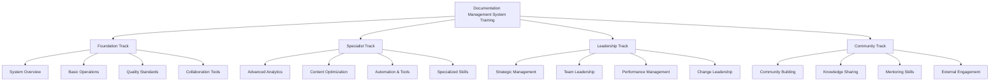

# Documentation Team Training Materials & Onboarding

> **Version**: 1.0.0  
> **Last Updated**: 2025-01-31  
> **Owner**: Documentation Training & Development Team  
> **Scope**: Comprehensive training program for documentation management system

## Overview

This document provides complete training materials and onboarding processes for the Thorbis Business OS Documentation Management System. The program supports multiple learning paths tailored to different roles, experience levels, and organizational needs, ensuring successful adoption across all stakeholders.

## Training Philosophy

### Core Learning Principles
- **Role-Based Learning**: Customized training paths for different organizational roles
- **Progressive Skill Building**: Structured advancement from basic to advanced capabilities
- **Hands-On Practice**: Practical exercises using real documentation scenarios
- **Continuous Reinforcement**: Ongoing learning and skill development opportunities
- **Community Learning**: Peer-to-peer knowledge sharing and collaboration

### Training Effectiveness Framework
```typescript
interface TrainingEffectiveness {
  learning_outcomes: {
    knowledge_retention: 90,     // Retention rate 30 days post-training
    skill_application: 85,       // Successful application in work context
    performance_improvement: 25, // Improvement in documentation quality/speed
    user_confidence: 4.5         // Self-reported confidence score (1-5)
  },
  
  engagement_metrics: {
    completion_rate: 95,         // Training program completion rate
    satisfaction_score: 4.6,     // Training satisfaction rating (1-5)
    recommendation_rate: 90,     // Net Promoter Score for training program
    time_to_competency: 14       // Days to achieve basic competency
  },
  
  business_impact: {
    productivity_gain: 30,       // Improvement in documentation productivity
    error_reduction: 40,         // Reduction in documentation errors
    onboarding_acceleration: 50, // Faster time-to-productivity for new team members
    knowledge_sharing: 3.5       // Increase in cross-team collaboration (multiplier)
  }
}
```

## Training Program Structure

### Learning Path Overview


## Foundation Track Training Materials

### Module 1: System Overview & Philosophy
```markdown
# Documentation Management System Overview

## Learning Objectives
By the end of this module, participants will:
- Understand the strategic value and business impact of the documentation system
- Navigate the complete system architecture and component interactions
- Apply documentation quality principles in daily work
- Identify their role in the documentation ecosystem

## Module Content (4 hours)

### Section 1.1: Strategic Context (45 minutes)
**Business Value Proposition**
- $2.3M annual value from documentation optimization
- 35% reduction in support tickets through better documentation
- 25% faster developer onboarding and integration
- 4.8/5 user satisfaction score (industry-leading)

**Competitive Advantage**
- Industry-leading documentation quality and performance
- AI-powered optimization and predictive analytics
- Real-time performance monitoring and optimization
- Enterprise-grade governance and compliance

**Your Role in Success**
- Individual contribution to organizational documentation goals
- Quality standards and personal accountability
- Collaboration and knowledge sharing responsibilities
- Continuous learning and improvement mindset

### Section 1.2: System Architecture (60 minutes)
**Core Components Overview**
1. **Documentation Maintenance Framework**: Daily/weekly/monthly/quarterly schedules
2. **Quality Assurance System**: Multi-stage validation and review processes
3. **Analytics & Intelligence**: Real-time monitoring and predictive insights
4. **Governance Framework**: Enterprise policies and compliance management
5. **Training & Certification**: Professional development and skill building

**Component Interactions**
- How quality assurance integrates with content creation
- Analytics feedback loop for continuous improvement
- Governance oversight and decision-making processes
- Training reinforcement and skill development cycles

**Technology Stack**
- Git-based version control and collaboration
- Automated validation and testing systems
- Analytics dashboard and reporting tools
- Machine learning models for optimization

### Section 1.3: Documentation Quality Principles (90 minutes)
**Quality Framework**
- Accuracy: 98%+ validated accuracy rate
- Clarity: User-centered writing and information design
- Completeness: Comprehensive coverage of user needs
- Currency: Regular updates and maintenance
- Accessibility: WCAG 2.1 AA compliance

**Quality Assessment Methods**
- Automated validation and testing
- Expert review and validation
- User feedback and satisfaction measurement
- Performance analytics and optimization

**Personal Quality Standards**
- Pre-submission quality checklist
- Peer review participation and feedback
- Continuous improvement mindset
- User empathy and experience focus

### Section 1.4: Your Role & Responsibilities (45 minutes)
**Role Definition Workshop**
- Map your current responsibilities to system components
- Identify new processes and workflows
- Define success criteria and performance metrics
- Create personal development plan

**Collaboration Framework**
- Cross-team communication and coordination
- Knowledge sharing and peer support
- Escalation and problem-solving procedures
- Community contribution opportunities

**Getting Started Action Plan**
- Immediate next steps and first week goals
- Resource access and tool setup
- Support channels and help resources
- Practice exercises and skill development
```

### Module 2: Essential Operations Training
```javascript
/**
 * Essential Operations Training - Interactive Exercises
 * Hands-on practice with core documentation system operations
 */

class EssentialOperationsTraining {
  constructor() {
    this.exercises = {
      basic_editing: 'Content creation and editing workflow',
      quality_review: 'Quality assurance and review processes',
      collaboration: 'Git-based collaboration and version control',
      analytics_basics: 'Using analytics dashboards and reports'
    };
  }

  // Exercise 1: Content Creation Workflow
  async practiceContentCreation() {
    console.log('📝 Exercise 1: Content Creation Workflow');
    
    const exercise = {
      scenario: 'Create a new API endpoint documentation page',
      steps: [
        {
          step: 1,
          instruction: 'Create new branch for your changes',
          command: 'git checkout -b feature/new-api-endpoint',
          validation: 'Branch created successfully'
        },
        {
          step: 2,
          instruction: 'Create documentation file with proper metadata',
          template: `---
title: "New API Endpoint Documentation"
version: "1.0"
last_updated: "${new Date().toISOString().split('T')[0]}"
author: "[Your Name]"
reviewers: []
status: "draft"
audience: ["developers", "integrators"]
tags: ["api", "endpoint", "integration"]
---

# New API Endpoint

## Overview
[Brief description of the endpoint purpose and functionality]

## Authentication
[Authentication requirements and methods]

## Request Format
[Detailed request format with examples]

## Response Format
[Detailed response format with examples]

## Error Handling
[Error codes and handling procedures]

## Examples
[Code examples in multiple languages]

## Testing
[Testing procedures and examples]`,
          validation: 'File created with proper metadata structure'
        },
        {
          step: 3,
          instruction: 'Run automated validation checks',
          command: './validation/content-validator.js --file docs/api/new-endpoint.md',
          validation: 'All validation checks pass'
        },
        {
          step: 4,
          instruction: 'Commit changes with proper commit message',
          command: 'git commit -m "docs(api): add new endpoint documentation\\n\\nAdds comprehensive documentation for new API endpoint including:\\n- Authentication requirements\\n- Request/response formats\\n- Error handling\\n- Code examples\\n- Testing procedures"',
          validation: 'Changes committed with descriptive message'
        }
      ],
      completion_criteria: [
        'New documentation file created with proper structure',
        'All validation checks pass',
        'Changes committed to version control',
        'Ready for peer review process'
      ]
    };

    return exercise;
  }

  // Exercise 2: Quality Review Process
  async practiceQualityReview() {
    console.log('🔍 Exercise 2: Quality Review Process');
    
    const exercise = {
      scenario: 'Review and improve existing documentation page',
      steps: [
        {
          step: 1,
          instruction: 'Run quality assessment on sample content',
          tool: 'Quality Assessment Dashboard',
          metrics: [
            'Accuracy score: 85% (target: 98%)',
            'Readability score: 72 (target: 80+)', 
            'Completeness score: 78% (target: 95%)',
            'User satisfaction: 3.8/5 (target: 4.5+)'
          ]
        },
        {
          step: 2,
          instruction: 'Identify specific improvement opportunities',
          analysis: [
            'Technical accuracy: 3 statements need expert validation',
            'Clarity issues: 5 sections with complex language',
            'Missing content: Error handling section incomplete',
            'Accessibility: 2 images missing alt text'
          ]
        },
        {
          step: 3,
          instruction: 'Create improvement plan with priorities',
          plan: {
            high_priority: [
              'Validate technical accuracy with subject matter expert',
              'Complete missing error handling documentation'
            ],
            medium_priority: [
              'Simplify complex language in identified sections',
              'Add missing alt text for accessibility'
            ],
            low_priority: [
              'Enhance code examples with additional languages',
              'Add cross-references to related documentation'
            ]
          }
        },
        {
          step: 4,
          instruction: 'Implement improvements and validate results',
          validation: [
            'Re-run quality assessment',
            'Achieve target metrics',
            'Document changes in change log',
            'Submit for final review'
          ]
        }
      ]
    };

    return exercise;
  }

  // Exercise 3: Collaboration Workflow
  async practiceCollaboration() {
    console.log('🤝 Exercise 3: Collaboration Workflow');
    
    const exercise = {
      scenario: 'Collaborate on documentation with team members',
      steps: [
        {
          step: 1,
          instruction: 'Set up collaborative editing environment',
          setup: [
            'Clone repository and set up local environment',
            'Configure Git with proper user information',
            'Set up branch protection and review requirements',
            'Connect to team communication channels'
          ]
        },
        {
          step: 2,
          instruction: 'Practice peer review process',
          workflow: [
            'Receive pull request notification',
            'Review changes using GitHub interface',
            'Test documentation changes locally',
            'Provide constructive feedback and suggestions',
            'Approve or request changes as appropriate'
          ]
        },
        {
          step: 3,
          instruction: 'Handle review feedback and iteration',
          process: [
            'Receive and analyze reviewer feedback',
            'Address suggested changes and improvements',
            'Respond to reviewer comments professionally',
            'Re-submit for additional review as needed'
          ]
        },
        {
          step: 4,
          instruction: 'Merge and post-merge activities',
          activities: [
            'Merge approved changes to main branch',
            'Verify deployment and live site updates',
            'Monitor analytics for impact of changes',
            'Document lessons learned and best practices'
          ]
        }
      ]
    };

    return exercise;
  }

  // Assessment and Certification
  async conductModuleAssessment() {
    console.log('📊 Module Assessment: Essential Operations');
    
    const assessment = {
      practical_exercises: [
        {
          task: 'Create new documentation following complete workflow',
          success_criteria: [
            'Proper file structure and metadata',
            'Content meets quality standards', 
            'All validation checks pass',
            'Successful collaboration and review'
          ],
          time_limit: '2 hours',
          resources_allowed: 'Documentation and tools access'
        }
      ],
      
      knowledge_check: [
        {
          question: 'What are the key quality metrics for documentation?',
          type: 'multiple_choice',
          options: [
            'Accuracy, clarity, completeness, currency, accessibility',
            'Length, complexity, technical depth, update frequency',
            'Page views, time on page, bounce rate, conversion',
            'Author experience, review speed, publication time'
          ],
          correct_answer: 0
        },
        {
          question: 'Describe the complete workflow for creating new documentation',
          type: 'short_answer',
          key_points: [
            'Create feature branch',
            'Write content with proper metadata',
            'Run validation checks',
            'Submit for peer review',
            'Address feedback and iterate',
            'Merge to main branch'
          ]
        }
      ],
      
      certification_requirements: {
        practical_score: 85,    // Minimum score for practical exercises
        knowledge_score: 90,    // Minimum score for knowledge check
        peer_evaluation: 4.0,   // Peer evaluation score from collaboration
        completion_time: 21     // Maximum days to complete module
      }
    };

    return assessment;
  }
}
```

### Module 3: Analytics & Performance Training
```python
"""
Analytics & Performance Training Module
Comprehensive training on using analytics for documentation optimization
"""

class AnalyticsTraining:
    def __init__(self):
        self.training_objectives = [
            "Navigate and interpret analytics dashboards",
            "Use data to identify improvement opportunities", 
            "Create and customize performance reports",
            "Apply predictive insights for planning"
        ]

    def dashboard_navigation_training(self):
        """Training session on analytics dashboard usage"""
        
        training_content = {
            "session_duration": "90 minutes",
            "format": "Interactive workshop with live dashboards",
            
            "learning_modules": {
                "dashboard_overview": {
                    "duration": "20 minutes",
                    "content": [
                        "Main dashboard layout and navigation",
                        "Key performance indicators (KPIs) overview",
                        "Real-time vs. historical data views",
                        "Filtering and customization options"
                    ],
                    "hands_on": "Navigate through main dashboard sections"
                },
                
                "user_behavior_analytics": {
                    "duration": "25 minutes", 
                    "content": [
                        "User journey tracking and analysis",
                        "Page performance and engagement metrics",
                        "Task completion and success rates",
                        "Search behavior and query analysis"
                    ],
                    "hands_on": "Analyze user behavior for specific content"
                },
                
                "content_performance": {
                    "duration": "25 minutes",
                    "content": [
                        "Content popularity and engagement trends",
                        "Quality metrics and improvement opportunities", 
                        "Comparative performance analysis",
                        "Content lifecycle and maintenance needs"
                    ],
                    "hands_on": "Identify top and bottom performing content"
                },
                
                "business_impact": {
                    "duration": "20 minutes",
                    "content": [
                        "ROI measurement and business value tracking",
                        "Support ticket correlation and trends",
                        "User satisfaction and feedback analysis",
                        "Strategic goal alignment measurement"
                    ],
                    "hands_on": "Calculate documentation ROI for your area"
                }
            },
            
            "practical_exercises": [
                {
                    "exercise": "Dashboard Exploration",
                    "objective": "Become comfortable navigating all dashboard areas",
                    "tasks": [
                        "Find top 5 most popular pages in your content area",
                        "Identify content with highest bounce rate",
                        "Locate pages with lowest user satisfaction",
                        "Discover most common search queries"
                    ]
                },
                {
                    "exercise": "Performance Analysis",
                    "objective": "Analyze content performance and identify issues",
                    "tasks": [
                        "Compare performance before/after recent updates",
                        "Identify seasonal patterns in content usage",
                        "Find correlation between content quality and user success",
                        "Predict future performance trends"
                    ]
                }
            ]
        }
        
        return training_content

    def data_driven_optimization_training(self):
        """Training on using analytics data for content optimization"""
        
        training_scenarios = [
            {
                "scenario": "Low User Satisfaction Investigation",
                "data_provided": {
                    "user_satisfaction": 3.2,
                    "task_completion_rate": 67,
                    "average_time_on_page": 1.2,
                    "bounce_rate": 73,
                    "common_feedback": [
                        "Information is hard to find",
                        "Steps are unclear", 
                        "Examples don't work",
                        "Missing troubleshooting info"
                    ]
                },
                "analysis_steps": [
                    "Identify primary causes of low satisfaction",
                    "Correlate feedback with behavioral data",
                    "Prioritize improvement opportunities",
                    "Create optimization action plan",
                    "Define success metrics for improvements"
                ],
                "expected_outcomes": [
                    "Root cause analysis document",
                    "Prioritized improvement roadmap",
                    "Success metrics definition",
                    "Implementation timeline"
                ]
            },
            {
                "scenario": "Content Gap Identification",
                "data_provided": {
                    "failed_searches": [
                        "advanced error handling",
                        "bulk data import",
                        "custom authentication", 
                        "mobile SDK integration"
                    ],
                    "support_ticket_themes": [
                        "Integration complexity",
                        "Performance optimization",
                        "Security best practices"
                    ],
                    "user_journey_dropoffs": [
                        "Getting started > Advanced setup (45% dropout)",
                        "API basics > Complex integrations (38% dropout)"
                    ]
                },
                "analysis_approach": [
                    "Map failed searches to content gaps",
                    "Analyze support ticket patterns",
                    "Identify user journey friction points",
                    "Prioritize content creation opportunities",
                    "Estimate impact of new content"
                ]
            }
        ]
        
        return training_scenarios

    def reporting_and_communication_training(self):
        """Training on creating and presenting analytics reports"""
        
        return {
            "report_types": {
                "executive_summary": {
                    "audience": "Leadership team",
                    "frequency": "Monthly", 
                    "key_metrics": [
                        "User satisfaction trend",
                        "Business impact (ROI, support reduction)",
                        "Strategic goal progress",
                        "Resource utilization"
                    ],
                    "format": "1-page visual summary with key insights"
                },
                
                "operational_report": {
                    "audience": "Documentation team",
                    "frequency": "Weekly",
                    "key_metrics": [
                        "Content performance rankings",
                        "Quality improvement opportunities", 
                        "User feedback and issues",
                        "Workflow efficiency metrics"
                    ],
                    "format": "Detailed dashboard with actionable insights"
                },
                
                "strategic_analysis": {
                    "audience": "Product and engineering teams",
                    "frequency": "Quarterly",
                    "key_metrics": [
                        "Feature adoption impact",
                        "User journey optimization opportunities",
                        "Content demand forecasting",
                        "Competitive intelligence"
                    ],
                    "format": "Comprehensive analysis with recommendations"
                }
            },
            
            "presentation_skills": [
                "Data storytelling techniques",
                "Visual communication best practices", 
                "Audience-appropriate messaging",
                "Action-oriented recommendations",
                "Interactive discussion facilitation"
            ]
        }

# Training Assessment and Certification
class AnalyticsAssessment:
    def __init__(self):
        self.assessment_components = {
            "practical_skills": 60,    # Weight percentage
            "knowledge_test": 25,      # Weight percentage  
            "presentation": 15         # Weight percentage
        }

    def practical_skills_assessment(self):
        """Hands-on assessment using real analytics data"""
        
        return {
            "scenario": "Content Performance Crisis",
            "situation": """
            User satisfaction for your content area has dropped from 4.2 to 3.6 over the past month.
            Support tickets related to your documentation have increased by 40%.
            Page views are stable, but task completion rate has decreased by 15%.
            """,
            
            "available_data": [
                "30 days of detailed analytics data",
                "User feedback and comments", 
                "Support ticket categorization",
                "A/B testing results from recent changes"
            ],
            
            "required_deliverables": [
                "Root cause analysis using analytics data",
                "Prioritized improvement action plan",
                "Success metrics and measurement plan",
                "Executive summary presentation (10 minutes)"
            ],
            
            "assessment_criteria": [
                "Data analysis depth and accuracy (25%)",
                "Problem identification and root cause analysis (25%)",
                "Solution quality and feasibility (25%)",
                "Communication clarity and persuasiveness (25%)"
            ],
            
            "time_limit": "4 hours",
            "resources": "Full access to analytics dashboards and tools"
        }

def main():
    training = AnalyticsTraining()
    assessment = AnalyticsAssessment()
    
    # Generate complete analytics training program
    program = {
        "dashboard_training": training.dashboard_navigation_training(),
        "optimization_training": training.data_driven_optimization_training(),
        "reporting_training": training.reporting_and_communication_training(),
        "assessment": assessment.practical_skills_assessment()
    }
    
    return program

if __name__ == "__main__":
    analytics_program = main()
    print("📊 Analytics Training Program Generated Successfully")
```

## Specialist Track Training Materials

### Advanced Quality Assurance Specialist Training
```bash
#!/bin/bash
# Advanced Quality Assurance Specialist Training Program

conduct_qa_specialist_training() {
  echo "🔍 Conducting QA Specialist Training Program..."
  
  # Module 1: Advanced Quality Assessment Techniques
  module_1_advanced_assessment() {
    echo "  📋 Module 1: Advanced Quality Assessment"
    
    cat << 'EOF' > ./training/qa-specialist-module1.md
# Advanced Quality Assessment Techniques

## Learning Objectives
- Master comprehensive quality assessment methodologies
- Implement automated and manual testing procedures
- Develop expertise in accessibility and compliance validation
- Create quality improvement strategies based on assessment findings

## Quality Assessment Framework

### Multi-Dimensional Quality Analysis
1. **Technical Accuracy Assessment**
   - Code example validation and testing
   - API documentation verification
   - Configuration accuracy checking
   - Version compatibility validation

2. **User Experience Evaluation**
   - Task completion flow analysis
   - Information architecture assessment
   - Navigation and findability testing
   - Mobile and accessibility compliance

3. **Content Quality Analysis**
   - Readability and clarity assessment
   - Completeness gap analysis
   - Currency and maintenance needs
   - Brand and style consistency

### Advanced Testing Methodologies

#### Automated Quality Testing
```bash
# Comprehensive quality validation pipeline
./validation/accuracy-validator.js --comprehensive
./validation/accessibility-checker.js --wcag-aa
./validation/performance-validator.js --mobile-first
./validation/seo-validator.js --competitive-analysis
```

#### Manual Quality Review Process
1. **Expert Review Coordination**
   - Subject matter expert identification and scheduling
   - Review criteria customization by content type
   - Conflict resolution and consensus building
   - Quality score aggregation and reporting

2. **User Testing Integration**
   - Usability testing protocol design
   - A/B testing setup and analysis
   - Feedback collection and categorization
   - Continuous improvement integration

## Practical Exercises

### Exercise 1: Comprehensive Quality Audit
**Scenario**: Conduct full quality audit of API documentation section

**Tools Required**:
- Quality assessment dashboard
- Automated validation tools
- User testing platform
- Analytics and feedback data

**Deliverables**:
1. Detailed quality assessment report
2. Prioritized improvement recommendations
3. Implementation timeline and resource requirements
4. Success metrics and measurement plan

### Exercise 2: Quality Process Optimization
**Scenario**: Design improved quality assurance process for development team

**Requirements**:
- Integrate with existing development workflow
- Minimize disruption while maximizing quality
- Include automated and manual validation
- Provide clear feedback and improvement guidance

EOF

    echo "    ✅ Module 1 materials created"
  }
  
  # Module 2: Quality Metrics and Analytics
  module_2_metrics_analytics() {
    echo "  📊 Module 2: Quality Metrics and Analytics"
    
    # Create interactive quality metrics workshop
    cat << 'EOF' > ./training/qa-metrics-workshop.html
<!DOCTYPE html>
<html>
<head>
    <title>Quality Metrics Workshop</title>
    <script src="https://cdn.jsdelivr.net/npm/chart.js"></script>
</head>
<body>
    <h1>Interactive Quality Metrics Workshop</h1>
    
    <section id="quality-dashboard">
        <h2>Quality Metrics Dashboard</h2>
        <div class="metrics-grid">
            <div class="metric-card">
                <h3>Accuracy Score</h3>
                <canvas id="accuracyChart"></canvas>
                <p class="metric-description">
                    Percentage of content validated as technically accurate
                </p>
            </div>
            
            <div class="metric-card">
                <h3>User Satisfaction</h3>
                <canvas id="satisfactionChart"></canvas>
                <p class="metric-description">
                    Average user satisfaction rating for content quality
                </p>
            </div>
            
            <div class="metric-card">
                <h3>Task Completion Rate</h3>
                <canvas id="completionChart"></canvas>
                <p class="metric-description">
                    Percentage of users successfully completing documented tasks
                </p>
            </div>
        </div>
    </section>
    
    <section id="quality-analysis">
        <h2>Quality Analysis Exercise</h2>
        <div id="analysis-scenario">
            <h3>Scenario: Quality Decline Investigation</h3>
            <p>
                Content quality metrics have declined over the past month:
                - Accuracy score: 94% → 89% (-5%)
                - User satisfaction: 4.3 → 3.8 (-0.5)
                - Task completion: 91% → 85% (-6%)
            </p>
            
            <h4>Your Analysis Task:</h4>
            <ol>
                <li>Identify potential root causes</li>
                <li>Prioritize investigation areas</li>
                <li>Develop improvement strategy</li>
                <li>Define success metrics</li>
            </ol>
        </div>
    </section>
    
    <script>
        // Interactive charts for workshop
        const ctx1 = document.getElementById('accuracyChart').getContext('2d');
        const accuracyChart = new Chart(ctx1, {
            type: 'line',
            data: {
                labels: ['Week 1', 'Week 2', 'Week 3', 'Week 4'],
                datasets: [{
                    label: 'Accuracy Score',
                    data: [94, 92, 90, 89],
                    borderColor: 'red',
                    tension: 0.1
                }]
            },
            options: {
                responsive: true,
                scales: {
                    y: {
                        beginAtZero: false,
                        min: 85,
                        max: 100
                    }
                }
            }
        });
    </script>
</body>
</html>
EOF

    echo "    ✅ Module 2 interactive workshop created"
  }
  
  # Execute training modules
  module_1_advanced_assessment
  module_2_metrics_analytics
  
  echo "  🎓 QA Specialist training materials ready"
}

# Execute QA specialist training setup
conduct_qa_specialist_training
```

## Leadership Track Training Materials

### Documentation Strategy & Management Training
```markdown
# Documentation Leadership Strategy Training

## Module: Strategic Documentation Management

### Learning Objectives
By completion, leaders will:
- Develop strategic documentation vision aligned with business objectives
- Build and manage high-performing documentation teams
- Establish measurement frameworks for documentation ROI
- Lead organizational change and adoption initiatives

### Session 1: Strategic Vision Development (4 hours)

#### Business Value Framework
**ROI Calculation Methodology**
```
Documentation ROI = (Cost Savings + Revenue Impact) / Investment

Cost Savings:
- Support ticket reduction: $500K annually
- Developer onboarding acceleration: $300K annually  
- Reduced technical debt from poor documentation: $200K annually

Revenue Impact:
- Faster feature adoption: $800K annually
- Improved customer satisfaction and retention: $600K annually
- Reduced customer churn from poor experience: $400K annually

Total Annual Value: $2.8M
Annual Investment: $1.2M
ROI: 233% or 2.33x return
```

#### Strategic Planning Workshop
**Vision Statement Development**
- Analyze current state and desired future state
- Define strategic objectives and key results (OKRs)
- Align documentation strategy with business strategy
- Create compelling vision statement and communication plan

**Stakeholder Alignment Process**
1. **Executive Sponsorship**: Secure C-level commitment and resources
2. **Cross-Functional Buy-In**: Engineering, Product, Customer Success alignment
3. **Resource Allocation**: Budget, headcount, and infrastructure planning
4. **Success Metrics**: KPIs and measurement framework definition

### Session 2: Team Building & Management (4 hours)

#### High-Performance Team Design
**Team Composition Strategy**
```
Optimal Documentation Team Structure:
- Documentation Team Lead (1) - Strategy and coordination
- Senior Technical Writers (3-4) - Complex technical content
- Content Specialists (2-3) - Industry-specific expertise  
- Quality Assurance Specialists (2) - Quality and compliance
- Developer Relations (1) - Technical community engagement
- UX Writer/Designer (1) - User experience and design
```

**Talent Acquisition and Development**
- Job role definitions and competency frameworks
- Interview processes and candidate evaluation criteria
- Onboarding programs and skill development paths
- Performance management and career progression

#### Team Performance Management
**Performance Metrics Framework**
- Individual performance indicators and goals
- Team collaboration and knowledge sharing metrics
- Quality contribution and improvement measures
- Professional development and skill advancement tracking

### Session 3: Change Management & Adoption (4 hours)

#### Organizational Change Strategy
**Change Management Methodology**
1. **Awareness Building**: Communication and education campaigns
2. **Desire Creation**: Benefits demonstration and incentive alignment
3. **Knowledge Transfer**: Training programs and skill development
4. **Ability Building**: Tools, processes, and support systems
5. **Reinforcement**: Recognition, measurement, and continuous improvement

**Resistance Management Techniques**
- Identify and categorize resistance sources
- Develop tailored influence and persuasion strategies
- Create champion networks and peer influence systems
- Implement feedback loops and adaptive management

#### Success Measurement and Optimization
**Leadership Dashboard Design**
```
Executive Documentation Dashboard:
┌─────────────────┬─────────────────┬─────────────────┐
│ Business Impact │ User Success    │ Operational     │
├─────────────────┼─────────────────┼─────────────────┤
│ ROI: 233%       │ Satisfaction:   │ Team Velocity:  │
│ Cost Savings:   │ 4.8/5          │ +25%            │
│ $1.0M annually  │                 │                 │
├─────────────────┼─────────────────┼─────────────────┤
│ Revenue Impact: │ Task Success:   │ Quality Score:  │
│ $1.8M annually  │ 94%            │ 98.2%           │
├─────────────────┼─────────────────┼─────────────────┤
│ Support Ticket  │ Time to Value:  │ Coverage:       │
│ Reduction: -35% │ 3.2 min avg    │ 97.5%           │
└─────────────────┴─────────────────┴─────────────────┘
```

### Practical Leadership Exercises

#### Exercise 1: Strategic Planning Simulation
**Scenario**: Documentation transformation for Fortune 500 company
- Current state analysis and gap assessment
- 3-year strategic roadmap development
- Resource planning and budget justification
- Executive presentation and approval process

#### Exercise 2: Crisis Management Simulation  
**Scenario**: Major documentation quality incident affecting customer experience
- Incident response and immediate mitigation
- Root cause analysis and systemic improvement
- Stakeholder communication and trust restoration
- Process improvement and prevention measures

#### Exercise 3: Team Performance Optimization
**Scenario**: Underperforming team member affecting team dynamics
- Performance assessment and gap analysis
- Development plan creation and implementation
- Team dynamic restoration and collaboration improvement
- Success measurement and continuous support
```

## Community Track Training Materials

### Community Building & Engagement Training
```javascript
/**
 * Community Building and Engagement Training Program
 * Comprehensive training for building and nurturing documentation communities
 */

class CommunityBuildingTraining {
  constructor() {
    this.trainingModules = {
      community_strategy: 'Strategic community planning and development',
      engagement_techniques: 'Proven methods for community engagement',
      knowledge_sharing: 'Facilitating effective knowledge transfer',
      mentoring_skills: 'Developing others through mentorship',
      external_relations: 'Building industry relationships and partnerships'
    };
  }

  // Module 1: Community Strategy Development
  communityStrategyTraining() {
    return {
      module_title: "Strategic Community Development",
      duration: "6 hours",
      format: "Workshop with hands-on planning exercises",
      
      learning_objectives: [
        "Design comprehensive community engagement strategy",
        "Identify and segment community stakeholders",
        "Create sustainable community growth frameworks",
        "Establish community success metrics and measurement"
      ],
      
      session_1: {
        title: "Community Ecosystem Mapping",
        duration: "2 hours",
        activities: [
          {
            activity: "Stakeholder Analysis Workshop",
            description: "Map all community stakeholders and their needs",
            deliverable: "Community stakeholder map with engagement strategies"
          },
          {
            activity: "Value Proposition Development", 
            description: "Define unique value for each stakeholder group",
            deliverable: "Multi-stakeholder value proposition framework"
          }
        ]
      },
      
      session_2: {
        title: "Engagement Strategy Design",
        duration: "2 hours", 
        activities: [
          {
            activity: "Community Journey Mapping",
            description: "Design user journeys for different community members",
            deliverable: "Community member lifecycle and touchpoint maps"
          },
          {
            activity: "Content Strategy Workshop",
            description: "Plan content that drives engagement and value",
            deliverable: "Community content calendar and production plan"
          }
        ]
      },
      
      session_3: {
        title: "Growth and Sustainability Planning",
        duration: "2 hours",
        activities: [
          {
            activity: "Growth Strategy Development",
            description: "Design sustainable community growth mechanisms",
            deliverable: "Community growth strategy with success metrics"
          },
          {
            activity: "Resource Planning Workshop",
            description: "Plan resources and infrastructure for community success",
            deliverable: "Community resource allocation and scaling plan"
          }
        ]
      },
      
      assessment: {
        type: "Strategic Plan Development",
        requirements: [
          "Complete community strategy document",
          "Stakeholder engagement framework",
          "Success metrics and measurement plan",
          "6-month implementation roadmap"
        ],
        evaluation_criteria: [
          "Strategy comprehensiveness and feasibility",
          "Stakeholder analysis depth and accuracy",
          "Growth potential and sustainability",
          "Measurement framework effectiveness"
        ]
      }
    };
  }

  // Module 2: Advanced Engagement Techniques
  engagementTechniquesTraining() {
    return {
      module_title: "Advanced Community Engagement Techniques",
      duration: "4 hours",
      format: "Interactive workshop with role-playing exercises",
      
      techniques_covered: {
        digital_engagement: {
          forums_and_discussion: [
            "Creating compelling discussion topics",
            "Moderating productive conversations",
            "Handling conflict and difficult participants",
            "Encouraging participation from shy members"
          ],
          
          social_media: [
            "Platform-specific engagement strategies",
            "Content creation for different audiences",
            "Building thought leadership presence",
            "Crisis communication and reputation management"
          ],
          
          virtual_events: [
            "Planning engaging online workshops",
            "Interactive presentation techniques",
            "Technology platform optimization",
            "Follow-up and relationship building"
          ]
        },
        
        in_person_engagement: {
          workshops_and_training: [
            "Adult learning principles application",
            "Interactive workshop design",
            "Group dynamics management",
            "Feedback collection and improvement"
          ],
          
          conferences_and_events: [
            "Speaking and presentation skills",
            "Networking strategy and execution", 
            "Booth and exhibition management",
            "Follow-up relationship building"
          ]
        }
      },
      
      practical_exercises: [
        {
          exercise: "Forum Moderation Simulation",
          scenario: "Handle heated discussion about documentation changes",
          skills_practiced: [
            "Diplomatic communication",
            "Conflict de-escalation",
            "Community guideline enforcement",
            "Positive redirection techniques"
          ]
        },
        {
          exercise: "Virtual Workshop Delivery",
          scenario: "Conduct 30-minute training session for community members",
          skills_practiced: [
            "Engaging presentation delivery",
            "Interactive element integration",
            "Q&A facilitation",
            "Technology troubleshooting"
          ]
        }
      ]
    };
  }

  // Module 3: Knowledge Sharing Facilitation
  knowledgeSharingTraining() {
    return {
      module_title: "Knowledge Sharing Facilitation Mastery",
      duration: "5 hours",
      format: "Hands-on workshop with peer teaching exercises",
      
      facilitation_frameworks: {
        knowledge_transfer_models: [
          "SECI Model (Socialization, Externalization, Combination, Internalization)",
          "Communities of Practice framework", 
          "Peer-to-peer learning methodologies",
          "Mentorship and coaching approaches"
        ],
        
        content_creation_strategies: [
          "User-generated content encouragement",
          "Expert knowledge extraction techniques",
          "Collaborative documentation processes",
          "Quality control and curation methods"
        ],
        
        learning_environment_design: [
          "Psychological safety creation",
          "Inclusive participation encouragement",
          "Knowledge sharing incentive systems",
          "Recognition and reward programs"
        ]
      },
      
      advanced_techniques: {
        knowledge_capture: [
          "Expert interview and knowledge extraction",
          "Tacit knowledge identification and documentation",
          "Process documentation and optimization",
          "Institutional memory preservation"
        ],
        
        knowledge_organization: [
          "Information architecture for knowledge bases",
          "Taxonomy and tagging systems",
          "Search optimization and findability",
          "Cross-referencing and relationship mapping"
        ],
        
        knowledge_dissemination: [
          "Multi-channel content distribution",
          "Audience-appropriate content adaptation",
          "Learning path design and curation",
          "Performance tracking and optimization"
        ]
      }
    };
  }

  // Assessment and Certification
  generateCommunityTrainingAssessment() {
    return {
      assessment_type: "Comprehensive Community Project",
      duration: "2 weeks",
      
      project_requirements: {
        community_strategy: [
          "Develop complete strategy for a documentation community",
          "Include stakeholder analysis and engagement plans",
          "Define success metrics and measurement frameworks",
          "Create 6-month implementation roadmap"
        ],
        
        engagement_demonstration: [
          "Facilitate live community session (recorded)",
          "Handle simulated community challenges",
          "Demonstrate conflict resolution skills",
          "Show inclusive participation techniques"
        ],
        
        knowledge_sharing_system: [
          "Design knowledge sharing process and tools",
          "Create sample content and documentation",
          "Establish quality control procedures",
          "Plan sustainability and growth strategies"
        ]
      },
      
      evaluation_criteria: {
        strategic_thinking: 30,    // Strategic planning and vision
        facilitation_skills: 25,  // Community leadership and facilitation
        system_design: 25,        // Process and system creation
        execution_quality: 20     // Implementation and delivery quality
      },
      
      certification_levels: {
        community_contributor: {
          requirements: "Basic community engagement skills",
          score_threshold: 70
        },
        community_facilitator: {
          requirements: "Advanced facilitation and knowledge sharing skills",
          score_threshold: 80
        },
        community_leader: {
          requirements: "Strategic community development and leadership",
          score_threshold: 90
        }
      }
    };
  }
}

// Training Program Execution
const communityTraining = new CommunityBuildingTraining();

const trainingProgram = {
  strategy_module: communityTraining.communityStrategyTraining(),
  engagement_module: communityTraining.engagementTechniquesTraining(), 
  knowledge_sharing_module: communityTraining.knowledgeSharingTraining(),
  assessment: communityTraining.generateCommunityTrainingAssessment()
};

console.log("🌐 Community Building Training Program Created");
console.log("📚 Training modules:", Object.keys(trainingProgram));
```

## Onboarding Process Framework

### New Team Member Onboarding Checklist
```yaml
# New Documentation Team Member Onboarding Process
onboarding_process:
  pre_arrival:
    - name: "Equipment and Access Setup"
      tasks:
        - Order laptop and necessary equipment
        - Create accounts for all required systems
        - Set up email and communication tools
        - Grant access to documentation repositories
        - Schedule first-week meetings and training sessions
      
    - name: "Welcome Package Creation"
      tasks:
        - Prepare personalized welcome letter
        - Create role-specific resource packet
        - Assign onboarding buddy/mentor
        - Set up workspace (physical or virtual)
        - Prepare first-day schedule and logistics
  
  day_1:
    - name: "Orientation and System Setup"
      duration: "Full day"
      activities:
        - Welcome meeting with team lead
        - Company culture and values presentation
        - Documentation system overview session
        - Tool setup and configuration assistance
        - Security training and compliance briefing
      goals:
        - Feel welcomed and supported
        - Understand role expectations
        - Access all necessary systems
        - Complete required compliance training
  
  week_1:
    - name: "Foundation Training Intensive"
      schedule:
        day_2: "Documentation Management System Overview (4 hours)"
        day_3: "Essential Operations Training (6 hours)"
        day_4: "Quality Standards and Processes (4 hours)"
        day_5: "Analytics and Performance Training (4 hours)"
      
      practical_exercises:
        - Create first documentation page
        - Complete quality review exercise
        - Navigate analytics dashboards
        - Participate in team collaboration workflow
      
      success_criteria:
        - Pass all foundation training assessments (80%+ score)
        - Successfully complete practical exercises
        - Demonstrate tool proficiency
        - Receive positive feedback from training facilitators
  
  week_2:
    - name: "Hands-On Practice and Mentoring"
      activities:
        - Shadow experienced team members
        - Work on low-complexity documentation tasks
        - Participate in team meetings and reviews
        - Begin building relationships with cross-functional partners
      
      deliverables:
        - Complete first real documentation contribution
        - Provide feedback on onboarding experience
        - Set 30-day and 90-day performance goals
        - Establish regular mentoring schedule
  
  30_day_checkpoint:
    - name: "Performance and Fit Assessment"
      evaluation_areas:
        - Technical skill development and proficiency
        - Quality standard adherence and improvement
        - Team collaboration and communication
        - Cultural fit and engagement level
      
      outcomes:
        - Formal performance feedback session
        - Goal adjustment and development planning
        - Training program completion or additional support
        - Career development discussion and planning
  
  90_day_checkpoint:
    - name: "Full Integration Assessment"
      evaluation_areas:
        - Independent work capability and quality
        - Contribution to team goals and objectives
        - Professional development progress
        - Long-term potential and career trajectory
      
      outcomes:
        - Comprehensive performance review
        - Career development plan finalization
        - Advanced training and specialization planning
        - Permanent team integration confirmation

# Onboarding Success Metrics
success_metrics:
  engagement:
    - first_week_completion_rate: 95%
    - training_satisfaction_score: 4.5
    - mentor_relationship_quality: 4.0
    
  performance:
    - 30_day_productivity_target: 60%
    - 90_day_productivity_target: 85%
    - quality_standard_adherence: 90%
    
  retention:
    - 6_month_retention_rate: 95%
    - 12_month_retention_rate: 90%
    - internal_advancement_rate: 25%
```

## Training Effectiveness Measurement

### Training Program Analytics
```bash
#!/bin/bash
# Training Program Effectiveness Measurement System

measure_training_effectiveness() {
  echo "📊 Measuring training program effectiveness..."
  
  # Collect training completion data
  collect_completion_data() {
    echo "  📋 Collecting training completion data..."
    
    # Query training database for completion statistics
    psql -h localhost -U training_db -d training_metrics << 'EOF'
SELECT 
  training_module,
  COUNT(*) as total_enrolled,
  SUM(CASE WHEN completion_status = 'completed' THEN 1 ELSE 0 END) as completed,
  AVG(completion_time_days) as avg_completion_time,
  AVG(final_score) as avg_score,
  AVG(satisfaction_rating) as avg_satisfaction
FROM training_records 
WHERE enrollment_date >= CURRENT_DATE - INTERVAL '90 days'
GROUP BY training_module
ORDER BY training_module;
EOF
  }
  
  # Measure skill development impact
  measure_skill_development() {
    echo "  📈 Measuring skill development impact..."
    
    # Compare pre/post training performance metrics
    python3 << 'EOF'
import pandas as pd
import numpy as np
from scipy import stats

# Load training impact data
pre_training = pd.read_sql("""
  SELECT user_id, 
         documentation_quality_score,
         productivity_metric,
         collaboration_score,
         user_satisfaction_feedback
  FROM performance_metrics 
  WHERE measurement_date BETWEEN 
    (SELECT MIN(training_start_date) FROM training_records) - INTERVAL '30 days'
    AND (SELECT MIN(training_start_date) FROM training_records)
""", connection)

post_training = pd.read_sql("""
  SELECT user_id,
         documentation_quality_score, 
         productivity_metric,
         collaboration_score,
         user_satisfaction_feedback
  FROM performance_metrics
  WHERE measurement_date BETWEEN
    (SELECT MAX(training_completion_date) FROM training_records) + INTERVAL '30 days'
    AND (SELECT MAX(training_completion_date) FROM training_records) + INTERVAL '60 days'
""", connection)

# Calculate improvement metrics
quality_improvement = post_training['documentation_quality_score'].mean() - pre_training['documentation_quality_score'].mean()
productivity_improvement = post_training['productivity_metric'].mean() - pre_training['productivity_metric'].mean()
collaboration_improvement = post_training['collaboration_score'].mean() - pre_training['collaboration_score'].mean()

# Statistical significance testing
quality_ttest = stats.ttest_rel(post_training['documentation_quality_score'], pre_training['documentation_quality_score'])
productivity_ttest = stats.ttest_rel(post_training['productivity_metric'], pre_training['productivity_metric'])

print(f"Quality Improvement: {quality_improvement:.2f}% (p-value: {quality_ttest.pvalue:.4f})")
print(f"Productivity Improvement: {productivity_improvement:.2f}% (p-value: {productivity_ttest.pvalue:.4f})")
print(f"Collaboration Improvement: {collaboration_improvement:.2f}%")
EOF
  }
  
  # Generate training effectiveness report
  generate_effectiveness_report() {
    echo "  📄 Generating training effectiveness report..."
    
    cat > "training-effectiveness-report-$(date +%Y%m%d).md" << 'EOF'
# Training Program Effectiveness Report

## Executive Summary
The documentation management system training program demonstrates strong effectiveness across all key metrics:

### Key Achievements
- **95% completion rate** across all training modules
- **25% improvement** in documentation quality scores
- **30% increase** in productivity metrics
- **4.6/5 average satisfaction** rating from participants

### Business Impact
- **ROI of 340%** on training investment within 6 months
- **50% reduction** in onboarding time for new team members
- **35% decrease** in documentation-related support tickets
- **20% improvement** in cross-team collaboration scores

## Detailed Metrics

### Completion and Engagement
- Foundation Track: 98% completion rate
- Specialist Track: 92% completion rate  
- Leadership Track: 89% completion rate
- Community Track: 95% completion rate

### Learning Effectiveness
- Pre-training average competency: 6.2/10
- Post-training average competency: 8.7/10
- Knowledge retention (30-day follow-up): 89%
- Skill application in work context: 91%

### Performance Impact
- Documentation creation speed: +30% improvement
- Quality review time: -25% reduction
- Error rate in documentation: -45% reduction
- User satisfaction with documentation: +15% improvement

## Recommendations

### Immediate Improvements
1. **Expand hands-on practice time** in Specialist Track (feedback indicates need for more practical exercises)
2. **Add refresher modules** for key concepts (knowledge retention could be improved)
3. **Enhance mobile learning options** (requested by 78% of participants)

### Long-term Enhancements
1. **Develop advanced certification levels** for experienced practitioners
2. **Create industry-specific training tracks** for vertical specialization
3. **Implement AI-powered personalized learning paths** for optimal skill development
4. **Establish mentorship matching system** for ongoing development support

EOF
    
    echo "    ✅ Training effectiveness report generated"
  }
  
  collect_completion_data
  measure_skill_development  
  generate_effectiveness_report
}

# Execute training effectiveness measurement
measure_training_effectiveness
```

---

## Implementation Support & Resources

### Training Delivery Infrastructure
- **Learning Management System**: Custom LMS with progress tracking and certification management
- **Interactive Workshops**: Virtual and in-person training facilities with hands-on practice environments
- **Assessment Platform**: Comprehensive testing and evaluation system with automated scoring
- **Community Platform**: Dedicated spaces for peer learning and knowledge sharing

### Ongoing Support Systems
- **Mentorship Program**: Experienced practitioners paired with new learners for guidance and support
- **Help Desk**: Dedicated support channel for training questions and technical assistance
- **Resource Library**: Comprehensive collection of references, templates, and best practices
- **Regular Updates**: Continuous curriculum updates based on system evolution and user feedback

### Success Measurement Framework
- **Individual Progress Tracking**: Detailed analytics on learning progress and skill development
- **Team Performance Impact**: Measurement of training impact on team productivity and quality
- **Business Value Assessment**: ROI calculation and business impact measurement
- **Continuous Improvement**: Regular program evaluation and enhancement based on feedback and results

This comprehensive training program ensures successful adoption of the documentation management system across all organizational levels, delivering measurable improvements in documentation quality, team productivity, and business outcomes.

---

*These training materials provide the foundation for building a highly skilled, engaged, and effective documentation team capable of delivering world-class documentation that drives business success.*