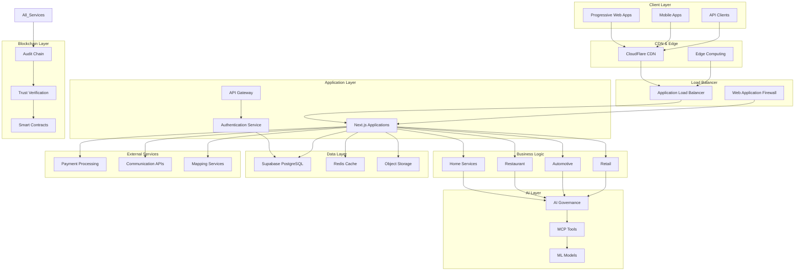
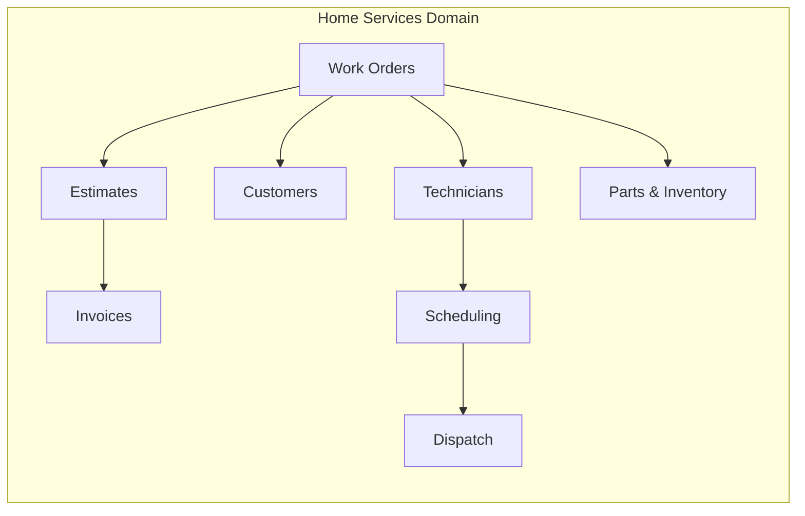
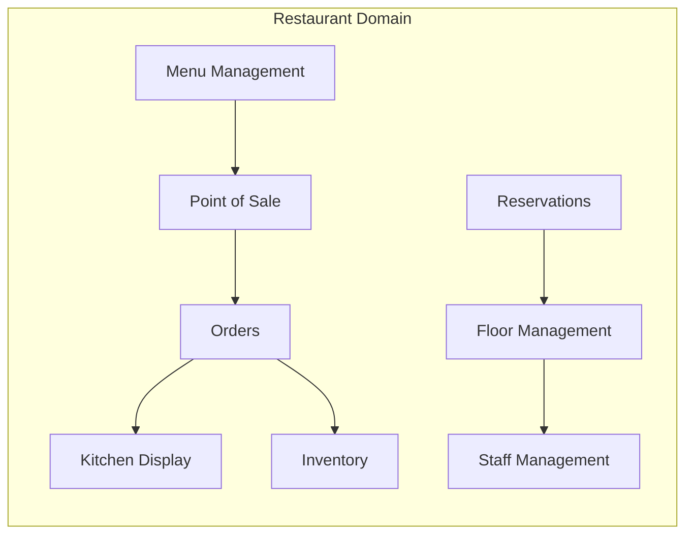
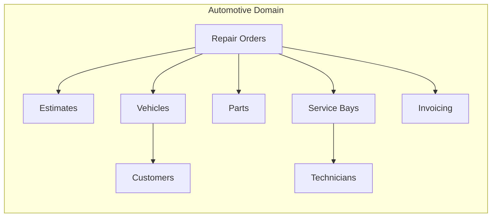
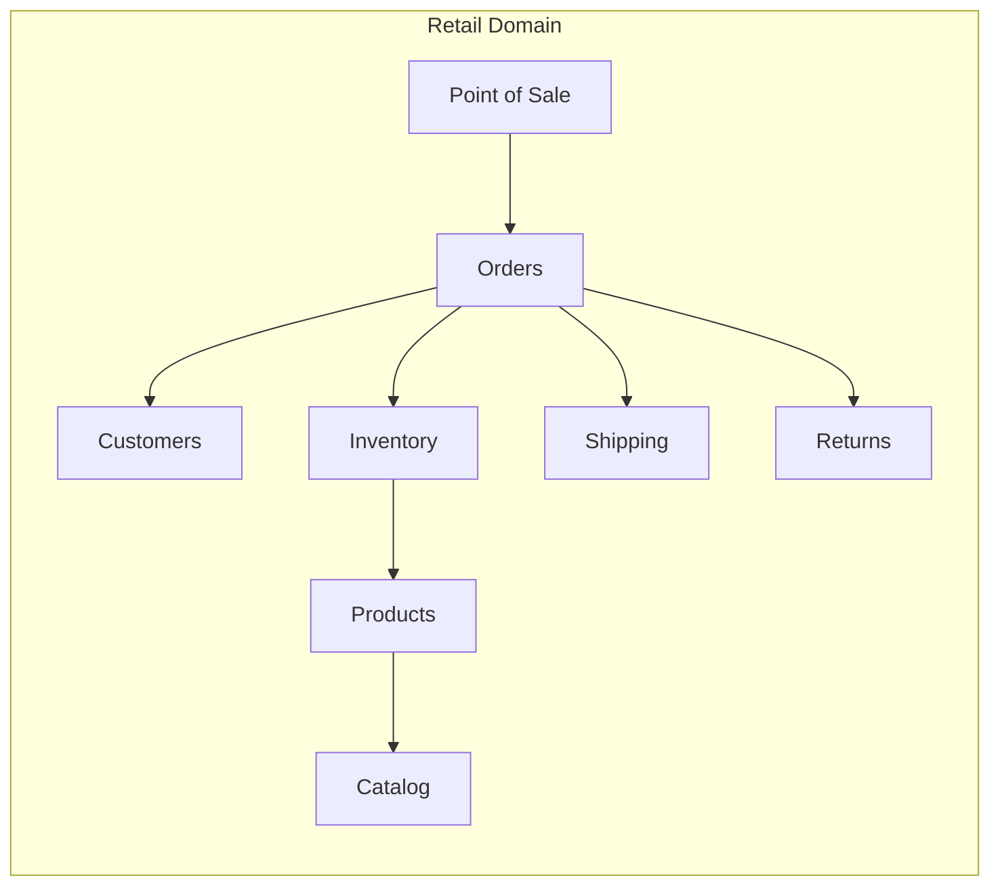
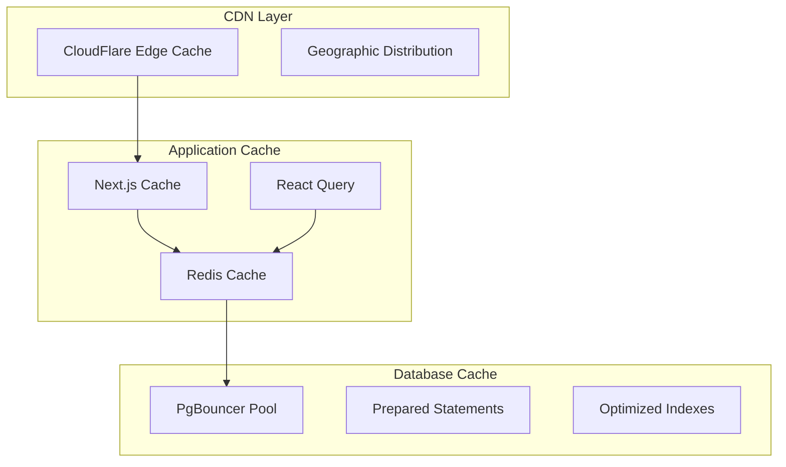
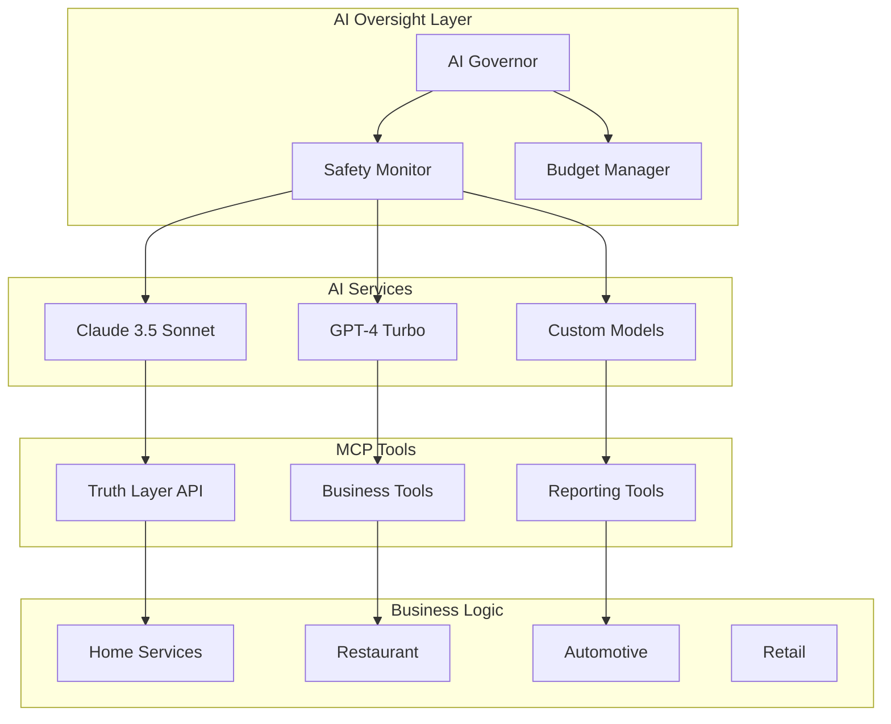
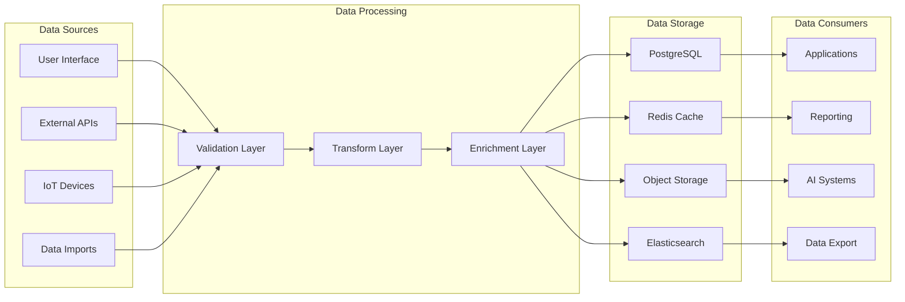
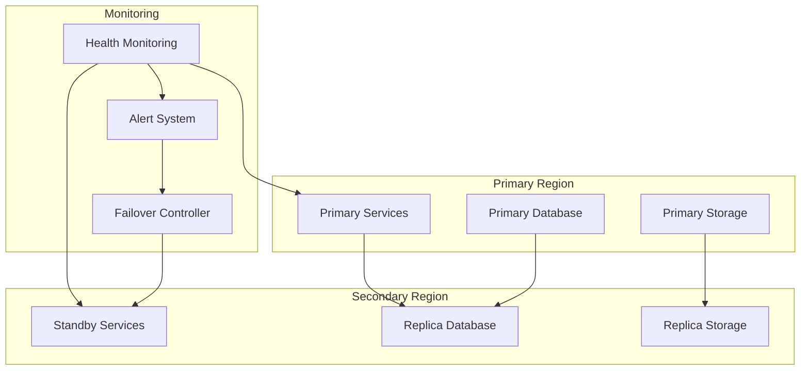

# Thorbis Business OS - System Architecture

> **Enterprise Multi-Tenant Business Operating System**  
> **Architecture Version**: 4.0.0  
> **Last Updated**: 2025-01-31  
> **Classification**: Core Architecture Document

## 🏗️ Architecture Overview

The Thorbis Business OS is a comprehensive, multi-tenant, industry-agnostic business operating system designed to handle the complete operational needs of service-based businesses across multiple verticals.

### 🎯 Core Design Principles

1. **Multi-Tenant by Design** - Complete data isolation between businesses
2. **Industry Agnostic** - Flexible enough to serve any service business
3. **API-First Architecture** - Everything accessible via REST APIs
4. **Performance Obsessed** - Sub-300ms response times with NextFaster doctrine
5. **Security Hardened** - Zero-trust architecture with defense-in-depth
6. **AI-Powered** - Built-in AI governance and automation
7. **Blockchain Verified** - Immutable audit trails for trust and compliance

### 📊 System Scale & Capacity

```yaml
System Specifications:
  Max Tenants: 1,000,000+
  Max Users per Tenant: 10,000
  Max API Calls: 10,000/second
  Database Tables: 500+
  Supported Industries: 20+
  Global Regions: 12
  Uptime SLA: 99.99%
  Data Retention: 10 years
```

## 🏛️ High-Level Architecture



## 🏢 Multi-Tenant Architecture

### Tenant Isolation Strategy

```typescript
// Every database table includes tenant isolation
interface BaseEntity {
  id: string;
  business_id: string; // Tenant identifier
  created_at: Date;
  updated_at: Date;
  created_by: string;
  updated_by: string;
}

// Row Level Security (RLS) policies enforce isolation
CREATE POLICY tenant_isolation ON work_orders 
  FOR ALL USING (business_id = auth.get_current_business_id());
```

### Tenant Resource Allocation

```yaml
Tenant Tiers:
  Starter:
    Users: 5
    Storage: 1GB
    API Calls: 1,000/month
    Features: Basic
    
  Professional:
    Users: 25
    Storage: 10GB
    API Calls: 10,000/month
    Features: Advanced
    
  Enterprise:
    Users: Unlimited
    Storage: 100GB+
    API Calls: 100,000/month
    Features: All + Custom
    
  Fortune 500:
    Users: Unlimited
    Storage: Unlimited
    API Calls: Unlimited
    Features: White-label + On-premise
```

## 🌐 Industry-Specific Architecture

### Home Services (`/hs/`)


### Restaurant (`/rest/`)


### Automotive (`/auto/`)


### Retail (`/ret/`)


## 🔧 Technical Stack

### Frontend Architecture
```yaml
Framework: Next.js 15 (App Router)
Language: TypeScript (Strict Mode)
Styling: Tailwind CSS + Odixe Design System
State Management: Zustand + React Query
Authentication: Supabase Auth
PWA: Service Worker + Background Sync
Performance: NextFaster Doctrine (170KB budget)
```

### Backend Architecture
```yaml
Runtime: Node.js 20+ / Edge Runtime
Database: Supabase PostgreSQL 15+
Caching: Redis Cluster
File Storage: Supabase Storage + AWS S3
Search: PostgreSQL Full-Text + Elasticsearch
Queue: Redis Bull + Background Tasks
Email: Supabase Auth + Custom SMTP
SMS: Twilio + Multi-provider fallback
```

### Infrastructure
```yaml
Orchestration: Kubernetes (AWS EKS / GCP GKE)
Load Balancer: AWS ALB / GCP Load Balancer
CDN: CloudFlare + Edge Computing
Monitoring: Prometheus + Grafana + Jaeger
Logging: ELK Stack (Elasticsearch + Logstash + Kibana)
Secrets: AWS Secrets Manager / GCP Secret Manager
CI/CD: GitHub Actions + ArgoCD
```

## 🚀 Performance Architecture

### NextFaster Implementation
```typescript
// Performance constraints enforced by architecture
const PERFORMANCE_BUDGETS = {
  javascript: '170KB', // Total JS per route
  navigation: '300ms',  // Max navigation time
  lcp: '1.8s',         // Largest Contentful Paint
  cls: '0.1',          // Cumulative Layout Shift
  fid: '100ms'         // First Input Delay
};

// Server-first rendering with minimal hydration
export default function Page() {
  return (
    <ServerComponent>
      <ClientComponent suppressHydrationWarning />
    </ServerComponent>
  );
}
```

### Caching Strategy


## 🛡️ Security Architecture

### Zero Trust Implementation
```typescript
// Every request requires authentication and authorization
interface SecurityContext {
  user: AuthenticatedUser;
  business: BusinessContext;
  permissions: Permission[];
  session: SessionToken;
  device: DeviceFingerprint;
  location: GeographicContext;
}

// Multi-layer security validation
async function validateRequest(request: Request): Promise<SecurityContext> {
  const token = await validateJWT(request);
  const business = await validateBusinessAccess(token);
  const permissions = await checkRBAC(token, business);
  const device = await validateDeviceFingerprint(request);
  
  return { user, business, permissions, device };
}
```

### Data Protection Layers
1. **Network Security**: WAF, DDoS protection, TLS 1.3
2. **Application Security**: OWASP compliance, input validation
3. **Database Security**: RLS policies, encryption at rest
4. **Identity Security**: Multi-factor authentication, session management
5. **Audit Security**: Immutable logs, blockchain verification

## 🤖 AI Integration Architecture

### AI Governance Framework


### AI Safety Protocols
```typescript
interface AIOperation {
  model: 'claude-3.5-sonnet' | 'gpt-4-turbo' | 'custom';
  tool: MCPTool;
  business_id: string;
  user_id: string;
  intent: OperationIntent;
  safety_level: 'low' | 'medium' | 'high' | 'critical';
}

async function executeAIOperation(operation: AIOperation) {
  // Pre-execution safety checks
  await validateSafetyLevel(operation);
  await checkBudgetLimits(operation);
  await validatePermissions(operation);
  
  // Execute with monitoring
  const result = await monitoredExecution(operation);
  
  // Post-execution audit
  await logToBlockchain(operation, result);
  await updateMetrics(operation, result);
  
  return result;
}
```

## 📊 Data Architecture

### Database Schema Organization
```sql
-- Core business entities with tenant isolation
CREATE SCHEMA businesses;  -- Tenant management
CREATE SCHEMA users;       -- User management
CREATE SCHEMA auth;        -- Authentication

-- Industry-specific schemas
CREATE SCHEMA hs;          -- Home services
CREATE SCHEMA rest;        -- Restaurant
CREATE SCHEMA auto;        -- Automotive
CREATE SCHEMA ret;         -- Retail

-- Shared operational schemas
CREATE SCHEMA audit;       -- Audit logging
CREATE SCHEMA ai;          -- AI operations
CREATE SCHEMA billing;     -- Usage tracking
CREATE SCHEMA trust;       -- Blockchain verification
```

### Data Flow Architecture


## 🔗 Integration Architecture

### API Gateway Design
```typescript
interface APIGateway {
  routes: {
    public: '/api/public/v1/*';     // Public APIs
    app: '/api/{industry}/app/v1/*'; // Authenticated APIs
    ai: '/api/{industry}/ai/*';      // AI tool endpoints
    webhook: '/api/webhooks/*';      // External webhooks
  };
  
  middleware: [
    'cors',
    'rate-limiting',
    'authentication',
    'authorization',
    'validation',
    'logging',
    'monitoring'
  ];
  
  versioning: 'url-path'; // /v1/, /v2/, etc.
  documentation: 'openapi-3.1';
}
```

### External Service Integration
```yaml
Payment Processing:
  Primary: Stripe Connect
  Fallback: Square, PayPal
  
Communication:
  Email: Supabase + SendGrid
  SMS: Twilio + AWS SNS
  Push: Firebase + APNs
  
Maps & Location:
  Primary: Google Maps
  Fallback: Mapbox, OpenStreetMap
  
Analytics:
  Product: Mixpanel + Custom
  Performance: New Relic + DataDog
  Business: Custom BI Dashboard
  
Document Generation:
  PDF: Puppeteer + Custom Templates
  Invoices: v0.dev API Integration
  Reports: React PDF + Charts
```

## 📈 Scalability Architecture

### Horizontal Scaling Strategy
```yaml
Application Layer:
  Strategy: Kubernetes Pod Autoscaling
  Triggers: CPU > 70%, Memory > 80%, Request Queue > 100
  Min Replicas: 2
  Max Replicas: 50
  Scale Up: 30 seconds
  Scale Down: 300 seconds

Database Layer:
  Strategy: Read Replicas + Connection Pooling
  Read Replicas: 3 per region
  Connection Pool: 100 connections per pod
  Query Optimization: Automatic index suggestions
  
Cache Layer:
  Strategy: Redis Cluster
  Nodes: 3 master + 3 replica
  Memory: 16GB per node
  Eviction: LRU + TTL based
  
Storage Layer:
  Strategy: Distributed Object Storage
  Replication: 3x across regions
  CDN: Global edge caching
  Backup: Daily snapshots + point-in-time recovery
```

### Performance Monitoring
```typescript
interface PerformanceMetrics {
  application: {
    response_time: number;
    throughput: number;
    error_rate: number;
    uptime: number;
  };
  
  database: {
    query_time: number;
    connection_count: number;
    cache_hit_rate: number;
    slow_queries: SlowQuery[];
  };
  
  infrastructure: {
    cpu_usage: number;
    memory_usage: number;
    disk_usage: number;
    network_io: number;
  };
  
  business: {
    active_users: number;
    api_calls: number;
    revenue_per_hour: number;
    customer_satisfaction: number;
  };
}
```

## 🔄 Deployment Architecture

### Multi-Environment Strategy
```yaml
Environments:
  Development:
    Purpose: Feature development
    Infrastructure: Minimal (1 pod per service)
    Database: Shared development instance
    External Services: Sandbox/Test modes
    
  Staging:
    Purpose: Integration testing
    Infrastructure: Production-like (2 pods per service)
    Database: Staging replica of production
    External Services: Test environments
    
  Production:
    Purpose: Live customer traffic
    Infrastructure: High availability (3+ pods per service)
    Database: Multi-region with failover
    External Services: Production configurations
    
  Disaster Recovery:
    Purpose: Business continuity
    Infrastructure: Cross-region deployment
    Database: Real-time replication
    RTO: 15 minutes
    RPO: 5 minutes
```

### CI/CD Pipeline

```mermaid
graph LR
    subgraph "Source Control"
        GIT[Git Repository]
        PR[Pull Request]
    end
    
    subgraph "Continuous Integration"
        BUILD[Build & Test]
        LINT[Code Quality]
        SECURITY[Security Scan]
        PERF[Performance Test]
    end
    
    subgraph "Continuous Deployment"
        DEV[Deploy to Dev]
        STAGE[Deploy to Staging]
        PROD[Deploy to Production]
    end
    
    subgraph "Monitoring"
        HEALTH[Health Checks]
        METRICS[Metrics Collection]
        ALERTS[Alert Management]
    end
    
    GIT --> PR
    PR --> BUILD
    BUILD --> LINT
    LINT --> SECURITY
    SECURITY --> PERF
    
    PERF --> DEV
    DEV --> STAGE
    STAGE --> PROD
    
    PROD --> HEALTH
    HEALTH --> METRICS
    METRICS --> ALERTS
```


## 📊 Business Intelligence Architecture

### Real-Time Analytics
```typescript
interface BusinessIntelligence {
  real_time: {
    active_users: number;
    revenue_today: number;
    orders_per_hour: number;
    system_health: HealthMetrics;
  };
  
  historical: {
    revenue_trends: TimeSeries;
    customer_growth: TimeSeries;
    feature_adoption: UsageMetrics;
    performance_trends: PerformanceTimeSeries;
  };
  
  predictive: {
    revenue_forecast: Prediction;
    churn_prediction: RiskScore;
    capacity_planning: ResourceForecast;
    maintenance_schedule: MaintenancePredict;
  };
  
  competitive: {
    market_analysis: MarketMetrics;
    pricing_intelligence: PricingData;
    feature_comparison: FeatureMatrix;
    customer_sentiment: SentimentScore;
  };
}
```

### Reporting Infrastructure
```yaml
Data Pipeline:
  Ingestion: Kafka + Debezium CDC
  Processing: Apache Spark + Kubernetes
  Storage: ClickHouse + PostgreSQL
  Visualization: Grafana + Custom Dashboards
  
Report Types:
  Operational: Real-time system metrics
  Financial: Revenue, costs, profitability
  Customer: Engagement, satisfaction, churn
  Performance: Speed, reliability, efficiency
  Compliance: Audit, security, privacy
  
Export Formats:
  - PDF reports with charts
  - Excel/CSV data exports
  - Real-time API endpoints
  - Webhook notifications
  - Email/SMS alerts
```

## 🌐 Global Architecture

### Multi-Region Deployment
```yaml
Regions:
  Primary: us-east-1 (Virginia)
  Secondary: us-west-2 (Oregon)
  Europe: eu-west-1 (Ireland)
  Asia: ap-southeast-1 (Singapore)
  
Data Residency:
  Customer Data: Stored in customer's region
  System Data: Replicated globally
  Backup Data: Cross-region replication
  Cache Data: Regional caching
  
Network:
  CDN: Global edge locations
  DNS: Route 53 with health checks
  Load Balancing: Geographic routing
  Failover: Automatic cross-region
```

### Disaster Recovery


---

## 📚 Related Documentation

- **[Database Architecture](./DATABASE-ARCHITECTURE.md)** - Detailed database design
- **[API Architecture](./API-ARCHITECTURE.md)** - Complete API specifications
- **[Security Architecture](./SECURITY-ARCHITECTURE.md)** - Security framework
- **[Deployment Guide](../deployment/DEPLOYMENT-GUIDE.md)** - Production deployment
- **[Development Workflow](../development/DEVELOPMENT-WORKFLOW.md)** - Developer guidelines

---

*This document represents the comprehensive system architecture of the Thorbis Business OS platform, designed to handle enterprise-scale multi-tenant business operations across multiple industries with uncompromising performance, security, and reliability.*

**Document Maintainer**: Architecture Team  
**Review Cycle**: Quarterly  
**Next Review**: April 30, 2025