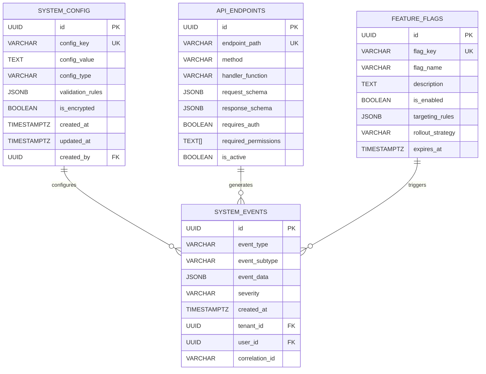
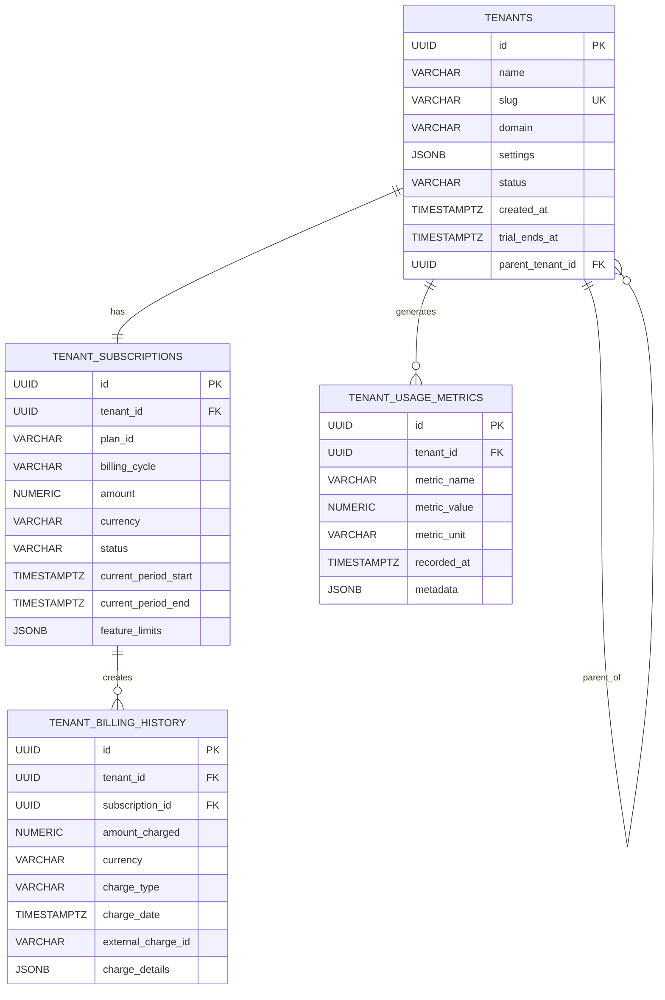
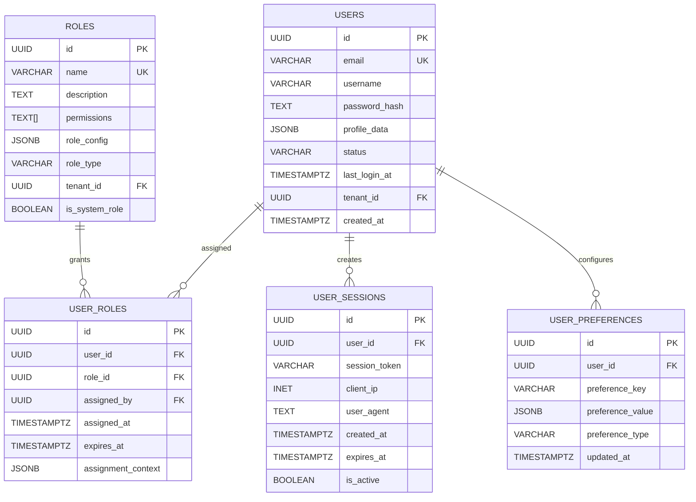
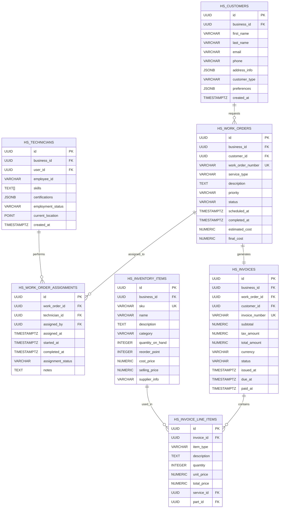
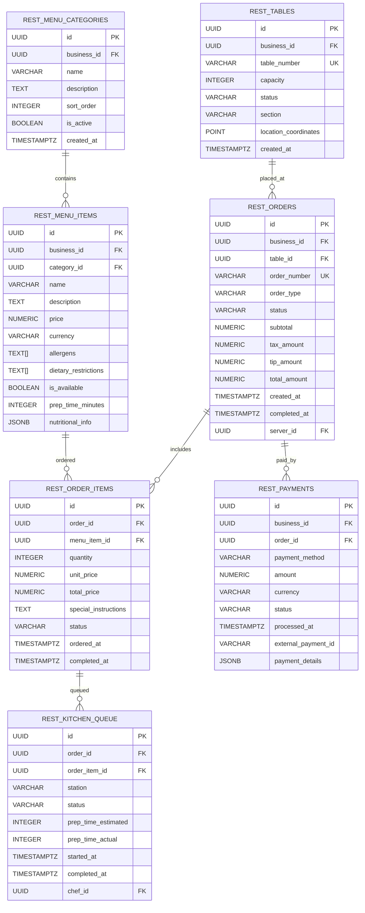
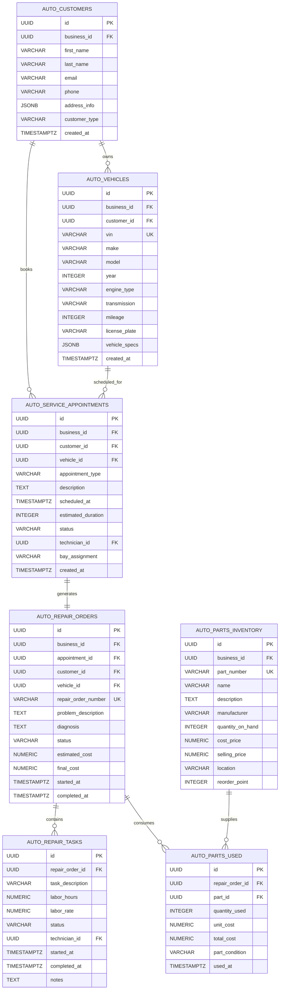
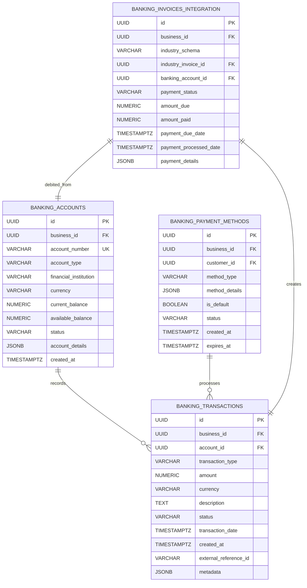

# Comprehensive Database Documentation & ERD Diagrams
**Complete Database Architecture Documentation for Thorbis Business OS**

## Overview
Comprehensive database documentation including Entity Relationship Diagrams (ERDs), table specifications, relationship mappings, and architectural patterns for the Thorbis Business OS multi-tenant, multi-industry platform.

### Documentation Scope
- **Complete Schema Architecture**: All schemas, tables, relationships, and constraints
- **Visual ERD Diagrams**: Industry-specific and cross-industry relationship diagrams
- **API Integration Mappings**: Database-to-API endpoint relationships
- **Performance Optimization**: Index strategies, partitioning, and query patterns
- **Security & Compliance**: RLS policies, encryption, and audit requirements

---

## Database Architecture Overview

### High-Level Schema Organization
```
┌─────────────────────────────────────────────────────────────────────────────────────────────────────┐
│                                    Thorbis Business OS Database                                       │
├─────────────────────────────────────────────────────────────────────────────────────────────────────┤
│                                                                                                       │
│  ┌──────────────────────────────────────────────────────────────────────────────────────────────┐   │
│  │                              System Core Schemas                                             │   │
│  ├──────────────────────────────────────────────────────────────────────────────────────────────┤   │
│  │  system_core  │  tenant_mgmt  │  user_mgmt  │  security_mgmt  │  monitoring_obs  │  perf_mgmt  │   │
│  └──────────────────────────────────────────────────────────────────────────────────────────────┘   │
│                                            │                                                          │
│  ┌──────────────────────────────────────────────────────────────────────────────────────────────┐   │
│  │                              Industry-Specific Schemas                                       │   │
│  ├──────────────────────────────────────────────────────────────────────────────────────────────┤   │
│  │    hs        │    auto       │    rest       │    banking    │    ret       │   courses      │   │
│  │ (Home Svc)   │ (Automotive)  │ (Restaurant)  │ (Financial)   │ (Retail)     │ (Learning)     │   │
│  ├──────────────────────────────────────────────────────────────────────────────────────────────┤   │
│  │              payroll         │             investigations            │      security_hardening │   │
│  └──────────────────────────────────────────────────────────────────────────────────────────────┘   │
│                                                                                                       │
└─────────────────────────────────────────────────────────────────────────────────────────────────────┘
```

---

## Core Schema ERD Diagrams

### System Core Schema ERD


### Multi-Tenant Management ERD


### User Management & RBAC ERD


---

## Industry-Specific Schema ERDs

### Home Services (HS) Schema ERD


### Restaurant (REST) Schema ERD


### Automotive (AUTO) Schema ERD


---

## Cross-Schema Integration ERD

### Banking & Financial Services Integration


---

## Table Specifications & Data Dictionary

### System Core Tables Detailed Specifications

#### system_config
**Purpose**: Centralized configuration management for the entire platform
- **Primary Key**: `id` (UUID)
- **Unique Constraints**: `config_key`
- **Indexes**: 
  - `idx_system_config_key` on `config_key`
  - `idx_system_config_type` on `config_type`
- **Row Level Security**: Admin access only
- **Audit Trail**: Full audit logging enabled
- **Data Retention**: Permanent (configuration history)

```sql
CREATE TABLE system_core.system_config (
  id UUID PRIMARY KEY DEFAULT gen_random_uuid(),
  config_key VARCHAR(255) NOT NULL,
  config_value TEXT,
  config_type config_type_enum NOT NULL,
  validation_rules JSONB,
  is_encrypted BOOLEAN DEFAULT false,
  environment VARCHAR(50) DEFAULT 'production',
  created_at TIMESTAMPTZ DEFAULT NOW(),
  updated_at TIMESTAMPTZ DEFAULT NOW(),
  created_by UUID REFERENCES auth.users(id),
  updated_by UUID REFERENCES auth.users(id),
  
  CONSTRAINT uk_system_config_key UNIQUE (config_key, environment),
  CONSTRAINT chk_config_value_not_empty CHECK (config_value IS NOT NULL AND config_value != ''),
  CONSTRAINT chk_environment CHECK (environment IN ('development', 'staging', 'production'))
);
```

#### system_events
**Purpose**: Centralized event logging and audit trail for the entire platform
- **Primary Key**: `id` (UUID)
- **Partitioning**: Range partitioned by `created_at` (monthly partitions)
- **Indexes**:
  - `idx_system_events_timestamp` on `created_at`
  - `idx_system_events_tenant` on `tenant_id`
  - `idx_system_events_type` on `event_type`
  - `idx_system_events_correlation` on `correlation_id`
- **Row Level Security**: Tenant isolation enabled
- **Data Retention**: 7 years (compliance requirement)

```sql
CREATE TABLE system_core.system_events (
  id UUID PRIMARY KEY DEFAULT gen_random_uuid(),
  event_type VARCHAR(100) NOT NULL,
  event_subtype VARCHAR(100),
  event_data JSONB NOT NULL,
  severity severity_enum NOT NULL DEFAULT 'INFO',
  created_at TIMESTAMPTZ DEFAULT NOW(),
  tenant_id UUID REFERENCES tenant_mgmt.tenants(id),
  user_id UUID REFERENCES auth.users(id),
  correlation_id UUID,
  source_system VARCHAR(100) DEFAULT 'thorbis_platform',
  ip_address INET,
  user_agent TEXT,
  session_id VARCHAR(255),
  
  -- Partitioning support
  event_date DATE GENERATED ALWAYS AS (DATE(created_at)) STORED
) PARTITION BY RANGE (event_date);
```

### Industry-Specific Table Specifications

#### Home Services: hs_work_orders
**Purpose**: Central work order management for home services businesses
- **Primary Key**: `id` (UUID)
- **Business Key**: `work_order_number` (tenant-scoped unique)
- **Foreign Keys**: 
  - `business_id` → `tenant_mgmt.tenants(id)`
  - `customer_id` → `hs.customers(id)`
- **Indexes**:
  - `idx_hs_work_orders_business_customer` on `(business_id, customer_id)`
  - `idx_hs_work_orders_status` on `status`
  - `idx_hs_work_orders_scheduled` on `scheduled_at`
  - `idx_hs_work_orders_number` on `work_order_number`
- **Row Level Security**: Business tenant isolation
- **Audit Trail**: All changes tracked in `hs_work_orders_audit`

```sql
CREATE TABLE hs.work_orders (
  id UUID PRIMARY KEY DEFAULT gen_random_uuid(),
  business_id UUID NOT NULL REFERENCES tenant_mgmt.tenants(id),
  customer_id UUID NOT NULL REFERENCES hs.customers(id),
  work_order_number VARCHAR(100) NOT NULL,
  service_type service_type_enum NOT NULL,
  description TEXT NOT NULL,
  priority priority_enum DEFAULT 'MEDIUM',
  status work_order_status_enum DEFAULT 'PENDING',
  scheduled_at TIMESTAMPTZ,
  completed_at TIMESTAMPTZ,
  estimated_cost NUMERIC(10,2),
  final_cost NUMERIC(10,2),
  location_address JSONB,
  special_instructions TEXT,
  created_at TIMESTAMPTZ DEFAULT NOW(),
  updated_at TIMESTAMPTZ DEFAULT NOW(),
  created_by UUID REFERENCES auth.users(id),
  updated_by UUID REFERENCES auth.users(id),
  
  CONSTRAINT uk_hs_work_order_number UNIQUE (business_id, work_order_number),
  CONSTRAINT chk_hs_work_order_costs CHECK (estimated_cost >= 0 AND final_cost >= 0),
  CONSTRAINT chk_hs_work_order_completion CHECK (
    (status = 'COMPLETED' AND completed_at IS NOT NULL) OR 
    (status != 'COMPLETED' AND completed_at IS NULL)
  )
);
```

---

## API to Database Mapping

### Home Services API Endpoints to Database Tables

| API Endpoint | HTTP Method | Primary Tables | Related Tables | Performance Notes |
|--------------|-------------|---------------|----------------|-------------------|
| `/api/hs/work-orders` | GET | `hs.work_orders` | `hs.customers`, `hs.technicians` | Uses composite index on `(business_id, status)` |
| `/api/hs/work-orders` | POST | `hs.work_orders` | `hs.customers`, `hs.work_order_assignments` | Triggers sequence number generation |
| `/api/hs/work-orders/{id}` | PUT | `hs.work_orders` | `hs.work_order_assignments`, `hs.invoices` | Updates trigger audit trail |
| `/api/hs/customers` | GET | `hs.customers` | `hs.work_orders` | Full-text search on name fields |
| `/api/hs/technicians/availability` | GET | `hs.technicians`, `hs.technician_availability` | `hs.work_order_assignments` | Uses spatial queries for location |
| `/api/hs/invoices/{id}/pdf` | GET | `hs.invoices`, `hs.invoice_line_items` | `hs.work_orders`, `hs.customers` | Generates PDF from template |

### Restaurant API Endpoints to Database Tables

| API Endpoint | HTTP Method | Primary Tables | Related Tables | Performance Notes |
|--------------|-------------|---------------|----------------|-------------------|
| `/api/rest/orders` | POST | `rest.orders`, `rest.order_items` | `rest.menu_items`, `rest.tables` | Atomic transaction required |
| `/api/rest/kitchen/queue` | GET | `rest.kitchen_queue` | `rest.order_items`, `rest.orders` | Real-time updates via WebSocket |
| `/api/rest/menu/items` | GET | `rest.menu_items` | `rest.menu_categories` | Cached heavily, TTL 5 minutes |
| `/api/rest/pos/payment` | POST | `rest.payments` | `rest.orders`, `banking.transactions` | Integrates with payment processor |

### Banking API Endpoints to Database Tables

| API Endpoint | HTTP Method | Primary Tables | Related Tables | Performance Notes |
|--------------|-------------|---------------|----------------|-------------------|
| `/api/banking/accounts` | GET | `banking.accounts` | `banking.transactions` | Balance calculation optimized |
| `/api/banking/transactions` | GET | `banking.transactions` | `banking.accounts` | Paginated, uses time-series index |
| `/api/banking/payments/process` | POST | `banking.transactions`, `banking.payment_methods` | Industry invoice tables | High-security transaction |

---

## Query Performance Optimization

### Common Query Patterns & Optimizations

#### Home Services - Work Order Lookup
```sql
-- Optimized query for work order dashboard
EXPLAIN (ANALYZE, BUFFERS) 
SELECT 
  wo.id,
  wo.work_order_number,
  wo.status,
  wo.scheduled_at,
  c.first_name || ' ' || c.last_name as customer_name,
  t.name as technician_name
FROM hs.work_orders wo
JOIN hs.customers c ON wo.customer_id = c.id
LEFT JOIN hs.work_order_assignments woa ON wo.id = woa.work_order_id
LEFT JOIN hs.technicians t ON woa.technician_id = t.id
WHERE wo.business_id = $1
  AND wo.scheduled_at >= CURRENT_DATE
  AND wo.scheduled_at < CURRENT_DATE + INTERVAL '7 days'
ORDER BY wo.scheduled_at ASC;

-- Supporting indexes:
-- CREATE INDEX idx_hs_work_orders_business_scheduled ON hs.work_orders (business_id, scheduled_at);
-- CREATE INDEX idx_hs_work_order_assignments_work_order ON hs.work_order_assignments (work_order_id);
```

#### Restaurant - Kitchen Queue Management
```sql
-- Optimized real-time kitchen queue query
EXPLAIN (ANALYZE, BUFFERS)
SELECT 
  kq.id,
  kq.status,
  kq.prep_time_estimated,
  oi.quantity,
  mi.name as item_name,
  o.order_number,
  t.table_number
FROM rest.kitchen_queue kq
JOIN rest.order_items oi ON kq.order_item_id = oi.id
JOIN rest.menu_items mi ON oi.menu_item_id = mi.id
JOIN rest.orders o ON oi.order_id = o.id
JOIN rest.tables t ON o.table_id = t.id
WHERE kq.business_id = $1
  AND kq.status IN ('PENDING', 'IN_PROGRESS')
ORDER BY 
  CASE kq.status WHEN 'IN_PROGRESS' THEN 1 WHEN 'PENDING' THEN 2 END,
  kq.started_at ASC NULLS LAST,
  kq.created_at ASC;

-- Supporting indexes:
-- CREATE INDEX idx_rest_kitchen_queue_status_business ON rest.kitchen_queue (business_id, status, started_at, created_at);
```

#### Banking - Account Balance Calculation
```sql
-- Optimized account balance query with running totals
EXPLAIN (ANALYZE, BUFFERS)
WITH balance_calculation AS (
  SELECT 
    account_id,
    SUM(CASE WHEN transaction_type = 'CREDIT' THEN amount ELSE -amount END) as balance_change
  FROM banking.transactions
  WHERE account_id = $1
    AND status = 'COMPLETED'
    AND transaction_date <= $2
  GROUP BY account_id
)
SELECT 
  a.account_number,
  a.account_type,
  COALESCE(bc.balance_change, 0) as current_balance
FROM banking.accounts a
LEFT JOIN balance_calculation bc ON a.id = bc.account_id
WHERE a.id = $1;

-- Supporting indexes:
-- CREATE INDEX idx_banking_transactions_account_date_status ON banking.transactions (account_id, transaction_date, status);
```

---

## Security & Compliance Mappings

### Row Level Security (RLS) Policies

#### Multi-Tenant Isolation Policy Template
```sql
-- Standard tenant isolation policy applied to all business tables
CREATE POLICY tenant_isolation ON {schema}.{table}
  FOR ALL TO authenticated_users
  USING (business_id = current_setting('app.current_tenant_id')::UUID)
  WITH CHECK (business_id = current_setting('app.current_tenant_id')::UUID);
```

#### Role-Based Data Access Policy
```sql
-- Example: Technicians can only see their assigned work orders
CREATE POLICY technician_work_orders ON hs.work_orders
  FOR SELECT TO technician_role
  USING (
    id IN (
      SELECT work_order_id 
      FROM hs.work_order_assignments woa
      JOIN hs.technicians t ON woa.technician_id = t.id
      WHERE t.user_id = auth.uid()
    )
  );
```

### Data Classification & Encryption Requirements

| Table | Columns | Classification | Encryption | Compliance |
|-------|---------|---------------|------------|------------|
| `hs.customers` | `email`, `phone` | CONFIDENTIAL | Column-level | PCI DSS, GDPR |
| `auto.vehicles` | `vin` | INTERNAL | Column-level | Industry Standard |
| `banking.accounts` | `account_number` | RESTRICTED | Column-level | PCI DSS, SOX |
| `banking.transactions` | `amount`, `external_reference_id` | CONFIDENTIAL | Column-level | PCI DSS |
| `user_mgmt.users` | `password_hash`, `email` | RESTRICTED | Column-level | GDPR, CCPA |
| `rest.payments` | `external_payment_id` | RESTRICTED | Column-level | PCI DSS |

---

## Development Guidelines & Best Practices

### Naming Conventions

#### Table Naming
- **Schema Prefix**: Industry code (`hs_`, `auto_`, `rest_`, `banking_`)
- **Descriptive Names**: Use full words, avoid abbreviations
- **Plural Nouns**: Tables represent collections (`customers`, `work_orders`)
- **Junction Tables**: Use both table names (`work_order_assignments`)

#### Column Naming
- **Snake Case**: Use underscores for word separation
- **Descriptive**: Full words preferred over abbreviations
- **Consistent Patterns**: 
  - `_id` suffix for foreign keys
  - `_at` suffix for timestamps
  - `_count` suffix for counters
  - `is_` prefix for booleans

#### Index Naming
- **Pattern**: `idx_{table}_{columns}_{type}`
- **Examples**: 
  - `idx_hs_work_orders_business_status`
  - `idx_rest_orders_created_at_desc`
  - `idx_banking_transactions_account_date`

### Code Generation Templates

#### API Endpoint Generation
```sql
-- Generate CRUD API endpoints from table metadata
SELECT 
  'export const ' || table_name || 'API = {' as api_definition,
  '  list: (params) => api.get("/api/' || schema_name || '/' || table_name || '", { params }),' as list_method,
  '  create: (data) => api.post("/api/' || schema_name || '/' || table_name || '", data),' as create_method,
  '  update: (id, data) => api.put("/api/' || schema_name || '/' || table_name || '/${id}", data),' as update_method,
  '  delete: (id) => api.delete("/api/' || schema_name || '/' || table_name || '/${id}")' as delete_method,
  '};' as closing
FROM information_schema.tables 
WHERE table_schema IN ('hs', 'auto', 'rest', 'banking', 'ret', 'courses', 'payroll', 'investigations')
  AND table_type = 'BASE TABLE';
```

#### TypeScript Interface Generation
```sql
-- Generate TypeScript interfaces from table columns
SELECT 
  'export interface ' || 
  INITCAP(table_name) || ' {' as interface_start,
  array_to_string(
    array_agg(
      '  ' || column_name || 
      CASE WHEN is_nullable = 'YES' THEN '?: ' ELSE ': ' END ||
      CASE data_type 
        WHEN 'uuid' THEN 'string'
        WHEN 'character varying' THEN 'string'
        WHEN 'text' THEN 'string'
        WHEN 'integer' THEN 'number'
        WHEN 'numeric' THEN 'number'
        WHEN 'boolean' THEN 'boolean'
        WHEN 'timestamp with time zone' THEN 'Date'
        WHEN 'jsonb' THEN 'Record<string, any>'
        ELSE 'any'
      END || ';'
      ORDER BY ordinal_position
    ), E'\n'
  ) as interface_body,
  '}' as interface_end
FROM information_schema.columns 
WHERE table_schema = 'hs' AND table_name = 'work_orders'
GROUP BY table_name;
```

---

## Implementation Checklist

### Phase 1: Core Infrastructure
- [ ] Deploy all core system schemas
- [ ] Implement multi-tenant isolation
- [ ] Configure Row Level Security policies
- [ ] Set up audit logging framework
- [ ] Create performance monitoring

### Phase 2: Industry Schemas
- [ ] Deploy Home Services schema
- [ ] Deploy Restaurant schema
- [ ] Deploy Automotive schema
- [ ] Deploy Banking/Financial schema
- [ ] Deploy Retail schema

### Phase 3: Integration & Optimization
- [ ] Implement cross-schema integrations
- [ ] Optimize query performance
- [ ] Configure data encryption
- [ ] Set up automated backups
- [ ] Deploy monitoring dashboards

### Phase 4: Documentation & Training
- [ ] Complete API documentation
- [ ] Create developer guides
- [ ] Generate ERD diagrams
- [ ] Conduct team training
- [ ] Establish maintenance procedures

---

This comprehensive database documentation provides complete coverage of the Thorbis Business OS database architecture, including detailed ERDs, table specifications, API mappings, performance optimizations, and security requirements across all industry verticals.