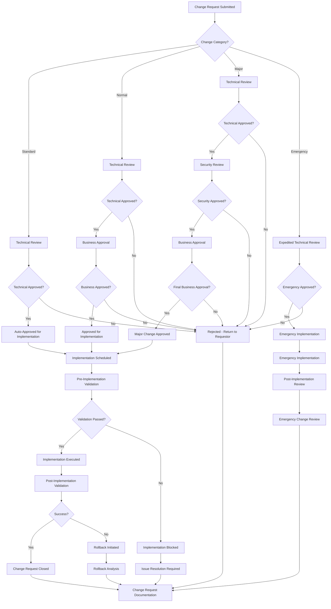

# Database Governance & Change Management Processes
**Enterprise Database Governance Framework for Thorbis Business OS**

## Overview
Comprehensive database governance and change management framework establishing policies, procedures, standards, and oversight mechanisms for database operations across all environments and industry verticals in the Thorbis Business OS platform.

### Governance Objectives
- **Strategic Alignment**: Ensure database operations align with business objectives and compliance requirements
- **Risk Management**: Identify, assess, and mitigate database-related risks
- **Quality Assurance**: Maintain high standards for database design, performance, and security
- **Change Control**: Systematic management of all database changes
- **Compliance Management**: Ensure adherence to regulatory requirements and industry standards

---

## Governance Architecture Overview

### Governance Structure
```
┌─────────────────────────────────────────────────────────────────────────────────────────────────────┐
│                              Database Governance Council                                             │
├─────────────────────────────────────────────────────────────────────────────────────────────────────┤
│  ┌──────────────────┐  ┌──────────────────┐  ┌──────────────────┐  ┌──────────────────┐            │
│  │   Executive      │  │   Technical      │  │    Security      │  │   Compliance     │            │
│  │   Oversight      │  │   Architecture   │  │    & Risk        │  │   & Audit        │            │
│  │                  │  │                  │  │                  │  │                  │            │
│  │ • Strategic      │  │ • Design         │  │ • Security       │  │ • Regulatory     │            │
│  │   Direction      │  │   Standards      │  │   Policies       │  │   Requirements   │            │
│  │ • Budget         │  │ • Performance    │  │ • Risk           │  │ • Audit          │            │
│  │   Approval       │  │   Standards      │  │   Assessment     │  │   Management     │            │
│  │ • Resource       │  │ • Change         │  │ • Incident       │  │ • Documentation  │            │
│  │   Allocation     │  │   Architecture   │  │   Response       │  │   Requirements   │            │
│  └──────────────────┘  └──────────────────┘  └──────────────────┘  └──────────────────┘            │
├─────────────────────────────────────────────────────────────────────────────────────────────────────┤
│                                   Operating Committees                                               │
├─────────────────────────────────────────────────────────────────────────────────────────────────────┤
│  ┌──────────────────┐  ┌──────────────────┐  ┌──────────────────┐  ┌──────────────────┐            │
│  │   Change Review  │  │  Quality Review  │  │  Security Review │  │  Performance     │            │
│  │   Board (CRB)    │  │  Committee       │  │  Committee       │  │  Review Board    │            │
│  │                  │  │                  │  │                  │  │                  │            │
│  │ • Migration      │  │ • Code Quality   │  │ • Access Control │  │ • Performance    │            │
│  │   Approval       │  │ • Documentation  │  │ • Encryption     │  │   Standards      │            │
│  │ • Risk           │  │ • Testing        │  │ • Vulnerability  │  │ • Capacity       │            │
│  │   Assessment     │  │   Standards      │  │   Assessment     │  │   Planning       │            │
│  │ • Impact         │  │ • Best Practices │  │ • Compliance     │  │ • Optimization   │            │
│  │   Analysis       │  │   Enforcement    │  │   Monitoring     │  │   Review         │            │
│  └──────────────────┘  └──────────────────┘  └──────────────────┘  └──────────────────┘            │
├─────────────────────────────────────────────────────────────────────────────────────────────────────┤
│                                   Execution Teams                                                   │
├─────────────────────────────────────────────────────────────────────────────────────────────────────┤
│  ┌──────────────────┐  ┌──────────────────┐  ┌──────────────────┐  ┌──────────────────┐            │
│  │   Database       │  │  Development     │  │   Operations     │  │   Business       │            │
│  │   Administration │  │  Teams           │  │   Teams          │  │   Stakeholders   │            │
│  └──────────────────┘  └──────────────────┘  └──────────────────┘  └──────────────────┘            │
└─────────────────────────────────────────────────────────────────────────────────────────────────────┘
```

---

## Governance Framework Schema

### Core Governance Tables
```sql
-- Database Governance Schema
CREATE SCHEMA IF NOT EXISTS db_governance;

-- Governance Policies Registry
CREATE TABLE db_governance.governance_policies (
  id UUID PRIMARY KEY DEFAULT gen_random_uuid(),
  policy_name VARCHAR(255) NOT NULL,
  policy_category policy_category_enum NOT NULL, -- 'DATA_MGMT', 'SECURITY', 'PERFORMANCE', 'COMPLIANCE', 'CHANGE_MGMT'
  policy_version VARCHAR(50) NOT NULL,
  
  -- Policy Content
  policy_description TEXT NOT NULL,
  policy_objectives TEXT[],
  policy_requirements JSONB NOT NULL,
  enforcement_mechanisms JSONB,
  
  -- Scope & Applicability
  applicable_environments TEXT[] DEFAULT ARRAY['development', 'staging', 'production'],
  applicable_industries TEXT[], -- NULL means applies to all
  applicable_roles TEXT[],
  
  -- Governance Context
  regulatory_basis TEXT[], -- Which regulations drive this policy
  business_justification TEXT,
  risk_mitigation_areas TEXT[],
  
  -- Lifecycle Management
  policy_status policy_status_enum DEFAULT 'DRAFT', -- 'DRAFT', 'REVIEW', 'APPROVED', 'ACTIVE', 'DEPRECATED'
  effective_date TIMESTAMPTZ,
  review_date TIMESTAMPTZ,
  expiry_date TIMESTAMPTZ,
  
  -- Approval & Ownership
  policy_owner VARCHAR(255) NOT NULL,
  approved_by UUID REFERENCES auth.users(id),
  approved_at TIMESTAMPTZ,
  
  -- Metrics & KPIs
  compliance_metrics JSONB,
  success_criteria JSONB,
  
  created_at TIMESTAMPTZ DEFAULT NOW(),
  updated_at TIMESTAMPTZ DEFAULT NOW(),
  created_by UUID REFERENCES auth.users(id),
  
  CONSTRAINT uk_governance_policy UNIQUE (policy_name, policy_version)
);

-- Change Request Management
CREATE TABLE db_governance.change_requests (
  id UUID PRIMARY KEY DEFAULT gen_random_uuid(),
  change_request_number VARCHAR(100) NOT NULL,
  change_title VARCHAR(255) NOT NULL,
  change_description TEXT NOT NULL,
  
  -- Change Classification
  change_type change_type_enum NOT NULL, -- 'SCHEMA', 'DATA', 'CONFIGURATION', 'SECURITY', 'PERFORMANCE', 'EMERGENCY'
  change_category change_category_enum NOT NULL, -- 'STANDARD', 'NORMAL', 'EMERGENCY', 'MAJOR'
  risk_level risk_level_enum NOT NULL, -- 'LOW', 'MEDIUM', 'HIGH', 'CRITICAL'
  
  -- Business Context
  business_justification TEXT NOT NULL,
  expected_benefits TEXT[],
  success_criteria TEXT[],
  affected_systems TEXT[],
  affected_users_count INTEGER,
  
  -- Technical Details
  technical_approach TEXT,
  implementation_plan JSONB,
  rollback_plan JSONB,
  testing_plan JSONB,
  
  -- Timeline & Resources
  requested_implementation_date TIMESTAMPTZ,
  estimated_effort_hours INTEGER,
  required_resources TEXT[],
  maintenance_window_required BOOLEAN DEFAULT false,
  
  -- Risk Assessment
  identified_risks JSONB,
  risk_mitigation_measures JSONB,
  impact_assessment JSONB,
  
  -- Change Status & Workflow
  change_status change_status_enum DEFAULT 'SUBMITTED', -- 'SUBMITTED', 'UNDER_REVIEW', 'APPROVED', 'REJECTED', 'IMPLEMENTED', 'CLOSED'
  current_approval_stage VARCHAR(100),
  
  -- Requestor Information
  requestor_id UUID REFERENCES auth.users(id) NOT NULL,
  requestor_department VARCHAR(100),
  business_sponsor VARCHAR(255),
  
  -- Review & Approval
  technical_reviewer UUID REFERENCES auth.users(id),
  security_reviewer UUID REFERENCES auth.users(id),
  business_approver UUID REFERENCES auth.users(id),
  
  -- Implementation Tracking
  assigned_implementer UUID REFERENCES auth.users(id),
  implementation_started_at TIMESTAMPTZ,
  implementation_completed_at TIMESTAMPTZ,
  
  created_at TIMESTAMPTZ DEFAULT NOW(),
  updated_at TIMESTAMPTZ DEFAULT NOW(),
  
  CONSTRAINT uk_change_request_number UNIQUE (change_request_number)
);

-- Change Approval Workflow
CREATE TABLE db_governance.change_approvals (
  id UUID PRIMARY KEY DEFAULT gen_random_uuid(),
  change_request_id UUID REFERENCES db_governance.change_requests(id) NOT NULL,
  
  -- Approval Stage
  approval_stage approval_stage_enum NOT NULL, -- 'TECHNICAL_REVIEW', 'SECURITY_REVIEW', 'BUSINESS_APPROVAL', 'FINAL_APPROVAL'
  approver_id UUID REFERENCES auth.users(id) NOT NULL,
  approver_role VARCHAR(100) NOT NULL,
  
  -- Approval Decision
  approval_status approval_status_enum NOT NULL, -- 'PENDING', 'APPROVED', 'REJECTED', 'CONDITIONAL'
  approval_notes TEXT,
  conditions TEXT,
  
  -- Review Details
  review_started_at TIMESTAMPTZ DEFAULT NOW(),
  review_completed_at TIMESTAMPTZ,
  review_duration_hours NUMERIC(8,2),
  
  -- Approval Context
  approval_criteria_met JSONB,
  concerns_raised TEXT[],
  recommendations TEXT[],
  
  created_at TIMESTAMPTZ DEFAULT NOW()
);

-- Standards & Best Practices
CREATE TABLE db_governance.database_standards (
  id UUID PRIMARY KEY DEFAULT gen_random_uuid(),
  standard_name VARCHAR(255) NOT NULL,
  standard_category standard_category_enum NOT NULL, -- 'NAMING', 'DESIGN', 'PERFORMANCE', 'SECURITY', 'DOCUMENTATION'
  standard_version VARCHAR(50) NOT NULL,
  
  -- Standard Definition
  standard_description TEXT NOT NULL,
  standard_rules JSONB NOT NULL,
  examples JSONB,
  anti_patterns JSONB,
  
  -- Implementation Guidelines
  implementation_guidance TEXT,
  validation_criteria JSONB,
  automated_checks TEXT[], -- List of automated validation functions
  
  -- Compliance Requirements
  compliance_level compliance_level_enum DEFAULT 'RECOMMENDED', -- 'MANDATORY', 'RECOMMENDED', 'OPTIONAL'
  enforcement_mechanism VARCHAR(100),
  violation_consequences TEXT,
  
  -- Standard Context
  applicable_schemas TEXT[],
  applicable_table_types TEXT[],
  applicable_operations TEXT[],
  
  -- Lifecycle
  standard_status VARCHAR(50) DEFAULT 'ACTIVE',
  effective_date TIMESTAMPTZ DEFAULT NOW(),
  review_date TIMESTAMPTZ,
  
  -- Ownership
  standard_owner VARCHAR(255),
  maintained_by UUID REFERENCES auth.users(id),
  
  created_at TIMESTAMPTZ DEFAULT NOW(),
  updated_at TIMESTAMPTZ DEFAULT NOW(),
  
  CONSTRAINT uk_database_standard UNIQUE (standard_name, standard_version)
);

-- Compliance Tracking
CREATE TABLE db_governance.compliance_assessments (
  id UUID PRIMARY KEY DEFAULT gen_random_uuid(),
  assessment_name VARCHAR(255) NOT NULL,
  assessment_type assessment_type_enum NOT NULL, -- 'POLICY_COMPLIANCE', 'STANDARDS_COMPLIANCE', 'REGULATORY_COMPLIANCE'
  
  -- Assessment Scope
  scope_description TEXT,
  assessed_schemas TEXT[],
  assessed_environments TEXT[],
  assessment_criteria JSONB,
  
  -- Assessment Timeline
  assessment_period_start TIMESTAMPTZ NOT NULL,
  assessment_period_end TIMESTAMPTZ NOT NULL,
  assessment_conducted_at TIMESTAMPTZ DEFAULT NOW(),
  
  -- Results Summary
  overall_compliance_score NUMERIC(5,2), -- Percentage
  compliant_items_count INTEGER DEFAULT 0,
  non_compliant_items_count INTEGER DEFAULT 0,
  critical_violations_count INTEGER DEFAULT 0,
  
  -- Detailed Results
  detailed_findings JSONB,
  recommendations JSONB,
  remediation_plan JSONB,
  
  -- Assessment Context
  assessor_name VARCHAR(255),
  assessment_methodology TEXT,
  assessment_tools_used TEXT[],
  
  -- Status & Follow-up
  assessment_status VARCHAR(50) DEFAULT 'COMPLETED',
  follow_up_required BOOLEAN DEFAULT false,
  next_assessment_date TIMESTAMPTZ,
  
  created_at TIMESTAMPTZ DEFAULT NOW(),
  created_by UUID REFERENCES auth.users(id)
);
```

### Change Management Workflow Functions
```sql
-- Change Request Submission Function
CREATE OR REPLACE FUNCTION db_governance.submit_change_request(
  p_change_title VARCHAR,
  p_change_description TEXT,
  p_change_type VARCHAR,
  p_business_justification TEXT,
  p_requestor_id UUID,
  p_requested_date TIMESTAMPTZ DEFAULT NULL
) RETURNS UUID AS $$
DECLARE
  v_change_request_id UUID;
  v_change_request_number VARCHAR(100);
  v_risk_level VARCHAR(20);
  v_change_category VARCHAR(20);
BEGIN
  v_change_request_id := gen_random_uuid();
  v_change_request_number := 'CR-' || to_char(NOW(), 'YYYY') || '-' || 
                            LPAD(EXTRACT(DOY FROM NOW())::TEXT, 3, '0') || '-' ||
                            LPAD(EXTRACT(EPOCH FROM NOW())::INTEGER % 10000, 4, '0');
  
  -- Determine change category and risk level based on change type and description
  CASE UPPER(p_change_type)
    WHEN 'EMERGENCY' THEN
      v_change_category := 'EMERGENCY';
      v_risk_level := 'CRITICAL';
    WHEN 'SCHEMA' THEN
      v_change_category := 'NORMAL';
      v_risk_level := CASE 
        WHEN p_change_description ILIKE '%drop%' OR p_change_description ILIKE '%delete%' THEN 'HIGH'
        WHEN p_change_description ILIKE '%alter%' THEN 'MEDIUM'
        ELSE 'LOW'
      END;
    WHEN 'DATA' THEN
      v_change_category := 'NORMAL';
      v_risk_level := 'MEDIUM';
    ELSE
      v_change_category := 'STANDARD';
      v_risk_level := 'LOW';
  END CASE;
  
  -- Insert change request
  INSERT INTO db_governance.change_requests (
    id, change_request_number, change_title, change_description,
    change_type, change_category, risk_level,
    business_justification, requestor_id,
    requested_implementation_date, change_status
  ) VALUES (
    v_change_request_id, v_change_request_number, p_change_title, p_change_description,
    p_change_type::change_type_enum, v_change_category::change_category_enum, 
    v_risk_level::risk_level_enum, p_business_justification, p_requestor_id,
    COALESCE(p_requested_date, NOW() + INTERVAL '7 days'), 'SUBMITTED'
  );
  
  -- Initialize approval workflow
  PERFORM db_governance.initialize_approval_workflow(v_change_request_id);
  
  -- Log change request submission
  PERFORM db_governance.log_governance_event(
    'CHANGE_REQUEST_SUBMITTED',
    format('Change request %s submitted: %s', v_change_request_number, p_change_title),
    jsonb_build_object(
      'change_request_id', v_change_request_id,
      'change_type', p_change_type,
      'risk_level', v_risk_level,
      'requestor', p_requestor_id
    )
  );
  
  RETURN v_change_request_id;
END;
$$ LANGUAGE plpgsql;

-- Approval Workflow Initialization
CREATE OR REPLACE FUNCTION db_governance.initialize_approval_workflow(
  p_change_request_id UUID
) RETURNS VOID AS $$
DECLARE
  v_change_request RECORD;
  v_approval_stages TEXT[];
BEGIN
  -- Get change request details
  SELECT * INTO v_change_request
  FROM db_governance.change_requests
  WHERE id = p_change_request_id;
  
  -- Determine approval workflow based on change category and risk level
  CASE v_change_request.change_category
    WHEN 'EMERGENCY' THEN
      v_approval_stages := ARRAY['TECHNICAL_REVIEW', 'FINAL_APPROVAL'];
    WHEN 'MAJOR' THEN
      v_approval_stages := ARRAY['TECHNICAL_REVIEW', 'SECURITY_REVIEW', 'BUSINESS_APPROVAL', 'FINAL_APPROVAL'];
    WHEN 'NORMAL' THEN
      IF v_change_request.risk_level IN ('HIGH', 'CRITICAL') THEN
        v_approval_stages := ARRAY['TECHNICAL_REVIEW', 'SECURITY_REVIEW', 'BUSINESS_APPROVAL'];
      ELSE
        v_approval_stages := ARRAY['TECHNICAL_REVIEW', 'BUSINESS_APPROVAL'];
      END IF;
    WHEN 'STANDARD' THEN
      v_approval_stages := ARRAY['TECHNICAL_REVIEW'];
  END CASE;
  
  -- Create approval records for each stage
  FOR i IN 1..array_length(v_approval_stages, 1) LOOP
    INSERT INTO db_governance.change_approvals (
      change_request_id, approval_stage, approver_id, approver_role, approval_status
    ) VALUES (
      p_change_request_id, 
      v_approval_stages[i]::approval_stage_enum,
      NULL, -- Will be assigned based on stage
      v_approval_stages[i],
      'PENDING'
    );
  END LOOP;
  
  -- Update change request status and assign first reviewer
  UPDATE db_governance.change_requests
  SET change_status = 'UNDER_REVIEW',
      current_approval_stage = v_approval_stages[1]
  WHERE id = p_change_request_id;
  
  -- Assign reviewers based on first approval stage
  PERFORM db_governance.assign_change_reviewers(p_change_request_id, v_approval_stages[1]);
END;
$$ LANGUAGE plpgsql;

-- Change Request Risk Assessment
CREATE OR REPLACE FUNCTION db_governance.assess_change_risk(
  p_change_request_id UUID
) RETURNS JSONB AS $$
DECLARE
  v_change_request RECORD;
  v_risk_assessment JSONB := '{"overall_risk": "LOW", "risk_factors": []}'::JSONB;
  v_risk_factors JSONB := '[]'::JSONB;
  v_overall_risk VARCHAR(20) := 'LOW';
BEGIN
  -- Get change request details
  SELECT * INTO v_change_request
  FROM db_governance.change_requests
  WHERE id = p_change_request_id;
  
  -- Assess risk factors
  
  -- Database operation risk
  IF v_change_request.change_description ILIKE '%drop%' OR 
     v_change_request.change_description ILIKE '%delete%' OR
     v_change_request.change_description ILIKE '%truncate%' THEN
    v_risk_factors := v_risk_factors || jsonb_build_object(
      'factor', 'DESTRUCTIVE_OPERATION',
      'severity', 'HIGH',
      'description', 'Change involves potentially destructive database operations'
    );
    v_overall_risk := 'HIGH';
  END IF;
  
  -- Production environment risk
  IF 'production' = ANY(v_change_request.affected_systems) THEN
    v_risk_factors := v_risk_factors || jsonb_build_object(
      'factor', 'PRODUCTION_IMPACT',
      'severity', 'MEDIUM',
      'description', 'Change affects production environment'
    );
    IF v_overall_risk = 'LOW' THEN v_overall_risk := 'MEDIUM'; END IF;
  END IF;
  
  -- User impact risk
  IF v_change_request.affected_users_count > 1000 THEN
    v_risk_factors := v_risk_factors || jsonb_build_object(
      'factor', 'HIGH_USER_IMPACT',
      'severity', 'MEDIUM',
      'description', format('Change affects %s users', v_change_request.affected_users_count)
    );
    IF v_overall_risk = 'LOW' THEN v_overall_risk := 'MEDIUM'; END IF;
  END IF;
  
  -- Maintenance window risk
  IF v_change_request.maintenance_window_required THEN
    v_risk_factors := v_risk_factors || jsonb_build_object(
      'factor', 'DOWNTIME_REQUIRED',
      'severity', 'MEDIUM',
      'description', 'Change requires maintenance window and potential downtime'
    );
  END IF;
  
  -- Emergency change risk
  IF v_change_request.change_category = 'EMERGENCY' THEN
    v_risk_factors := v_risk_factors || jsonb_build_object(
      'factor', 'EMERGENCY_CHANGE',
      'severity', 'HIGH',
      'description', 'Emergency changes have higher risk due to compressed review cycle'
    );
    v_overall_risk := 'CRITICAL';
  END IF;
  
  -- Build final risk assessment
  v_risk_assessment := jsonb_build_object(
    'overall_risk', v_overall_risk,
    'risk_factors', v_risk_factors,
    'assessed_at', NOW(),
    'assessment_criteria', 'Automated risk assessment based on change characteristics'
  );
  
  -- Update change request with risk assessment
  UPDATE db_governance.change_requests
  SET identified_risks = v_risk_assessment,
      risk_level = v_overall_risk::risk_level_enum
  WHERE id = p_change_request_id;
  
  RETURN v_risk_assessment;
END;
$$ LANGUAGE plpgsql;

-- Standards Compliance Validation
CREATE OR REPLACE FUNCTION db_governance.validate_standards_compliance(
  p_schema_name VARCHAR,
  p_table_name VARCHAR DEFAULT NULL
) RETURNS JSONB AS $$
DECLARE
  v_compliance_results JSONB := '{"overall_compliant": true, "violations": []}'::JSONB;
  v_violations JSONB := '[]'::JSONB;
  v_standard RECORD;
  v_validation_result BOOLEAN;
BEGIN
  -- Check applicable standards
  FOR v_standard IN 
    SELECT * FROM db_governance.database_standards 
    WHERE standard_status = 'ACTIVE'
      AND (applicable_schemas IS NULL OR p_schema_name = ANY(applicable_schemas))
      AND compliance_level IN ('MANDATORY', 'RECOMMENDED')
  LOOP
    -- Execute automated validation checks
    FOR i IN 1..array_length(v_standard.automated_checks, 1) LOOP
      BEGIN
        -- Execute validation function (placeholder - would call actual validation functions)
        EXECUTE format('SELECT %s($1, $2)', v_standard.automated_checks[i])
        INTO v_validation_result
        USING p_schema_name, p_table_name;
        
        -- If validation fails, record violation
        IF NOT v_validation_result THEN
          v_violations := v_violations || jsonb_build_object(
            'standard_name', v_standard.standard_name,
            'standard_category', v_standard.standard_category,
            'violation_type', v_standard.automated_checks[i],
            'compliance_level', v_standard.compliance_level,
            'description', format('Failed validation: %s', v_standard.automated_checks[i])
          );
        END IF;
        
      EXCEPTION
        WHEN OTHERS THEN
          -- Log validation error but continue
          PERFORM db_governance.log_governance_event(
            'STANDARDS_VALIDATION_ERROR',
            format('Error validating standard %s: %s', v_standard.standard_name, SQLERRM),
            jsonb_build_object('standard_id', v_standard.id, 'error', SQLERRM)
          );
      END;
    END LOOP;
  END LOOP;
  
  -- Build final compliance results
  v_compliance_results := jsonb_build_object(
    'overall_compliant', (jsonb_array_length(v_violations) = 0),
    'violations', v_violations,
    'assessed_at', NOW(),
    'schema_assessed', p_schema_name,
    'table_assessed', p_table_name
  );
  
  RETURN v_compliance_results;
END;
$$ LANGUAGE plpgsql;
```

---

## Change Management Process Workflows

### Standard Change Request Process


### Database Standards Enforcement Process
```sql
-- Automated Standards Validation Framework
CREATE OR REPLACE FUNCTION db_governance.enforce_naming_standards()
RETURNS TRIGGER AS $$
DECLARE
  v_violations TEXT[] := ARRAY[]::TEXT[];
  v_table_name TEXT;
  v_schema_name TEXT;
BEGIN
  -- Get table and schema information
  v_table_name := TG_TABLE_NAME;
  v_schema_name := TG_TABLE_SCHEMA;
  
  -- Table naming convention validation
  IF NOT v_table_name ~ '^[a-z][a-z0-9_]*[a-z0-9]$' THEN
    v_violations := v_violations || 'Table name must be lowercase with underscores';
  END IF;
  
  -- Schema-specific naming rules
  CASE v_schema_name
    WHEN 'hs', 'auto', 'rest', 'banking', 'ret', 'courses', 'payroll', 'investigations' THEN
      -- Industry schemas should not have schema prefix in table names
      IF v_table_name LIKE v_schema_name || '_%' THEN
        v_violations := v_violations || format('Industry schema tables should not have %s_ prefix', v_schema_name);
      END IF;
    WHEN 'system_core', 'tenant_mgmt', 'user_mgmt', 'security_mgmt' THEN
      -- System schemas require descriptive prefixes
      IF LENGTH(v_table_name) < 5 THEN
        v_violations := v_violations || 'System tables require descriptive names (minimum 5 characters)';
      END IF;
  END CASE;
  
  -- Log violations if found
  IF array_length(v_violations, 1) > 0 THEN
    PERFORM db_governance.log_standards_violation(
      'NAMING_CONVENTION',
      format('Table %s.%s', v_schema_name, v_table_name),
      v_violations
    );
    
    -- For mandatory standards, raise exception
    RAISE EXCEPTION 'Naming standards violation for table %.%: %', 
      v_schema_name, v_table_name, array_to_string(v_violations, ', ');
  END IF;
  
  RETURN COALESCE(NEW, OLD);
END;
$$ LANGUAGE plpgsql;

-- Column Standards Validation
CREATE OR REPLACE FUNCTION db_governance.validate_column_standards(
  p_schema_name VARCHAR,
  p_table_name VARCHAR
) RETURNS JSONB AS $$
DECLARE
  v_column RECORD;
  v_violations JSONB := '[]'::JSONB;
  v_standards_config JSONB;
BEGIN
  -- Get column standards configuration
  SELECT standard_rules INTO v_standards_config
  FROM db_governance.database_standards
  WHERE standard_name = 'Column Design Standards' AND standard_status = 'ACTIVE';
  
  -- Validate each column
  FOR v_column IN
    SELECT column_name, data_type, is_nullable, column_default
    FROM information_schema.columns
    WHERE table_schema = p_schema_name AND table_name = p_table_name
  LOOP
    -- Primary key naming
    IF v_column.column_name = 'id' AND v_column.data_type != 'uuid' THEN
      v_violations := v_violations || jsonb_build_object(
        'column', v_column.column_name,
        'violation', 'Primary key should be UUID type',
        'severity', 'HIGH'
      );
    END IF;
    
    -- Foreign key naming
    IF v_column.column_name LIKE '%_id' AND v_column.column_name != 'id' THEN
      IF v_column.data_type != 'uuid' THEN
        v_violations := v_violations || jsonb_build_object(
          'column', v_column.column_name,
          'violation', 'Foreign key should be UUID type',
          'severity', 'MEDIUM'
        );
      END IF;
    END IF;
    
    -- Timestamp columns
    IF v_column.column_name IN ('created_at', 'updated_at') THEN
      IF v_column.data_type != 'timestamp with time zone' THEN
        v_violations := v_violations || jsonb_build_object(
          'column', v_column.column_name,
          'violation', 'Timestamp columns should use TIMESTAMPTZ type',
          'severity', 'MEDIUM'
        );
      END IF;
    END IF;
    
    -- Audit columns requirement
    IF p_schema_name IN ('hs', 'auto', 'rest', 'banking', 'ret', 'courses', 'payroll') THEN
      -- Business tables should have audit columns
      CONTINUE; -- Would check for created_at, updated_at, etc.
    END IF;
  END LOOP;
  
  RETURN jsonb_build_object(
    'compliant', (jsonb_array_length(v_violations) = 0),
    'violations', v_violations,
    'assessed_at', NOW()
  );
END;
$$ LANGUAGE plpgsql;
```

---

## Governance Reporting & Metrics

### Key Performance Indicators (KPIs)
```sql
-- Governance KPI Dashboard View
CREATE OR REPLACE VIEW db_governance.governance_kpi_dashboard AS
WITH change_metrics AS (
  SELECT 
    DATE_TRUNC('month', created_at) as month,
    change_category,
    COUNT(*) as total_changes,
    COUNT(CASE WHEN change_status = 'IMPLEMENTED' THEN 1 END) as successful_changes,
    COUNT(CASE WHEN change_status = 'REJECTED' THEN 1 END) as rejected_changes,
    AVG(EXTRACT(EPOCH FROM (implementation_completed_at - created_at))/3600) as avg_implementation_hours
  FROM db_governance.change_requests
  WHERE created_at >= NOW() - INTERVAL '12 months'
  GROUP BY DATE_TRUNC('month', created_at), change_category
),
compliance_metrics AS (
  SELECT 
    DATE_TRUNC('month', assessment_conducted_at) as month,
    AVG(overall_compliance_score) as avg_compliance_score,
    SUM(critical_violations_count) as total_critical_violations,
    COUNT(*) as total_assessments
  FROM db_governance.compliance_assessments
  WHERE assessment_conducted_at >= NOW() - INTERVAL '12 months'
  GROUP BY DATE_TRUNC('month', assessment_conducted_at)
),
standards_metrics AS (
  SELECT 
    standard_category,
    COUNT(*) as total_standards,
    COUNT(CASE WHEN standard_status = 'ACTIVE' THEN 1 END) as active_standards,
    COUNT(CASE WHEN compliance_level = 'MANDATORY' THEN 1 END) as mandatory_standards
  FROM db_governance.database_standards
  GROUP BY standard_category
)
SELECT 
  cm.month,
  cm.change_category,
  cm.total_changes,
  cm.successful_changes,
  cm.rejected_changes,
  ROUND((cm.successful_changes::NUMERIC / NULLIF(cm.total_changes, 0) * 100), 2) as success_rate_percent,
  cm.avg_implementation_hours,
  comp.avg_compliance_score,
  comp.total_critical_violations
FROM change_metrics cm
LEFT JOIN compliance_metrics comp ON cm.month = comp.month
ORDER BY cm.month DESC, cm.change_category;

-- Governance Risk Assessment View
CREATE OR REPLACE VIEW db_governance.governance_risk_assessment AS
SELECT 
  'Change Management' as risk_category,
  COUNT(CASE WHEN risk_level = 'CRITICAL' THEN 1 END) as critical_risk_count,
  COUNT(CASE WHEN risk_level = 'HIGH' THEN 1 END) as high_risk_count,
  COUNT(CASE WHEN risk_level = 'MEDIUM' THEN 1 END) as medium_risk_count,
  COUNT(CASE WHEN change_status = 'REJECTED' THEN 1 END) as rejected_changes,
  ROUND(AVG(CASE WHEN change_status = 'IMPLEMENTED' THEN 
    EXTRACT(EPOCH FROM (implementation_completed_at - created_at))/3600 
  END), 2) as avg_implementation_time_hours
FROM db_governance.change_requests
WHERE created_at >= NOW() - INTERVAL '90 days'

UNION ALL

SELECT 
  'Standards Compliance' as risk_category,
  SUM(critical_violations_count) as critical_risk_count,
  SUM(non_compliant_items_count) as high_risk_count,
  0 as medium_risk_count,
  0 as rejected_changes,
  AVG(overall_compliance_score) as avg_implementation_time_hours -- Reusing column for compliance score
FROM db_governance.compliance_assessments
WHERE assessment_conducted_at >= NOW() - INTERVAL '90 days'

UNION ALL

SELECT 
  'Policy Adherence' as risk_category,
  COUNT(CASE WHEN policy_category = 'SECURITY' AND policy_status != 'ACTIVE' THEN 1 END) as critical_risk_count,
  COUNT(CASE WHEN policy_status = 'EXPIRED' THEN 1 END) as high_risk_count,
  COUNT(CASE WHEN review_date < NOW() THEN 1 END) as medium_risk_count,
  0 as rejected_changes,
  0 as avg_implementation_time_hours
FROM db_governance.governance_policies;

-- Standards Violation Tracking
CREATE OR REPLACE FUNCTION db_governance.generate_standards_report(
  p_period_months INTEGER DEFAULT 3
) RETURNS TABLE (
  standard_name VARCHAR,
  violation_count BIGINT,
  affected_schemas TEXT[],
  severity_breakdown JSONB,
  trend VARCHAR
) AS $$
BEGIN
  RETURN QUERY
  WITH violation_data AS (
    SELECT 
      gsl.standard_name,
      COUNT(*) as violation_count,
      array_agg(DISTINCT gsl.object_schema) as affected_schemas,
      jsonb_object_agg(gsl.severity, gsl.severity_count) as severity_breakdown,
      DATE_TRUNC('week', gsl.logged_at) as week
    FROM (
      -- This would be populated by actual standards violation logging
      SELECT 
        'Table Naming Convention' as standard_name,
        'public' as object_schema,
        'HIGH' as severity,
        1 as severity_count,
        NOW() - INTERVAL '1 week' as logged_at
      -- More violation data would be unioned here
    ) gsl
    WHERE gsl.logged_at >= NOW() - (p_period_months || ' months')::INTERVAL
    GROUP BY gsl.standard_name, DATE_TRUNC('week', gsl.logged_at)
  ),
  trend_analysis AS (
    SELECT 
      vd.standard_name,
      SUM(vd.violation_count) as total_violations,
      array_agg(DISTINCT schema) as schemas,
      jsonb_object_agg(severity_key, severity_value) as severities,
      CASE 
        WHEN COUNT(*) < 2 THEN 'INSUFFICIENT_DATA'
        WHEN (array_agg(vd.violation_count ORDER BY vd.week DESC))[1] > 
             (array_agg(vd.violation_count ORDER BY vd.week DESC))[2] THEN 'INCREASING'
        WHEN (array_agg(vd.violation_count ORDER BY vd.week DESC))[1] < 
             (array_agg(vd.violation_count ORDER BY vd.week DESC))[2] THEN 'DECREASING'
        ELSE 'STABLE'
      END as trend
    FROM violation_data vd
    CROSS JOIN jsonb_each(vd.severity_breakdown) as sb(severity_key, severity_value)
    CROSS JOIN unnest(vd.affected_schemas) as schema
    GROUP BY vd.standard_name
  )
  SELECT 
    ta.standard_name::VARCHAR,
    ta.total_violations,
    ta.schemas,
    ta.severities,
    ta.trend::VARCHAR
  FROM trend_analysis ta
  ORDER BY ta.total_violations DESC;
END;
$$ LANGUAGE plpgsql;
```

---

## Governance Automation & Integration

### Automated Policy Enforcement
```sql
-- Policy Enforcement Engine
CREATE OR REPLACE FUNCTION db_governance.enforce_governance_policies()
RETURNS VOID AS $$
DECLARE
  v_policy RECORD;
  v_violation_count INTEGER;
  v_enforcement_action JSONB;
BEGIN
  -- Check each active policy
  FOR v_policy IN 
    SELECT * FROM db_governance.governance_policies 
    WHERE policy_status = 'ACTIVE'
  LOOP
    -- Execute policy compliance checks
    CASE v_policy.policy_category
      WHEN 'DATA_MGMT' THEN
        PERFORM db_governance.enforce_data_management_policies(v_policy.id);
      WHEN 'SECURITY' THEN
        PERFORM db_governance.enforce_security_policies(v_policy.id);
      WHEN 'PERFORMANCE' THEN
        PERFORM db_governance.enforce_performance_policies(v_policy.id);
      WHEN 'COMPLIANCE' THEN
        PERFORM db_governance.enforce_compliance_policies(v_policy.id);
      WHEN 'CHANGE_MGMT' THEN
        PERFORM db_governance.enforce_change_management_policies(v_policy.id);
    END CASE;
  END LOOP;
  
  -- Generate policy enforcement summary
  PERFORM db_governance.log_governance_event(
    'POLICY_ENFORCEMENT_COMPLETED',
    'Daily policy enforcement cycle completed',
    jsonb_build_object('timestamp', NOW(), 'policies_checked', 
      (SELECT COUNT(*) FROM db_governance.governance_policies WHERE policy_status = 'ACTIVE')
    )
  );
END;
$$ LANGUAGE plpgsql;

-- Integration with CI/CD Pipeline
CREATE OR REPLACE FUNCTION db_governance.validate_pipeline_changes(
  p_git_commit_hash VARCHAR,
  p_migration_files TEXT[]
) RETURNS JSONB AS $$
DECLARE
  v_validation_results JSONB := '{"approved": true, "violations": []}'::JSONB;
  v_violations JSONB := '[]'::JSONB;
  v_migration_file TEXT;
  v_file_content TEXT;
BEGIN
  -- Validate each migration file against governance standards
  FOREACH v_migration_file IN ARRAY p_migration_files
  LOOP
    -- Read file content (would integrate with actual file system)
    -- v_file_content := pg_read_file(v_migration_file);
    
    -- Check for destructive operations
    IF v_file_content ILIKE '%DROP TABLE%' OR 
       v_file_content ILIKE '%DELETE FROM%' OR
       v_file_content ILIKE '%TRUNCATE%' THEN
      v_violations := v_violations || jsonb_build_object(
        'file', v_migration_file,
        'violation', 'DESTRUCTIVE_OPERATION',
        'description', 'File contains potentially destructive operations requiring additional approval'
      );
    END IF;
    
    -- Check for naming convention compliance
    IF v_file_content ~ 'CREATE TABLE [A-Z]' THEN
      v_violations := v_violations || jsonb_build_object(
        'file', v_migration_file,
        'violation', 'NAMING_CONVENTION',
        'description', 'Table names should be lowercase'
      );
    END IF;
    
    -- Check for missing audit columns in business tables
    IF v_file_content ILIKE '%CREATE TABLE hs.%' OR
       v_file_content ILIKE '%CREATE TABLE auto.%' OR
       v_file_content ILIKE '%CREATE TABLE rest.%' THEN
      IF NOT (v_file_content ILIKE '%created_at%' AND v_file_content ILIKE '%updated_at%') THEN
        v_violations := v_violations || jsonb_build_object(
          'file', v_migration_file,
          'violation', 'MISSING_AUDIT_COLUMNS',
          'description', 'Business tables must include created_at and updated_at columns'
        );
      END IF;
    END IF;
  END LOOP;
  
  -- Build validation results
  v_validation_results := jsonb_build_object(
    'approved', (jsonb_array_length(v_violations) = 0),
    'violations', v_violations,
    'validated_at', NOW(),
    'git_commit', p_git_commit_hash,
    'files_checked', array_length(p_migration_files, 1)
  );
  
  -- Log validation results
  PERFORM db_governance.log_governance_event(
    'PIPELINE_VALIDATION',
    format('Pipeline validation completed for commit %s', p_git_commit_hash),
    v_validation_results
  );
  
  RETURN v_validation_results;
END;
$$ LANGUAGE plpgsql;
```

---

## Governance Training & Communication

### Stakeholder Communication Framework
```sql
-- Governance Communication Management
CREATE TABLE db_governance.governance_communications (
  id UUID PRIMARY KEY DEFAULT gen_random_uuid(),
  communication_type communication_type_enum NOT NULL, -- 'POLICY_UPDATE', 'TRAINING', 'INCIDENT', 'COMPLIANCE'
  
  -- Message Details
  title VARCHAR(255) NOT NULL,
  message_content TEXT NOT NULL,
  priority priority_enum NOT NULL,
  communication_channel VARCHAR(100), -- 'EMAIL', 'SLACK', 'DASHBOARD', 'TRAINING_PORTAL'
  
  -- Audience Targeting
  target_roles TEXT[],
  target_departments TEXT[],
  target_individuals UUID[],
  
  -- Delivery & Tracking
  scheduled_delivery_at TIMESTAMPTZ DEFAULT NOW(),
  actual_delivery_at TIMESTAMPTZ,
  delivery_status VARCHAR(50) DEFAULT 'PENDING',
  
  -- Response & Acknowledgment
  acknowledgment_required BOOLEAN DEFAULT false,
  acknowledgment_deadline TIMESTAMPTZ,
  acknowledged_by UUID[],
  
  -- Content Management
  attachments JSONB,
  external_links TEXT[],
  training_materials JSONB,
  
  created_at TIMESTAMPTZ DEFAULT NOW(),
  created_by UUID REFERENCES auth.users(id)
);

-- Training and Awareness Tracking
CREATE TABLE db_governance.governance_training (
  id UUID PRIMARY KEY DEFAULT gen_random_uuid(),
  training_name VARCHAR(255) NOT NULL,
  training_type training_type_enum NOT NULL, -- 'ONBOARDING', 'ANNUAL', 'SPECIALIZED', 'COMPLIANCE'
  
  -- Training Content
  training_description TEXT,
  learning_objectives TEXT[],
  training_modules JSONB,
  assessment_criteria JSONB,
  
  -- Delivery Information
  delivery_method VARCHAR(100), -- 'ONLINE', 'CLASSROOM', 'SELF_PACED', 'WORKSHOP'
  duration_hours NUMERIC(4,2),
  training_materials JSONB,
  
  -- Targeting & Scheduling
  required_roles TEXT[],
  required_certifications TEXT[],
  training_schedule JSONB,
  completion_deadline TIMESTAMPTZ,
  
  -- Tracking & Compliance
  completion_rate_target NUMERIC(5,2) DEFAULT 95.0,
  recertification_period_months INTEGER,
  
  training_status VARCHAR(50) DEFAULT 'ACTIVE',
  created_at TIMESTAMPTZ DEFAULT NOW(),
  created_by UUID REFERENCES auth.users(id)
);

-- Individual Training Progress
CREATE TABLE db_governance.training_progress (
  id UUID PRIMARY KEY DEFAULT gen_random_uuid(),
  training_id UUID REFERENCES db_governance.governance_training(id) NOT NULL,
  user_id UUID REFERENCES auth.users(id) NOT NULL,
  
  -- Progress Tracking
  enrollment_date TIMESTAMPTZ DEFAULT NOW(),
  started_at TIMESTAMPTZ,
  completed_at TIMESTAMPTZ,
  last_activity_at TIMESTAMPTZ,
  
  -- Assessment Results
  assessment_score NUMERIC(5,2),
  passing_score NUMERIC(5,2) DEFAULT 80.0,
  assessment_attempts INTEGER DEFAULT 0,
  certification_earned BOOLEAN DEFAULT false,
  
  -- Progress Details
  modules_completed JSONB,
  time_spent_hours NUMERIC(6,2),
  completion_status VARCHAR(50) DEFAULT 'ENROLLED', -- 'ENROLLED', 'IN_PROGRESS', 'COMPLETED', 'FAILED'
  
  -- Certification Management
  certificate_issued_at TIMESTAMPTZ,
  certificate_expires_at TIMESTAMPTZ,
  recertification_due_at TIMESTAMPTZ,
  
  CONSTRAINT uk_training_progress UNIQUE (training_id, user_id)
);
```

---

## Implementation Roadmap

### Phase 1: Foundation Setup (Week 1-2)
- [ ] Deploy governance schema and core tables
- [ ] Establish governance council and operating committees
- [ ] Create initial governance policies and standards
- [ ] Set up change request management workflow

### Phase 2: Process Implementation (Week 3-4)
- [ ] Implement automated standards validation
- [ ] Deploy change approval workflow system
- [ ] Create governance reporting dashboards
- [ ] Establish compliance assessment processes

### Phase 3: Integration & Automation (Week 5-6)
- [ ] Integrate with CI/CD pipeline for automated governance
- [ ] Deploy policy enforcement automation
- [ ] Set up governance monitoring and alerting
- [ ] Create governance training programs

### Phase 4: Optimization & Expansion (Week 7-8)
- [ ] Fine-tune governance processes based on feedback
- [ ] Expand governance coverage to all database operations
- [ ] Implement advanced analytics and predictive governance
- [ ] Establish continuous improvement processes

---

## Governance Success Metrics

### Key Success Indicators
- **Change Success Rate**: >95% of approved changes implemented successfully
- **Standards Compliance**: >90% compliance with mandatory database standards
- **Policy Adherence**: >95% adherence to active governance policies
- **Training Completion**: >90% completion rate for required governance training
- **Incident Reduction**: 50% reduction in database-related incidents
- **Audit Readiness**: 100% compliance with regulatory audit requirements

---

This comprehensive database governance and change management framework provides enterprise-grade oversight, control, and continuous improvement capabilities for the Thorbis Business OS platform, ensuring alignment with business objectives, regulatory compliance, and operational excellence.