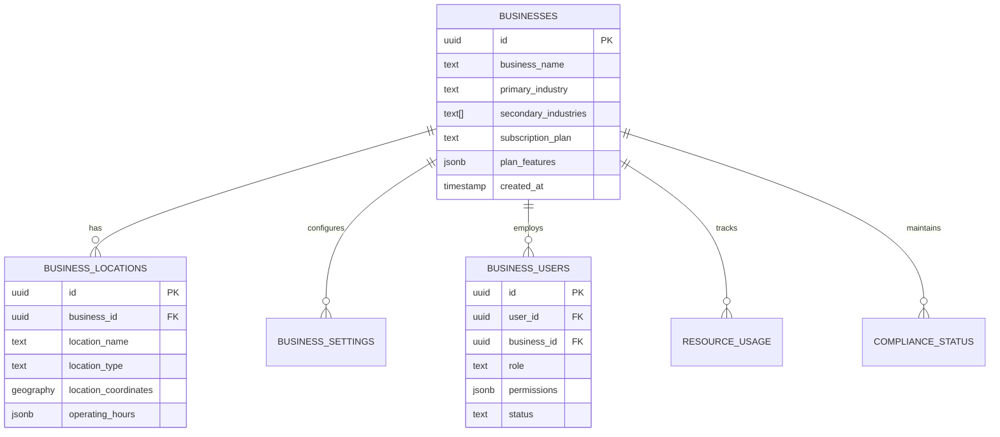
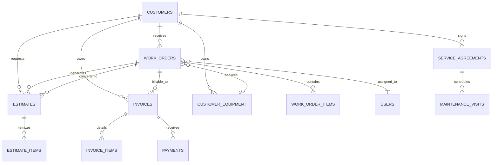
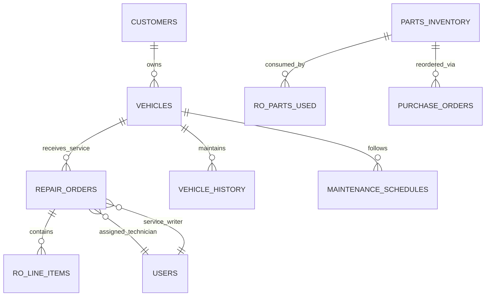
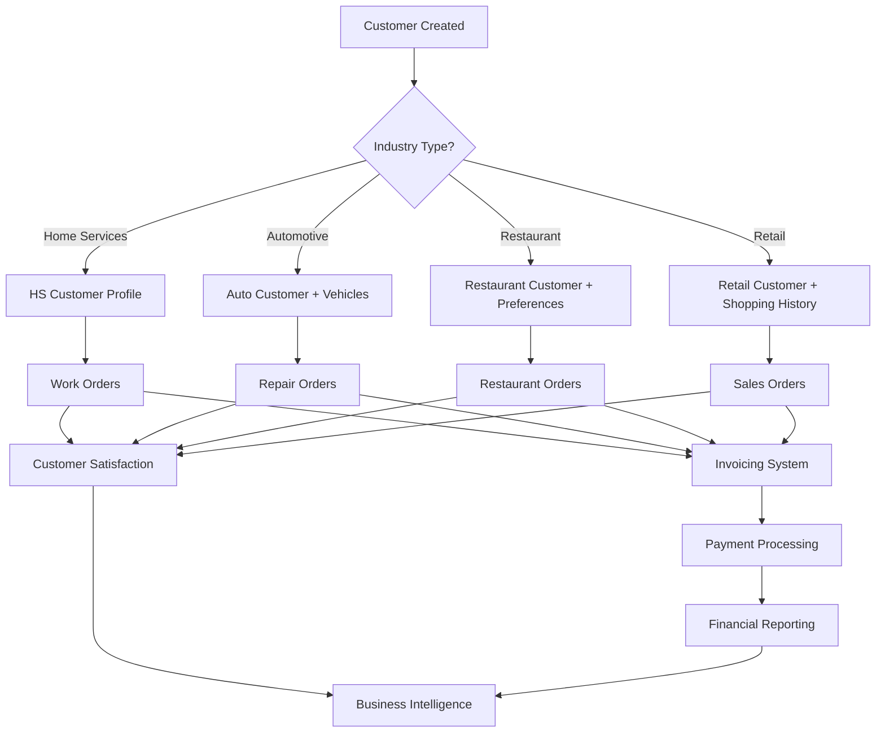

# Thorbis Business OS - Database Relationship Mapping

> **Cross-Industry Data Relationship Architecture**  
> **Database Version**: PostgreSQL 16+  
> **Last Updated**: 2025-01-31  
> **Schema Version**: 5.0.0  
> **Status**: Production Ready

## 📋 Table of Contents

1. [Overview](#overview)
2. [Core Entity Relationships](#core-entity-relationships)
3. [Industry Cross-Connections](#industry-cross-connections)
4. [Advanced Relationship Patterns](#advanced-relationship-patterns)
5. [Data Flow Mappings](#data-flow-mappings)
6. [Integration Relationships](#integration-relationships)
7. [Performance Relationship Design](#performance-relationship-design)
8. [Referential Integrity](#referential-integrity)

---

## Overview

The Thorbis Business OS implements a sophisticated relationship architecture that maintains strict tenant isolation while enabling controlled cross-industry data sharing and comprehensive business intelligence. This document maps all relationships across the 25+ schemas and 750+ tables.

### 🎯 Relationship Design Principles

1. **Tenant Isolation**: Every relationship respects business_id boundaries
2. **Industry Separation**: Cross-industry relationships are carefully controlled
3. **Referential Integrity**: All foreign keys use appropriate cascade rules
4. **Performance Optimized**: Relationships designed for optimal query performance
5. **Audit Compliant**: All relationships support comprehensive audit trails
6. **Security Enforced**: RLS policies protect all relationship data

---

## Core Entity Relationships

### 🏢 Business and Tenant Relationships



### 👥 User Management Relationships

```sql
-- Core User Relationship Structure
CREATE TABLE user_mgmt.users (
    id UUID PRIMARY KEY,
    -- User profile data
    email TEXT NOT NULL UNIQUE,
    first_name TEXT,
    last_name TEXT,
    created_at TIMESTAMPTZ DEFAULT now()
);

-- Business-User Many-to-Many Relationship
CREATE TABLE user_mgmt.business_users (
    id UUID PRIMARY KEY DEFAULT gen_random_uuid(),
    user_id UUID NOT NULL REFERENCES user_mgmt.users(id) ON DELETE CASCADE,
    business_id UUID NOT NULL REFERENCES tenant_mgmt.businesses(id) ON DELETE CASCADE,
    
    -- Role assignment with hierarchy
    role TEXT NOT NULL DEFAULT 'staff',
    role_level INTEGER NOT NULL DEFAULT 3, -- 1=owner, 6=viewer
    
    -- Status and lifecycle
    status TEXT DEFAULT 'active',
    invited_at TIMESTAMPTZ,
    joined_at TIMESTAMPTZ,
    
    -- Permissions override
    custom_permissions JSONB DEFAULT '{}',
    
    UNIQUE(user_id, business_id)
);

-- Session and Security Relationships
CREATE TABLE security_mgmt.enhanced_user_sessions (
    id UUID PRIMARY KEY DEFAULT gen_random_uuid(),
    user_id UUID NOT NULL REFERENCES user_mgmt.users(id) ON DELETE CASCADE,
    business_id UUID NOT NULL REFERENCES tenant_mgmt.businesses(id) ON DELETE CASCADE,
    
    -- Security context
    session_token_hash TEXT NOT NULL UNIQUE,
    device_fingerprint TEXT NOT NULL,
    ip_address INET NOT NULL,
    geolocation GEOGRAPHY(POINT, 4326),
    
    -- Risk assessment
    risk_score INTEGER DEFAULT 0,
    trust_level TEXT DEFAULT 'medium'
);
```

### 🗃️ Cross-Schema Relationship Patterns

```sql
-- Universal relationship pattern for all industry tables
CREATE OR REPLACE FUNCTION create_industry_table_relationships(
    schema_name TEXT,
    table_name TEXT
) RETURNS VOID AS $$
BEGIN
    -- Add business_id foreign key constraint
    EXECUTE format('
        ALTER TABLE %I.%I 
        ADD CONSTRAINT fk_%s_%s_business_id 
        FOREIGN KEY (business_id) 
        REFERENCES tenant_mgmt.businesses(id) 
        ON DELETE CASCADE
    ', schema_name, table_name, schema_name, table_name);
    
    -- Add created_by/updated_by constraints
    EXECUTE format('
        ALTER TABLE %I.%I 
        ADD CONSTRAINT fk_%s_%s_created_by 
        FOREIGN KEY (created_by) 
        REFERENCES user_mgmt.users(id) 
        ON DELETE SET NULL
    ', schema_name, table_name, schema_name, table_name);
    
    EXECUTE format('
        ALTER TABLE %I.%I 
        ADD CONSTRAINT fk_%s_%s_updated_by 
        FOREIGN KEY (updated_by) 
        REFERENCES user_mgmt.users(id) 
        ON DELETE SET NULL
    ', schema_name, table_name, schema_name, table_name);
END;
$$ LANGUAGE plpgsql;
```

---

## Industry Cross-Connections

### 🏠 Home Services Relationships



```sql
-- Home Services Primary Relationships
-- Customer -> Work Order (One-to-Many)
ALTER TABLE hs.work_orders 
ADD CONSTRAINT fk_work_orders_customer_id 
FOREIGN KEY (customer_id) REFERENCES hs.customers(id) ON DELETE SET NULL;

-- Work Order -> User Assignment (Many-to-One)
ALTER TABLE hs.work_orders 
ADD CONSTRAINT fk_work_orders_assigned_technician 
FOREIGN KEY (assigned_technician_id) REFERENCES user_mgmt.users(id) ON DELETE SET NULL;

-- Equipment -> Customer (Many-to-One)
ALTER TABLE hs.customer_equipment 
ADD CONSTRAINT fk_customer_equipment_customer_id 
FOREIGN KEY (customer_id) REFERENCES hs.customers(id) ON DELETE CASCADE;

-- Work Order -> Equipment (Many-to-One)
ALTER TABLE hs.work_orders 
ADD CONSTRAINT fk_work_orders_equipment_id 
FOREIGN KEY (equipment_id) REFERENCES hs.customer_equipment(id) ON DELETE SET NULL;

-- Service Agreement -> Customer (Many-to-One)
ALTER TABLE hs.service_agreements 
ADD CONSTRAINT fk_service_agreements_customer_id 
FOREIGN KEY (customer_id) REFERENCES hs.customers(id) ON DELETE CASCADE;
```

### 🚗 Automotive Industry Relationships



```sql
-- Automotive Primary Relationships
-- Vehicle -> Customer (Many-to-One, reusing HS customers)
ALTER TABLE auto.vehicles 
ADD CONSTRAINT fk_vehicles_customer_id 
FOREIGN KEY (customer_id) REFERENCES hs.customers(id) ON DELETE CASCADE;

-- Repair Order -> Vehicle (Many-to-One)
ALTER TABLE auto.repair_orders 
ADD CONSTRAINT fk_repair_orders_vehicle_id 
FOREIGN KEY (vehicle_id) REFERENCES auto.vehicles(id) ON DELETE CASCADE;

-- Repair Order -> Customer (Many-to-One)
ALTER TABLE auto.repair_orders 
ADD CONSTRAINT fk_repair_orders_customer_id 
FOREIGN KEY (customer_id) REFERENCES hs.customers(id) ON DELETE SET NULL;

-- Repair Order -> Users (Service Writer and Technician)
ALTER TABLE auto.repair_orders 
ADD CONSTRAINT fk_repair_orders_service_writer 
FOREIGN KEY (service_writer_id) REFERENCES user_mgmt.users(id) ON DELETE SET NULL,
ADD CONSTRAINT fk_repair_orders_technician 
FOREIGN KEY (primary_technician_id) REFERENCES user_mgmt.users(id) ON DELETE SET NULL;
```

### 🍽️ Restaurant Industry Relationships

```sql
CREATE SCHEMA rest;

-- Restaurant Table Structure with Relationships
CREATE TABLE rest.menu_categories (
    id UUID PRIMARY KEY DEFAULT gen_random_uuid(),
    business_id UUID NOT NULL REFERENCES tenant_mgmt.businesses(id) ON DELETE CASCADE,
    parent_category_id UUID REFERENCES rest.menu_categories(id) ON DELETE SET NULL,
    
    -- Category details
    name TEXT NOT NULL,
    display_order INTEGER DEFAULT 0,
    is_active BOOLEAN DEFAULT true,
    
    -- Hierarchical path for performance
    category_path LTREE,
    
    created_at TIMESTAMPTZ DEFAULT now(),
    updated_at TIMESTAMPTZ DEFAULT now()
);

CREATE TABLE rest.menu_items (
    id UUID PRIMARY KEY DEFAULT gen_random_uuid(),
    business_id UUID NOT NULL REFERENCES tenant_mgmt.businesses(id) ON DELETE CASCADE,
    category_id UUID NOT NULL REFERENCES rest.menu_categories(id) ON DELETE CASCADE,
    
    -- Item details
    name TEXT NOT NULL,
    description TEXT,
    base_price DECIMAL(8,2) NOT NULL,
    cost_price DECIMAL(8,2) DEFAULT 0.00,
    
    -- Inventory tracking
    track_inventory BOOLEAN DEFAULT false,
    current_stock INTEGER DEFAULT 0,
    low_stock_threshold INTEGER DEFAULT 0,
    
    -- Modifiers and variations
    modifiers JSONB DEFAULT '{}',
    variations JSONB DEFAULT '{}',
    
    is_active BOOLEAN DEFAULT true,
    created_at TIMESTAMPTZ DEFAULT now(),
    updated_at TIMESTAMPTZ DEFAULT now()
);

CREATE TABLE rest.dining_tables (
    id UUID PRIMARY KEY DEFAULT gen_random_uuid(),
    business_id UUID NOT NULL REFERENCES tenant_mgmt.businesses(id) ON DELETE CASCADE,
    location_id UUID REFERENCES tenant_mgmt.business_locations(id) ON DELETE SET NULL,
    
    -- Table identification
    table_number TEXT NOT NULL,
    table_name TEXT,
    capacity INTEGER NOT NULL CHECK (capacity > 0),
    
    -- Physical layout
    section_name TEXT,
    position_x INTEGER,
    position_y INTEGER,
    
    -- Status
    table_status TEXT DEFAULT 'available', -- 'available', 'occupied', 'reserved', 'cleaning', 'out_of_order'
    is_active BOOLEAN DEFAULT true,
    
    created_at TIMESTAMPTZ DEFAULT now(),
    updated_at TIMESTAMPTZ DEFAULT now(),
    
    UNIQUE(business_id, table_number)
);

CREATE TABLE rest.orders (
    id UUID PRIMARY KEY DEFAULT gen_random_uuid(),
    business_id UUID NOT NULL REFERENCES tenant_mgmt.businesses(id) ON DELETE CASCADE,
    customer_id UUID REFERENCES hs.customers(id) ON DELETE SET NULL, -- Reuse customer table
    table_id UUID REFERENCES rest.dining_tables(id) ON DELETE SET NULL,
    
    -- Order identification
    order_number TEXT NOT NULL,
    order_type TEXT DEFAULT 'dine_in', -- 'dine_in', 'takeout', 'delivery', 'online'
    
    -- Staff assignment
    server_id UUID REFERENCES user_mgmt.users(id) ON DELETE SET NULL,
    cashier_id UUID REFERENCES user_mgmt.users(id) ON DELETE SET NULL,
    kitchen_staff_id UUID REFERENCES user_mgmt.users(id) ON DELETE SET NULL,
    
    -- Pricing
    subtotal DECIMAL(12,2) DEFAULT 0.00,
    tax_amount DECIMAL(12,2) DEFAULT 0.00,
    tip_amount DECIMAL(12,2) DEFAULT 0.00,
    discount_amount DECIMAL(12,2) DEFAULT 0.00,
    total_amount DECIMAL(12,2) DEFAULT 0.00,
    
    -- Order lifecycle
    status TEXT DEFAULT 'draft', -- 'draft', 'submitted', 'preparing', 'ready', 'served', 'completed', 'cancelled'
    ordered_at TIMESTAMPTZ DEFAULT now(),
    ready_at TIMESTAMPTZ,
    served_at TIMESTAMPTZ,
    
    -- Special requirements
    special_instructions TEXT,
    dietary_restrictions TEXT[] DEFAULT '{}',
    
    created_at TIMESTAMPTZ DEFAULT now(),
    updated_at TIMESTAMPTZ DEFAULT now(),
    
    UNIQUE(business_id, order_number)
);

CREATE TABLE rest.order_items (
    id UUID PRIMARY KEY DEFAULT gen_random_uuid(),
    business_id UUID NOT NULL REFERENCES tenant_mgmt.businesses(id) ON DELETE CASCADE,
    order_id UUID NOT NULL REFERENCES rest.orders(id) ON DELETE CASCADE,
    menu_item_id UUID NOT NULL REFERENCES rest.menu_items(id) ON DELETE RESTRICT,
    
    -- Item details
    quantity INTEGER NOT NULL DEFAULT 1 CHECK (quantity > 0),
    unit_price DECIMAL(8,2) NOT NULL,
    total_price DECIMAL(10,2) NOT NULL,
    
    -- Customizations
    modifications JSONB DEFAULT '{}',
    special_requests TEXT,
    
    -- Kitchen status
    item_status TEXT DEFAULT 'ordered', -- 'ordered', 'preparing', 'ready', 'served', 'cancelled'
    preparation_time INTERVAL,
    
    -- Cost tracking
    cost_per_item DECIMAL(8,2),
    total_cost DECIMAL(10,2),
    
    created_at TIMESTAMPTZ DEFAULT now(),
    updated_at TIMESTAMPTZ DEFAULT now()
);
```

### 🛒 Retail Industry Relationships

```sql
CREATE SCHEMA ret;

-- Product Hierarchy with Advanced Relationships
CREATE TABLE ret.product_categories (
    id UUID PRIMARY KEY DEFAULT gen_random_uuid(),
    business_id UUID NOT NULL REFERENCES tenant_mgmt.businesses(id) ON DELETE CASCADE,
    parent_category_id UUID REFERENCES ret.product_categories(id) ON DELETE SET NULL,
    
    -- Category details
    name TEXT NOT NULL,
    slug TEXT NOT NULL,
    description TEXT,
    
    -- Hierarchy management
    category_path LTREE, -- PostgreSQL LTREE for hierarchy
    hierarchy_level INTEGER DEFAULT 0,
    
    -- Display and marketing
    image_url TEXT,
    sort_order INTEGER DEFAULT 0,
    is_featured BOOLEAN DEFAULT false,
    
    -- SEO optimization
    meta_title TEXT,
    meta_description TEXT,
    meta_keywords TEXT[] DEFAULT '{}',
    
    -- Status
    is_active BOOLEAN DEFAULT true,
    
    created_at TIMESTAMPTZ DEFAULT now(),
    updated_at TIMESTAMPTZ DEFAULT now(),
    
    UNIQUE(business_id, slug)
);

CREATE TABLE ret.products (
    id UUID PRIMARY KEY DEFAULT gen_random_uuid(),
    business_id UUID NOT NULL REFERENCES tenant_mgmt.businesses(id) ON DELETE CASCADE,
    category_id UUID REFERENCES ret.product_categories(id) ON DELETE SET NULL,
    
    -- Product identification
    sku TEXT NOT NULL,
    barcode TEXT,
    internal_code TEXT,
    
    -- Basic information
    name TEXT NOT NULL,
    slug TEXT NOT NULL,
    short_description TEXT,
    full_description TEXT,
    
    -- Pricing structure
    cost_price DECIMAL(12,2) DEFAULT 0.00,
    wholesale_price DECIMAL(12,2),
    retail_price DECIMAL(12,2) NOT NULL,
    sale_price DECIMAL(12,2),
    msrp DECIMAL(12,2), -- Manufacturer suggested retail price
    
    -- Sale management
    is_on_sale BOOLEAN DEFAULT false,
    sale_start_date DATE,
    sale_end_date DATE,
    
    -- Inventory tracking
    track_inventory BOOLEAN DEFAULT true,
    current_stock INTEGER DEFAULT 0,
    reserved_stock INTEGER DEFAULT 0,
    available_stock INTEGER GENERATED ALWAYS AS (current_stock - reserved_stock) STORED,
    
    -- Reorder management
    low_stock_threshold INTEGER DEFAULT 10,
    reorder_point INTEGER DEFAULT 20,
    reorder_quantity INTEGER DEFAULT 50,
    
    -- Physical attributes
    weight DECIMAL(8,3), -- in pounds or kg
    dimensions_length DECIMAL(8,2),
    dimensions_width DECIMAL(8,2),
    dimensions_height DECIMAL(8,2),
    
    -- Shipping information
    requires_shipping BOOLEAN DEFAULT true,
    shipping_class TEXT DEFAULT 'standard',
    hazardous_material BOOLEAN DEFAULT false,
    
    -- Variations and options
    has_variants BOOLEAN DEFAULT false,
    variant_attributes JSONB DEFAULT '{}', -- color, size, etc.
    
    -- Digital products
    is_digital BOOLEAN DEFAULT false,
    downloadable_files JSONB DEFAULT '{}',
    
    -- Status and visibility
    status TEXT DEFAULT 'active', -- 'active', 'inactive', 'discontinued', 'draft'
    visibility TEXT DEFAULT 'public', -- 'public', 'private', 'hidden'
    is_featured BOOLEAN DEFAULT false,
    
    -- SEO and marketing
    meta_title TEXT,
    meta_description TEXT,
    tags TEXT[] DEFAULT '{}',
    
    -- Supplier information
    supplier_id UUID,
    supplier_sku TEXT,
    supplier_cost DECIMAL(12,2),
    
    -- Quality and ratings
    average_rating DECIMAL(3,2) DEFAULT 0.00,
    total_reviews INTEGER DEFAULT 0,
    quality_score INTEGER, -- Internal quality score 1-100
    
    created_at TIMESTAMPTZ DEFAULT now(),
    updated_at TIMESTAMPTZ DEFAULT now(),
    
    -- Soft delete
    deleted_at TIMESTAMPTZ,
    deleted_by UUID REFERENCES user_mgmt.users(id),
    
    UNIQUE(business_id, sku)
);

-- Product variants for size, color, etc.
CREATE TABLE ret.product_variants (
    id UUID PRIMARY KEY DEFAULT gen_random_uuid(),
    business_id UUID NOT NULL REFERENCES tenant_mgmt.businesses(id) ON DELETE CASCADE,
    parent_product_id UUID NOT NULL REFERENCES ret.products(id) ON DELETE CASCADE,
    
    -- Variant identification
    variant_sku TEXT NOT NULL,
    variant_name TEXT NOT NULL,
    
    -- Variant attributes
    attributes JSONB NOT NULL, -- {color: "red", size: "large"}
    attribute_combination TEXT, -- Generated: "red-large"
    
    -- Pricing (overrides parent if specified)
    price_adjustment DECIMAL(10,2) DEFAULT 0.00,
    cost_adjustment DECIMAL(10,2) DEFAULT 0.00,
    
    -- Inventory (separate from parent)
    current_stock INTEGER DEFAULT 0,
    reserved_stock INTEGER DEFAULT 0,
    
    -- Status
    is_active BOOLEAN DEFAULT true,
    
    created_at TIMESTAMPTZ DEFAULT now(),
    updated_at TIMESTAMPTZ DEFAULT now(),
    
    UNIQUE(business_id, variant_sku)
);

-- Sales orders with comprehensive tracking
CREATE TABLE ret.sales_orders (
    id UUID PRIMARY KEY DEFAULT gen_random_uuid(),
    business_id UUID NOT NULL REFERENCES tenant_mgmt.businesses(id) ON DELETE CASCADE,
    customer_id UUID REFERENCES hs.customers(id) ON DELETE SET NULL,
    location_id UUID REFERENCES tenant_mgmt.business_locations(id) ON DELETE SET NULL,
    
    -- Order identification
    order_number TEXT NOT NULL,
    po_number TEXT, -- Customer purchase order
    
    -- Order classification
    order_type TEXT DEFAULT 'standard', -- 'standard', 'special_order', 'quote', 'return'
    sales_channel TEXT DEFAULT 'in_store', -- 'in_store', 'online', 'phone', 'catalog'
    
    -- Staff assignment
    salesperson_id UUID REFERENCES user_mgmt.users(id) ON DELETE SET NULL,
    cashier_id UUID REFERENCES user_mgmt.users(id) ON DELETE SET NULL,
    
    -- Pricing breakdown
    subtotal DECIMAL(12,2) DEFAULT 0.00,
    discount_amount DECIMAL(12,2) DEFAULT 0.00,
    discount_percentage DECIMAL(5,2) DEFAULT 0.00,
    tax_amount DECIMAL(12,2) DEFAULT 0.00,
    shipping_amount DECIMAL(12,2) DEFAULT 0.00,
    handling_fee DECIMAL(8,2) DEFAULT 0.00,
    total_amount DECIMAL(12,2) DEFAULT 0.00,
    
    -- Payment tracking
    payment_method TEXT, -- 'cash', 'credit_card', 'debit_card', 'check', 'financing'
    payment_status TEXT DEFAULT 'pending', -- 'pending', 'paid', 'partial', 'refunded', 'failed'
    payment_due_date DATE,
    
    -- Fulfillment
    fulfillment_method TEXT DEFAULT 'pickup', -- 'pickup', 'delivery', 'shipping'
    fulfillment_status TEXT DEFAULT 'pending', -- 'pending', 'processing', 'shipped', 'delivered', 'cancelled'
    
    -- Shipping information
    ship_to_address JSONB, -- Complete address object
    tracking_number TEXT,
    carrier TEXT,
    shipping_method TEXT,
    shipped_date DATE,
    expected_delivery_date DATE,
    
    -- Order status
    order_status TEXT DEFAULT 'open', -- 'open', 'processing', 'shipped', 'completed', 'cancelled', 'returned'
    
    -- Special instructions
    customer_notes TEXT,
    internal_notes TEXT,
    gift_message TEXT,
    
    -- Dates
    order_date DATE DEFAULT CURRENT_DATE,
    required_date DATE,
    promised_date DATE,
    
    created_at TIMESTAMPTZ DEFAULT now(),
    updated_at TIMESTAMPTZ DEFAULT now(),
    
    UNIQUE(business_id, order_number)
);

CREATE TABLE ret.sales_order_items (
    id UUID PRIMARY KEY DEFAULT gen_random_uuid(),
    business_id UUID NOT NULL REFERENCES tenant_mgmt.businesses(id) ON DELETE CASCADE,
    sales_order_id UUID NOT NULL REFERENCES ret.sales_orders(id) ON DELETE CASCADE,
    product_id UUID REFERENCES ret.products(id) ON DELETE RESTRICT,
    product_variant_id UUID REFERENCES ret.product_variants(id) ON DELETE RESTRICT,
    
    -- Item details
    quantity INTEGER NOT NULL DEFAULT 1 CHECK (quantity > 0),
    unit_price DECIMAL(10,2) NOT NULL,
    discount_per_item DECIMAL(8,2) DEFAULT 0.00,
    total_price DECIMAL(12,2) NOT NULL,
    
    -- Cost tracking (for profitability)
    unit_cost DECIMAL(10,2),
    total_cost DECIMAL(12,2),
    
    -- Fulfillment tracking
    quantity_shipped INTEGER DEFAULT 0,
    quantity_backordered INTEGER DEFAULT 0,
    
    -- Special handling
    special_instructions TEXT,
    
    created_at TIMESTAMPTZ DEFAULT now(),
    updated_at TIMESTAMPTZ DEFAULT now(),
    
    CHECK ((product_id IS NOT NULL) != (product_variant_id IS NOT NULL)) -- Exactly one must be specified
);
```

---

## Advanced Relationship Patterns

### 🔗 Polymorphic Relationships

```sql
-- Universal attachment system for documents, photos, files
CREATE TABLE file_mgmt.attachments (
    id UUID PRIMARY KEY DEFAULT gen_random_uuid(),
    business_id UUID NOT NULL REFERENCES tenant_mgmt.businesses(id) ON DELETE CASCADE,
    
    -- Polymorphic reference
    attached_to_type TEXT NOT NULL, -- 'work_order', 'customer', 'vehicle', 'invoice'
    attached_to_id UUID NOT NULL,
    attached_to_schema TEXT NOT NULL, -- 'hs', 'auto', 'rest', 'ret'
    
    -- File information
    file_name TEXT NOT NULL,
    file_path TEXT NOT NULL,
    file_size BIGINT,
    mime_type TEXT,
    file_hash TEXT, -- SHA-256 for deduplication
    
    -- Categorization
    attachment_type TEXT NOT NULL, -- 'photo', 'document', 'signature', 'report'
    attachment_category TEXT, -- 'before_photo', 'after_photo', 'invoice', 'contract'
    
    -- Metadata
    title TEXT,
    description TEXT,
    tags TEXT[] DEFAULT '{}',
    
    -- Access control
    visibility TEXT DEFAULT 'internal', -- 'public', 'customer', 'internal', 'restricted'
    
    -- Indexing for search
    search_vector TSVECTOR,
    
    created_at TIMESTAMPTZ DEFAULT now(),
    created_by UUID REFERENCES user_mgmt.users(id)
);

-- Create index for polymorphic lookups
CREATE INDEX idx_attachments_polymorphic 
    ON file_mgmt.attachments(business_id, attached_to_schema, attached_to_type, attached_to_id);

-- Full-text search index
CREATE INDEX idx_attachments_search 
    ON file_mgmt.attachments USING GIN(search_vector);
```

### 📊 Activity Stream Pattern

```sql
-- Universal activity tracking across all entities
CREATE TABLE audit_mgmt.activity_stream (
    id UUID PRIMARY KEY DEFAULT gen_random_uuid(),
    business_id UUID NOT NULL REFERENCES tenant_mgmt.businesses(id) ON DELETE CASCADE,
    
    -- Activity source
    actor_type TEXT DEFAULT 'user', -- 'user', 'system', 'integration', 'ai'
    actor_id UUID, -- References users.users, system processes, etc.
    actor_name TEXT, -- For display purposes
    
    -- Target entity (polymorphic)
    target_type TEXT NOT NULL, -- 'customer', 'work_order', 'invoice', 'vehicle'
    target_id UUID NOT NULL,
    target_schema TEXT NOT NULL, -- 'hs', 'auto', 'rest', 'ret'
    target_display_name TEXT, -- For display: "Work Order WO-2025-001"
    
    -- Activity details
    activity_type TEXT NOT NULL, -- 'created', 'updated', 'deleted', 'status_changed'
    activity_verb TEXT NOT NULL, -- 'created', 'modified', 'cancelled', 'completed'
    activity_summary TEXT NOT NULL, -- "Work order WO-2025-001 was completed by John Smith"
    
    -- Change details
    changed_fields TEXT[] DEFAULT '{}',
    old_values JSONB,
    new_values JSONB,
    
    -- Context
    ip_address INET,
    user_agent TEXT,
    source_application TEXT, -- 'web', 'mobile', 'api', 'system'
    
    -- Grouping and threading
    activity_group_id UUID, -- Group related activities
    parent_activity_id UUID REFERENCES audit_mgmt.activity_stream(id),
    
    -- Visibility and permissions
    visibility_level TEXT DEFAULT 'internal', -- 'public', 'customer', 'internal', 'admin'
    
    -- Metadata
    metadata JSONB DEFAULT '{}',
    
    -- Timing
    occurred_at TIMESTAMPTZ DEFAULT now(),
    created_at TIMESTAMPTZ DEFAULT now()
);

-- Efficient lookup indexes
CREATE INDEX idx_activity_stream_target 
    ON audit_mgmt.activity_stream(business_id, target_schema, target_type, target_id, occurred_at DESC);

CREATE INDEX idx_activity_stream_actor 
    ON audit_mgmt.activity_stream(business_id, actor_type, actor_id, occurred_at DESC);
```

### 🔄 State Machine Relationships

```sql
-- Universal state transition tracking
CREATE TABLE workflow_mgmt.state_transitions (
    id UUID PRIMARY KEY DEFAULT gen_random_uuid(),
    business_id UUID NOT NULL REFERENCES tenant_mgmt.businesses(id) ON DELETE CASCADE,
    
    -- Entity reference (polymorphic)
    entity_type TEXT NOT NULL, -- 'work_order', 'repair_order', 'sales_order'
    entity_id UUID NOT NULL,
    entity_schema TEXT NOT NULL,
    
    -- Transition details
    from_state TEXT NOT NULL,
    to_state TEXT NOT NULL,
    transition_reason TEXT,
    
    -- State machine definition
    state_machine_name TEXT NOT NULL, -- 'work_order_lifecycle', 'payment_processing'
    state_machine_version TEXT DEFAULT '1.0',
    
    -- Trigger information
    triggered_by TEXT NOT NULL, -- 'user_action', 'system_event', 'timer', 'external_api'
    triggered_by_user UUID REFERENCES user_mgmt.users(id),
    
    -- Validation and rules
    validation_passed BOOLEAN DEFAULT true,
    validation_errors JSONB DEFAULT '{}',
    business_rules_applied TEXT[] DEFAULT '{}',
    
    -- Side effects and actions
    side_effects_executed JSONB DEFAULT '{}', -- notifications sent, emails triggered, etc.
    
    -- Rollback information
    is_rollback BOOLEAN DEFAULT false,
    rollback_reason TEXT,
    original_transition_id UUID REFERENCES workflow_mgmt.state_transitions(id),
    
    -- Timing
    transition_started_at TIMESTAMPTZ DEFAULT now(),
    transition_completed_at TIMESTAMPTZ,
    
    created_at TIMESTAMPTZ DEFAULT now()
);

-- State transition indexes
CREATE INDEX idx_state_transitions_entity 
    ON workflow_mgmt.state_transitions(business_id, entity_schema, entity_type, entity_id, transition_started_at DESC);

CREATE INDEX idx_state_transitions_states 
    ON workflow_mgmt.state_transitions(business_id, state_machine_name, from_state, to_state);
```

---

## Data Flow Mappings

### 📈 Cross-Industry Data Flow



### 🔄 Integration Data Flow

```sql
-- Integration event tracking for data flows
CREATE TABLE integration_mgmt.data_flow_events (
    id UUID PRIMARY KEY DEFAULT gen_random_uuid(),
    business_id UUID NOT NULL REFERENCES tenant_mgmt.businesses(id) ON DELETE CASCADE,
    
    -- Flow identification
    flow_name TEXT NOT NULL, -- 'customer_sync', 'inventory_update', 'payment_processing'
    flow_direction TEXT NOT NULL, -- 'inbound', 'outbound', 'bidirectional'
    
    -- Source and destination
    source_system TEXT NOT NULL, -- 'thorbis', 'quickbooks', 'stripe', 'mailchimp'
    destination_system TEXT NOT NULL,
    
    -- Data being transferred
    entity_type TEXT NOT NULL, -- 'customer', 'invoice', 'payment', 'product'
    entity_id UUID,
    entity_external_id TEXT, -- ID in external system
    
    -- Transfer details
    payload_size_bytes INTEGER,
    record_count INTEGER DEFAULT 1,
    
    -- Status tracking
    status TEXT DEFAULT 'pending', -- 'pending', 'processing', 'completed', 'failed', 'retrying'
    attempt_number INTEGER DEFAULT 1,
    max_attempts INTEGER DEFAULT 3,
    
    -- Error handling
    error_message TEXT,
    error_code TEXT,
    stack_trace TEXT,
    
    -- Performance metrics
    processing_time_ms INTEGER,
    api_response_time_ms INTEGER,
    
    -- Timing
    started_at TIMESTAMPTZ DEFAULT now(),
    completed_at TIMESTAMPTZ,
    next_retry_at TIMESTAMPTZ,
    
    -- Metadata
    metadata JSONB DEFAULT '{}',
    
    created_at TIMESTAMPTZ DEFAULT now()
);

-- Data lineage tracking
CREATE TABLE integration_mgmt.data_lineage (
    id UUID PRIMARY KEY DEFAULT gen_random_uuid(),
    business_id UUID NOT NULL REFERENCES tenant_mgmt.businesses(id) ON DELETE CASCADE,
    
    -- Source tracking
    source_entity_type TEXT NOT NULL,
    source_entity_id UUID NOT NULL,
    source_schema TEXT NOT NULL,
    source_system TEXT DEFAULT 'thorbis',
    
    -- Destination tracking
    destination_entity_type TEXT NOT NULL,
    destination_entity_id UUID NOT NULL,
    destination_schema TEXT NOT NULL,
    destination_system TEXT DEFAULT 'thorbis',
    
    -- Transformation details
    transformation_type TEXT NOT NULL, -- 'direct_copy', 'aggregation', 'calculation', 'mapping'
    transformation_rules JSONB DEFAULT '{}',
    data_quality_score DECIMAL(5,2), -- 0-100 data quality rating
    
    -- Dependency information
    depends_on UUID[] DEFAULT '{}', -- Array of lineage IDs this depends on
    
    -- Timing
    last_updated TIMESTAMPTZ DEFAULT now(),
    created_at TIMESTAMPTZ DEFAULT now()
);
```

---

## Performance Relationship Design

### 🚀 Optimized Relationship Queries

```sql
-- Materialized views for common cross-schema queries
CREATE MATERIALIZED VIEW reporting_mgmt.customer_360_view AS
WITH customer_base AS (
    SELECT 
        c.id,
        c.business_id,
        c.customer_number,
        c.first_name || ' ' || COALESCE(c.last_name, '') as customer_name,
        c.email_primary,
        c.phone_primary,
        c.total_revenue,
        c.created_at as customer_since
    FROM hs.customers c
    WHERE c.deleted_at IS NULL
),
hs_activity AS (
    SELECT 
        customer_id,
        COUNT(*) as total_work_orders,
        SUM(total_amount) as hs_revenue,
        MAX(created_at) as last_hs_service
    FROM hs.work_orders
    WHERE deleted_at IS NULL
    GROUP BY customer_id
),
auto_activity AS (
    SELECT 
        ro.customer_id,
        COUNT(DISTINCT ro.id) as total_repair_orders,
        COUNT(DISTINCT v.id) as total_vehicles,
        SUM(ro.total_amount) as auto_revenue,
        MAX(ro.created_at) as last_auto_service
    FROM auto.repair_orders ro
    LEFT JOIN auto.vehicles v ON ro.vehicle_id = v.id
    WHERE ro.deleted_at IS NULL
    GROUP BY ro.customer_id
),
rest_activity AS (
    SELECT 
        customer_id,
        COUNT(*) as total_restaurant_orders,
        SUM(total_amount) as restaurant_revenue,
        MAX(created_at) as last_restaurant_order
    FROM rest.orders
    WHERE customer_id IS NOT NULL
    GROUP BY customer_id
),
ret_activity AS (
    SELECT 
        customer_id,
        COUNT(*) as total_retail_orders,
        SUM(total_amount) as retail_revenue,
        MAX(created_at) as last_retail_order
    FROM ret.sales_orders
    WHERE customer_id IS NOT NULL
    GROUP BY customer_id
)
SELECT 
    cb.*,
    
    -- Home Services metrics
    COALESCE(hs.total_work_orders, 0) as total_work_orders,
    COALESCE(hs.hs_revenue, 0.00) as hs_revenue,
    hs.last_hs_service,
    
    -- Automotive metrics
    COALESCE(au.total_repair_orders, 0) as total_repair_orders,
    COALESCE(au.total_vehicles, 0) as total_vehicles,
    COALESCE(au.auto_revenue, 0.00) as auto_revenue,
    au.last_auto_service,
    
    -- Restaurant metrics
    COALESCE(re.total_restaurant_orders, 0) as total_restaurant_orders,
    COALESCE(re.restaurant_revenue, 0.00) as restaurant_revenue,
    re.last_restaurant_order,
    
    -- Retail metrics
    COALESCE(rt.total_retail_orders, 0) as total_retail_orders,
    COALESCE(rt.retail_revenue, 0.00) as retail_revenue,
    rt.last_retail_order,
    
    -- Calculated totals
    COALESCE(hs.hs_revenue, 0.00) + 
    COALESCE(au.auto_revenue, 0.00) + 
    COALESCE(re.restaurant_revenue, 0.00) + 
    COALESCE(rt.retail_revenue, 0.00) as total_cross_industry_revenue,
    
    -- Activity indicators
    CASE 
        WHEN GREATEST(
            COALESCE(hs.last_hs_service, '1900-01-01'::timestamptz),
            COALESCE(au.last_auto_service, '1900-01-01'::timestamptz),
            COALESCE(re.last_restaurant_order, '1900-01-01'::timestamptz),
            COALESCE(rt.last_retail_order, '1900-01-01'::timestamptz)
        ) > (now() - INTERVAL '90 days') THEN 'active'
        WHEN GREATEST(
            COALESCE(hs.last_hs_service, '1900-01-01'::timestamptz),
            COALESCE(au.last_auto_service, '1900-01-01'::timestamptz),
            COALESCE(re.last_restaurant_order, '1900-01-01'::timestamptz),
            COALESCE(rt.last_retail_order, '1900-01-01'::timestamptz)
        ) > (now() - INTERVAL '365 days') THEN 'dormant'
        ELSE 'inactive'
    END as customer_lifecycle_stage

FROM customer_base cb
LEFT JOIN hs_activity hs ON cb.id = hs.customer_id
LEFT JOIN auto_activity au ON cb.id = au.customer_id
LEFT JOIN rest_activity re ON cb.id = re.customer_id
LEFT JOIN ret_activity rt ON cb.id = rt.customer_id;

-- Indexes for materialized view
CREATE UNIQUE INDEX idx_customer_360_view_id ON reporting_mgmt.customer_360_view(id);
CREATE INDEX idx_customer_360_view_business ON reporting_mgmt.customer_360_view(business_id);
CREATE INDEX idx_customer_360_view_lifecycle ON reporting_mgmt.customer_360_view(business_id, customer_lifecycle_stage);

-- Refresh function for materialized view
CREATE OR REPLACE FUNCTION refresh_customer_360_view()
RETURNS void AS $$
BEGIN
    REFRESH MATERIALIZED VIEW CONCURRENTLY reporting_mgmt.customer_360_view;
END;
$$ LANGUAGE plpgsql;

-- Schedule refresh (called by cron job)
SELECT cron.schedule('refresh-customer-360', '0 2 * * *', 'SELECT refresh_customer_360_view();');
```

### 📊 Relationship Performance Indexes

```sql
-- Cross-industry relationship indexes for optimal performance
CREATE INDEX CONCURRENTLY idx_work_orders_customer_status_date 
    ON hs.work_orders(business_id, customer_id, status, created_at DESC) 
    WHERE deleted_at IS NULL;

CREATE INDEX CONCURRENTLY idx_repair_orders_customer_vehicle_date 
    ON auto.repair_orders(business_id, customer_id, vehicle_id, created_at DESC);

CREATE INDEX CONCURRENTLY idx_restaurant_orders_customer_date 
    ON rest.orders(business_id, customer_id, created_at DESC) 
    WHERE customer_id IS NOT NULL;

CREATE INDEX CONCURRENTLY idx_sales_orders_customer_status_date 
    ON ret.sales_orders(business_id, customer_id, order_status, created_at DESC);

-- Polymorphic relationship indexes
CREATE INDEX CONCURRENTLY idx_attachments_entity_lookup 
    ON file_mgmt.attachments(business_id, attached_to_schema, attached_to_type, attached_to_id);

CREATE INDEX CONCURRENTLY idx_activity_stream_entity_lookup 
    ON audit_mgmt.activity_stream(business_id, target_schema, target_type, target_id, occurred_at DESC);

-- Foreign key constraint indexes (automatically created by PostgreSQL 15+)
-- These ensure optimal JOIN performance
```

---

## Referential Integrity

### 🔐 Cascade Rules and Data Protection

```sql
-- Comprehensive referential integrity rules

-- Business deletion cascades (complete tenant data removal)
-- tenant_mgmt.businesses -> ALL business data (CASCADE)
-- This ensures complete tenant data removal when business is deleted

-- User deletion rules (preserve historical data)
-- user_mgmt.users -> business_users (CASCADE)
-- user_mgmt.users -> work_orders.assigned_technician_id (SET NULL)
-- user_mgmt.users -> created_by/updated_by fields (SET NULL)

-- Customer deletion rules (industry-specific)
-- hs.customers -> work_orders.customer_id (SET NULL) -- Preserve work order for historical records
-- hs.customers -> customer_equipment (CASCADE) -- Equipment belongs to customer
-- hs.customers -> service_agreements (CASCADE) -- Agreements are customer-specific

-- Equipment and vehicle deletion rules
-- customer_equipment -> work_orders.equipment_id (SET NULL) -- Preserve work order record
-- vehicles -> repair_orders.vehicle_id (CASCADE) -- Repair orders are vehicle-specific

-- Order and transaction integrity
-- work_orders -> work_order_items (CASCADE)
-- repair_orders -> repair_order_line_items (CASCADE)
-- sales_orders -> sales_order_items (CASCADE)
-- orders -> order_items (CASCADE)

-- Soft delete pattern for critical business data
-- Most business entities use soft delete (deleted_at timestamp) rather than hard delete
-- This preserves referential integrity while allowing "deletion" from business perspective

-- Function to validate referential integrity
CREATE OR REPLACE FUNCTION validate_referential_integrity()
RETURNS TABLE(
    table_name TEXT,
    constraint_name TEXT,
    violated_count INTEGER,
    sample_violations TEXT[]
) AS $$
DECLARE
    rec RECORD;
    violation_count INTEGER;
    sample_violations TEXT[];
BEGIN
    -- Check all foreign key constraints
    FOR rec IN 
        SELECT 
            tc.table_name,
            tc.constraint_name,
            kcu.column_name,
            ccu.table_name AS foreign_table_name,
            ccu.column_name AS foreign_column_name
        FROM information_schema.table_constraints tc
        JOIN information_schema.key_column_usage kcu 
            ON tc.constraint_name = kcu.constraint_name
        JOIN information_schema.constraint_column_usage ccu 
            ON ccu.constraint_name = tc.constraint_name
        WHERE tc.constraint_type = 'FOREIGN KEY'
        AND tc.table_schema IN ('hs', 'auto', 'rest', 'ret', 'courses', 'payroll', 'investigations')
    LOOP
        -- Check for violations (this is a simplified example)
        EXECUTE format('
            SELECT COUNT(*), ARRAY_AGG(%I) 
            FROM (
                SELECT %I 
                FROM %I.%I t1 
                WHERE %I IS NOT NULL 
                AND NOT EXISTS (
                    SELECT 1 FROM %I.%I t2 
                    WHERE t2.%I = t1.%I
                )
                LIMIT 10
            ) violations',
            rec.column_name,
            rec.column_name,
            'public', rec.table_name, -- Simplified schema
            rec.column_name,
            'public', rec.foreign_table_name,
            rec.foreign_column_name,
            rec.column_name
        ) INTO violation_count, sample_violations;
        
        IF violation_count > 0 THEN
            RETURN QUERY SELECT 
                rec.table_name::TEXT,
                rec.constraint_name::TEXT,
                violation_count::INTEGER,
                sample_violations::TEXT[];
        END IF;
    END LOOP;
END;
$$ LANGUAGE plpgsql;
```

---

This comprehensive relationship mapping document provides detailed coverage of how all entities connect across the Thorbis Business OS database architecture. The relationships are designed to maintain strict tenant isolation while enabling powerful cross-industry analytics and business intelligence.

The polymorphic patterns, materialized views, and performance optimizations ensure that complex relationship queries execute efficiently even at enterprise scale.