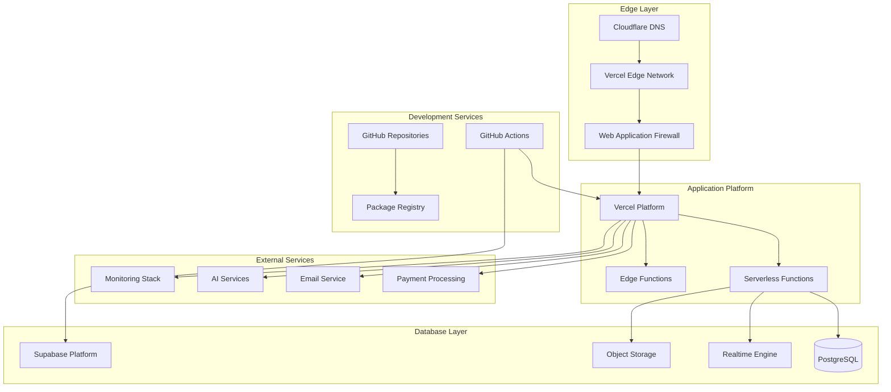

# Infrastructure Provisioning Guide

This comprehensive guide covers the provisioning and management of infrastructure for Thorbis Business OS using Infrastructure as Code (IaC) principles, including platform services, networking, monitoring, and supporting systems.

## Infrastructure Overview

### Infrastructure Architecture



### Infrastructure Components

#### Core Platform Services
```typescript
// Infrastructure configuration schema
interface InfrastructureConfig {
  platform: PlatformConfig
  database: DatabaseConfig
  networking: NetworkingConfig
  monitoring: MonitoringConfig
  security: SecurityConfig
  backup: BackupConfig
}

const infrastructureConfig: InfrastructureConfig = {
  platform: {
    hosting: {
      provider: 'vercel',
      plan: 'pro',
      regions: ['global', 'us-east-1', 'eu-west-1'],
      features: ['edge-functions', 'analytics', 'custom-domains']
    },
    
    compute: {
      functions: {
        runtime: 'nodejs20.x',
        timeout: 10000,
        memory: 1024,
        concurrency: 100
      },
      
      edgeFunctions: {
        runtime: 'edge',
        timeout: 30000,
        regions: 'all'
      }
    }
  },
  
  database: {
    provider: 'supabase',
    plan: 'pro',
    compute: 'dedicated-4xl',
    storage: '100GB',
    features: [
      'point-in-time-recovery',
      'read-replicas',
      'database-webhooks',
      'realtime-subscriptions'
    ]
  },
  
  networking: {
    dns: {
      provider: 'cloudflare',
      zones: ['thorbis.com'],
      features: ['ddos-protection', 'ssl-termination', 'caching']
    },
    
    cdn: {
      provider: 'vercel-edge',
      caching: 'aggressive',
      compression: true,
      imageOptimization: true
    }
  },
  
  monitoring: {
    apm: 'sentry',
    metrics: 'datadog',
    logs: 'datadog',
    uptime: 'uptimerobot',
    performance: 'vercel-analytics'
  }
}
```

## Platform Service Configuration

### Vercel Platform Setup

#### Project Configuration
```typescript
// vercel.config.ts - Infrastructure as Code for Vercel
export default {
  version: 2,
  name: 'thorbis-business-os',
  
  // Build configuration
  builds: [
    {
      src: 'apps/site/package.json',
      use: '@vercel/next@latest',
      config: {
        outputDirectory: 'apps/site/.next',
        distDir: '.next',
        cleanUrls: true,
        trailingSlash: false
      }
    },
    {
      src: 'apps/hs/package.json',
      use: '@vercel/next@latest', 
      config: {
        outputDirectory: 'apps/hs/.next'
      }
    }
    // ... additional apps
  ],
  
  // Routing configuration
  routes: [
    // Industry-specific routing
    {
      src: '/hs/(.*)',
      dest: 'apps/hs/$1',
      headers: {
        'X-Industry': 'home-services'
      }
    },
    {
      src: '/rest/(.*)',
      dest: 'apps/rest/$1',
      headers: {
        'X-Industry': 'restaurant'
      }
    },
    {
      src: '/auto/(.*)',
      dest: 'apps/auto/$1',
      headers: {
        'X-Industry': 'automotive'
      }
    },
    {
      src: '/ret/(.*)',
      dest: 'apps/ret/$1',
      headers: {
        'X-Industry': 'retail'
      }
    },
    
    // API routing
    {
      src: '/api/hs/(.*)',
      dest: 'apps/hs/api/$1'
    },
    {
      src: '/api/rest/(.*)', 
      dest: 'apps/rest/api/$1'
    },
    
    // Static assets
    {
      src: '/_next/static/(.*)',
      headers: {
        'Cache-Control': 'public, max-age=31536000, immutable'
      }
    },
    
    // Default to marketing site
    {
      src: '/(.*)',
      dest: 'apps/site/$1'
    }
  ],
  
  // Headers configuration
  headers: [
    {
      source: '/(.*)',
      headers: [
        {
          key: 'X-DNS-Prefetch-Control',
          value: 'on'
        },
        {
          key: 'X-XSS-Protection',
          value: '1; mode=block'
        },
        {
          key: 'X-Frame-Options',
          value: 'DENY'
        },
        {
          key: 'X-Content-Type-Options',
          value: 'nosniff'
        },
        {
          key: 'Referrer-Policy',
          value: 'strict-origin-when-cross-origin'
        }
      ]
    },
    
    // Security headers for API routes
    {
      source: '/api/(.*)',
      headers: [
        {
          key: 'Access-Control-Allow-Origin',
          value: 'https://thorbis.com'
        },
        {
          key: 'Access-Control-Allow-Methods',
          value: 'GET, POST, PUT, DELETE, OPTIONS'
        },
        {
          key: 'Access-Control-Allow-Headers',
          value: 'Content-Type, Authorization'
        }
      ]
    }
  ],
  
  // Redirects
  redirects: [
    {
      source: '/home-services',
      destination: '/hs',
      permanent: true
    },
    {
      source: '/restaurant',
      destination: '/rest',
      permanent: true
    }
  ],
  
  // Environment variables
  env: {
    NODE_ENV: 'production',
    NEXT_PUBLIC_VERCEL_ENV: '@vercel-env'
  },
  
  // Function configuration
  functions: {
    'apps/*/api/**/*.js': {
      maxDuration: 10,
      memory: 1024
    },
    'apps/*/api/webhooks/**/*.js': {
      maxDuration: 30,
      memory: 2048
    }
  },
  
  // Regions configuration
  regions: ['sfo1', 'iad1', 'fra1'],
  
  // Analytics
  analytics: {
    id: 'thorbis-business-os'
  }
}
```

#### Deployment Automation Script
```bash
#!/bin/bash
# scripts/provision-vercel.sh

set -e

echo "🚀 Provisioning Vercel infrastructure..."

# Validate prerequisites
if [ -z "$VERCEL_TOKEN" ]; then
  echo "❌ VERCEL_TOKEN not set"
  exit 1
fi

# Login to Vercel
vercel login --token $VERCEL_TOKEN

# Link project to Vercel
vercel link --token $VERCEL_TOKEN --yes

# Set up custom domains
DOMAINS=(
  "thorbis.com"
  "www.thorbis.com"
  "staging.thorbis.com"
)

for domain in "${DOMAINS[@]}"; do
  echo "🌐 Adding domain: $domain"
  vercel domains add $domain --token $VERCEL_TOKEN
done

# Configure environment variables
echo "⚙️ Configuring environment variables..."

# Production environment variables
vercel env add NEXT_PUBLIC_SUPABASE_URL "$PROD_SUPABASE_URL" production --token $VERCEL_TOKEN
vercel env add SUPABASE_SERVICE_ROLE_KEY "$PROD_SUPABASE_SERVICE_KEY" production --token $VERCEL_TOKEN
vercel env add ANTHROPIC_API_KEY "$PROD_ANTHROPIC_KEY" production --token $VERCEL_TOKEN
vercel env add STRIPE_SECRET_KEY "$PROD_STRIPE_SECRET" production --token $VERCEL_TOKEN

# Staging environment variables
vercel env add NEXT_PUBLIC_SUPABASE_URL "$STAGING_SUPABASE_URL" preview --token $VERCEL_TOKEN
vercel env add SUPABASE_SERVICE_ROLE_KEY "$STAGING_SUPABASE_SERVICE_KEY" preview --token $VERCEL_TOKEN

# Set up webhooks
echo "🔗 Configuring webhooks..."
vercel env add WEBHOOK_SECRET "$(openssl rand -hex 32)" production --token $VERCEL_TOKEN

# Configure project settings
vercel project add --token $VERCEL_TOKEN

echo "✅ Vercel infrastructure provisioned successfully"
```

### Supabase Database Configuration

#### Database Provisioning Script
```typescript
// scripts/provision-supabase.ts
import { createClient } from '@supabase/supabase-js'

interface DatabaseConfig {
  projectId: string
  region: string
  plan: 'free' | 'pro' | 'team' | 'enterprise'
  computeSize: string
  storageSize: string
  features: string[]
}

export class SupabaseProvisioner {
  private client: any
  
  constructor(private config: DatabaseConfig) {
    // Initialize Supabase management client
    this.client = createClient(
      process.env.SUPABASE_MANAGEMENT_URL!,
      process.env.SUPABASE_MANAGEMENT_KEY!
    )
  }
  
  async provisionDatabase(): Promise<void> {
    console.log('🗄️ Provisioning Supabase database...')
    
    try {
      // Create new project
      const project = await this.createProject()
      console.log(`✅ Project created: ${project.id}`)
      
      // Wait for project initialization
      await this.waitForProjectReady(project.id)
      
      // Configure database settings
      await this.configureDatabase(project.id)
      
      // Set up database schema
      await this.setupSchema(project.id)
      
      // Configure Row Level Security
      await this.setupRLS(project.id)
      
      // Set up realtime subscriptions
      await this.configureRealtime(project.id)
      
      // Configure backups
      await this.configureBackups(project.id)
      
      console.log('✅ Supabase database provisioned successfully')
      
    } catch (error) {
      console.error('❌ Database provisioning failed:', error)
      throw error
    }
  }
  
  private async createProject() {
    return await this.client.from('projects').insert({
      name: 'Thorbis Business OS',
      organization_id: process.env.SUPABASE_ORG_ID,
      plan: this.config.plan,
      region: this.config.region,
      database_password: process.env.DATABASE_PASSWORD
    }).single()
  }
  
  private async waitForProjectReady(projectId: string): Promise<void> {
    const maxAttempts = 60 // 10 minutes
    let attempts = 0
    
    while (attempts < maxAttempts) {
      const { data: project } = await this.client
        .from('projects')
        .select('status')
        .eq('id', projectId)
        .single()
      
      if (project.status === 'ACTIVE_HEALTHY') {
        return
      }
      
      console.log(`⏳ Waiting for project to be ready... (${attempts + 1}/${maxAttempts})`)
      await new Promise(resolve => setTimeout(resolve, 10000))
      attempts++
    }
    
    throw new Error('Project did not become ready within timeout')
  }
  
  private async configureDatabase(projectId: string): Promise<void> {
    // Configure database settings
    const settings = {
      shared_preload_libraries: 'pg_stat_statements,pgaudit',
      log_statement: 'ddl',
      log_min_duration_statement: 1000,
      track_activities: true,
      track_counts: true,
      track_io_timing: true,
      
      // Performance settings
      shared_buffers: '256MB',
      effective_cache_size: '1GB',
      maintenance_work_mem: '64MB',
      checkpoint_completion_target: 0.9,
      wal_buffers: '16MB',
      
      // Security settings
      ssl: true,
      require_secure_transport: true
    }
    
    for (const [key, value] of Object.entries(settings)) {
      await this.executeSQL(projectId, `ALTER SYSTEM SET ${key} = '${value}';`)
    }
    
    // Reload configuration
    await this.executeSQL(projectId, 'SELECT pg_reload_conf();')
  }
  
  private async setupSchema(projectId: string): Promise<void> {
    console.log('📋 Setting up database schema...')
    
    // Read and execute migration files
    const migrationFiles = [
      'database/migrations/001_initial_schema.sql',
      'database/migrations/002_rls_policies.sql',
      'database/migrations/003_functions.sql',
      'database/migrations/004_indexes.sql',
      'database/migrations/005_triggers.sql'
    ]
    
    for (const file of migrationFiles) {
      const sql = await fs.readFile(file, 'utf-8')
      await this.executeSQL(projectId, sql)
      console.log(`✅ Executed: ${file}`)
    }
  }
  
  private async setupRLS(projectId: string): Promise<void> {
    console.log('🔒 Setting up Row Level Security...')
    
    const rlsPolicies = [
      // Enable RLS on all business tables
      'ALTER TABLE businesses ENABLE ROW LEVEL SECURITY;',
      'ALTER TABLE customers ENABLE ROW LEVEL SECURITY;',
      'ALTER TABLE work_orders ENABLE ROW LEVEL SECURITY;',
      'ALTER TABLE invoices ENABLE ROW LEVEL SECURITY;',
      
      // Create tenant isolation policies
      `CREATE POLICY "tenant_isolation" ON customers
        FOR ALL USING (business_id = current_setting('app.current_business_id')::UUID);`,
      
      `CREATE POLICY "tenant_isolation" ON work_orders  
        FOR ALL USING (business_id = current_setting('app.current_business_id')::UUID);`
    ]
    
    for (const policy of rlsPolicies) {
      await this.executeSQL(projectId, policy)
    }
  }
  
  private async configureRealtime(projectId: string): Promise<void> {
    console.log('🔄 Configuring Realtime subscriptions...')
    
    const realtimeConfig = {
      // Enable realtime for specific tables
      tables: [
        'work_orders',
        'customers',
        'notifications',
        'chat_messages'
      ],
      
      // Configure publication rules
      publications: [
        {
          name: 'business_updates',
          tables: ['work_orders', 'customers'],
          events: ['INSERT', 'UPDATE', 'DELETE']
        }
      ]
    }
    
    // Enable realtime replication
    for (const table of realtimeConfig.tables) {
      await this.executeSQL(
        projectId,
        `ALTER PUBLICATION supabase_realtime ADD TABLE ${table};`
      )
    }
  }
  
  private async configureBackups(projectId: string): Promise<void> {
    console.log('💾 Configuring database backups...')
    
    const backupConfig = {
      // Daily automatic backups
      schedule: '0 2 * * *', // 2 AM daily
      retention: 30, // 30 days
      
      // Point-in-time recovery
      pitr: {
        enabled: true,
        retention: 7 // 7 days
      },
      
      // Cross-region replication
      replicas: [
        {
          region: 'us-west-2',
          type: 'read-replica'
        }
      ]
    }
    
    // Configure via Supabase API
    await this.configureProjectBackups(projectId, backupConfig)
  }
  
  private async executeSQL(projectId: string, sql: string): Promise<void> {
    const projectClient = createClient(
      `https://${projectId}.supabase.co`,
      process.env.SUPABASE_SERVICE_ROLE_KEY!
    )
    
    const { error } = await projectClient.rpc('execute_sql', { query: sql })
    
    if (error) {
      throw new Error(`SQL execution failed: ${error.message}`)
    }
  }
}

// Usage
const provisioner = new SupabaseProvisioner({
  projectId: 'thorbis-business-os',
  region: 'us-east-1',
  plan: 'pro',
  computeSize: 'xlarge',
  storageSize: '100GB',
  features: ['pitr', 'read-replicas', 'webhooks']
})

provisioner.provisionDatabase().catch(console.error)
```

### CDN and Edge Configuration

#### Cloudflare DNS Setup
```typescript
// scripts/configure-cloudflare.ts
import Cloudflare from 'cloudflare'

interface DNSConfig {
  zone: string
  records: DNSRecord[]
  settings: ZoneSettings
}

export class CloudflareProvisioner {
  private cf: Cloudflare
  
  constructor() {
    this.cf = new Cloudflare({
      apiToken: process.env.CLOUDFLARE_API_TOKEN!
    })
  }
  
  async provisionDNS(config: DNSConfig): Promise<void> {
    console.log('🌐 Provisioning Cloudflare DNS...')
    
    try {
      // Get zone ID
      const zones = await this.cf.zones.list({ name: config.zone })
      const zone = zones.result[0]
      
      if (!zone) {
        throw new Error(`Zone ${config.zone} not found`)
      }
      
      // Configure DNS records
      await this.configureDNSRecords(zone.id, config.records)
      
      // Configure zone settings
      await this.configureZoneSettings(zone.id, config.settings)
      
      // Set up security rules
      await this.configureSecurityRules(zone.id)
      
      // Configure caching rules
      await this.configureCaching(zone.id)
      
      console.log('✅ Cloudflare DNS configured successfully')
      
    } catch (error) {
      console.error('❌ Cloudflare configuration failed:', error)
      throw error
    }
  }
  
  private async configureDNSRecords(zoneId: string, records: DNSRecord[]): Promise<void> {
    for (const record of records) {
      try {
        await this.cf.dnsRecords.create(zoneId, {
          type: record.type,
          name: record.name,
          content: record.content,
          ttl: record.ttl || 300,
          proxied: record.proxied || false
        })
        
        console.log(`✅ DNS record created: ${record.name} -> ${record.content}`)
      } catch (error) {
        if (error.code === 81057) { // Record already exists
          console.log(`⚠️ DNS record already exists: ${record.name}`)
        } else {
          throw error
        }
      }
    }
  }
  
  private async configureZoneSettings(zoneId: string, settings: ZoneSettings): Promise<void> {
    const settingsToApply = [
      { id: 'ssl', value: 'strict' },
      { id: 'always_https', value: 'on' },
      { id: 'min_tls_version', value: '1.2' },
      { id: 'brotli', value: 'on' },
      { id: 'early_hints', value: 'on' },
      { id: 'http2', value: 'on' },
      { id: 'http3', value: 'on' },
      { id: 'ipv6', value: 'on' },
      { id: 'websockets', value: 'on' }
    ]
    
    for (const setting of settingsToApply) {
      await this.cf.zoneSettings.edit(zoneId, setting.id, { value: setting.value })
      console.log(`✅ Zone setting configured: ${setting.id} = ${setting.value}`)
    }
  }
  
  private async configureSecurityRules(zoneId: string): Promise<void> {
    // Configure Web Application Firewall rules
    const wafRules = [
      {
        description: 'Block malicious bots',
        expression: 'cf.client.bot',
        action: 'block'
      },
      {
        description: 'Rate limit API endpoints',
        expression: 'http.request.uri.path matches "^/api/"',
        action: 'rate_limit',
        rateLimit: {
          threshold: 1000,
          period: 60
        }
      },
      {
        description: 'Block countries with high fraud risk',
        expression: 'ip.geoip.country in {"CN" "RU" "KP"}',
        action: 'block'
      }
    ]
    
    for (const rule of wafRules) {
      await this.createFirewallRule(zoneId, rule)
    }
  }
  
  private async configureCaching(zoneId: string): Promise<void> {
    // Configure page rules for caching
    const pageRules = [
      {
        targets: [{ target: 'url', constraint: { operator: 'matches', value: '*thorbis.com/_next/static/*' } }],
        actions: [
          { id: 'cache_level', value: 'cache_everything' },
          { id: 'edge_cache_ttl', value: 31536000 }, // 1 year
          { id: 'browser_cache_ttl', value: 31536000 }
        ]
      },
      {
        targets: [{ target: 'url', constraint: { operator: 'matches', value: '*thorbis.com/api/*' } }],
        actions: [
          { id: 'cache_level', value: 'bypass' }
        ]
      }
    ]
    
    for (const rule of pageRules) {
      await this.cf.pagerules.create(zoneId, rule)
      console.log('✅ Page rule created for caching')
    }
  }
}

// DNS configuration
const dnsConfig: DNSConfig = {
  zone: 'thorbis.com',
  records: [
    {
      type: 'A',
      name: '@',
      content: '76.76.19.61', // Vercel IP
      proxied: true
    },
    {
      type: 'CNAME',
      name: 'www',
      content: 'thorbis.com',
      proxied: true
    },
    {
      type: 'CNAME',
      name: 'staging',
      content: 'staging-thorbis.vercel.app',
      proxied: true
    },
    {
      type: 'MX',
      name: '@',
      content: 'mx1.forwardemail.net',
      priority: 10
    },
    {
      type: 'TXT',
      name: '@',
      content: 'v=spf1 include:_spf.vercel.com ~all'
    }
  ],
  settings: {
    ssl: 'strict',
    alwaysHttps: true,
    minTlsVersion: '1.2'
  }
}

const provisioner = new CloudflareProvisioner()
provisioner.provisionDNS(dnsConfig)
```

## Monitoring Infrastructure

### Observability Stack Setup

#### Comprehensive Monitoring Configuration
```typescript
// scripts/provision-monitoring.ts
interface MonitoringStack {
  apm: APMConfig
  metrics: MetricsConfig
  logging: LoggingConfig
  uptime: UptimeConfig
  alerts: AlertingConfig
}

export class MonitoringProvisioner {
  async provisionMonitoring(stack: MonitoringStack): Promise<void> {
    console.log('📊 Provisioning monitoring infrastructure...')
    
    try {
      // Set up Application Performance Monitoring
      await this.setupAPM(stack.apm)
      
      // Configure metrics collection
      await this.setupMetrics(stack.metrics)
      
      // Set up centralized logging
      await this.setupLogging(stack.logging)
      
      // Configure uptime monitoring
      await this.setupUptimeMonitoring(stack.uptime)
      
      // Set up alerting
      await this.setupAlerting(stack.alerts)
      
      console.log('✅ Monitoring infrastructure provisioned successfully')
      
    } catch (error) {
      console.error('❌ Monitoring provisioning failed:', error)
      throw error
    }
  }
  
  private async setupAPM(config: APMConfig): Promise<void> {
    console.log('🔍 Setting up Application Performance Monitoring...')
    
    // Sentry configuration
    const sentryConfig = {
      organization: 'thorbis',
      projects: [
        {
          name: 'thorbis-home-services',
          platform: 'node',
          alertRules: [
            {
              name: 'High Error Rate',
              conditions: [{ interval: '1m', metric: 'event.type', comparison: 'gte', value: 10 }],
              actions: [{ service: 'slack', targetIdentifier: '#alerts' }]
            }
          ]
        },
        {
          name: 'thorbis-restaurant',
          platform: 'node'
        }
      ]
    }
    
    // Create Sentry projects
    for (const project of sentryConfig.projects) {
      await this.createSentryProject(project)
    }
    
    // Configure performance monitoring
    await this.configureSentryPerformance()
  }
  
  private async setupMetrics(config: MetricsConfig): Promise<void> {
    console.log('📈 Setting up metrics collection...')
    
    // DataDog configuration
    const datadogConfig = {
      apiKey: process.env.DATADOG_API_KEY!,
      appKey: process.env.DATADOG_APP_KEY!,
      dashboards: [
        {
          title: 'Thorbis Business OS - Overview',
          widgets: [
            {
              type: 'timeseries',
              title: 'Request Rate',
              queries: ['sum:vercel.requests{*}']
            },
            {
              type: 'query_value',
              title: 'Error Rate',
              queries: ['sum:vercel.errors{*}/sum:vercel.requests{*}*100']
            },
            {
              type: 'heatmap',
              title: 'Response Time Distribution',
              queries: ['avg:vercel.response_time{*}']
            }
          ]
        }
      ],
      
      monitors: [
        {
          name: 'High Error Rate Alert',
          query: 'avg(last_5m):sum:vercel.errors{*}/sum:vercel.requests{*}*100 > 5',
          message: 'Error rate is above 5% for the last 5 minutes',
          tags: ['team:platform', 'severity:high']
        },
        {
          name: 'Database Connection Issues',
          query: 'avg(last_10m):avg:postgresql.connections.count{*} > 80',
          message: 'Database connection count is high',
          tags: ['team:platform', 'severity:medium']
        }
      ]
    }
    
    // Create DataDog resources
    await this.createDataDogDashboards(datadogConfig.dashboards)
    await this.createDataDogMonitors(datadogConfig.monitors)
  }
  
  private async setupLogging(config: LoggingConfig): Promise<void> {
    console.log('📝 Setting up centralized logging...')
    
    // Configure log aggregation
    const loggingConfig = {
      // Vercel log drains
      logDrains: [
        {
          name: 'datadog-logs',
          url: `https://http-intake.logs.datadoghq.com/v1/input/${process.env.DATADOG_API_KEY}`,
          headers: { 'DD-API-KEY': process.env.DATADOG_API_KEY! }
        }
      ],
      
      // Log processing rules
      processingRules: [
        {
          name: 'exclude-health-checks',
          filter: 'path:/api/health',
          action: 'exclude'
        },
        {
          name: 'sensitive-data-scrubbing',
          filter: '*',
          action: 'mask',
          patterns: ['email', 'phone', 'ssn']
        }
      ],
      
      // Retention policies
      retention: {
        info: '30d',
        warn: '90d',
        error: '1y'
      }
    }
    
    await this.configureLogDrains(loggingConfig.logDrains)
    await this.setupLogProcessing(loggingConfig.processingRules)
  }
  
  private async setupUptimeMonitoring(config: UptimeConfig): Promise<void> {
    console.log('⏰ Setting up uptime monitoring...')
    
    const uptimeMonitors = [
      {
        url: 'https://thorbis.com',
        name: 'Thorbis Main Site',
        type: 'HTTP',
        interval: 60, // 1 minute
        locations: ['us-east', 'us-west', 'europe', 'asia'],
        assertions: [
          { type: 'status', comparison: 'equals', value: 200 },
          { type: 'response_time', comparison: 'less_than', value: 2000 }
        ]
      },
      {
        url: 'https://thorbis.com/api/health',
        name: 'API Health Check',
        type: 'HTTP',
        interval: 60,
        locations: ['us-east', 'us-west'],
        assertions: [
          { type: 'status', comparison: 'equals', value: 200 },
          { type: 'json', path: 'status', comparison: 'equals', value: 'healthy' }
        ]
      }
    ]
    
    for (const monitor of uptimeMonitors) {
      await this.createUptimeMonitor(monitor)
    }
  }
  
  private async setupAlerting(config: AlertingConfig): Promise<void> {
    console.log('🚨 Setting up alerting...')
    
    const alertChannels = [
      {
        type: 'slack',
        name: 'engineering-alerts',
        webhook: process.env.SLACK_WEBHOOK_ENGINEERING!,
        severity: ['critical', 'high']
      },
      {
        type: 'email',
        name: 'on-call-alerts',
        addresses: ['oncall@thorbis.com'],
        severity: ['critical']
      },
      {
        type: 'pagerduty',
        name: 'critical-alerts',
        integrationKey: process.env.PAGERDUTY_INTEGRATION_KEY!,
        severity: ['critical']
      }
    ]
    
    const alertRules = [
      {
        name: 'Application Down',
        condition: 'uptime < 90% for 5 minutes',
        severity: 'critical',
        channels: ['engineering-alerts', 'on-call-alerts', 'critical-alerts']
      },
      {
        name: 'High Error Rate',
        condition: 'error_rate > 5% for 10 minutes',
        severity: 'high',
        channels: ['engineering-alerts']
      },
      {
        name: 'Database Performance Degradation',
        condition: 'db_response_time > 1000ms for 15 minutes',
        severity: 'medium',
        channels: ['engineering-alerts']
      }
    ]
    
    await this.configureAlertChannels(alertChannels)
    await this.createAlertRules(alertRules)
  }
}
```

## Security Infrastructure

### Security Service Configuration

#### Comprehensive Security Setup
```bash
#!/bin/bash
# scripts/provision-security.sh

set -e

echo "🔒 Provisioning security infrastructure..."

# SSL Certificate Management
echo "📜 Setting up SSL certificates..."

# Cloudflare SSL configuration
curl -X PATCH "https://api.cloudflare.com/client/v4/zones/$CLOUDFLARE_ZONE_ID/settings/ssl" \
  -H "Authorization: Bearer $CLOUDFLARE_API_TOKEN" \
  -H "Content-Type: application/json" \
  --data '{"value":"strict"}'

# Enable HSTS
curl -X PATCH "https://api.cloudflare.com/client/v4/zones/$CLOUDFLARE_ZONE_ID/settings/security_header" \
  -H "Authorization: Bearer $CLOUDFLARE_API_TOKEN" \
  -H "Content-Type: application/json" \
  --data '{
    "value": {
      "strict_transport_security": {
        "enabled": true,
        "max_age": 31536000,
        "include_subdomains": true,
        "preload": true
      }
    }
  }'

# Web Application Firewall Rules
echo "🛡️ Configuring WAF rules..."

# Create firewall rule for DDoS protection
curl -X POST "https://api.cloudflare.com/client/v4/zones/$CLOUDFLARE_ZONE_ID/firewall/rules" \
  -H "Authorization: Bearer $CLOUDFLARE_API_TOKEN" \
  -H "Content-Type: application/json" \
  --data '{
    "filter": {
      "expression": "cf.threat_score gt 14 or cf.bot_management.score lt 30"
    },
    "action": "challenge",
    "description": "Challenge suspicious traffic"
  }'

# Rate limiting for API endpoints
curl -X POST "https://api.cloudflare.com/client/v4/zones/$CLOUDFLARE_ZONE_ID/rate_limits" \
  -H "Authorization: Bearer $CLOUDFLARE_API_TOKEN" \
  -H "Content-Type: application/json" \
  --data '{
    "match": {
      "request": {
        "url": "*thorbis.com/api/*"
      }
    },
    "threshold": 1000,
    "period": 60,
    "action": {
      "mode": "ban",
      "timeout": 600,
      "response": {
        "content_type": "application/json",
        "body": "{\"error\": \"Rate limit exceeded\"}"
      }
    }
  }'

# Security headers configuration
echo "🔐 Configuring security headers..."

# Create security headers rule
curl -X POST "https://api.cloudflare.com/client/v4/zones/$CLOUDFLARE_ZONE_ID/rulesets" \
  -H "Authorization: Bearer $CLOUDFLARE_API_TOKEN" \
  -H "Content-Type: application/json" \
  --data '{
    "name": "security-headers",
    "kind": "zone",
    "phase": "http_response_headers_transform",
    "rules": [
      {
        "action": "rewrite",
        "expression": "true",
        "action_parameters": {
          "headers": {
            "X-Content-Type-Options": {
              "operation": "set",
              "value": "nosniff"
            },
            "X-Frame-Options": {
              "operation": "set", 
              "value": "DENY"
            },
            "X-XSS-Protection": {
              "operation": "set",
              "value": "1; mode=block"
            },
            "Referrer-Policy": {
              "operation": "set",
              "value": "strict-origin-when-cross-origin"
            }
          }
        }
      }
    ]
  }'

echo "✅ Security infrastructure provisioned successfully"
```

## Infrastructure Validation

### Infrastructure Testing and Validation

#### Comprehensive Validation Script
```typescript
// scripts/validate-infrastructure.ts
export class InfrastructureValidator {
  async validateInfrastructure(): Promise<ValidationReport> {
    console.log('🔍 Validating infrastructure configuration...')
    
    const validations = await Promise.allSettled([
      this.validatePlatformServices(),
      this.validateDatabaseConnectivity(),
      this.validateNetworkConfiguration(),
      this.validateSecuritySettings(),
      this.validateMonitoring(),
      this.validateBackupSystems()
    ])
    
    return this.generateValidationReport(validations)
  }
  
  private async validatePlatformServices(): Promise<ValidationResult> {
    const checks = []
    
    // Vercel deployment validation
    try {
      const response = await fetch('https://api.vercel.com/v9/projects', {
        headers: { Authorization: `Bearer ${process.env.VERCEL_TOKEN}` }
      })
      
      if (response.ok) {
        checks.push({ name: 'Vercel API Access', status: 'pass' })
      } else {
        checks.push({ name: 'Vercel API Access', status: 'fail', error: 'API access denied' })
      }
    } catch (error) {
      checks.push({ name: 'Vercel API Access', status: 'fail', error: error.message })
    }
    
    // Domain configuration validation
    const domains = ['thorbis.com', 'www.thorbis.com', 'staging.thorbis.com']
    
    for (const domain of domains) {
      try {
        const response = await fetch(`https://${domain}/api/health`, { timeout: 10000 })
        checks.push({
          name: `Domain ${domain}`,
          status: response.ok ? 'pass' : 'fail',
          details: `HTTP ${response.status}`
        })
      } catch (error) {
        checks.push({
          name: `Domain ${domain}`,
          status: 'fail',
          error: error.message
        })
      }
    }
    
    return {
      category: 'Platform Services',
      checks,
      overall: checks.every(c => c.status === 'pass') ? 'pass' : 'fail'
    }
  }
  
  private async validateDatabaseConnectivity(): Promise<ValidationResult> {
    const checks = []
    
    // Database connection test
    try {
      const supabase = createClient(
        process.env.NEXT_PUBLIC_SUPABASE_URL!,
        process.env.SUPABASE_SERVICE_ROLE_KEY!
      )
      
      const startTime = Date.now()
      const { data, error } = await supabase.from('businesses').select('count').limit(1)
      const responseTime = Date.now() - startTime
      
      if (error) throw error
      
      checks.push({
        name: 'Database Connection',
        status: 'pass',
        details: `Connected in ${responseTime}ms`
      })
      
      // Connection pool validation
      if (responseTime > 1000) {
        checks.push({
          name: 'Database Performance',
          status: 'warning',
          details: `Slow response time: ${responseTime}ms`
        })
      } else {
        checks.push({
          name: 'Database Performance',
          status: 'pass',
          details: `Good response time: ${responseTime}ms`
        })
      }
      
    } catch (error) {
      checks.push({
        name: 'Database Connection',
        status: 'fail',
        error: error.message
      })
    }
    
    // RLS validation
    try {
      const { data: policies } = await supabase
        .rpc('get_policies_for_table', { table_name: 'customers' })
      
      if (policies && policies.length > 0) {
        checks.push({
          name: 'Row Level Security',
          status: 'pass',
          details: `${policies.length} policies configured`
        })
      } else {
        checks.push({
          name: 'Row Level Security',
          status: 'fail',
          error: 'No RLS policies found'
        })
      }
    } catch (error) {
      checks.push({
        name: 'Row Level Security',
        status: 'fail',
        error: error.message
      })
    }
    
    return {
      category: 'Database',
      checks,
      overall: checks.filter(c => c.status === 'fail').length === 0 ? 'pass' : 'fail'
    }
  }
  
  private async validateNetworkConfiguration(): Promise<ValidationResult> {
    const checks = []
    
    // DNS resolution validation
    const domains = ['thorbis.com', 'www.thorbis.com', 'staging.thorbis.com']
    
    for (const domain of domains) {
      try {
        const lookup = await dns.promises.lookup(domain)
        checks.push({
          name: `DNS Resolution - ${domain}`,
          status: 'pass',
          details: `Resolves to ${lookup.address}`
        })
      } catch (error) {
        checks.push({
          name: `DNS Resolution - ${domain}`,
          status: 'fail',
          error: error.message
        })
      }
    }
    
    // SSL certificate validation
    for (const domain of domains) {
      try {
        const cert = await this.getSSLCertificate(domain)
        const daysUntilExpiry = Math.floor(
          (cert.valid_to.getTime() - Date.now()) / (1000 * 60 * 60 * 24)
        )
        
        if (daysUntilExpiry > 30) {
          checks.push({
            name: `SSL Certificate - ${domain}`,
            status: 'pass',
            details: `Valid for ${daysUntilExpiry} days`
          })
        } else {
          checks.push({
            name: `SSL Certificate - ${domain}`,
            status: 'warning',
            details: `Expires in ${daysUntilExpiry} days`
          })
        }
      } catch (error) {
        checks.push({
          name: `SSL Certificate - ${domain}`,
          status: 'fail',
          error: error.message
        })
      }
    }
    
    return {
      category: 'Network Configuration',
      checks,
      overall: checks.filter(c => c.status === 'fail').length === 0 ? 'pass' : 'fail'
    }
  }
  
  async generateValidationReport(validations: PromiseSettledResult<ValidationResult>[]): Promise<ValidationReport> {
    const results = validations.map(v => 
      v.status === 'fulfilled' ? v.value : {
        category: 'Unknown',
        checks: [{ name: 'Validation Error', status: 'fail', error: v.reason.message }],
        overall: 'fail'
      }
    )
    
    const overallStatus = results.every(r => r.overall === 'pass') ? 'pass' : 
                         results.some(r => r.overall === 'fail') ? 'fail' : 'warning'
    
    return {
      timestamp: new Date().toISOString(),
      overall: overallStatus,
      categories: results,
      summary: {
        total: results.reduce((sum, r) => sum + r.checks.length, 0),
        passed: results.reduce((sum, r) => sum + r.checks.filter(c => c.status === 'pass').length, 0),
        failed: results.reduce((sum, r) => sum + r.checks.filter(c => c.status === 'fail').length, 0),
        warnings: results.reduce((sum, r) => sum + r.checks.filter(c => c.status === 'warning').length, 0)
      }
    }
  }
}
```

## Next Steps

After provisioning infrastructure:

1. **[Application Deployment](./04-application-deployment.md)**: Deploy applications to provisioned infrastructure
2. **[Database Migration](./05-database-migration.md)**: Set up database schema and data migration
3. **[Security Hardening](./06-security-hardening.md)**: Apply additional security configurations
4. **[Monitoring and Observability](./07-monitoring-observability.md)**: Configure comprehensive monitoring

## Infrastructure Resources

### Management Tools
- **Terraform/Pulumi**: Infrastructure as Code for complex deployments
- **Vercel CLI**: Platform management and configuration
- **Supabase CLI**: Database management and deployment
- **Cloudflare API**: DNS and CDN configuration automation

### Monitoring and Validation
- **Infrastructure Tests**: Automated validation and health checks
- **Performance Monitoring**: Real-time infrastructure performance tracking
- **Cost Optimization**: Resource usage analysis and cost management
- **Security Scanning**: Continuous security assessment and compliance

---

*Last Updated: 2025-01-31*  
*Version: 1.0.0*  
*Previous: [CI/CD Pipeline Configuration](./02-cicd-pipeline.md) | Next: [Application Deployment](./04-application-deployment.md)*