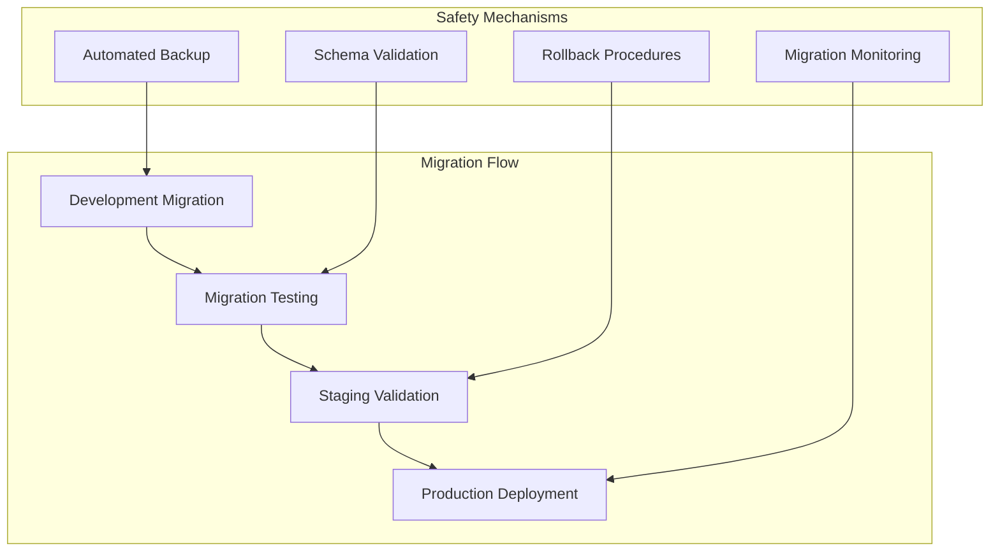

# Database Migration Guide

This comprehensive guide covers database schema management, migration procedures, and data integrity maintenance for Thorbis Business OS across all deployment environments.

## Migration Overview

### Migration Strategy

Thorbis Business OS employs a forward-only migration strategy with comprehensive rollback capabilities, designed to maintain data integrity and minimize downtime during database schema changes.



### Migration Principles

#### Forward-Only Migrations
```typescript
// Migration principles implementation
const migrationPrinciples = {
  forwardOnly: {
    description: 'All schema changes move forward in version sequence',
    implementation: 'Sequential numbered migrations with no gaps',
    benefits: ['Predictable deployment', 'Clear version history', 'Simplified rollback']
  },
  
  dataIntegrity: {
    description: 'Maintain data consistency throughout migration process',
    implementation: 'Transactional migrations with validation',
    safeguards: ['Backup verification', 'Constraint validation', 'Foreign key checks']
  },
  
  zeroDowntime: {
    description: 'Minimize service interruption during migrations',
    implementation: 'Online schema changes and blue-green deployments',
    techniques: ['Non-blocking alterations', 'Gradual rollouts', 'Connection pooling']
  },
  
  rollbackReady: {
    description: 'Always maintain rollback capability',
    implementation: 'Automated rollback scripts and data backups',
    requirements: ['Point-in-time recovery', 'Schema versioning', 'Data snapshots']
  }
}
```

## Migration Architecture

### Supabase Migration System

#### Migration File Structure
```bash
# Supabase migrations directory structure
supabase/
├── migrations/
│   ├── 20250131000001_initial_schema.sql
│   ├── 20250131000002_add_business_tables.sql
│   ├── 20250131000003_create_rls_policies.sql
│   ├── 20250131000004_add_industry_schemas.sql
│   └── 20250131000005_create_audit_system.sql
├── seed.sql
└── config.toml
```

#### Migration Template Structure
```sql
-- Migration: [DESCRIPTION]
-- Version: [TIMESTAMP]_[DESCRIPTIVE_NAME].sql
-- Author: [AUTHOR_NAME]
-- Date: [CREATION_DATE]

-- Pre-migration checks
DO $$
BEGIN
    -- Check prerequisites
    IF NOT EXISTS (SELECT 1 FROM information_schema.tables WHERE table_name = 'prerequisite_table') THEN
        RAISE EXCEPTION 'Prerequisite table does not exist';
    END IF;
END $$;

-- Begin transaction for atomic migration
BEGIN;

-- Migration content
-- (Add your schema changes here)

-- Post-migration validation
DO $$
BEGIN
    -- Validate migration success
    IF NOT EXISTS (SELECT 1 FROM information_schema.tables WHERE table_name = 'new_table') THEN
        RAISE EXCEPTION 'Migration validation failed: new_table not created';
    END IF;
END $$;

-- Commit transaction
COMMIT;

-- Update migration log
INSERT INTO migration_history (version, description, applied_at, status)
VALUES ('20250131000001', 'Initial schema creation', NOW(), 'completed');
```

### Migration Categories

#### Schema Migrations
```sql
-- schema_migrations/001_create_business_schema.sql
-- Creates core business schema structure

CREATE SCHEMA IF NOT EXISTS business_core;
CREATE SCHEMA IF NOT EXISTS business_hs;
CREATE SCHEMA IF NOT EXISTS business_rest;
CREATE SCHEMA IF NOT EXISTS business_auto;
CREATE SCHEMA IF NOT EXISTS business_ret;

-- Core business tables
CREATE TABLE business_core.businesses (
    id UUID PRIMARY KEY DEFAULT gen_random_uuid(),
    name VARCHAR(255) NOT NULL,
    industry business_core.industry_type NOT NULL,
    created_at TIMESTAMPTZ DEFAULT NOW(),
    updated_at TIMESTAMPTZ DEFAULT NOW()
);

-- Industry-specific tables
CREATE TABLE business_hs.work_orders (
    id UUID PRIMARY KEY DEFAULT gen_random_uuid(),
    business_id UUID REFERENCES business_core.businesses(id),
    customer_id UUID REFERENCES business_core.customers(id),
    status VARCHAR(50) DEFAULT 'pending',
    created_at TIMESTAMPTZ DEFAULT NOW(),
    updated_at TIMESTAMPTZ DEFAULT NOW()
);

-- Row Level Security policies
ALTER TABLE business_core.businesses ENABLE ROW LEVEL SECURITY;
ALTER TABLE business_hs.work_orders ENABLE ROW LEVEL SECURITY;

-- Create RLS policies
CREATE POLICY businesses_isolation_policy ON business_core.businesses
    FOR ALL TO authenticated
    USING (id = (SELECT business_id FROM user_profiles WHERE user_id = auth.uid()));

CREATE POLICY work_orders_isolation_policy ON business_hs.work_orders
    FOR ALL TO authenticated
    USING (business_id = (SELECT business_id FROM user_profiles WHERE user_id = auth.uid()));
```

#### Data Migrations
```sql
-- data_migrations/002_populate_initial_data.sql
-- Populates initial reference data

INSERT INTO business_core.industry_types (name, description) VALUES
    ('home_services', 'Home Services and Contracting'),
    ('restaurant', 'Restaurant and Food Service'),
    ('automotive', 'Automotive and Repair Services'),
    ('retail', 'Retail and E-commerce');

INSERT INTO business_core.user_roles (name, description, permissions) VALUES
    ('owner', 'Business Owner', '["full_access"]'),
    ('manager', 'Business Manager', '["read_write", "user_management"]'),
    ('staff', 'Staff Member', '["read_write"]'),
    ('viewer', 'View Only', '["read_only"]');

-- Create default business settings
INSERT INTO business_core.business_settings (business_id, key, value)
SELECT 
    b.id,
    setting.key,
    setting.default_value
FROM business_core.businesses b
CROSS JOIN (
    VALUES 
        ('timezone', 'UTC'),
        ('currency', 'USD'),
        ('date_format', 'MM/DD/YYYY'),
        ('business_hours', '{"monday": {"open": "09:00", "close": "17:00"}}')
) AS setting(key, default_value);
```

#### Index Migrations
```sql
-- index_migrations/003_create_performance_indexes.sql
-- Creates indexes for optimal query performance

-- Primary business indexes
CREATE INDEX CONCURRENTLY IF NOT EXISTS idx_businesses_industry 
    ON business_core.businesses(industry);
CREATE INDEX CONCURRENTLY IF NOT EXISTS idx_businesses_created_at 
    ON business_core.businesses(created_at);

-- Work orders indexes
CREATE INDEX CONCURRENTLY IF NOT EXISTS idx_work_orders_business_id 
    ON business_hs.work_orders(business_id);
CREATE INDEX CONCURRENTLY IF NOT EXISTS idx_work_orders_status 
    ON business_hs.work_orders(status);
CREATE INDEX CONCURRENTLY IF NOT EXISTS idx_work_orders_created_at 
    ON business_hs.work_orders(created_at);

-- Composite indexes for common queries
CREATE INDEX CONCURRENTLY IF NOT EXISTS idx_work_orders_business_status 
    ON business_hs.work_orders(business_id, status);
CREATE INDEX CONCURRENTLY IF NOT EXISTS idx_work_orders_business_date 
    ON business_hs.work_orders(business_id, created_at);

-- Full-text search indexes
CREATE INDEX CONCURRENTLY IF NOT EXISTS idx_customers_search 
    ON business_core.customers USING gin(
        to_tsvector('english', name || ' ' || email || ' ' || phone)
    );
```

## Migration Procedures

### Pre-Migration Checklist

#### Environment Validation
```bash
#!/bin/bash
# scripts/pre-migration-check.sh

echo "🔍 Starting pre-migration validation..."

# Check database connectivity
if ! supabase db ping --project-ref $SUPABASE_PROJECT_REF; then
    echo "❌ Database connectivity check failed"
    exit 1
fi

# Check current schema version
CURRENT_VERSION=$(supabase db version)
echo "📋 Current schema version: $CURRENT_VERSION"

# Validate migration files
PENDING_MIGRATIONS=$(supabase migration list --pending)
if [ -z "$PENDING_MIGRATIONS" ]; then
    echo "ℹ️  No pending migrations found"
    exit 0
fi

echo "📝 Pending migrations:"
echo "$PENDING_MIGRATIONS"

# Check disk space
DB_SIZE=$(supabase db size)
AVAILABLE_SPACE=$(df -h /var/lib/postgresql/data | awk 'NR==2{print $4}')
echo "💾 Database size: $DB_SIZE"
echo "💾 Available space: $AVAILABLE_SPACE"

# Validate backup exists
BACKUP_DATE=$(supabase backup list | head -n1 | awk '{print $2}')
if [ -z "$BACKUP_DATE" ]; then
    echo "⚠️  No recent backup found - creating backup before migration"
    supabase backup create --project-ref $SUPABASE_PROJECT_REF
fi

echo "✅ Pre-migration validation completed successfully"
```

#### Migration Testing Framework
```typescript
// tests/migration-tests.ts
import { createClient } from '@supabase/supabase-js'
import { describe, it, expect, beforeAll, afterAll } from 'vitest'

interface MigrationTest {
  name: string
  migrationFile: string
  testQueries: TestQuery[]
  expectedResults: Record<string, any>[]
}

class MigrationTester {
  private supabase: any
  private testDatabaseUrl: string
  
  constructor(testDatabaseUrl: string) {
    this.testDatabaseUrl = testDatabaseUrl
    this.supabase = createClient(testDatabaseUrl, process.env.SUPABASE_SERVICE_ROLE_KEY!)
  }
  
  async runMigrationTest(test: MigrationTest): Promise<boolean> {
    console.log(`🧪 Testing migration: ${test.name}`)
    
    try {
      // Apply migration
      await this.applyMigration(test.migrationFile)
      
      // Run test queries
      for (const query of test.testQueries) {
        const result = await this.supabase.rpc(query.name, query.params)
        
        if (result.error) {
          throw new Error(`Query failed: ${result.error.message}`)
        }
        
        // Validate results
        const expected = test.expectedResults.find(r => r.queryName === query.name)
        if (expected && !this.validateResult(result.data, expected.data)) {
          throw new Error(`Result validation failed for query: ${query.name}`)
        }
      }
      
      console.log(`✅ Migration test passed: ${test.name}`)
      return true
    } catch (error) {
      console.error(`❌ Migration test failed: ${test.name}`, error)
      return false
    }
  }
  
  private async applyMigration(migrationFile: string): Promise<void> {
    // Implementation for applying migration in test environment
    const migrationSQL = await import(`../supabase/migrations/${migrationFile}`)
    await this.supabase.rpc('exec_sql', { sql: migrationSQL.default })
  }
  
  private validateResult(actual: any, expected: any): boolean {
    // Deep comparison of query results
    return JSON.stringify(actual) === JSON.stringify(expected)
  }
}

// Migration test suite
const migrationTests: MigrationTest[] = [
  {
    name: 'Initial Schema Creation',
    migrationFile: '20250131000001_initial_schema.sql',
    testQueries: [
      {
        name: 'verify_businesses_table',
        params: { table_name: 'businesses' }
      },
      {
        name: 'verify_rls_policies',
        params: { table_name: 'businesses' }
      }
    ],
    expectedResults: [
      {
        queryName: 'verify_businesses_table',
        data: { exists: true, columns: ['id', 'name', 'industry', 'created_at', 'updated_at'] }
      },
      {
        queryName: 'verify_rls_policies',
        data: { rls_enabled: true, policy_count: 1 }
      }
    ]
  }
]

describe('Migration Tests', () => {
  let tester: MigrationTester
  
  beforeAll(async () => {
    tester = new MigrationTester(process.env.TEST_SUPABASE_URL!)
  })
  
  afterAll(async () => {
    // Cleanup test database
    await tester.cleanup()
  })
  
  migrationTests.forEach(test => {
    it(`should successfully apply ${test.name}`, async () => {
      const result = await tester.runMigrationTest(test)
      expect(result).toBe(true)
    })
  })
})
```

### Production Migration Process

#### Staging Migration Validation
```bash
#!/bin/bash
# scripts/staging-migration.sh

set -e

echo "🚀 Starting staging migration process..."

# Environment setup
export SUPABASE_PROJECT_REF=$STAGING_SUPABASE_PROJECT_REF
export SUPABASE_DB_PASSWORD=$STAGING_SUPABASE_PASSWORD

# Create pre-migration backup
echo "📦 Creating pre-migration backup..."
BACKUP_ID=$(supabase backup create --project-ref $SUPABASE_PROJECT_REF)
echo "✅ Backup created: $BACKUP_ID"

# Validate migration files
echo "🔍 Validating migration files..."
supabase migration list --pending

# Apply migrations with monitoring
echo "⚡ Applying migrations to staging..."
supabase db push --include-all --project-ref $SUPABASE_PROJECT_REF

# Post-migration validation
echo "🧪 Running post-migration validation..."
npm run test:migration:validate

# Performance testing
echo "📊 Running performance tests..."
npm run test:performance:migration

# Data integrity checks
echo "🔐 Validating data integrity..."
npm run test:data:integrity

# RLS policy validation
echo "🛡️  Validating security policies..."
npm run test:security:rls

echo "✅ Staging migration completed successfully"

# Generate migration report
echo "📋 Generating migration report..."
./scripts/generate-migration-report.sh $BACKUP_ID
```

#### Production Migration Deployment
```typescript
// scripts/production-migration.ts
interface MigrationConfig {
  environment: 'production'
  projectRef: string
  backupStrategy: BackupStrategy
  rollbackPlan: RollbackPlan
  validationChecks: ValidationCheck[]
  monitoringConfig: MonitoringConfig
}

class ProductionMigrator {
  private config: MigrationConfig
  private supabase: any
  
  constructor(config: MigrationConfig) {
    this.config = config
    this.supabase = createClient(
      process.env.PROD_SUPABASE_URL!,
      process.env.PROD_SUPABASE_SERVICE_KEY!
    )
  }
  
  async executeMigration(): Promise<MigrationResult> {
    console.log('🚀 Starting production migration...')
    
    const migrationId = this.generateMigrationId()
    
    try {
      // Phase 1: Pre-migration preparation
      await this.preMigrationPreparation(migrationId)
      
      // Phase 2: Create comprehensive backup
      const backupId = await this.createProductionBackup()
      
      // Phase 3: Apply migrations with monitoring
      const migrationResult = await this.applyMigrationsWithMonitoring()
      
      // Phase 4: Post-migration validation
      await this.postMigrationValidation()
      
      // Phase 5: Performance verification
      await this.performanceVerification()
      
      // Phase 6: Security validation
      await this.securityValidation()
      
      console.log('✅ Production migration completed successfully')
      
      return {
        success: true,
        migrationId,
        backupId,
        duration: Date.now() - migrationResult.startTime,
        validationResults: migrationResult.validationResults
      }
      
    } catch (error) {
      console.error('❌ Production migration failed:', error)
      
      // Automatic rollback on failure
      await this.initiateRollback(migrationId)
      
      throw new Error(`Migration failed: ${error.message}`)
    }
  }
  
  private async preMigrationPreparation(migrationId: string): Promise<void> {
    console.log('📋 Preparing for migration...')
    
    // Check system health
    const healthCheck = await this.performHealthCheck()
    if (!healthCheck.healthy) {
      throw new Error(`System health check failed: ${healthCheck.issues.join(', ')}`)
    }
    
    // Verify no active long-running transactions
    const activeTransactions = await this.checkActiveTransactions()
    if (activeTransactions.length > 0) {
      console.warn('⚠️  Active transactions detected, waiting for completion...')
      await this.waitForTransactionCompletion()
    }
    
    // Prepare rollback environment
    await this.prepareRollbackEnvironment(migrationId)
    
    // Notify stakeholders
    await this.notifyMigrationStart(migrationId)
  }
  
  private async createProductionBackup(): Promise<string> {
    console.log('📦 Creating production backup...')
    
    const backupConfig = {
      includeData: true,
      includeSchema: true,
      compression: true,
      verification: true
    }
    
    const backupId = await this.supabase.backup.create(backupConfig)
    
    // Verify backup integrity
    const backupVerification = await this.supabase.backup.verify(backupId)
    if (!backupVerification.valid) {
      throw new Error('Backup verification failed')
    }
    
    console.log(`✅ Backup created and verified: ${backupId}`)
    return backupId
  }
  
  private async applyMigrationsWithMonitoring(): Promise<MigrationExecutionResult> {
    console.log('⚡ Applying migrations with real-time monitoring...')
    
    const startTime = Date.now()
    const migrationMonitor = new MigrationMonitor(this.config.monitoringConfig)
    
    // Start monitoring
    migrationMonitor.start()
    
    try {
      // Get pending migrations
      const pendingMigrations = await this.getPendingMigrations()
      
      for (const migration of pendingMigrations) {
        console.log(`📝 Applying migration: ${migration.name}`)
        
        const migrationStart = Date.now()
        await this.applyMigration(migration)
        const migrationDuration = Date.now() - migrationStart
        
        // Log migration completion
        await this.logMigrationCompletion(migration, migrationDuration)
        
        // Validate migration
        await this.validateMigration(migration)
      }
      
      return {
        success: true,
        startTime,
        duration: Date.now() - startTime,
        migrationsApplied: pendingMigrations.length,
        validationResults: await migrationMonitor.getResults()
      }
      
    } finally {
      migrationMonitor.stop()
    }
  }
  
  private async performHealthCheck(): Promise<HealthCheckResult> {
    const checks = [
      this.checkDatabaseConnectivity(),
      this.checkDiskSpace(),
      this.checkMemoryUsage(),
      this.checkActiveConnections(),
      this.checkReplicationLag()
    ]
    
    const results = await Promise.allSettled(checks)
    const issues = results
      .filter(r => r.status === 'rejected' || !r.value.healthy)
      .map(r => r.status === 'rejected' ? r.reason : r.value.issue)
    
    return {
      healthy: issues.length === 0,
      issues,
      timestamp: new Date().toISOString()
    }
  }
}

// Usage
const productionMigrator = new ProductionMigrator({
  environment: 'production',
  projectRef: process.env.PROD_SUPABASE_PROJECT_REF!,
  backupStrategy: {
    beforeMigration: true,
    pointInTimeRecovery: true,
    verifyIntegrity: true
  },
  rollbackPlan: {
    automaticRollback: true,
    rollbackTimeout: 300000, // 5 minutes
    notificationChannels: ['slack', 'email']
  },
  validationChecks: [
    'schema_integrity',
    'data_consistency',
    'rls_policies',
    'performance_benchmarks',
    'foreign_key_constraints'
  ],
  monitoringConfig: {
    realTimeMetrics: true,
    alertThresholds: {
      migrationTimeout: 600000, // 10 minutes
      errorRate: 0.01, // 1%
      performanceDegradation: 0.2 // 20%
    }
  }
})
```

## Rollback Procedures

### Automated Rollback System

#### Rollback Strategy Implementation
```typescript
// rollback/rollback-manager.ts
interface RollbackConfig {
  migrationId: string
  backupId: string
  strategy: 'point_in_time' | 'full_restore' | 'schema_only'
  timeout: number
  validationLevel: 'basic' | 'comprehensive'
}

class RollbackManager {
  private config: RollbackConfig
  private supabase: any
  
  constructor(config: RollbackConfig) {
    this.config = config
  }
  
  async executeRollback(): Promise<RollbackResult> {
    console.log(`🔄 Initiating rollback for migration: ${this.config.migrationId}`)
    
    const rollbackStartTime = Date.now()
    
    try {
      // Phase 1: Pre-rollback validation
      await this.preRollbackValidation()
      
      // Phase 2: Stop application traffic (if needed)
      if (this.config.strategy === 'full_restore') {
        await this.enableMaintenanceMode()
      }
      
      // Phase 3: Execute rollback strategy
      const rollbackResult = await this.executeRollbackStrategy()
      
      // Phase 4: Post-rollback validation
      await this.postRollbackValidation()
      
      // Phase 5: Resume normal operations
      if (this.config.strategy === 'full_restore') {
        await this.disableMaintenanceMode()
      }
      
      // Phase 6: Notify stakeholders
      await this.notifyRollbackCompletion()
      
      const rollbackDuration = Date.now() - rollbackStartTime
      
      console.log(`✅ Rollback completed successfully in ${rollbackDuration}ms`)
      
      return {
        success: true,
        strategy: this.config.strategy,
        duration: rollbackDuration,
        backupRestored: this.config.backupId,
        validationResults: rollbackResult.validationResults
      }
      
    } catch (error) {
      console.error('❌ Rollback failed:', error)
      
      // Emergency procedures
      await this.executeEmergencyProcedures()
      
      throw new Error(`Rollback failed: ${error.message}`)
    }
  }
  
  private async executeRollbackStrategy(): Promise<RollbackExecutionResult> {
    switch (this.config.strategy) {
      case 'point_in_time':
        return await this.pointInTimeRestore()
      case 'full_restore':
        return await this.fullBackupRestore()
      case 'schema_only':
        return await this.schemaOnlyRollback()
      default:
        throw new Error(`Unknown rollback strategy: ${this.config.strategy}`)
    }
  }
  
  private async pointInTimeRestore(): Promise<RollbackExecutionResult> {
    console.log('🕐 Executing point-in-time restore...')
    
    // Calculate restore point (just before migration)
    const migrationTimestamp = await this.getMigrationTimestamp(this.config.migrationId)
    const restorePoint = new Date(migrationTimestamp.getTime() - 60000) // 1 minute before
    
    // Execute point-in-time recovery
    const restoreResult = await this.supabase.backup.restoreToPoint(restorePoint)
    
    if (!restoreResult.success) {
      throw new Error('Point-in-time restore failed')
    }
    
    return {
      success: true,
      method: 'point_in_time',
      restorePoint: restorePoint.toISOString(),
      dataLoss: this.calculateDataLoss(restorePoint),
      validationResults: await this.validateRestore()
    }
  }
  
  private async fullBackupRestore(): Promise<RollbackExecutionResult> {
    console.log('📦 Executing full backup restore...')
    
    // Restore from pre-migration backup
    const restoreResult = await this.supabase.backup.restore(this.config.backupId)
    
    if (!restoreResult.success) {
      throw new Error('Full backup restore failed')
    }
    
    // Rebuild indexes and refresh statistics
    await this.rebuildIndexes()
    await this.refreshStatistics()
    
    return {
      success: true,
      method: 'full_restore',
      backupId: this.config.backupId,
      validationResults: await this.validateRestore()
    }
  }
  
  private async schemaOnlyRollback(): Promise<RollbackExecutionResult> {
    console.log('📋 Executing schema-only rollback...')
    
    // Get migration rollback scripts
    const rollbackScripts = await this.getRollbackScripts(this.config.migrationId)
    
    for (const script of rollbackScripts.reverse()) {
      console.log(`📝 Executing rollback script: ${script.name}`)
      await this.executeRollbackScript(script)
    }
    
    return {
      success: true,
      method: 'schema_only',
      scriptsExecuted: rollbackScripts.length,
      validationResults: await this.validateRestore()
    }
  }
}
```

## Data Integrity and Validation

### Comprehensive Validation Framework

#### Data Consistency Checks
```sql
-- validation/data_consistency_checks.sql
-- Comprehensive data consistency validation queries

-- Check referential integrity
CREATE OR REPLACE FUNCTION validate_referential_integrity()
RETURNS TABLE(
    table_name TEXT,
    constraint_name TEXT,
    violation_count BIGINT,
    sample_violations JSONB
) AS $$
BEGIN
    -- Check all foreign key constraints
    RETURN QUERY
    SELECT 
        tc.table_name::TEXT,
        tc.constraint_name::TEXT,
        COUNT(*)::BIGINT as violation_count,
        jsonb_agg(row_to_json(violations.*)) as sample_violations
    FROM information_schema.table_constraints tc
    JOIN information_schema.key_column_usage kcu 
        ON tc.constraint_name = kcu.constraint_name
    LEFT JOIN LATERAL (
        -- Dynamic query to find violations
        SELECT * FROM (
            SELECT row_number() OVER () as row_num, *
            FROM (
                EXECUTE format(
                    'SELECT * FROM %I.%I t1 WHERE NOT EXISTS (SELECT 1 FROM %I.%I t2 WHERE t2.%I = t1.%I)',
                    tc.table_schema,
                    tc.table_name,
                    ccu.table_schema,
                    ccu.table_name,
                    ccu.column_name,
                    kcu.column_name
                )
            ) violations_subquery
        ) violations_numbered
        WHERE violations_numbered.row_num <= 5  -- Sample first 5 violations
    ) violations ON true
    WHERE tc.constraint_type = 'FOREIGN KEY'
    GROUP BY tc.table_name, tc.constraint_name
    HAVING COUNT(*) > 0;
END;
$$ LANGUAGE plpgsql;

-- Check business rule consistency
CREATE OR REPLACE FUNCTION validate_business_rules()
RETURNS TABLE(
    rule_name TEXT,
    table_name TEXT,
    violation_count BIGINT,
    description TEXT
) AS $$
BEGIN
    -- Business rule: Work orders must have valid status
    RETURN QUERY
    SELECT 
        'valid_work_order_status'::TEXT,
        'work_orders'::TEXT,
        COUNT(*)::BIGINT,
        'Work orders with invalid status values'::TEXT
    FROM business_hs.work_orders 
    WHERE status NOT IN ('pending', 'in_progress', 'completed', 'cancelled');
    
    -- Business rule: Invoices must have positive amounts
    RETURN QUERY
    SELECT 
        'positive_invoice_amounts'::TEXT,
        'invoices'::TEXT,
        COUNT(*)::BIGINT,
        'Invoices with negative or zero amounts'::TEXT
    FROM business_core.invoices 
    WHERE total_amount <= 0;
    
    -- Business rule: Users must belong to a business
    RETURN QUERY
    SELECT 
        'users_have_business'::TEXT,
        'user_profiles'::TEXT,
        COUNT(*)::BIGINT,
        'Users without valid business association'::TEXT
    FROM business_core.user_profiles up
    WHERE NOT EXISTS (
        SELECT 1 FROM business_core.businesses b 
        WHERE b.id = up.business_id
    );
    
    -- Add more business rules as needed
    
END;
$$ LANGUAGE plpgsql;

-- Check data type consistency
CREATE OR REPLACE FUNCTION validate_data_types()
RETURNS TABLE(
    table_name TEXT,
    column_name TEXT,
    expected_type TEXT,
    actual_type TEXT,
    issue_description TEXT
) AS $$
BEGIN
    -- Validate UUID fields are properly formatted
    RETURN QUERY
    SELECT 
        t.table_name::TEXT,
        c.column_name::TEXT,
        'uuid'::TEXT as expected_type,
        'invalid_uuid'::TEXT as actual_type,
        'UUID column contains invalid UUID values'::TEXT
    FROM information_schema.tables t
    JOIN information_schema.columns c ON t.table_name = c.table_name
    WHERE c.data_type = 'uuid'
    AND EXISTS (
        EXECUTE format(
            'SELECT 1 FROM %I.%I WHERE %I IS NOT NULL AND %I !~ ''^[0-9a-f]{8}-[0-9a-f]{4}-[0-9a-f]{4}-[0-9a-f]{4}-[0-9a-f]{12}$''',
            t.table_schema, t.table_name, c.column_name, c.column_name
        )
    );
END;
$$ LANGUAGE plpgsql;
```

#### Performance Impact Assessment
```typescript
// validation/performance-validator.ts
interface PerformanceMetric {
  metric: string
  beforeMigration: number
  afterMigration: number
  threshold: number
  status: 'pass' | 'fail' | 'warning'
  impact: string
}

class MigrationPerformanceValidator {
  private supabase: any
  private benchmarkQueries: BenchmarkQuery[]
  
  constructor(supabaseClient: any) {
    this.supabase = supabaseClient
    this.benchmarkQueries = [
      {
        name: 'business_list_query',
        sql: 'SELECT * FROM business_core.businesses ORDER BY created_at DESC LIMIT 100',
        expectedDuration: 50 // milliseconds
      },
      {
        name: 'work_orders_by_business',
        sql: `SELECT wo.* FROM business_hs.work_orders wo 
              JOIN business_core.businesses b ON wo.business_id = b.id 
              WHERE b.industry = 'home_services' 
              ORDER BY wo.created_at DESC LIMIT 100`,
        expectedDuration: 100
      },
      {
        name: 'customer_search_query',
        sql: `SELECT * FROM business_core.customers 
              WHERE to_tsvector('english', name || ' ' || email) @@ plainto_tsquery('john') 
              LIMIT 20`,
        expectedDuration: 200
      }
    ]
  }
  
  async validatePerformance(): Promise<PerformanceValidationResult> {
    console.log('📊 Starting performance validation...')
    
    const results: PerformanceMetric[] = []
    
    for (const query of this.benchmarkQueries) {
      const metric = await this.benchmarkQuery(query)
      results.push(metric)
    }
    
    // Additional system metrics
    const systemMetrics = await this.getSystemMetrics()
    results.push(...systemMetrics)
    
    const overall = this.calculateOverallPerformance(results)
    
    return {
      timestamp: new Date().toISOString(),
      metrics: results,
      overall,
      recommendations: this.generateRecommendations(results)
    }
  }
  
  private async benchmarkQuery(query: BenchmarkQuery): Promise<PerformanceMetric> {
    const iterations = 10
    const durations: number[] = []
    
    for (let i = 0; i < iterations; i++) {
      const start = performance.now()
      await this.supabase.rpc('execute_sql', { sql: query.sql })
      const duration = performance.now() - start
      durations.push(duration)
      
      // Small delay between iterations
      await new Promise(resolve => setTimeout(resolve, 100))
    }
    
    const avgDuration = durations.reduce((sum, d) => sum + d, 0) / iterations
    const maxDuration = Math.max(...durations)
    const minDuration = Math.min(...durations)
    
    let status: 'pass' | 'fail' | 'warning'
    let impact: string
    
    if (avgDuration <= query.expectedDuration) {
      status = 'pass'
      impact = 'No performance degradation detected'
    } else if (avgDuration <= query.expectedDuration * 1.5) {
      status = 'warning'
      impact = `Performance degraded by ${Math.round(((avgDuration / query.expectedDuration) - 1) * 100)}%`
    } else {
      status = 'fail'
      impact = `Significant performance degradation: ${Math.round(((avgDuration / query.expectedDuration) - 1) * 100)}%`
    }
    
    return {
      metric: query.name,
      beforeMigration: query.expectedDuration,
      afterMigration: avgDuration,
      threshold: query.expectedDuration * 1.2,
      status,
      impact,
      details: {
        avgDuration,
        maxDuration,
        minDuration,
        iterations
      }
    }
  }
  
  private async getSystemMetrics(): Promise<PerformanceMetric[]> {
    const systemQueries = [
      {
        name: 'database_size',
        sql: 'SELECT pg_database_size(current_database()) as size_bytes',
        transformer: (result: any) => result[0].size_bytes / (1024 * 1024) // MB
      },
      {
        name: 'active_connections',
        sql: 'SELECT count(*) as connection_count FROM pg_stat_activity',
        transformer: (result: any) => result[0].connection_count
      },
      {
        name: 'cache_hit_ratio',
        sql: `SELECT 
                round(
                  100.0 * sum(blks_hit) / (sum(blks_hit) + sum(blks_read)), 2
                ) as cache_hit_ratio
              FROM pg_stat_database 
              WHERE datname = current_database()`,
        transformer: (result: any) => result[0].cache_hit_ratio
      }
    ]
    
    const metrics: PerformanceMetric[] = []
    
    for (const query of systemQueries) {
      const result = await this.supabase.rpc('execute_sql', { sql: query.sql })
      const value = query.transformer(result.data)
      
      // Define thresholds for system metrics
      const thresholds = {
        database_size: 10240, // 10GB warning
        active_connections: 80, // 80% of max connections
        cache_hit_ratio: 95 // 95% minimum cache hit ratio
      }
      
      let status: 'pass' | 'fail' | 'warning'
      if (query.name === 'cache_hit_ratio') {
        status = value >= thresholds[query.name] ? 'pass' : 'warning'
      } else {
        status = value <= thresholds[query.name] ? 'pass' : 'warning'
      }
      
      metrics.push({
        metric: query.name,
        beforeMigration: thresholds[query.name],
        afterMigration: value,
        threshold: thresholds[query.name],
        status,
        impact: status === 'pass' ? 'Within acceptable limits' : `Exceeds recommended threshold`
      })
    }
    
    return metrics
  }
}
```

## Migration Monitoring

### Real-Time Migration Monitoring
```typescript
// monitoring/migration-monitor.ts
interface MigrationMonitorConfig {
  migrationId: string
  alerting: AlertConfig
  metrics: MetricsConfig
  logging: LoggingConfig
}

class MigrationMonitor {
  private config: MigrationMonitorConfig
  private metrics: Map<string, MetricCollector>
  private alerts: AlertManager
  
  constructor(config: MigrationMonitorConfig) {
    this.config = config
    this.metrics = new Map()
    this.alerts = new AlertManager(config.alerting)
    
    this.initializeMetrics()
  }
  
  async startMonitoring(): Promise<void> {
    console.log('📡 Starting migration monitoring...')
    
    // Start collecting metrics
    this.metrics.forEach(collector => collector.start())
    
    // Enable alerting
    this.alerts.enable()
    
    // Start health checks
    this.startHealthChecks()
  }
  
  async stopMonitoring(): Promise<MigrationReport> {
    console.log('🛑 Stopping migration monitoring...')
    
    // Stop all collectors
    this.metrics.forEach(collector => collector.stop())
    
    // Generate final report
    const report = await this.generateReport()
    
    return report
  }
  
  private initializeMetrics(): void {
    // Database performance metrics
    this.metrics.set('query_performance', new QueryPerformanceCollector({
      sampleQueries: [
        'SELECT COUNT(*) FROM business_core.businesses',
        'SELECT COUNT(*) FROM business_hs.work_orders',
        'SELECT COUNT(*) FROM business_core.customers'
      ],
      intervalMs: 5000
    }))
    
    // Connection metrics
    this.metrics.set('connections', new ConnectionMetricsCollector({
      intervalMs: 10000
    }))
    
    // Lock monitoring
    this.metrics.set('locks', new LockMonitoringCollector({
      intervalMs: 2000,
      alertOnDeadlock: true
    }))
    
    // Disk space monitoring
    this.metrics.set('disk_space', new DiskSpaceCollector({
      intervalMs: 30000,
      warningThreshold: 0.8, // 80%
      criticalThreshold: 0.9  // 90%
    }))
  }
  
  private startHealthChecks(): void {
    setInterval(async () => {
      const health = await this.performHealthCheck()
      
      if (!health.healthy) {
        await this.alerts.trigger({
          level: 'critical',
          message: `Migration health check failed: ${health.issues.join(', ')}`,
          migrationId: this.config.migrationId,
          timestamp: new Date().toISOString()
        })
      }
    }, 10000) // Every 10 seconds
  }
  
  private async performHealthCheck(): Promise<HealthStatus> {
    const checks = await Promise.allSettled([
      this.checkDatabaseConnectivity(),
      this.checkLongRunningQueries(),
      this.checkDeadlocks(),
      this.checkReplicationLag()
    ])
    
    const issues = checks
      .filter(result => result.status === 'rejected' || !result.value.healthy)
      .map(result => result.status === 'rejected' ? result.reason : result.value.issue)
    
    return {
      healthy: issues.length === 0,
      issues,
      timestamp: new Date().toISOString()
    }
  }
  
  async generateReport(): Promise<MigrationReport> {
    const metricsData = new Map()
    
    for (const [name, collector] of this.metrics) {
      metricsData.set(name, collector.getData())
    }
    
    const alertHistory = this.alerts.getHistory()
    
    return {
      migrationId: this.config.migrationId,
      startTime: this.startTime,
      endTime: new Date().toISOString(),
      duration: Date.now() - this.startTime.getTime(),
      metrics: Object.fromEntries(metricsData),
      alerts: alertHistory,
      summary: this.generateSummary(metricsData, alertHistory)
    }
  }
}
```

## Best Practices and Guidelines

### Migration Development Guidelines

#### Code Review Checklist
```markdown
# Migration Code Review Checklist

## Schema Changes
- [ ] All table alterations are backwards compatible where possible
- [ ] Indexes are created with CONCURRENTLY to avoid blocking
- [ ] Foreign key constraints are properly defined
- [ ] Row Level Security policies are updated appropriately
- [ ] Data types are appropriate for expected data volume

## Data Migrations
- [ ] Data transformations are idempotent
- [ ] Large data migrations are batched to avoid timeouts
- [ ] Data validation is included in migration
- [ ] Rollback procedures are documented and tested

## Performance Considerations
- [ ] New indexes support expected query patterns
- [ ] Migration execution time is reasonable for production
- [ ] No unnecessary full table scans
- [ ] Query plans reviewed for performance impact

## Security and Compliance
- [ ] RLS policies maintain data isolation
- [ ] Sensitive data is properly protected
- [ ] Audit logging is maintained
- [ ] Compliance requirements are met

## Testing and Validation
- [ ] Migration tested in development environment
- [ ] Rollback procedure tested and verified
- [ ] Data integrity checks included
- [ ] Performance impact assessed
```

#### Migration Naming Convention
```bash
# Migration file naming convention
# Format: YYYYMMDDHHMMSS_descriptive_name.sql
# Example: 20250131143000_add_customer_preferences_table.sql

# Good examples:
20250131143000_add_customer_preferences_table.sql
20250131143100_create_work_order_indexes.sql
20250131143200_update_rls_policies_for_multi_tenant.sql

# Bad examples:
migration_1.sql
fix_bug.sql
update_schema.sql
temp_migration.sql
```

## Troubleshooting Common Issues

### Migration Failure Recovery

#### Common Migration Issues
```bash
#!/bin/bash
# troubleshooting/common-migration-issues.sh

echo "🔍 Migration Troubleshooting Guide"
echo "=================================="

# Check 1: Long-running migrations
echo "Checking for long-running migrations..."
LONG_RUNNING=$(supabase db query "
    SELECT pid, now() - pg_stat_activity.query_start AS duration, query 
    FROM pg_stat_activity 
    WHERE (now() - pg_stat_activity.query_start) > interval '10 minutes'
    AND state = 'active'
    ORDER BY duration DESC;
")

if [ ! -z "$LONG_RUNNING" ]; then
    echo "⚠️  Long-running migrations detected:"
    echo "$LONG_RUNNING"
fi

# Check 2: Blocked queries
echo "Checking for blocked queries..."
BLOCKED_QUERIES=$(supabase db query "
    SELECT blocked_locks.pid AS blocked_pid,
           blocked_activity.usename AS blocked_user,
           blocking_locks.pid AS blocking_pid,
           blocking_activity.usename AS blocking_user,
           blocked_activity.query AS blocked_statement,
           blocking_activity.query AS blocking_statement
    FROM pg_catalog.pg_locks blocked_locks
    JOIN pg_catalog.pg_stat_activity blocked_activity ON blocked_activity.pid = blocked_locks.pid
    JOIN pg_catalog.pg_locks blocking_locks ON blocking_locks.locktype = blocked_locks.locktype
    JOIN pg_catalog.pg_stat_activity blocking_activity ON blocking_activity.pid = blocking_locks.pid
    WHERE NOT blocked_locks.granted AND blocking_locks.granted;
")

if [ ! -z "$BLOCKED_QUERIES" ]; then
    echo "🚫 Blocked queries detected:"
    echo "$BLOCKED_QUERIES"
fi

# Check 3: Failed migrations
echo "Checking migration history..."
FAILED_MIGRATIONS=$(supabase migration list --status failed)

if [ ! -z "$FAILED_MIGRATIONS" ]; then
    echo "❌ Failed migrations found:"
    echo "$FAILED_MIGRATIONS"
fi

echo "✅ Migration troubleshooting completed"
```

## Next Steps

After completing database migration procedures:

1. **[Application Deployment](./05-application-deployment.md)**: Deploy applications with new schema
2. **[Security Hardening](./06-security-hardening.md)**: Implement production security measures
3. **[Monitoring Setup](./07-monitoring-observability.md)**: Configure comprehensive monitoring
4. **[Backup and Recovery](./08-backup-recovery.md)**: Establish backup and recovery procedures

## Migration Resources

### Documentation References
- **Supabase Migrations**: Database schema management and migration procedures
- **PostgreSQL Documentation**: Advanced migration techniques and best practices
- **Performance Optimization**: Query optimization and index management
- **Security Policies**: Row Level Security and data protection

### Tools and Scripts
- **Migration Validator**: Automated migration testing and validation
- **Performance Monitor**: Real-time migration performance monitoring
- **Rollback Manager**: Automated rollback procedures and recovery
- **Health Checker**: Comprehensive database health monitoring

---

*Last Updated: 2025-01-31*  
*Version: 1.0.0*  
*Previous: [Infrastructure Provisioning](./03-infrastructure-provisioning.md) | Next: [Application Deployment](./05-application-deployment.md)*