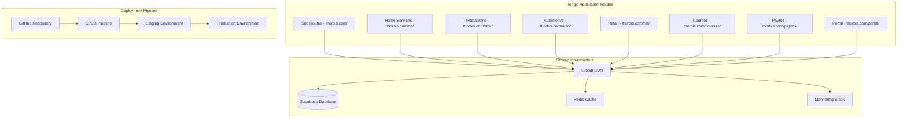

# Application Deployment Guide

This comprehensive guide covers the deployment procedures, strategies, and best practices for deploying Thorbis Business OS applications across all environments with zero-downtime and optimal performance.

## Deployment Overview

### Single Application Architecture

Thorbis Business OS uses a single Next.js 15 application architecture that serves different industry verticals through route-based separation while sharing common infrastructure and services.



### Deployment Strategy

#### NextFaster Deployment Principles
```typescript
// Deployment configuration aligned with NextFaster doctrine
interface NextFasterDeployment {
  performance: {
    timeToInteractive: '300ms' // Sub-300ms TTI target
    javascriptBudget: '170KB' // Maximum JS bundle size
    cacheStrategy: 'aggressive' // Edge caching with SWR
    prefetching: 'intelligent' // Link hover prefetching
  }
  
  reliability: {
    deploymentStrategy: 'blue-green' // Zero-downtime deployments
    rollbackTime: '60s' // Maximum rollback duration
    healthChecks: 'comprehensive' // Multi-layer health validation
    monitoring: 'real-time' // Continuous performance monitoring
  }
  
  scalability: {
    autoScaling: 'enabled' // Automatic scaling based on load
    edgeDistribution: 'global' // Worldwide edge distribution
    caching: 'multi-tier' // Browser, CDN, and server caching
    optimization: 'continuous' // Ongoing performance optimization
  }
}
```

## Single Application Deployment

### Unified Application Configuration

#### Application Deployment Configuration
```typescript
// deployment.config.ts
export const deploymentConfig = {
  name: 'thorbis-business-os',
  domain: 'thorbis.com',
  type: 'unified-application',
  
  build: {
    command: 'npm run build',
    outputDirectory: '.next',
    nodeVersion: '20.x',
    environmentVariables: {
      NEXT_PUBLIC_APP_ENV: process.env.VERCEL_ENV,
      NEXT_PUBLIC_SITE_URL: 'https://thorbis.com',
      NEXT_PUBLIC_API_BASE_URL: 'https://thorbis.com/api'
    }
  },
  
  deployment: {
    strategy: 'app-router-optimized',
    regions: ['global'],
    edgeFunctions: ['middleware', 'api-routes'],
    routes: {
      marketing: '/',
      homeServices: '/hs',
      restaurant: '/rest',
      automotive: '/auto',
      retail: '/ret',
      courses: '/courses',
      payroll: '/payroll',
      portal: '/portal'
    },
    caching: {
      static: '31536000', // 1 year
      dynamic: '3600', // 1 hour
      api: '300' // 5 minutes
    }
  },
  
  performance: {
    budgets: {
      javascript: '170KB', // NextFaster budget
      css: '50KB',
      images: 'optimized',
      fonts: 'subset'
    },
    optimizations: {
      imageOptimization: true,
      fontOptimization: true,
      bundleAnalysis: true,
      compressionLevel: 'maximum'
    }
  }
}
```

#### Application Deployment Script
```bash
#!/bin/bash
# scripts/deploy-app.sh

set -e

echo "🚀 Deploying Thorbis Business OS Application..."

# Environment validation
if [ -z "$VERCEL_PROJECT_ID" ]; then
    echo "❌ VERCEL_PROJECT_ID environment variable not set"
    exit 1
fi

# Pre-deployment checks
echo "🔍 Running pre-deployment checks..."
cd apps/site

# Type checking
echo "📝 Type checking..."
pnpm type-check

# Linting
echo "🔧 Linting..."
pnpm lint

# Testing
echo "🧪 Running tests..."
pnpm test:unit

# Bundle analysis
echo "📊 Analyzing bundle size..."
BUNDLE_SIZE=$(pnpm analyze:bundle --json | jq '.javascript.size')
MAX_SIZE=102400 # 100KB in bytes

if [ "$BUNDLE_SIZE" -gt "$MAX_SIZE" ]; then
    echo "❌ Bundle size exceeds limit: ${BUNDLE_SIZE} bytes > ${MAX_SIZE} bytes"
    exit 1
fi

# Performance audit
echo "⚡ Running performance audit..."
pnpm audit:performance

# Security scan
echo "🛡️  Running security scan..."
pnpm audit:security

# Deploy to Vercel
echo "🚀 Deploying to Vercel..."
vercel deploy \
    --prod \
    --project-id="$VERCEL_PROJECT_ID_SITE" \
    --build-env NEXT_PUBLIC_APP_ENV="production" \
    --build-env NEXT_PUBLIC_SITE_URL="https://thorbis.com"

# Post-deployment validation
echo "✅ Running post-deployment validation..."
./scripts/validate-deployment.sh site

echo "🎉 Site deployment completed successfully!"
```

### Industry Applications (HS, Rest, Auto, Ret)

#### Industry App Deployment Configuration
```typescript
// shared/deployment/industry-app.config.ts
interface IndustryAppConfig {
  industry: 'hs' | 'rest' | 'auto' | 'ret'
  route: string
  name: string
  specialFeatures: string[]
}

export const industryAppsConfig: Record<string, IndustryAppConfig> = {
  hs: {
    industry: 'hs',
    route: '/hs',
    name: 'Home Services',
    specialFeatures: ['work-orders', 'dispatch', 'scheduling', 'invoicing']
  },
  rest: {
    industry: 'rest',
    route: '/rest',
    name: 'Restaurant',
    specialFeatures: ['pos', 'kds', 'reservations', 'inventory']
  },
  auto: {
    industry: 'auto',
    route: '/auto',
    name: 'Automotive',
    specialFeatures: ['repair-orders', 'estimates', 'parts', 'bays']
  },
  ret: {
    industry: 'ret',
    route: '/ret',
    name: 'Retail',
    specialFeatures: ['pos', 'inventory', 'customers', 'orders']
  }
}

export function generateIndustryDeploymentConfig(industry: keyof typeof industryAppsConfig) {
  const config = industryAppsConfig[industry]
  
  return {
    name: `thorbis-${industry}`,
    domain: `thorbis.com${config.route}`,
    type: 'application',
    
    build: {
      command: `pnpm --filter @thorbis/${industry} build`,
      outputDirectory: `apps/${industry}/.next`,
      nodeVersion: '18.x',
      environmentVariables: {
        NEXT_PUBLIC_APP_ENV: process.env.VERCEL_ENV,
        NEXT_PUBLIC_INDUSTRY: industry,
        NEXT_PUBLIC_APP_NAME: config.name,
        NEXT_PUBLIC_API_BASE_URL: `https://thorbis.com/api/${industry}`
      }
    },
    
    deployment: {
      strategy: 'server-side-rendered',
      regions: ['global'],
      edgeFunctions: ['middleware', 'api-routes'],
      caching: {
        static: '86400', // 1 day
        dynamic: '300', // 5 minutes
        api: '60' // 1 minute
      }
    },
    
    performance: {
      budgets: {
        javascript: '170KB', // NextFaster budget
        css: '50KB',
        images: 'optimized',
        fonts: 'subset'
      },
      optimizations: {
        serverComponents: true,
        codesplitting: 'automatic',
        imageOptimization: true,
        prefetching: 'intelligent'
      }
    },
    
    database: {
      connectionPooling: true,
      readReplicas: process.env.NODE_ENV === 'production',
      caching: {
        strategy: 'redis',
        ttl: '300' // 5 minutes
      }
    }
  }
}
```

#### Multi-App Deployment Script
```bash
#!/bin/bash
# scripts/deploy-industry-apps.sh

set -e

APPS=("hs" "rest" "auto" "ret")
FAILED_DEPLOYMENTS=()

echo "🚀 Starting multi-app deployment process..."

# Function to deploy single app
deploy_app() {
    local app=$1
    echo "📦 Deploying $app application..."
    
    cd "apps/$app"
    
    # Run app-specific checks
    if ! pnpm type-check; then
        echo "❌ Type check failed for $app"
        return 1
    fi
    
    if ! pnpm lint; then
        echo "❌ Lint check failed for $app"
        return 1
    fi
    
    if ! pnpm test:unit; then
        echo "❌ Unit tests failed for $app"
        return 1
    fi
    
    # Build application
    if ! pnpm build; then
        echo "❌ Build failed for $app"
        return 1
    fi
    
    # Deploy to Vercel
    local project_id_var="VERCEL_PROJECT_ID_$(echo $app | tr '[:lower:]' '[:upper:]')"
    local project_id="${!project_id_var}"
    
    if [ -z "$project_id" ]; then
        echo "❌ Project ID not found for $app: $project_id_var"
        return 1
    fi
    
    if ! vercel deploy --prod --project-id="$project_id"; then
        echo "❌ Deployment failed for $app"
        return 1
    fi
    
    # Post-deployment validation
    if ! ../../scripts/validate-deployment.sh "$app"; then
        echo "❌ Post-deployment validation failed for $app"
        return 1
    fi
    
    echo "✅ $app deployment completed successfully"
    cd ../..
    return 0
}

# Deploy apps in parallel with error handling
for app in "${APPS[@]}"; do
    if deploy_app "$app"; then
        echo "✅ $app deployed successfully"
    else
        echo "❌ $app deployment failed"
        FAILED_DEPLOYMENTS+=("$app")
    fi &
done

# Wait for all deployments to complete
wait

# Check results
if [ ${#FAILED_DEPLOYMENTS[@]} -eq 0 ]; then
    echo "🎉 All applications deployed successfully!"
else
    echo "❌ Some deployments failed:"
    printf ' - %s\n' "${FAILED_DEPLOYMENTS[@]}"
    exit 1
fi
```

### Courses Application

#### Courses Deployment Configuration
```typescript
// apps/courses/deployment.config.ts
export const coursesDeploymentConfig = {
  name: 'thorbis-courses',
  domain: 'thorbis.com/courses',
  type: 'learning-platform',
  
  build: {
    command: 'pnpm --filter @thorbis/courses build',
    outputDirectory: 'apps/courses/.next',
    nodeVersion: '18.x',
    environmentVariables: {
      NEXT_PUBLIC_APP_ENV: process.env.VERCEL_ENV,
      NEXT_PUBLIC_SUPABASE_URL: process.env.NEXT_PUBLIC_SUPABASE_URL,
      NEXT_PUBLIC_SUPABASE_ANON_KEY: process.env.NEXT_PUBLIC_SUPABASE_ANON_KEY,
      // Additional course-specific variables
      NEXT_PUBLIC_VIDEO_CDN_URL: process.env.NEXT_PUBLIC_VIDEO_CDN_URL,
      NEXT_PUBLIC_CERTIFICATE_API_URL: process.env.NEXT_PUBLIC_CERTIFICATE_API_URL
    }
  },
  
  deployment: {
    strategy: 'hybrid', // Mix of SSR and SSG
    regions: ['global'],
    edgeFunctions: ['video-streaming', 'progress-tracking'],
    caching: {
      static: '2592000', // 30 days for course content
      dynamic: '300', // 5 minutes for user progress
      videos: '86400' // 1 day for video content
    }
  },
  
  features: {
    videoStreaming: {
      enabled: true,
      cdn: 'vercel-edge',
      adaptiveBitrate: true,
      subtitles: true
    },
    progressTracking: {
      realTime: true,
      offline: true,
      analytics: true
    },
    certificates: {
      generation: 'server-side',
      verification: 'blockchain',
      templates: 'dynamic'
    }
  }
}
```

### LOM Application (Subdomain)

#### LOM Deployment Configuration
```typescript
// apps/lom/deployment.config.ts
export const lomDeploymentConfig = {
  name: 'thorbis-lom',
  domain: 'lom.thorbis.com', // Only subdomain
  type: 'documentation',
  
  build: {
    command: 'pnpm --filter @thorbis/lom build',
    outputDirectory: 'apps/lom/.next',
    nodeVersion: '18.x',
    environmentVariables: {
      NEXT_PUBLIC_APP_ENV: process.env.VERCEL_ENV,
      NEXT_PUBLIC_LOM_API_URL: 'https://lom.thorbis.com/api',
      NEXT_PUBLIC_GITHUB_REPO: 'https://github.com/thorbis/lom-specifications'
    }
  },
  
  deployment: {
    strategy: 'static-generated', // Mostly static documentation
    regions: ['global'],
    edgeFunctions: ['api-explorer', 'validator'],
    caching: {
      static: '604800', // 1 week for documentation
      api: '3600', // 1 hour for API specs
      validator: '300' // 5 minutes for validation results
    }
  },
  
  features: {
    schemaValidation: {
      realTime: true,
      multiVersion: true,
      errorHighlighting: true
    },
    apiExplorer: {
      interactive: true,
      codeGeneration: true,
      authentication: false // Public API explorer
    },
    documentation: {
      searchable: true,
      versioned: true,
      exportable: true
    }
  }
}
```

## Advanced Deployment Strategies

### Blue-Green Deployment

#### Blue-Green Implementation
```typescript
// deployment/blue-green-deployer.ts
interface BlueGreenConfig {
  applications: string[]
  healthCheckTimeout: number
  rollbackTimeout: number
  trafficSwitchStrategy: 'immediate' | 'gradual'
}

class BlueGreenDeployer {
  private config: BlueGreenConfig
  private vercel: VercelClient
  
  constructor(config: BlueGreenConfig) {
    this.config = config
    this.vercel = new VercelClient(process.env.VERCEL_TOKEN!)
  }
  
  async deploy(): Promise<BlueGreenDeploymentResult> {
    console.log('🔄 Starting Blue-Green deployment...')
    
    const deploymentId = this.generateDeploymentId()
    
    try {
      // Phase 1: Deploy to Green environment
      const greenDeployment = await this.deployToGreen()
      
      // Phase 2: Health check Green environment
      await this.healthCheckGreen(greenDeployment)
      
      // Phase 3: Switch traffic to Green
      await this.switchTrafficToGreen(greenDeployment)
      
      // Phase 4: Validate production traffic
      await this.validateProductionTraffic(greenDeployment)
      
      // Phase 5: Decommission Blue environment
      await this.decommissionBlue()
      
      console.log('✅ Blue-Green deployment completed successfully')
      
      return {
        success: true,
        deploymentId,
        greenDeployment,
        switchTime: new Date().toISOString(),
        validationResults: await this.getValidationResults()
      }
      
    } catch (error) {
      console.error('❌ Blue-Green deployment failed:', error)
      
      // Automatic rollback to Blue
      await this.rollbackToBlue()
      
      throw new Error(`Blue-Green deployment failed: ${error.message}`)
    }
  }
  
  private async deployToGreen(): Promise<GreenDeployment> {
    console.log('🟢 Deploying to Green environment...')
    
    const deployments = new Map<string, VercelDeployment>()
    
    // Deploy all applications to Green slots
    for (const app of this.config.applications) {
      const deployment = await this.vercel.deploy({
        projectId: this.getProjectId(app),
        environment: 'green',
        alias: `green-${app}.thorbis.com`,
        buildCommand: this.getBuildCommand(app),
        environmentVariables: this.getEnvironmentVariables(app, 'green')
      })
      
      deployments.set(app, deployment)
      console.log(`✅ ${app} deployed to Green: ${deployment.url}`)
    }
    
    return {
      id: this.generateGreenId(),
      deployments,
      timestamp: new Date().toISOString(),
      status: 'deployed'
    }
  }
  
  private async healthCheckGreen(green: GreenDeployment): Promise<void> {
    console.log('🏥 Running health checks on Green environment...')
    
    const healthChecks = []
    
    for (const [app, deployment] of green.deployments) {
      healthChecks.push(this.performAppHealthCheck(app, deployment.url))
    }
    
    const results = await Promise.allSettled(healthChecks)
    const failures = results.filter(r => r.status === 'rejected')
    
    if (failures.length > 0) {
      throw new Error(`Health check failures: ${failures.length}/${results.length}`)
    }
    
    console.log('✅ All Green environment health checks passed')
  }
  
  private async switchTrafficToGreen(green: GreenDeployment): Promise<void> {
    console.log('🔀 Switching traffic to Green environment...')
    
    if (this.config.trafficSwitchStrategy === 'immediate') {
      await this.immediateTrafficSwitch(green)
    } else {
      await this.gradualTrafficSwitch(green)
    }
    
    console.log('✅ Traffic switched to Green environment')
  }
  
  private async immediateTrafficSwitch(green: GreenDeployment): Promise<void> {
    // Update DNS/CDN to point to Green environment
    for (const [app, deployment] of green.deployments) {
      await this.vercel.updateAlias({
        deploymentId: deployment.id,
        alias: this.getProductionAlias(app)
      })
      
      console.log(`🔀 ${app} traffic switched to Green`)
    }
  }
  
  private async gradualTrafficSwitch(green: GreenDeployment): Promise<void> {
    const trafficSteps = [10, 25, 50, 75, 100] // Percentage steps
    
    for (const percentage of trafficSteps) {
      console.log(`🔀 Switching ${percentage}% traffic to Green...`)
      
      for (const [app, deployment] of green.deployments) {
        await this.vercel.updateTrafficSplit({
          projectId: this.getProjectId(app),
          rules: [
            { percentage: 100 - percentage, target: 'blue' },
            { percentage: percentage, target: 'green' }
          ]
        })
      }
      
      // Wait and monitor for issues
      await this.sleep(30000) // 30 seconds
      await this.monitorTrafficHealth()
    }
  }
  
  private async performAppHealthCheck(app: string, url: string): Promise<HealthCheckResult> {
    const healthChecks = [
      this.checkHttpResponse(url),
      this.checkDatabaseConnectivity(app),
      this.checkAPIEndpoints(app, url),
      this.checkPerformanceMetrics(url)
    ]
    
    const results = await Promise.allSettled(healthChecks)
    const failures = results.filter(r => r.status === 'rejected')
    
    return {
      app,
      healthy: failures.length === 0,
      checks: results.length,
      failures: failures.length,
      details: results
    }
  }
}
```

### Canary Deployment

#### Canary Deployment Strategy
```typescript
// deployment/canary-deployer.ts
interface CanaryConfig {
  applications: string[]
  trafficPercentage: number[]
  validationThresholds: ValidationThresholds
  rollbackTriggers: RollbackTrigger[]
}

class CanaryDeployer {
  private config: CanaryConfig
  private metrics: MetricsCollector
  
  constructor(config: CanaryConfig) {
    this.config = config
    this.metrics = new MetricsCollector()
  }
  
  async deploy(): Promise<CanaryDeploymentResult> {
    console.log('🐤 Starting Canary deployment...')
    
    try {
      // Deploy Canary version
      const canaryDeployment = await this.deployCanaryVersion()
      
      // Gradual traffic rollout with monitoring
      const rolloutResult = await this.graduallRollout(canaryDeployment)
      
      // Final validation and full rollout
      await this.validateAndCompleteRollout(canaryDeployment)
      
      console.log('✅ Canary deployment completed successfully')
      
      return {
        success: true,
        canaryDeployment,
        rolloutResult,
        finalMetrics: await this.metrics.getFinalReport()
      }
      
    } catch (error) {
      console.error('❌ Canary deployment failed:', error)
      await this.rollbackCanary()
      throw error
    }
  }
  
  private async graduallRollout(canary: CanaryDeployment): Promise<RolloutResult> {
    const rolloutSteps = this.config.trafficPercentage
    
    for (const percentage of rolloutSteps) {
      console.log(`🐤 Rolling out to ${percentage}% of traffic...`)
      
      // Update traffic split
      await this.updateTrafficSplit(canary, percentage)
      
      // Monitor for specified duration
      const monitoringResult = await this.monitorCanaryHealth(percentage)
      
      // Check rollback triggers
      if (this.shouldRollback(monitoringResult)) {
        throw new Error(`Canary rollback triggered at ${percentage}%: ${monitoringResult.trigger}`)
      }
      
      console.log(`✅ ${percentage}% rollout successful`)
    }
    
    return {
      steps: rolloutSteps.length,
      finalPercentage: rolloutSteps[rolloutSteps.length - 1],
      healthMetrics: await this.metrics.getHealthSummary()
    }
  }
  
  private async monitorCanaryHealth(percentage: number): Promise<CanaryHealthResult> {
    const monitoringDuration = this.calculateMonitoringDuration(percentage)
    const startTime = Date.now()
    
    while (Date.now() - startTime < monitoringDuration) {
      const metrics = await this.collectMetrics()
      
      // Check for immediate rollback triggers
      for (const trigger of this.config.rollbackTriggers) {
        if (this.evaluateTrigger(trigger, metrics)) {
          return {
            healthy: false,
            trigger: trigger.name,
            metrics,
            duration: Date.now() - startTime
          }
        }
      }
      
      await this.sleep(5000) // Check every 5 seconds
    }
    
    return {
      healthy: true,
      metrics: await this.collectMetrics(),
      duration: monitoringDuration
    }
  }
}
```

## Environment-Specific Configurations

### Production Environment

#### Production Deployment Configuration
```typescript
// deployment/production.config.ts
export const productionConfig = {
  environment: 'production',
  
  infrastructure: {
    hosting: {
      provider: 'vercel',
      plan: 'enterprise',
      regions: [
        'iad1', // Washington, D.C.
        'fra1', // Frankfurt
        'nrt1', // Tokyo
        'syd1', // Sydney
        'pdx1', // Portland
        'sfo1', // San Francisco
      ]
    },
    
    database: {
      provider: 'supabase',
      plan: 'pro',
      instances: {
        primary: 'us-east-1',
        readReplicas: ['us-west-2', 'eu-west-1', 'ap-southeast-1']
      },
      connectionPooling: {
        enabled: true,
        maxConnections: 100,
        poolMode: 'transaction'
      }
    },
    
    caching: {
      cdn: {
        provider: 'vercel-edge',
        regions: 'global',
        cacheHeaders: {
          static: 'public, max-age=31536000, immutable',
          dynamic: 'public, max-age=300, s-maxage=300',
          api: 'public, max-age=60, s-maxage=60'
        }
      },
      
      redis: {
        provider: 'upstash',
        plan: 'professional',
        regions: ['us-east-1', 'eu-west-1'],
        clustering: true
      }
    }
  },
  
  security: {
    ssl: {
      enforced: true,
      hsts: 'max-age=31536000; includeSubDomains; preload',
      protocols: ['TLSv1.2', 'TLSv1.3']
    },
    
    headers: {
      'Content-Security-Policy': `
        default-src 'self';
        script-src 'self' 'unsafe-inline' 'unsafe-eval' https://va.vercel-scripts.com;
        style-src 'self' 'unsafe-inline' https://fonts.googleapis.com;
        img-src 'self' data: https: blob:;
        font-src 'self' https://fonts.gstatic.com;
        connect-src 'self' https://*.supabase.co https://*.anthropic.com;
        frame-ancestors 'none';
      `.replace(/\s+/g, ' ').trim(),
      
      'Strict-Transport-Security': 'max-age=31536000; includeSubDomains; preload',
      'X-Frame-Options': 'DENY',
      'X-Content-Type-Options': 'nosniff',
      'Referrer-Policy': 'strict-origin-when-cross-origin',
      'Permissions-Policy': 'camera=(), microphone=(), geolocation=()'
    },
    
    rateLimiting: {
      global: '10000/15m',
      api: '1000/15m',
      auth: '5/1m'
    }
  },
  
  monitoring: {
    apm: {
      provider: 'sentry',
      sampleRate: 0.1,
      tracing: true,
      performanceMonitoring: true
    },
    
    metrics: {
      provider: 'datadog',
      customMetrics: true,
      logAggregation: true,
      alerting: true
    },
    
    uptime: {
      provider: 'uptime-robot',
      checkInterval: '1m',
      locations: ['global'],
      alertChannels: ['slack', 'email', 'sms']
    }
  },
  
  performance: {
    budgets: {
      javascript: '170KB',
      css: '50KB',
      images: 'optimized',
      fonts: 'subset'
    },
    
    optimization: {
      compression: 'brotli',
      minification: true,
      bundleAnalysis: true,
      imageOptimization: {
        formats: ['avif', 'webp', 'jpeg'],
        quality: 85,
        sizes: [640, 768, 1024, 1280, 1920]
      }
    }
  }
}
```

### Staging Environment

#### Staging Deployment Configuration
```typescript
// deployment/staging.config.ts
export const stagingConfig = {
  environment: 'staging',
  
  infrastructure: {
    hosting: {
      provider: 'vercel',
      plan: 'pro',
      regions: ['iad1'] // Single region for staging
    },
    
    database: {
      provider: 'supabase',
      plan: 'pro',
      instances: {
        primary: 'us-east-1'
        // No read replicas for staging
      },
      connectionPooling: {
        enabled: true,
        maxConnections: 50
      }
    }
  },
  
  testing: {
    e2e: {
      enabled: true,
      browsers: ['chromium', 'firefox', 'webkit'],
      devices: ['desktop', 'mobile'],
      parallelization: true
    },
    
    performance: {
      lighthouse: {
        enabled: true,
        thresholds: {
          performance: 90,
          accessibility: 100,
          bestPractices: 90,
          seo: 90
        }
      },
      
      loadTesting: {
        enabled: true,
        scenarios: ['normal', 'peak', 'stress'],
        duration: '5m'
      }
    },
    
    security: {
      scanning: {
        enabled: true,
        tools: ['snyk', 'owasp-zap'],
        schedule: 'on-deploy'
      }
    }
  },
  
  validation: {
    healthChecks: {
      timeout: '30s',
      retries: 3,
      endpoints: [
        '/api/health',
        '/api/hs/health',
        '/api/rest/health',
        '/api/auto/health',
        '/api/ret/health'
      ]
    },
    
    smoke: {
      enabled: true,
      scenarios: [
        'user-authentication',
        'basic-navigation',
        'api-connectivity',
        'database-connection'
      ]
    }
  }
}
```

## Deployment Automation

### CI/CD Pipeline Integration

#### Automated Deployment Workflow
```yaml
# .github/workflows/deployment.yml
name: Automated Deployment Pipeline

on:
  push:
    branches: [main]
  pull_request:
    branches: [main]

env:
  NODE_VERSION: '18.x'
  PNPM_VERSION: '8.x'

jobs:
  changes:
    name: Detect Changes
    runs-on: ubuntu-latest
    outputs:
      apps: ${{ steps.changes.outputs.changes }}
    steps:
      - uses: actions/checkout@v4
      - uses: dorny/paths-filter@v2
        id: changes
        with:
          filters: |
            site: 'apps/site/**'
            hs: 'apps/hs/**'
            rest: 'apps/rest/**'
            auto: 'apps/auto/**'
            ret: 'apps/ret/**'
            courses: 'apps/courses/**'
            payroll: 'apps/payroll/**'
            lom: 'apps/lom/**'
            packages: 'packages/**'

  validate:
    name: Validate Applications
    runs-on: ubuntu-latest
    needs: changes
    if: ${{ needs.changes.outputs.apps != '[]' }}
    strategy:
      matrix:
        app: ${{ fromJSON(needs.changes.outputs.apps) }}
    steps:
      - name: Checkout
        uses: actions/checkout@v4
      
      - name: Setup Node.js
        uses: actions/setup-node@v4
        with:
          node-version: ${{ env.NODE_VERSION }}
      
      - name: Setup pnpm
        uses: pnpm/action-setup@v2
        with:
          version: ${{ env.PNPM_VERSION }}
      
      - name: Get pnpm store directory
        id: pnpm-cache
        shell: bash
        run: echo "STORE_PATH=$(pnpm store path)" >> $GITHUB_OUTPUT
      
      - name: Setup pnpm cache
        uses: actions/cache@v3
        with:
          path: ${{ steps.pnpm-cache.outputs.STORE_PATH }}
          key: ${{ runner.os }}-pnpm-store-${{ hashFiles('**/pnpm-lock.yaml') }}
          restore-keys: ${{ runner.os }}-pnpm-store-
      
      - name: Install dependencies
        run: pnpm install --frozen-lockfile
      
      - name: Type Check
        run: pnpm --filter @thorbis/${{ matrix.app }} type-check
      
      - name: Lint
        run: pnpm --filter @thorbis/${{ matrix.app }} lint
      
      - name: Test
        run: pnpm --filter @thorbis/${{ matrix.app }} test:unit
      
      - name: Build
        run: pnpm --filter @thorbis/${{ matrix.app }} build
        env:
          NEXT_PUBLIC_APP_ENV: ${{ github.ref == 'refs/heads/main' && 'production' || 'staging' }}
      
      - name: Bundle Analysis
        run: pnpm --filter @thorbis/${{ matrix.app }} analyze:bundle

  deploy-staging:
    name: Deploy to Staging
    runs-on: ubuntu-latest
    needs: [changes, validate]
    if: github.event_name == 'pull_request'
    environment: staging
    strategy:
      matrix:
        app: ${{ fromJSON(needs.changes.outputs.apps) }}
    steps:
      - name: Checkout
        uses: actions/checkout@v4
      
      - name: Deploy to Staging
        uses: amondnet/vercel-action@v25
        with:
          vercel-token: ${{ secrets.VERCEL_TOKEN }}
          vercel-org-id: ${{ secrets.VERCEL_ORG_ID }}
          vercel-project-id: ${{ secrets[format('VERCEL_PROJECT_ID_{0}', upper(matrix.app))] }}
          working-directory: apps/${{ matrix.app }}
          scope: ${{ secrets.VERCEL_ORG_ID }}
          alias-domains: staging-${{ matrix.app }}.thorbis.com
      
      - name: Run E2E Tests
        run: |
          pnpm --filter @thorbis/${{ matrix.app }} test:e2e
        env:
          E2E_BASE_URL: https://staging-${{ matrix.app }}.thorbis.com
      
      - name: Performance Audit
        run: |
          pnpm --filter @thorbis/${{ matrix.app }} audit:performance
        env:
          AUDIT_URL: https://staging-${{ matrix.app }}.thorbis.com

  deploy-production:
    name: Deploy to Production
    runs-on: ubuntu-latest
    needs: [changes, validate]
    if: github.ref == 'refs/heads/main'
    environment: production
    strategy:
      matrix:
        app: ${{ fromJSON(needs.changes.outputs.apps) }}
    steps:
      - name: Checkout
        uses: actions/checkout@v4
      
      - name: Deploy to Production
        uses: amondnet/vercel-action@v25
        with:
          vercel-token: ${{ secrets.VERCEL_TOKEN }}
          vercel-org-id: ${{ secrets.VERCEL_ORG_ID }}
          vercel-project-id: ${{ secrets[format('VERCEL_PROJECT_ID_{0}', upper(matrix.app))] }}
          vercel-args: '--prod'
          working-directory: apps/${{ matrix.app }}
          scope: ${{ secrets.VERCEL_ORG_ID }}
      
      - name: Post-Deployment Validation
        run: |
          ./scripts/validate-production-deployment.sh ${{ matrix.app }}
      
      - name: Update Deployment Status
        run: |
          ./scripts/notify-deployment-success.sh ${{ matrix.app }}

  rollback:
    name: Rollback on Failure
    runs-on: ubuntu-latest
    needs: [deploy-production]
    if: failure() && github.ref == 'refs/heads/main'
    environment: production
    steps:
      - name: Checkout
        uses: actions/checkout@v4
      
      - name: Rollback Deployment
        run: |
          ./scripts/rollback-deployment.sh
        env:
          VERCEL_TOKEN: ${{ secrets.VERCEL_TOKEN }}
          ROLLBACK_TARGET: previous-stable
      
      - name: Notify Rollback
        run: |
          ./scripts/notify-rollback.sh
        env:
          SLACK_WEBHOOK: ${{ secrets.SLACK_WEBHOOK }}
```

## Post-Deployment Validation

### Comprehensive Validation Framework

#### Deployment Validation Suite
```typescript
// validation/deployment-validator.ts
interface ValidationSuite {
  healthChecks: HealthCheck[]
  performanceTests: PerformanceTest[]
  functionalTests: FunctionalTest[]
  securityScans: SecurityScan[]
}

class DeploymentValidator {
  private suite: ValidationSuite
  private apps: string[]
  
  constructor(apps: string[]) {
    this.apps = apps
    this.suite = this.buildValidationSuite()
  }
  
  async validateDeployment(): Promise<ValidationReport> {
    console.log('🔍 Starting post-deployment validation...')
    
    const results = new Map<string, AppValidationResult>()
    
    for (const app of this.apps) {
      console.log(`📋 Validating ${app} deployment...`)
      
      const appResult = await this.validateApp(app)
      results.set(app, appResult)
      
      if (!appResult.passed) {
        console.error(`❌ Validation failed for ${app}: ${appResult.failures.join(', ')}`)
      } else {
        console.log(`✅ ${app} validation passed`)
      }
    }
    
    const overallSuccess = Array.from(results.values()).every(r => r.passed)
    
    return {
      timestamp: new Date().toISOString(),
      overall: overallSuccess ? 'pass' : 'fail',
      applications: Object.fromEntries(results),
      summary: this.generateSummary(results)
    }
  }
  
  private async validateApp(app: string): Promise<AppValidationResult> {
    const baseUrl = this.getAppUrl(app)
    const results: ValidationResult[] = []
    
    // Health checks
    console.log(`🏥 Running health checks for ${app}...`)
    for (const check of this.suite.healthChecks) {
      const result = await this.runHealthCheck(baseUrl, check)
      results.push(result)
    }
    
    // Performance tests
    console.log(`⚡ Running performance tests for ${app}...`)
    for (const test of this.suite.performanceTests) {
      const result = await this.runPerformanceTest(baseUrl, test)
      results.push(result)
    }
    
    // Functional tests
    console.log(`🧪 Running functional tests for ${app}...`)
    for (const test of this.suite.functionalTests) {
      const result = await this.runFunctionalTest(baseUrl, test, app)
      results.push(result)
    }
    
    // Security scans
    console.log(`🛡️  Running security scans for ${app}...`)
    for (const scan of this.suite.securityScans) {
      const result = await this.runSecurityScan(baseUrl, scan)
      results.push(result)
    }
    
    const failures = results.filter(r => !r.passed)
    
    return {
      app,
      passed: failures.length === 0,
      totalTests: results.length,
      failures: failures.map(f => f.name),
      results,
      duration: this.calculateTotalDuration(results)
    }
  }
  
  private async runHealthCheck(baseUrl: string, check: HealthCheck): Promise<ValidationResult> {
    const startTime = Date.now()
    
    try {
      const response = await fetch(`${baseUrl}${check.endpoint}`, {
        timeout: check.timeout || 10000
      })
      
      if (!response.ok) {
        throw new Error(`HTTP ${response.status}: ${response.statusText}`)
      }
      
      const data = await response.json()
      const duration = Date.now() - startTime
      
      // Validate response structure
      if (check.expectedFields) {
        for (const field of check.expectedFields) {
          if (!(field in data)) {
            throw new Error(`Missing expected field: ${field}`)
          }
        }
      }
      
      return {
        name: check.name,
        type: 'health',
        passed: true,
        duration,
        details: { status: response.status, responseTime: duration }
      }
      
    } catch (error) {
      return {
        name: check.name,
        type: 'health',
        passed: false,
        duration: Date.now() - startTime,
        error: error.message
      }
    }
  }
  
  private async runPerformanceTest(baseUrl: string, test: PerformanceTest): Promise<ValidationResult> {
    console.log(`📊 Running performance test: ${test.name}`)
    
    const startTime = Date.now()
    
    try {
      // Use Lighthouse for performance testing
      const lighthouse = await import('lighthouse')
      const chromeLauncher = await import('chrome-launcher')
      
      const chrome = await chromeLauncher.launch({ chromeFlags: ['--headless'] })
      const options = {
        logLevel: 'info',
        output: 'json',
        onlyCategories: ['performance'],
        port: chrome.port
      }
      
      const runnerResult = await lighthouse(baseUrl + test.path, options)
      await chrome.kill()
      
      const performanceScore = runnerResult.lhr.categories.performance.score * 100
      const metrics = runnerResult.lhr.audits
      
      const passed = performanceScore >= test.minScore
      
      return {
        name: test.name,
        type: 'performance',
        passed,
        duration: Date.now() - startTime,
        details: {
          score: performanceScore,
          fcp: metrics['first-contentful-paint'].numericValue,
          lcp: metrics['largest-contentful-paint'].numericValue,
          cls: metrics['cumulative-layout-shift'].numericValue,
          tti: metrics['interactive'].numericValue
        }
      }
      
    } catch (error) {
      return {
        name: test.name,
        type: 'performance',
        passed: false,
        duration: Date.now() - startTime,
        error: error.message
      }
    }
  }
  
  private buildValidationSuite(): ValidationSuite {
    return {
      healthChecks: [
        {
          name: 'Basic Health Check',
          endpoint: '/api/health',
          timeout: 5000,
          expectedFields: ['status', 'timestamp', 'version']
        },
        {
          name: 'Database Connectivity',
          endpoint: '/api/health/database',
          timeout: 10000,
          expectedFields: ['connected', 'responseTime']
        },
        {
          name: 'External Services',
          endpoint: '/api/health/external',
          timeout: 15000,
          expectedFields: ['services']
        }
      ],
      
      performanceTests: [
        {
          name: 'Homepage Performance',
          path: '/',
          minScore: 90,
          maxLoadTime: 2000
        },
        {
          name: 'App Dashboard Performance',
          path: '/dashboard',
          minScore: 85,
          maxLoadTime: 3000
        }
      ],
      
      functionalTests: [
        {
          name: 'User Authentication Flow',
          scenario: 'authentication',
          steps: ['login-page', 'login-submit', 'dashboard-redirect']
        },
        {
          name: 'API Endpoints',
          scenario: 'api-tests',
          endpoints: ['/api/businesses', '/api/users', '/api/health']
        }
      ],
      
      securityScans: [
        {
          name: 'Security Headers',
          checks: ['csp', 'hsts', 'x-frame-options', 'x-content-type-options']
        },
        {
          name: 'SSL Configuration',
          checks: ['certificate-validity', 'tls-version', 'cipher-strength']
        }
      ]
    }
  }
}
```

## Monitoring and Alerting

### Post-Deployment Monitoring

#### Deployment Monitoring Setup
```typescript
// monitoring/deployment-monitor.ts
interface DeploymentMonitoringConfig {
  applications: string[]
  monitoring: {
    healthCheck: {
      interval: number
      timeout: number
      retries: number
    }
    performance: {
      interval: number
      thresholds: PerformanceThresholds
    }
    errorTracking: {
      enabled: boolean
      sampleRate: number
    }
  }
  alerting: {
    channels: AlertChannel[]
    escalation: EscalationPolicy
  }
}

class DeploymentMonitor {
  private config: DeploymentMonitoringConfig
  private monitors: Map<string, AppMonitor>
  private alertManager: AlertManager
  
  constructor(config: DeploymentMonitoringConfig) {
    this.config = config
    this.monitors = new Map()
    this.alertManager = new AlertManager(config.alerting)
    
    this.initializeMonitors()
  }
  
  async startMonitoring(): Promise<void> {
    console.log('📡 Starting deployment monitoring...')
    
    for (const [app, monitor] of this.monitors) {
      console.log(`🔍 Starting monitor for ${app}...`)
      await monitor.start()
    }
    
    // Start alert manager
    await this.alertManager.start()
    
    console.log('✅ All deployment monitors started')
  }
  
  async stopMonitoring(): Promise<MonitoringReport> {
    console.log('🛑 Stopping deployment monitoring...')
    
    const reports = new Map<string, AppMonitoringReport>()
    
    for (const [app, monitor] of this.monitors) {
      const report = await monitor.stop()
      reports.set(app, report)
    }
    
    await this.alertManager.stop()
    
    return {
      timestamp: new Date().toISOString(),
      applications: Object.fromEntries(reports),
      summary: this.generateMonitoringSummary(reports)
    }
  }
  
  private initializeMonitors(): void {
    for (const app of this.config.applications) {
      const monitor = new AppMonitor({
        app,
        baseUrl: this.getAppUrl(app),
        healthCheck: this.config.monitoring.healthCheck,
        performance: this.config.monitoring.performance,
        onAlert: (alert) => this.alertManager.trigger(alert)
      })
      
      this.monitors.set(app, monitor)
    }
  }
}

class AppMonitor {
  private config: AppMonitorConfig
  private healthCheckInterval: NodeJS.Timeout | null = null
  private performanceInterval: NodeJS.Timeout | null = null
  private metrics: AppMetrics
  
  constructor(config: AppMonitorConfig) {
    this.config = config
    this.metrics = new AppMetrics()
  }
  
  async start(): Promise<void> {
    // Start health checking
    this.healthCheckInterval = setInterval(
      () => this.performHealthCheck(),
      this.config.healthCheck.interval
    )
    
    // Start performance monitoring
    this.performanceInterval = setInterval(
      () => this.checkPerformance(),
      this.config.performance.interval
    )
    
    // Initial health check
    await this.performHealthCheck()
  }
  
  async stop(): Promise<AppMonitoringReport> {
    if (this.healthCheckInterval) {
      clearInterval(this.healthCheckInterval)
      this.healthCheckInterval = null
    }
    
    if (this.performanceInterval) {
      clearInterval(this.performanceInterval)
      this.performanceInterval = null
    }
    
    return this.generateReport()
  }
  
  private async performHealthCheck(): Promise<void> {
    try {
      const startTime = Date.now()
      const response = await fetch(`${this.config.baseUrl}/api/health`, {
        timeout: this.config.healthCheck.timeout
      })
      
      const responseTime = Date.now() - startTime
      const healthy = response.ok
      
      this.metrics.recordHealthCheck({
        timestamp: new Date().toISOString(),
        healthy,
        responseTime,
        statusCode: response.status
      })
      
      if (!healthy) {
        await this.config.onAlert({
          type: 'health',
          app: this.config.app,
          message: `Health check failed: HTTP ${response.status}`,
          severity: 'high',
          timestamp: new Date().toISOString()
        })
      }
      
    } catch (error) {
      this.metrics.recordHealthCheck({
        timestamp: new Date().toISOString(),
        healthy: false,
        error: error.message
      })
      
      await this.config.onAlert({
        type: 'health',
        app: this.config.app,
        message: `Health check error: ${error.message}`,
        severity: 'critical',
        timestamp: new Date().toISOString()
      })
    }
  }
  
  private async checkPerformance(): Promise<void> {
    try {
      const metrics = await this.collectPerformanceMetrics()
      
      this.metrics.recordPerformance(metrics)
      
      // Check against thresholds
      const violations = this.checkPerformanceThresholds(metrics)
      
      if (violations.length > 0) {
        await this.config.onAlert({
          type: 'performance',
          app: this.config.app,
          message: `Performance thresholds exceeded: ${violations.join(', ')}`,
          severity: 'medium',
          timestamp: new Date().toISOString(),
          details: metrics
        })
      }
      
    } catch (error) {
      console.error(`Performance monitoring error for ${this.config.app}:`, error)
    }
  }
  
  private async collectPerformanceMetrics(): Promise<PerformanceMetrics> {
    // Collect various performance metrics
    const startTime = Date.now()
    
    // Response time test
    const response = await fetch(this.config.baseUrl)
    const responseTime = Date.now() - startTime
    
    // Memory usage (if available)
    const memoryUsage = await this.getMemoryUsage()
    
    // Error rate
    const errorRate = await this.getErrorRate()
    
    return {
      timestamp: new Date().toISOString(),
      responseTime,
      memoryUsage,
      errorRate,
      statusCode: response.status
    }
  }
}
```

## Troubleshooting Deployment Issues

### Common Deployment Problems

#### Deployment Troubleshooting Guide
```bash
#!/bin/bash
# troubleshooting/deployment-issues.sh

echo "🔧 Deployment Troubleshooting Guide"
echo "==================================="

# Function to check deployment status
check_deployment_status() {
    local app=$1
    echo "🔍 Checking deployment status for $app..."
    
    # Check Vercel deployment status
    DEPLOYMENT_STATUS=$(vercel ls --scope=$VERCEL_ORG_ID | grep $app | head -1 | awk '{print $3}')
    echo "📊 Current status: $DEPLOYMENT_STATUS"
    
    if [ "$DEPLOYMENT_STATUS" != "READY" ]; then
        echo "⚠️  Deployment not ready, checking logs..."
        vercel logs --scope=$VERCEL_ORG_ID $(vercel ls --scope=$VERCEL_ORG_ID | grep $app | head -1 | awk '{print $1}')
    fi
}

# Function to check build errors
check_build_errors() {
    local app=$1
    echo "🔍 Checking build errors for $app..."
    
    cd "apps/$app"
    
    # Check if build succeeds locally
    if ! pnpm build; then
        echo "❌ Local build failed for $app"
        echo "💡 Common solutions:"
        echo "   - Check TypeScript errors: pnpm type-check"
        echo "   - Check linting errors: pnpm lint"
        echo "   - Check dependency issues: pnpm install"
        echo "   - Check environment variables"
        return 1
    else
        echo "✅ Local build successful"
    fi
    
    cd ../..
}

# Function to check environment variables
check_environment_variables() {
    local app=$1
    echo "🔍 Checking environment variables for $app..."
    
    local project_id_var="VERCEL_PROJECT_ID_$(echo $app | tr '[:lower:]' '[:upper:]')"
    local project_id="${!project_id_var}"
    
    if [ -z "$project_id" ]; then
        echo "❌ Project ID not found: $project_id_var"
        return 1
    fi
    
    # List environment variables
    vercel env ls production --project-id="$project_id"
}

# Function to check performance issues
check_performance_issues() {
    local app=$1
    echo "🔍 Checking performance issues for $app..."
    
    cd "apps/$app"
    
    # Check bundle size
    echo "📦 Analyzing bundle size..."
    if command -v webpack-bundle-analyzer &> /dev/null; then
        pnpm analyze:bundle
    fi
    
    # Check for large dependencies
    echo "📊 Checking large dependencies..."
    pnpm ls --depth=0 | sort -k2 -nr
    
    cd ../..
}

# Function to check health endpoints
check_health_endpoints() {
    local app=$1
    local base_url="https://$app.thorbis.com"
    
    if [ "$app" = "site" ]; then
        base_url="https://thorbis.com"
    fi
    
    echo "🔍 Checking health endpoints for $app at $base_url..."
    
    # Check main health endpoint
    if curl -f -s "$base_url/api/health" > /dev/null; then
        echo "✅ Main health endpoint responding"
    else
        echo "❌ Main health endpoint not responding"
        curl -v "$base_url/api/health" || true
    fi
    
    # Check app-specific health endpoint
    if [ "$app" != "site" ]; then
        if curl -f -s "$base_url/api/$app/health" > /dev/null; then
            echo "✅ App-specific health endpoint responding"
        else
            echo "❌ App-specific health endpoint not responding"
        fi
    fi
}

# Main troubleshooting routine
troubleshoot_deployment() {
    local app=${1:-"all"}
    
    if [ "$app" = "all" ]; then
        APPS=("site" "hs" "rest" "auto" "ret" "courses" "payroll" "lom")
    else
        APPS=("$app")
    fi
    
    for app_name in "${APPS[@]}"; do
        echo "🔧 Troubleshooting $app_name..."
        echo "================================"
        
        check_deployment_status "$app_name"
        check_build_errors "$app_name"
        check_environment_variables "$app_name"
        check_performance_issues "$app_name"
        check_health_endpoints "$app_name"
        
        echo ""
    done
}

# Run troubleshooting
troubleshoot_deployment "$1"

echo "✅ Troubleshooting completed"
echo ""
echo "💡 Additional debugging steps:"
echo "   - Check GitHub Actions logs"
echo "   - Review Vercel deployment logs"
echo "   - Check Supabase connectivity"
echo "   - Verify DNS configuration"
echo "   - Review error monitoring (Sentry)"
```

## Next Steps

After completing application deployment:

1. **[Security Hardening](./06-security-hardening.md)**: Implement production security measures
2. **[Monitoring and Observability](./07-monitoring-observability.md)**: Set up comprehensive monitoring
3. **[Backup and Recovery](./08-backup-recovery.md)**: Establish backup and recovery procedures
4. **[Troubleshooting and Maintenance](./09-troubleshooting-maintenance.md)**: Ongoing maintenance procedures

## Deployment Resources

### Documentation References
- **Vercel Deployment**: Platform-specific deployment optimization
- **Next.js Deployment**: Application deployment best practices
- **Performance Monitoring**: Real-time deployment monitoring
- **Security Configuration**: Production security hardening

### Tools and Utilities
- **Deployment Scripts**: Automated deployment procedures
- **Validation Suites**: Comprehensive post-deployment testing
- **Monitoring Tools**: Real-time deployment health monitoring
- **Troubleshooting Guides**: Common issue resolution procedures

---

*Last Updated: 2025-01-31*  
*Version: 1.0.0*  
*Previous: [Database Migration](./04-database-migration.md) | Next: [Security Hardening](./06-security-hardening.md)*