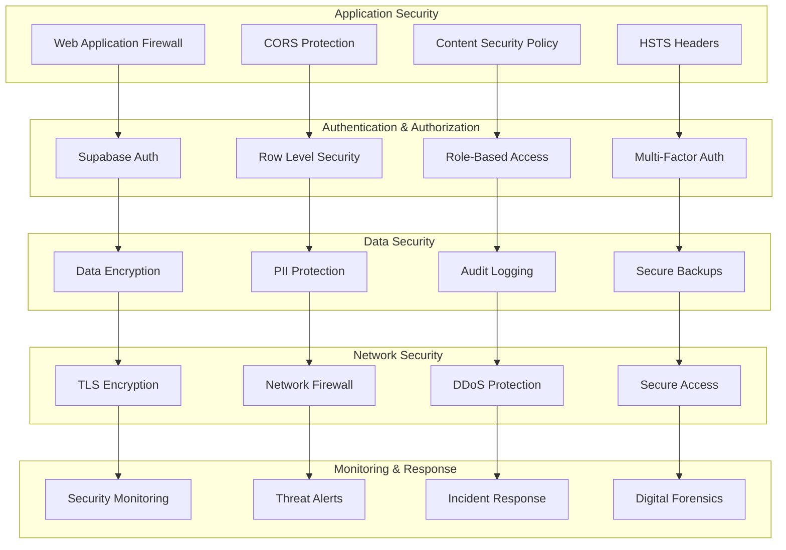

# Security Hardening Guide

This comprehensive guide covers production security configuration, hardening procedures, and security best practices for Thorbis Business OS deployments across all environments.

## Security Overview

### Security-First Architecture

Thorbis Business OS implements a defense-in-depth security strategy with multiple layers of protection, comprehensive monitoring, and proactive threat detection.



### Security Principles

#### Zero Trust Security Model
```typescript
// Security principles implementation
const securityPrinciples = {
  zeroTrust: {
    principle: 'Never trust, always verify',
    implementation: {
      authentication: 'Multi-factor authentication required',
      authorization: 'Least privilege access control',
      networkAccess: 'Encrypted and verified connections only',
      dataAccess: 'Row-level security and encryption'
    }
  },
  
  defenseInDepth: {
    principle: 'Multiple layers of security controls',
    layers: [
      'Network perimeter security',
      'Application security controls',
      'Database security policies',
      'Data encryption and protection',
      'Monitoring and detection systems'
    ]
  },
  
  securityByDesign: {
    principle: 'Security built into architecture from the ground up',
    implementation: {
      codeReview: 'Security-focused code review process',
      testing: 'Automated security testing in CI/CD',
      monitoring: 'Real-time security monitoring',
      compliance: 'Built-in compliance frameworks'
    }
  },
  
  continuousCompliance: {
    principle: 'Ongoing compliance monitoring and validation',
    frameworks: ['SOC 2 Type II', 'GDPR', 'CCPA', 'HIPAA'],
    validation: 'Automated compliance checks and reporting'
  }
}
```

## Network Security Hardening

### Web Application Firewall (WAF)

#### Vercel WAF Configuration
```typescript
// security/waf-config.ts
interface WAFRule {
  id: string
  description: string
  conditions: WAFCondition[]
  action: 'block' | 'challenge' | 'log' | 'allow'
  priority: number
}

export const wafConfiguration: WAFRule[] = [
  {
    id: 'sql-injection-protection',
    description: 'Block SQL injection attempts',
    conditions: [
      {
        field: 'uri.query',
        operator: 'contains',
        value: ['union select', 'drop table', 'exec(', '0x', 'char('],
        caseSensitive: false
      },
      {
        field: 'body',
        operator: 'contains',
        value: ['union select', 'information_schema', 'sys.tables'],
        caseSensitive: false
      }
    ],
    action: 'block',
    priority: 1
  },
  
  {
    id: 'xss-protection',
    description: 'Block cross-site scripting attempts',
    conditions: [
      {
        field: 'uri.query',
        operator: 'contains',
        value: ['<script', 'javascript:', 'onerror=', 'onload='],
        caseSensitive: false
      },
      {
        field: 'headers',
        operator: 'contains',
        value: ['<script', 'javascript:', 'eval('],
        caseSensitive: false
      }
    ],
    action: 'block',
    priority: 2
  },
  
  {
    id: 'directory-traversal-protection',
    description: 'Block directory traversal attempts',
    conditions: [
      {
        field: 'uri.path',
        operator: 'contains',
        value: ['../', '../', '..\\', '..\\\\'],
        caseSensitive: false
      }
    ],
    action: 'block',
    priority: 3
  },
  
  {
    id: 'rate-limiting-aggressive',
    description: 'Block excessive requests from single IP',
    conditions: [
      {
        field: 'ip.src',
        operator: 'rate_limit',
        value: {
          requests: 1000,
          window: '15m'
        }
      }
    ],
    action: 'challenge',
    priority: 4
  },
  
  {
    id: 'api-rate-limiting',
    description: 'Rate limit API endpoints',
    conditions: [
      {
        field: 'uri.path',
        operator: 'starts_with',
        value: ['/api/']
      },
      {
        field: 'ip.src',
        operator: 'rate_limit',
        value: {
          requests: 100,
          window: '1m'
        }
      }
    ],
    action: 'block',
    priority: 5
  },
  
  {
    id: 'bot-protection',
    description: 'Challenge suspected bot traffic',
    conditions: [
      {
        field: 'http.user_agent',
        operator: 'matches',
        value: [
          'curl*',
          'wget*',
          'python-requests*',
          'Go-http-client*',
          'PostmanRuntime*'
        ]
      }
    ],
    action: 'challenge',
    priority: 6
  },
  
  {
    id: 'geo-blocking',
    description: 'Block traffic from high-risk countries',
    conditions: [
      {
        field: 'ip.geoip.country',
        operator: 'in',
        value: ['CN', 'RU', 'KP', 'IR'] // High-risk countries
      }
    ],
    action: 'challenge', // Challenge instead of block for legitimate users
    priority: 7
  }
]

// WAF deployment script
export async function deployWAFRules(): Promise<void> {
  console.log('🛡️  Deploying WAF rules...')
  
  for (const rule of wafConfiguration) {
    try {
      await deployWAFRule(rule)
      console.log(`✅ Deployed WAF rule: ${rule.id}`)
    } catch (error) {
      console.error(`❌ Failed to deploy WAF rule ${rule.id}:`, error)
      throw error
    }
  }
  
  console.log('🎉 All WAF rules deployed successfully')
}

async function deployWAFRule(rule: WAFRule): Promise<void> {
  // Implementation would interact with Vercel's security API
  // This is a placeholder for the actual deployment logic
  const response = await fetch('https://api.vercel.com/v1/security/waf/rules', {
    method: 'POST',
    headers: {
      'Authorization': `Bearer ${process.env.VERCEL_TOKEN}`,
      'Content-Type': 'application/json'
    },
    body: JSON.stringify(rule)
  })
  
  if (!response.ok) {
    throw new Error(`WAF rule deployment failed: ${response.statusText}`)
  }
}
```

### Security Headers Configuration

#### Comprehensive Security Headers
```typescript
// security/headers.ts
interface SecurityHeadersConfig {
  [key: string]: string
}

export const productionSecurityHeaders: SecurityHeadersConfig = {
  // Strict Transport Security
  'Strict-Transport-Security': [
    'max-age=31536000', // 1 year
    'includeSubDomains',
    'preload'
  ].join('; '),
  
  // Content Security Policy
  'Content-Security-Policy': [
    "default-src 'self'",
    "script-src 'self' 'unsafe-inline' 'unsafe-eval' https://va.vercel-scripts.com https://js.stripe.com",
    "style-src 'self' 'unsafe-inline' https://fonts.googleapis.com",
    "img-src 'self' data: https: blob:",
    "font-src 'self' https://fonts.gstatic.com",
    "connect-src 'self' https://*.supabase.co https://*.anthropic.com https://api.stripe.com",
    "media-src 'self' blob: data:",
    "object-src 'none'",
    "child-src 'self' https://js.stripe.com",
    "frame-ancestors 'none'",
    "form-action 'self'",
    "base-uri 'self'",
    "upgrade-insecure-requests"
  ].join('; '),
  
  // Frame Protection
  'X-Frame-Options': 'DENY',
  
  // Content Type Protection
  'X-Content-Type-Options': 'nosniff',
  
  // XSS Protection
  'X-XSS-Protection': '1; mode=block',
  
  // Referrer Policy
  'Referrer-Policy': 'strict-origin-when-cross-origin',
  
  // Permissions Policy
  'Permissions-Policy': [
    'camera=()',
    'microphone=()',
    'geolocation=()',
    'payment=(self)',
    'usb=()',
    'bluetooth=()',
    'magnetometer=()',
    'gyroscope=()',
    'accelerometer=()'
  ].join(', '),
  
  // Cross-Origin Policies
  'Cross-Origin-Embedder-Policy': 'require-corp',
  'Cross-Origin-Opener-Policy': 'same-origin',
  'Cross-Origin-Resource-Policy': 'cross-origin',
  
  // Cache Control for Security
  'Cache-Control': 'no-store, max-age=0',
  
  // Server Information Hiding
  'Server': 'Thorbis',
  
  // Custom Security Headers
  'X-Robots-Tag': 'noindex, nofollow, noarchive, nosnippet',
  'X-Permitted-Cross-Domain-Policies': 'none'
}

// Next.js configuration for security headers
export const nextJsSecurityConfig = {
  async headers() {
    return [
      {
        // Apply security headers to all routes
        source: '/(.*)',
        headers: Object.entries(productionSecurityHeaders).map(([key, value]) => ({
          key,
          value
        }))
      },
      {
        // More restrictive headers for API routes
        source: '/api/(.*)',
        headers: [
          {
            key: 'Cache-Control',
            value: 'no-store, no-cache, must-revalidate, proxy-revalidate, max-age=0'
          },
          {
            key: 'X-Content-Type-Options',
            value: 'nosniff'
          },
          {
            key: 'X-Frame-Options',
            value: 'DENY'
          }
        ]
      }
    ]
  }
}
```

### SSL/TLS Configuration

#### Certificate Management
```typescript
// security/ssl-config.ts
interface SSLConfiguration {
  domains: string[]
  certificateType: 'letsencrypt' | 'custom' | 'wildcard'
  minTLSVersion: '1.2' | '1.3'
  cipherSuites: string[]
  hstsPreload: boolean
  ocspStapling: boolean
}

export const sslConfigurations: Record<string, SSLConfiguration> = {
  production: {
    domains: [
      'thorbis.com',
      '*.thorbis.com',
      'lom.thorbis.com'
    ],
    certificateType: 'wildcard',
    minTLSVersion: '1.2', // Support 1.2 for compatibility
    cipherSuites: [
      'TLS_AES_128_GCM_SHA256',
      'TLS_AES_256_GCM_SHA384',
      'TLS_CHACHA20_POLY1305_SHA256',
      'ECDHE-RSA-AES128-GCM-SHA256',
      'ECDHE-RSA-AES256-GCM-SHA384'
    ],
    hstsPreload: true,
    ocspStapling: true
  },
  
  staging: {
    domains: [
      'staging.thorbis.com',
      '*.staging.thorbis.com'
    ],
    certificateType: 'letsencrypt',
    minTLSVersion: '1.2',
    cipherSuites: [
      'TLS_AES_128_GCM_SHA256',
      'TLS_AES_256_GCM_SHA384'
    ],
    hstsPreload: false,
    ocspStapling: true
  }
}

// SSL Health Check
export class SSLHealthChecker {
  async checkSSLConfiguration(domain: string): Promise<SSLHealthResult> {
    console.log(`🔍 Checking SSL configuration for ${domain}...`)
    
    try {
      const certificateInfo = await this.getCertificateInfo(domain)
      const tlsInfo = await this.getTLSInfo(domain)
      const securityHeaders = await this.checkSecurityHeaders(domain)
      
      const issues = []
      
      // Check certificate expiry
      if (certificateInfo.daysUntilExpiry < 30) {
        issues.push('Certificate expires within 30 days')
      }
      
      // Check TLS version
      if (tlsInfo.version < '1.2') {
        issues.push('TLS version below minimum requirement')
      }
      
      // Check HSTS
      if (!securityHeaders.hsts) {
        issues.push('HSTS header missing')
      }
      
      return {
        domain,
        healthy: issues.length === 0,
        issues,
        certificateInfo,
        tlsInfo,
        securityHeaders,
        timestamp: new Date().toISOString()
      }
      
    } catch (error) {
      return {
        domain,
        healthy: false,
        issues: [`SSL check failed: ${error.message}`],
        timestamp: new Date().toISOString()
      }
    }
  }
  
  private async getCertificateInfo(domain: string): Promise<CertificateInfo> {
    // Implementation would use OpenSSL or similar to get certificate info
    const response = await fetch(`https://api.ssllabs.com/api/v3/analyze?host=${domain}`)
    const data = await response.json()
    
    return {
      issuer: data.certs[0].issuerLabel,
      subject: data.certs[0].subject,
      validFrom: new Date(data.certs[0].notBefore),
      validTo: new Date(data.certs[0].notAfter),
      daysUntilExpiry: Math.floor((new Date(data.certs[0].notAfter).getTime() - Date.now()) / (1000 * 60 * 60 * 24)),
      keyStrength: data.certs[0].keyStrength,
      signatureAlgorithm: data.certs[0].sigAlg
    }
  }
  
  private async getTLSInfo(domain: string): Promise<TLSInfo> {
    // Implementation would check TLS configuration
    return {
      version: '1.3',
      cipherSuite: 'TLS_AES_256_GCM_SHA384',
      keyExchange: 'ECDH',
      serverSignature: 'RSA-PSS',
      certificateTransparency: true
    }
  }
  
  private async checkSecurityHeaders(domain: string): Promise<SecurityHeadersCheck> {
    const response = await fetch(`https://${domain}`, { method: 'HEAD' })
    const headers = response.headers
    
    return {
      hsts: headers.has('strict-transport-security'),
      csp: headers.has('content-security-policy'),
      xFrameOptions: headers.has('x-frame-options'),
      xContentTypeOptions: headers.has('x-content-type-options'),
      referrerPolicy: headers.has('referrer-policy')
    }
  }
}
```

## Application Security Hardening

### Authentication and Authorization

#### Multi-Factor Authentication Setup
```typescript
// security/mfa-config.ts
interface MFAConfiguration {
  required: boolean
  providers: MFAProvider[]
  backupCodes: boolean
  rememberDevice: boolean
  gracePeriod: number // days
}

export const mfaConfig: Record<string, MFAConfiguration> = {
  production: {
    required: true,
    providers: ['authenticator', 'sms', 'email'],
    backupCodes: true,
    rememberDevice: true,
    gracePeriod: 7
  },
  
  staging: {
    required: false, // Optional for testing
    providers: ['authenticator', 'email'],
    backupCodes: true,
    rememberDevice: false,
    gracePeriod: 1
  }
}

// MFA enforcement implementation
export class MFAEnforcer {
  private supabase: any
  private config: MFAConfiguration
  
  constructor(config: MFAConfiguration) {
    this.config = config
    this.supabase = createClient(
      process.env.NEXT_PUBLIC_SUPABASE_URL!,
      process.env.SUPABASE_SERVICE_ROLE_KEY!
    )
  }
  
  async enforceMFA(userId: string): Promise<MFAEnforcementResult> {
    console.log(`🔐 Enforcing MFA for user: ${userId}`)
    
    try {
      // Check if user has MFA enabled
      const { data: mfaFactors } = await this.supabase.auth.mfa.listFactors()
      
      if (mfaFactors.length === 0 && this.config.required) {
        // Require MFA setup
        return {
          required: true,
          setup: true,
          providers: this.config.providers,
          message: 'Multi-factor authentication setup required'
        }
      }
      
      // Check if MFA challenge is needed
      const lastMFAVerification = await this.getLastMFAVerification(userId)
      const gracePeriodExpired = this.isGracePeriodExpired(lastMFAVerification)
      
      if (gracePeriodExpired || !this.config.rememberDevice) {
        return {
          required: true,
          setup: false,
          challenge: true,
          availableFactors: mfaFactors,
          message: 'Multi-factor authentication required'
        }
      }
      
      return {
        required: false,
        message: 'MFA verification not required'
      }
      
    } catch (error) {
      console.error('MFA enforcement error:', error)
      throw new Error(`MFA enforcement failed: ${error.message}`)
    }
  }
  
  async setupMFA(userId: string, factorType: string): Promise<MFASetupResult> {
    try {
      switch (factorType) {
        case 'authenticator':
          return await this.setupAuthenticatorMFA(userId)
        case 'sms':
          return await this.setupSMSMFA(userId)
        case 'email':
          return await this.setupEmailMFA(userId)
        default:
          throw new Error(`Unsupported MFA factor type: ${factorType}`)
      }
    } catch (error) {
      throw new Error(`MFA setup failed: ${error.message}`)
    }
  }
  
  private async setupAuthenticatorMFA(userId: string): Promise<MFASetupResult> {
    const { data, error } = await this.supabase.auth.mfa.enroll({
      factorType: 'totp',
      friendlyName: 'Authenticator App'
    })
    
    if (error) throw error
    
    return {
      factorId: data.id,
      qrCode: data.totp.qr_code,
      secret: data.totp.secret,
      recoveryCodes: await this.generateRecoveryCodes(userId),
      instructions: 'Scan the QR code with your authenticator app and enter the verification code'
    }
  }
  
  private async generateRecoveryCodes(userId: string): Promise<string[]> {
    const codes = []
    for (let i = 0; i < 10; i++) {
      codes.push(this.generateRecoveryCode())
    }
    
    // Store recovery codes in database (hashed)
    await this.storeRecoveryCodes(userId, codes)
    
    return codes
  }
  
  private generateRecoveryCode(): string {
    // Generate 8-character alphanumeric code
    const chars = 'ABCDEFGHIJKLMNOPQRSTUVWXYZ0123456789'
    let code = ''
    for (let i = 0; i < 8; i++) {
      code += chars.charAt(Math.floor(Math.random() * chars.length))
    }
    return code
  }
}
```

### Row Level Security (RLS) Policies

#### Comprehensive RLS Implementation
```sql
-- security/rls-policies.sql
-- Comprehensive Row Level Security policies for multi-tenant architecture

-- Enable RLS on all business tables
ALTER TABLE business_core.businesses ENABLE ROW LEVEL SECURITY;
ALTER TABLE business_core.user_profiles ENABLE ROW LEVEL SECURITY;
ALTER TABLE business_core.customers ENABLE ROW LEVEL SECURITY;
ALTER TABLE business_core.invoices ENABLE ROW LEVEL SECURITY;
ALTER TABLE business_hs.work_orders ENABLE ROW LEVEL SECURITY;
ALTER TABLE business_rest.orders ENABLE ROW LEVEL SECURITY;
ALTER TABLE business_auto.repair_orders ENABLE ROW LEVEL SECURITY;
ALTER TABLE business_ret.sales_orders ENABLE ROW LEVEL SECURITY;

-- Drop existing policies if they exist
DROP POLICY IF EXISTS businesses_isolation_policy ON business_core.businesses;
DROP POLICY IF EXISTS user_profiles_isolation_policy ON business_core.user_profiles;
DROP POLICY IF EXISTS customers_isolation_policy ON business_core.customers;
DROP POLICY IF EXISTS invoices_isolation_policy ON business_core.invoices;
DROP POLICY IF EXISTS work_orders_isolation_policy ON business_hs.work_orders;
DROP POLICY IF EXISTS orders_isolation_policy ON business_rest.orders;
DROP POLICY IF EXISTS repair_orders_isolation_policy ON business_auto.repair_orders;
DROP POLICY IF EXISTS sales_orders_isolation_policy ON business_ret.sales_orders;

-- Business isolation policies
CREATE POLICY businesses_isolation_policy ON business_core.businesses
    FOR ALL TO authenticated
    USING (
        -- Users can only access their own business
        id = (
            SELECT business_id 
            FROM business_core.user_profiles 
            WHERE user_id = auth.uid()
        )
    );

-- User profile policies with role-based access
CREATE POLICY user_profiles_isolation_policy ON business_core.user_profiles
    FOR ALL TO authenticated
    USING (
        -- Users can access profiles in their business
        business_id = (
            SELECT business_id 
            FROM business_core.user_profiles 
            WHERE user_id = auth.uid()
        )
        AND (
            -- Own profile
            user_id = auth.uid()
            OR
            -- Admin/Manager can see all profiles in their business
            EXISTS (
                SELECT 1 
                FROM business_core.user_profiles up
                WHERE up.user_id = auth.uid() 
                AND up.business_id = user_profiles.business_id
                AND up.role IN ('owner', 'manager')
            )
        )
    );

-- Customer access policies
CREATE POLICY customers_isolation_policy ON business_core.customers
    FOR ALL TO authenticated
    USING (
        -- Customers belong to user's business
        business_id = (
            SELECT business_id 
            FROM business_core.user_profiles 
            WHERE user_id = auth.uid()
        )
        AND (
            -- Staff and above can access customers
            EXISTS (
                SELECT 1 
                FROM business_core.user_profiles up
                WHERE up.user_id = auth.uid() 
                AND up.business_id = customers.business_id
                AND up.role IN ('owner', 'manager', 'staff')
            )
        )
    );

-- Invoice access policies with financial data protection
CREATE POLICY invoices_isolation_policy ON business_core.invoices
    FOR ALL TO authenticated
    USING (
        business_id = (
            SELECT business_id 
            FROM business_core.user_profiles 
            WHERE user_id = auth.uid()
        )
        AND (
            -- Financial data access control
            EXISTS (
                SELECT 1 
                FROM business_core.user_profiles up
                WHERE up.user_id = auth.uid() 
                AND up.business_id = invoices.business_id
                AND (
                    -- Owner/Manager full access
                    up.role IN ('owner', 'manager')
                    OR 
                    -- Staff can only view, not modify financial data
                    (up.role = 'staff' AND TG_OP = 'SELECT')
                )
            )
        )
    );

-- Industry-specific RLS policies
-- Home Services work orders
CREATE POLICY work_orders_isolation_policy ON business_hs.work_orders
    FOR ALL TO authenticated
    USING (
        business_id = (
            SELECT business_id 
            FROM business_core.user_profiles 
            WHERE user_id = auth.uid()
        )
        AND (
            -- Assigned technician can access
            assigned_technician_id = auth.uid()
            OR
            -- Business staff can access
            EXISTS (
                SELECT 1 
                FROM business_core.user_profiles up
                WHERE up.user_id = auth.uid() 
                AND up.business_id = work_orders.business_id
                AND up.role IN ('owner', 'manager', 'staff')
            )
        )
    );

-- Restaurant orders
CREATE POLICY orders_isolation_policy ON business_rest.orders
    FOR ALL TO authenticated
    USING (
        business_id = (
            SELECT business_id 
            FROM business_core.user_profiles 
            WHERE user_id = auth.uid()
        )
        AND (
            -- Kitchen/wait staff can access
            EXISTS (
                SELECT 1 
                FROM business_core.user_profiles up
                WHERE up.user_id = auth.uid() 
                AND up.business_id = orders.business_id
                AND up.role IN ('owner', 'manager', 'staff')
            )
        )
    );

-- Auto repair orders
CREATE POLICY repair_orders_isolation_policy ON business_auto.repair_orders
    FOR ALL TO authenticated
    USING (
        business_id = (
            SELECT business_id 
            FROM business_core.user_profiles 
            WHERE user_id = auth.uid()
        )
        AND (
            -- Assigned mechanic can access
            assigned_mechanic_id = auth.uid()
            OR
            -- Shop staff can access
            EXISTS (
                SELECT 1 
                FROM business_core.user_profiles up
                WHERE up.user_id = auth.uid() 
                AND up.business_id = repair_orders.business_id
                AND up.role IN ('owner', 'manager', 'staff')
            )
        )
    );

-- Retail sales orders
CREATE POLICY sales_orders_isolation_policy ON business_ret.sales_orders
    FOR ALL TO authenticated
    USING (
        business_id = (
            SELECT business_id 
            FROM business_core.user_profiles 
            WHERE user_id = auth.uid()
        )
        AND (
            -- Sales staff can access
            EXISTS (
                SELECT 1 
                FROM business_core.user_profiles up
                WHERE up.user_id = auth.uid() 
                AND up.business_id = sales_orders.business_id
                AND up.role IN ('owner', 'manager', 'staff')
            )
        )
    );

-- Audit logging policies
CREATE POLICY audit_logs_policy ON business_core.audit_logs
    FOR SELECT TO authenticated
    USING (
        -- Only owners and managers can view audit logs
        EXISTS (
            SELECT 1 
            FROM business_core.user_profiles up
            WHERE up.user_id = auth.uid() 
            AND up.business_id = audit_logs.business_id
            AND up.role IN ('owner', 'manager')
        )
    );

-- API access policies for external integrations
CREATE POLICY api_access_policy ON business_core.api_tokens
    FOR ALL TO authenticated
    USING (
        -- Only owners can manage API tokens
        EXISTS (
            SELECT 1 
            FROM business_core.user_profiles up
            WHERE up.user_id = auth.uid() 
            AND up.business_id = api_tokens.business_id
            AND up.role = 'owner'
        )
    );
```

### Data Encryption and Protection

#### Comprehensive Data Protection
```typescript
// security/data-protection.ts
interface DataProtectionConfig {
  encryptionAtRest: EncryptionConfig
  encryptionInTransit: TransitEncryption
  piiProtection: PIIProtectionConfig
  dataClassification: DataClassificationConfig
}

class DataProtectionManager {
  private config: DataProtectionConfig
  
  constructor(config: DataProtectionConfig) {
    this.config = config
  }
  
  // PII Detection and Protection
  async protectPII(data: any): Promise<PIIProtectionResult> {
    console.log('🔐 Applying PII protection...')
    
    const detectedPII = await this.detectPII(data)
    const protectedData = await this.applyPIIProtection(data, detectedPII)
    
    return {
      originalData: data,
      detectedPII,
      protectedData,
      protectionMethods: this.getProtectionMethods(detectedPII)
    }
  }
  
  private async detectPII(data: any): Promise<PIIDetectionResult[]> {
    const piiPatterns = {
      email: /\b[A-Za-z0-9._%+-]+@[A-Za-z0-9.-]+\.[A-Z|a-z]{2,}\b/g,
      phone: /\b\d{3}[-.]?\d{3}[-.]?\d{4}\b/g,
      ssn: /\b\d{3}[-]?\d{2}[-]?\d{4}\b/g,
      creditCard: /\b\d{4}[-\s]?\d{4}[-\s]?\d{4}[-\s]?\d{4}\b/g,
      address: /\b\d+\s+\w+\s+(st|street|ave|avenue|rd|road|blvd|boulevard)\b/gi
    }
    
    const detected: PIIDetectionResult[] = []
    const dataString = JSON.stringify(data)
    
    for (const [type, pattern] of Object.entries(piiPatterns)) {
      const matches = Array.from(dataString.matchAll(pattern))
      for (const match of matches) {
        detected.push({
          type: type as PIIType,
          value: match[0],
          position: match.index!,
          confidence: this.calculateConfidence(type, match[0])
        })
      }
    }
    
    return detected
  }
  
  private async applyPIIProtection(data: any, detectedPII: PIIDetectionResult[]): Promise<any> {
    let protectedData = JSON.parse(JSON.stringify(data))
    
    for (const pii of detectedPII) {
      switch (pii.type) {
        case 'email':
          protectedData = this.maskEmail(protectedData, pii.value)
          break
        case 'phone':
          protectedData = this.maskPhone(protectedData, pii.value)
          break
        case 'ssn':
          protectedData = this.maskSSN(protectedData, pii.value)
          break
        case 'creditCard':
          protectedData = this.maskCreditCard(protectedData, pii.value)
          break
        case 'address':
          protectedData = this.maskAddress(protectedData, pii.value)
          break
      }
    }
    
    return protectedData
  }
  
  private maskEmail(data: any, email: string): any {
    const [localPart, domain] = email.split('@')
    const maskedLocal = localPart.charAt(0) + '*'.repeat(Math.max(0, localPart.length - 2)) + localPart.slice(-1)
    const maskedEmail = `${maskedLocal}@${domain}`
    
    return this.replaceInObject(data, email, maskedEmail)
  }
  
  private maskPhone(data: any, phone: string): any {
    // Keep first 3 and last 2 digits
    const digits = phone.replace(/\D/g, '')
    const masked = `${digits.slice(0, 3)}-***-**${digits.slice(-2)}`
    
    return this.replaceInObject(data, phone, masked)
  }
  
  private maskSSN(data: any, ssn: string): any {
    // Only show last 4 digits
    const digits = ssn.replace(/\D/g, '')
    const masked = `***-**-${digits.slice(-4)}`
    
    return this.replaceInObject(data, ssn, masked)
  }
  
  private maskCreditCard(data: any, creditCard: string): any {
    // Only show last 4 digits
    const digits = creditCard.replace(/\D/g, '')
    const masked = `****-****-****-${digits.slice(-4)}`
    
    return this.replaceInObject(data, creditCard, masked)
  }
  
  // Field-level encryption for sensitive data
  async encryptSensitiveField(value: string, fieldType: string): Promise<EncryptedField> {
    const key = await this.getEncryptionKey(fieldType)
    const encrypted = await this.encrypt(value, key)
    
    return {
      encrypted: encrypted.data,
      iv: encrypted.iv,
      fieldType,
      algorithm: 'AES-256-GCM',
      timestamp: new Date().toISOString()
    }
  }
  
  async decryptSensitiveField(encryptedField: EncryptedField): Promise<string> {
    const key = await this.getEncryptionKey(encryptedField.fieldType)
    return await this.decrypt(encryptedField.encrypted, key, encryptedField.iv)
  }
  
  private async encrypt(text: string, key: Buffer): Promise<EncryptionResult> {
    const crypto = await import('crypto')
    const iv = crypto.randomBytes(16)
    const cipher = crypto.createCipher('aes-256-gcm', key)
    
    let encrypted = cipher.update(text, 'utf8', 'hex')
    encrypted += cipher.final('hex')
    
    return {
      data: encrypted,
      iv: iv.toString('hex'),
      authTag: cipher.getAuthTag().toString('hex')
    }
  }
  
  private async decrypt(encryptedText: string, key: Buffer, iv: string): Promise<string> {
    const crypto = await import('crypto')
    const decipher = crypto.createDecipher('aes-256-gcm', key)
    decipher.setAuthTag(Buffer.from(iv, 'hex'))
    
    let decrypted = decipher.update(encryptedText, 'hex', 'utf8')
    decrypted += decipher.final('utf8')
    
    return decrypted
  }
  
  private async getEncryptionKey(fieldType: string): Promise<Buffer> {
    // In production, this would retrieve keys from a secure key management service
    const keyString = process.env[`ENCRYPTION_KEY_${fieldType.toUpperCase()}`] || process.env.DEFAULT_ENCRYPTION_KEY
    return Buffer.from(keyString!, 'base64')
  }
}
```

## Security Monitoring and Alerting

### Real-Time Security Monitoring

#### Security Event Monitoring System
```typescript
// security/monitoring.ts
interface SecurityEvent {
  id: string
  timestamp: string
  type: SecurityEventType
  severity: 'low' | 'medium' | 'high' | 'critical'
  source: string
  details: Record<string, any>
  userId?: string
  ipAddress?: string
  userAgent?: string
}

type SecurityEventType = 
  | 'failed_login' 
  | 'suspicious_login' 
  | 'privilege_escalation' 
  | 'data_access_violation'
  | 'sql_injection_attempt'
  | 'xss_attempt'
  | 'rate_limit_exceeded'
  | 'unusual_api_access'
  | 'mfa_bypass_attempt'
  | 'admin_action'

class SecurityMonitor {
  private eventQueue: SecurityEvent[] = []
  private alertManager: SecurityAlertManager
  private config: SecurityMonitoringConfig
  
  constructor(config: SecurityMonitoringConfig) {
    this.config = config
    this.alertManager = new SecurityAlertManager(config.alerting)
  }
  
  async recordSecurityEvent(event: Omit<SecurityEvent, 'id' | 'timestamp'>): Promise<void> {
    const securityEvent: SecurityEvent = {
      id: this.generateEventId(),
      timestamp: new Date().toISOString(),
      ...event
    }
    
    // Add to queue for processing
    this.eventQueue.push(securityEvent)
    
    // Store in audit log
    await this.storeSecurityEvent(securityEvent)
    
    // Process immediate threats
    await this.processSecurityEvent(securityEvent)
    
    // Trigger alerts if necessary
    await this.evaluateAlertTriggers(securityEvent)
  }
  
  private async processSecurityEvent(event: SecurityEvent): Promise<void> {
    console.log(`🔒 Processing security event: ${event.type} (${event.severity})`)
    
    switch (event.type) {
      case 'failed_login':
        await this.handleFailedLogin(event)
        break
      case 'suspicious_login':
        await this.handleSuspiciousLogin(event)
        break
      case 'sql_injection_attempt':
        await this.handleSQLInjectionAttempt(event)
        break
      case 'rate_limit_exceeded':
        await this.handleRateLimitExceeded(event)
        break
      case 'privilege_escalation':
        await this.handlePrivilegeEscalation(event)
        break
      default:
        await this.handleGenericSecurityEvent(event)
    }
  }
  
  private async handleFailedLogin(event: SecurityEvent): Promise<void> {
    const { ipAddress, userId } = event
    
    // Count recent failed attempts
    const recentFailures = await this.countRecentFailedLogins(ipAddress, userId)
    
    if (recentFailures >= this.config.loginAttempts.threshold) {
      // Lock account or IP
      await this.lockAccount(userId, ipAddress)
      
      // Escalate alert
      await this.alertManager.triggerAlert({
        type: 'account_lockout',
        severity: 'high',
        message: `Account locked due to ${recentFailures} failed login attempts`,
        details: event
      })
    }
  }
  
  private async handleSuspiciousLogin(event: SecurityEvent): Promise<void> {
    const { userId, ipAddress, details } = event
    
    // Check for geographic anomalies
    const userLocation = await this.getUserNormalLocation(userId)
    const currentLocation = await this.getIPLocation(ipAddress!)
    
    if (this.isGeographicallyAnomalous(userLocation, currentLocation)) {
      // Require additional verification
      await this.requireAdditionalVerification(userId)
      
      await this.alertManager.triggerAlert({
        type: 'geographic_anomaly',
        severity: 'medium',
        message: `Login from unusual location detected`,
        details: {
          ...event,
          userLocation,
          currentLocation
        }
      })
    }
    
    // Check for device anomalies
    const knownDevices = await this.getUserKnownDevices(userId)
    const currentDevice = this.extractDeviceFingerprint(details)
    
    if (!this.isKnownDevice(knownDevices, currentDevice)) {
      await this.requireDeviceVerification(userId, currentDevice)
    }
  }
  
  private async handleSQLInjectionAttempt(event: SecurityEvent): Promise<void> {
    const { ipAddress, details } = event
    
    // Immediately block IP
    await this.blockIP(ipAddress!, 'sql_injection', 3600) // 1 hour block
    
    // Alert security team immediately
    await this.alertManager.triggerAlert({
      type: 'sql_injection',
      severity: 'critical',
      message: 'SQL injection attempt detected and blocked',
      details: event,
      immediate: true
    })
    
    // Log for forensic analysis
    await this.createForensicLog(event)
  }
  
  private async handleRateLimitExceeded(event: SecurityEvent): Promise<void> {
    const { ipAddress, source } = event
    
    // Escalate blocking time based on severity
    const blockDuration = this.calculateBlockDuration(event)
    await this.blockIP(ipAddress!, 'rate_limit', blockDuration)
    
    // Check if part of larger attack pattern
    const patternAnalysis = await this.analyzeAttackPattern(ipAddress!, source)
    
    if (patternAnalysis.isCoordinated) {
      await this.alertManager.triggerAlert({
        type: 'coordinated_attack',
        severity: 'high',
        message: 'Coordinated attack pattern detected',
        details: {
          ...event,
          patternAnalysis
        }
      })
    }
  }
  
  // Threat intelligence integration
  async checkThreatIntelligence(ipAddress: string): Promise<ThreatIntelResult> {
    const sources = [
      this.checkVirusTotal(ipAddress),
      this.checkAbuseIPDB(ipAddress),
      this.checkThreatBook(ipAddress)
    ]
    
    const results = await Promise.allSettled(sources)
    const threats = results
      .filter(r => r.status === 'fulfilled' && r.value.isThreat)
      .map(r => (r as PromiseFulfilledResult<any>).value)
    
    return {
      ipAddress,
      isThreat: threats.length > 0,
      threats,
      sources: results.length,
      timestamp: new Date().toISOString()
    }
  }
  
  private async checkVirusTotal(ip: string): Promise<ThreatSource> {
    try {
      const response = await fetch(`https://www.virustotal.com/vtapi/v2/ip-address/report?apikey=${process.env.VIRUSTOTAL_API_KEY}&ip=${ip}`)
      const data = await response.json()
      
      return {
        source: 'VirusTotal',
        isThreat: data.detected_urls && data.detected_urls.length > 0,
        score: data.detected_urls ? data.detected_urls.length : 0,
        details: data
      }
    } catch (error) {
      return { source: 'VirusTotal', isThreat: false, error: error.message }
    }
  }
  
  // Security metrics and reporting
  async generateSecurityReport(timeRange: TimeRange): Promise<SecurityReport> {
    const events = await this.getSecurityEventsInRange(timeRange)
    
    return {
      timeRange,
      totalEvents: events.length,
      eventsByType: this.groupEventsByType(events),
      eventsBySeverity: this.groupEventsBySeverity(events),
      topThreats: this.identifyTopThreats(events),
      blockedIPs: await this.getBlockedIPs(timeRange),
      recommendations: this.generateSecurityRecommendations(events),
      complianceStatus: await this.checkComplianceStatus(),
      timestamp: new Date().toISOString()
    }
  }
}

// Security alert management
class SecurityAlertManager {
  private config: AlertingConfig
  private channels: AlertChannel[]
  
  constructor(config: AlertingConfig) {
    this.config = config
    this.channels = this.initializeChannels()
  }
  
  async triggerAlert(alert: SecurityAlert): Promise<void> {
    console.log(`🚨 Security alert: ${alert.type} (${alert.severity})`)
    
    // Determine which channels to use based on severity
    const channelsToUse = this.selectChannelsForSeverity(alert.severity)
    
    // Send alerts
    const alertPromises = channelsToUse.map(channel => 
      this.sendAlert(channel, alert)
    )
    
    await Promise.allSettled(alertPromises)
    
    // Log alert
    await this.logAlert(alert)
    
    // Escalate if immediate attention required
    if (alert.immediate) {
      await this.escalateAlert(alert)
    }
  }
  
  private async sendAlert(channel: AlertChannel, alert: SecurityAlert): Promise<void> {
    switch (channel.type) {
      case 'slack':
        await this.sendSlackAlert(channel, alert)
        break
      case 'email':
        await this.sendEmailAlert(channel, alert)
        break
      case 'sms':
        await this.sendSMSAlert(channel, alert)
        break
      case 'webhook':
        await this.sendWebhookAlert(channel, alert)
        break
    }
  }
  
  private async sendSlackAlert(channel: AlertChannel, alert: SecurityAlert): Promise<void> {
    const webhook = channel.config.webhookUrl
    const color = this.getSeverityColor(alert.severity)
    
    const payload = {
      attachments: [{
        color,
        title: `🚨 Security Alert: ${alert.type}`,
        text: alert.message,
        fields: [
          {
            title: 'Severity',
            value: alert.severity.toUpperCase(),
            short: true
          },
          {
            title: 'Timestamp',
            value: new Date().toISOString(),
            short: true
          }
        ],
        footer: 'Thorbis Security System'
      }]
    }
    
    await fetch(webhook, {
      method: 'POST',
      headers: { 'Content-Type': 'application/json' },
      body: JSON.stringify(payload)
    })
  }
}
```

## Compliance and Audit

### Compliance Framework Implementation

#### SOC 2 Type II Compliance
```typescript
// security/compliance.ts
interface ComplianceRequirement {
  framework: string
  control: string
  description: string
  implementation: string
  evidence: string[]
  status: 'compliant' | 'non-compliant' | 'in-progress'
  lastAudit: string
  nextAudit: string
}

export class ComplianceManager {
  private requirements: ComplianceRequirement[]
  
  constructor() {
    this.requirements = this.loadComplianceRequirements()
  }
  
  async validateCompliance(): Promise<ComplianceReport> {
    console.log('🔍 Validating compliance across all frameworks...')
    
    const validationResults = new Map<string, ComplianceValidation>()
    
    // Group requirements by framework
    const frameworkGroups = this.groupRequirementsByFramework()
    
    for (const [framework, requirements] of frameworkGroups) {
      const validation = await this.validateFrameworkCompliance(framework, requirements)
      validationResults.set(framework, validation)
    }
    
    return {
      timestamp: new Date().toISOString(),
      frameworks: Object.fromEntries(validationResults),
      overallCompliance: this.calculateOverallCompliance(validationResults),
      recommendations: this.generateComplianceRecommendations(validationResults)
    }
  }
  
  private loadComplianceRequirements(): ComplianceRequirement[] {
    return [
      // SOC 2 Type II Requirements
      {
        framework: 'SOC2',
        control: 'CC6.1',
        description: 'Logical and physical access controls',
        implementation: 'Multi-factor authentication, role-based access control, encrypted data transmission',
        evidence: ['MFA logs', 'Access control policies', 'Encryption certificates'],
        status: 'compliant',
        lastAudit: '2025-01-15',
        nextAudit: '2025-07-15'
      },
      {
        framework: 'SOC2',
        control: 'CC6.2',
        description: 'Prior to issuing system credentials, the entity registers users',
        implementation: 'User registration process with approval workflow',
        evidence: ['User registration logs', 'Approval workflows', 'Identity verification'],
        status: 'compliant',
        lastAudit: '2025-01-15',
        nextAudit: '2025-07-15'
      },
      {
        framework: 'SOC2',
        control: 'CC6.3',
        description: 'System credentials are removed when access is revoked',
        implementation: 'Automated user deprovisioning, regular access reviews',
        evidence: ['Deprovisioning logs', 'Access review reports'],
        status: 'compliant',
        lastAudit: '2025-01-15',
        nextAudit: '2025-07-15'
      },
      
      // GDPR Requirements
      {
        framework: 'GDPR',
        control: 'Article 32',
        description: 'Security of processing - encryption and pseudonymization',
        implementation: 'Data encryption at rest and in transit, PII masking',
        evidence: ['Encryption implementation', 'PII protection logs'],
        status: 'compliant',
        lastAudit: '2025-01-10',
        nextAudit: '2025-04-10'
      },
      {
        framework: 'GDPR',
        control: 'Article 33',
        description: 'Notification of data breach to supervisory authority',
        implementation: 'Automated breach detection and notification system',
        evidence: ['Breach detection system', 'Notification procedures'],
        status: 'compliant',
        lastAudit: '2025-01-10',
        nextAudit: '2025-04-10'
      },
      
      // CCPA Requirements
      {
        framework: 'CCPA',
        control: 'Section 1798.100',
        description: 'Right to know about personal information collected',
        implementation: 'Privacy policy, data inventory, user consent management',
        evidence: ['Privacy policy', 'Data mapping', 'Consent logs'],
        status: 'compliant',
        lastAudit: '2025-01-05',
        nextAudit: '2025-04-05'
      }
    ]
  }
  
  private async validateFrameworkCompliance(
    framework: string, 
    requirements: ComplianceRequirement[]
  ): Promise<ComplianceValidation> {
    const validationResults = []
    
    for (const requirement of requirements) {
      const validation = await this.validateRequirement(requirement)
      validationResults.push(validation)
    }
    
    const compliantCount = validationResults.filter(v => v.compliant).length
    const compliancePercentage = (compliantCount / validationResults.length) * 100
    
    return {
      framework,
      totalRequirements: requirements.length,
      compliantRequirements: compliantCount,
      compliancePercentage,
      validations: validationResults,
      status: compliancePercentage >= 95 ? 'compliant' : 'needs-attention'
    }
  }
  
  private async validateRequirement(requirement: ComplianceRequirement): Promise<RequirementValidation> {
    console.log(`🔍 Validating ${requirement.framework} control ${requirement.control}...`)
    
    try {
      // Automated validation based on control type
      const validationResult = await this.performAutomatedValidation(requirement)
      
      // Check evidence availability
      const evidenceValidation = await this.validateEvidence(requirement.evidence)
      
      // Check if audit is current
      const auditCurrent = this.isAuditCurrent(requirement.lastAudit)
      
      const compliant = validationResult.passed && evidenceValidation.complete && auditCurrent
      
      return {
        control: requirement.control,
        description: requirement.description,
        compliant,
        validationDetails: validationResult,
        evidenceStatus: evidenceValidation,
        auditStatus: { current: auditCurrent, lastAudit: requirement.lastAudit },
        recommendations: this.generateControlRecommendations(requirement, validationResult)
      }
      
    } catch (error) {
      return {
        control: requirement.control,
        description: requirement.description,
        compliant: false,
        error: error.message,
        recommendations: [`Review and fix validation error: ${error.message}`]
      }
    }
  }
  
  private async performAutomatedValidation(requirement: ComplianceRequirement): Promise<ValidationResult> {
    switch (requirement.control) {
      case 'CC6.1':
        return await this.validateAccessControls()
      case 'CC6.2':
        return await this.validateUserRegistration()
      case 'CC6.3':
        return await this.validateUserDeprovisioning()
      case 'Article 32':
        return await this.validateDataEncryption()
      case 'Article 33':
        return await this.validateBreachNotification()
      case 'Section 1798.100':
        return await this.validateDataTransparency()
      default:
        return { passed: true, details: 'No automated validation available' }
    }
  }
  
  private async validateAccessControls(): Promise<ValidationResult> {
    const checks = [
      await this.checkMFAEnforcement(),
      await this.checkRBACImplementation(),
      await this.checkPasswordPolicies(),
      await this.checkSessionManagement()
    ]
    
    const failedChecks = checks.filter(c => !c.passed)
    
    return {
      passed: failedChecks.length === 0,
      details: `${checks.length - failedChecks.length}/${checks.length} access control checks passed`,
      checks,
      issues: failedChecks.map(c => c.issue)
    }
  }
  
  private async checkMFAEnforcement(): Promise<ValidationCheck> {
    // Check if MFA is required for all users
    const { data: mfaStats } = await this.supabase
      .from('user_profiles')
      .select('id, mfa_enabled')
      .eq('role', 'owner')
    
    const totalUsers = mfaStats.length
    const mfaEnabledUsers = mfaStats.filter(u => u.mfa_enabled).length
    const compliancePercentage = (mfaEnabledUsers / totalUsers) * 100
    
    return {
      name: 'MFA Enforcement',
      passed: compliancePercentage >= 95, // 95% threshold
      details: `${mfaEnabledUsers}/${totalUsers} users have MFA enabled (${compliancePercentage.toFixed(1)}%)`,
      issue: compliancePercentage < 95 ? 'MFA not enforced for all privileged users' : undefined
    }
  }
}
```

## Security Best Practices

### Security Development Lifecycle

#### Secure Coding Standards
```typescript
// security/secure-coding.ts
interface SecureCodingStandard {
  category: string
  rules: SecurityRule[]
  enforcement: 'automatic' | 'manual' | 'review'
}

export const secureCodingStandards: SecureCodingStandard[] = [
  {
    category: 'Input Validation',
    enforcement: 'automatic',
    rules: [
      {
        id: 'INPUT-001',
        title: 'Validate all user inputs',
        description: 'All user inputs must be validated using Zod schemas or equivalent',
        example: `
// Good
const schema = z.object({
  email: z.string().email(),
  password: z.string().min(12)
})
const validatedData = schema.parse(userInput)

// Bad
const email = req.body.email // No validation
        `,
        severity: 'high',
        tools: ['zod', 'yup', 'joi']
      },
      {
        id: 'INPUT-002',
        title: 'Sanitize output data',
        description: 'All data displayed to users must be properly escaped',
        example: `
// Good
<div>{escapeHtml(userContent)}</div>

// Bad
<div dangerouslySetInnerHTML={{__html: userContent}} />
        `,
        severity: 'high',
        tools: ['dompurify', 'he']
      }
    ]
  },
  
  {
    category: 'Authentication & Authorization',
    enforcement: 'automatic',
    rules: [
      {
        id: 'AUTH-001',
        title: 'Never store passwords in plain text',
        description: 'Always use proper hashing for password storage',
        example: `
// Good - handled by Supabase Auth
const { user, error } = await supabase.auth.signUp({
  email, password
})

// Bad
const user = { email, password } // Plain text storage
        `,
        severity: 'critical',
        tools: ['bcrypt', 'scrypt', 'supabase-auth']
      },
      {
        id: 'AUTH-002',
        title: 'Implement proper session management',
        description: 'Use secure session tokens with appropriate expiration',
        example: `
// Good
const session = await supabase.auth.getSession()
if (!session || isExpired(session)) {
  return redirect('/login')
}

// Bad
const userId = req.cookies.userId // Unsecured user ID
        `,
        severity: 'high',
        tools: ['supabase-auth', 'next-auth']
      }
    ]
  },
  
  {
    category: 'Data Protection',
    enforcement: 'review',
    rules: [
      {
        id: 'DATA-001',
        title: 'Encrypt sensitive data at rest',
        description: 'PII and financial data must be encrypted when stored',
        example: `
// Good
const encryptedData = await encrypt(sensitiveData, encryptionKey)
await db.insert({ data: encryptedData })

// Bad
await db.insert({ ssn: userSSN }) // Plain text PII
        `,
        severity: 'high',
        tools: ['crypto', 'bcrypt']
      },
      {
        id: 'DATA-002',
        title: 'Use HTTPS for all data transmission',
        description: 'Never transmit sensitive data over unencrypted connections',
        example: `
// Good
const response = await fetch('https://api.example.com/secure', options)

// Bad
const response = await fetch('http://api.example.com/data', options)
        `,
        severity: 'critical',
        tools: ['tls', 'https']
      }
    ]
  }
]

// Security linting rules
export const securityLintRules = {
  'no-eval': 'error',
  'no-implied-eval': 'error',
  'no-new-func': 'error',
  'no-script-url': 'error',
  'security/detect-object-injection': 'error',
  'security/detect-non-literal-fs-filename': 'error',
  'security/detect-non-literal-regexp': 'error',
  'security/detect-non-literal-require': 'error',
  'security/detect-possible-timing-attacks': 'error',
  'security/detect-pseudoRandomBytes': 'error',
  'security/detect-unsafe-regex': 'error'
}
```

## Next Steps

After completing security hardening:

1. **[Monitoring and Observability](./07-monitoring-observability.md)**: Set up comprehensive monitoring
2. **[Backup and Recovery](./08-backup-recovery.md)**: Establish backup and recovery procedures
3. **[Troubleshooting and Maintenance](./09-troubleshooting-maintenance.md)**: Ongoing maintenance procedures

## Security Resources

### Documentation References
- **Security Architecture**: Comprehensive security implementation details
- **Compliance Frameworks**: SOC 2, GDPR, CCPA compliance procedures
- **Threat Intelligence**: Security monitoring and threat detection
- **Incident Response**: Security incident handling procedures

### Security Tools and Services
- **Vulnerability Scanning**: Automated security scanning and assessment
- **Penetration Testing**: Regular security testing and validation
- **Security Monitoring**: Real-time threat detection and response
- **Compliance Auditing**: Automated compliance monitoring and reporting

---

*Last Updated: 2025-01-31*  
*Version: 1.0.0*  
*Previous: [Application Deployment](./05-application-deployment.md) | Next: [Monitoring and Observability](./07-monitoring-observability.md)*