# Monitoring and Observability Guide

This comprehensive guide covers the setup, configuration, and management of monitoring and observability systems for Thorbis Business OS, providing complete visibility into application performance, infrastructure health, and user experience.

## Observability Overview

### Three Pillars of Observability

Thorbis Business OS implements comprehensive observability through metrics, logs, and traces, providing complete visibility into system behavior and user experience.

```mermaid
graph TB
    subgraph "Metrics"
        AppMetrics[Application Metrics]
        InfraMetrics[Infrastructure Metrics]
        BusinessMetrics[Business Metrics]
        CustomMetrics[Custom Metrics]
    end
    
    subgraph "Logs"
        AppLogs[Application Logs]
        AccessLogs[Access Logs]
        ErrorLogs[Error Logs]
        AuditLogs[Audit Logs]
    end
    
    subgraph "Traces"
        APITraces[API Request Traces]
        DBTraces[Database Query Traces]
        ExtTraces[External Service Traces]
        UserTraces[User Journey Traces]
    end
    
    subgraph "Observability Platform"
        DataDog[DataDog APM]
        Sentry[Sentry Error Tracking]
        LogRocket[LogRocket Session Replay]
        Uptime[Uptime Robot]
    end
    
    AppMetrics --> DataDog
    InfraMetrics --> DataDog
    BusinessMetrics --> DataDog
    CustomMetrics --> DataDog
    
    AppLogs --> Sentry
    AccessLogs --> DataDog
    ErrorLogs --> Sentry
    AuditLogs --> DataDog
    
    APITraces --> DataDog
    DBTraces --> DataDog
    ExtTraces --> DataDog
    UserTraces --> LogRocket
    
    DataDog --> AlertManager[Alert Manager]
    Sentry --> AlertManager
    LogRocket --> AlertManager
    Uptime --> AlertManager
```



### Observability Strategy

#### NextFaster Performance Monitoring
```typescript
// monitoring/nextfaster-observability.ts
interface NextFasterMetrics {
  performance: PerformanceMetrics
  reliability: ReliabilityMetrics
  userExperience: UserExperienceMetrics
  businessImpact: BusinessImpactMetrics
}

export class NextFasterObservability {
  private metricsCollector: MetricsCollector
  private config: ObservabilityConfig
  
  constructor(config: ObservabilityConfig) {
    this.config = config
    this.metricsCollector = new MetricsCollector(config)
  }
  
  async initializeMonitoring(): Promise<void> {
    console.log('📡 Initializing NextFaster observability...')
    
    // Core Web Vitals monitoring
    await this.setupCoreWebVitals()
    
    // Performance budgets monitoring
    await this.setupPerformanceBudgets()
    
    // Real User Monitoring (RUM)
    await this.setupRealUserMonitoring()
    
    // Synthetic monitoring
    await this.setupSyntheticMonitoring()
    
    console.log('✅ NextFaster observability initialized')
  }
  
  private async setupCoreWebVitals(): Promise<void> {
    console.log('⚡ Setting up Core Web Vitals monitoring...')
    
    const vitalsConfig = {
      metrics: [
        {
          name: 'largest_contentful_paint',
          target: 1800, // 1.8s NextFaster target
          threshold: 2500, // Warning threshold
          critical: 4000 // Critical threshold
        },
        {
          name: 'first_input_delay',
          target: 100, // 100ms NextFaster target
          threshold: 200, // Warning threshold
          critical: 300 // Critical threshold
        },
        {
          name: 'cumulative_layout_shift',
          target: 0.1, // NextFaster target
          threshold: 0.15, // Warning threshold
          critical: 0.25 // Critical threshold
        },
        {
          name: 'time_to_interactive',
          target: 300, // 300ms NextFaster target
          threshold: 500, // Warning threshold
          critical: 1000 // Critical threshold
        }
      ],
      sampling: 0.1, // 10% sampling for performance
      reporting: {
        interval: '1m',
        aggregation: 'p75' // 75th percentile
      }
    }
    
    await this.metricsCollector.setupVitalsMonitoring(vitalsConfig)
  }
  
  private async setupPerformanceBudgets(): Promise<void> {
    console.log('📊 Setting up performance budget monitoring...')
    
    const budgets = {
      javascript: {
        budget: 170 * 1024, // 170KB NextFaster budget
        warning: 150 * 1024, // Warning at 150KB
        error: 170 * 1024 // Error at budget limit
      },
      css: {
        budget: 50 * 1024, // 50KB CSS budget
        warning: 40 * 1024,
        error: 50 * 1024
      },
      images: {
        budget: 500 * 1024, // 500KB images budget
        warning: 400 * 1024,
        error: 500 * 1024
      },
      fonts: {
        budget: 100 * 1024, // 100KB fonts budget
        warning: 80 * 1024,
        error: 100 * 1024
      }
    }
    
    await this.metricsCollector.setupBudgetMonitoring(budgets)
  }
  
  async collectNextFasterMetrics(): Promise<NextFasterMetrics> {
    const [performance, reliability, userExperience, businessImpact] = await Promise.all([
      this.collectPerformanceMetrics(),
      this.collectReliabilityMetrics(),
      this.collectUserExperienceMetrics(),
      this.collectBusinessImpactMetrics()
    ])
    
    return {
      performance,
      reliability,
      userExperience,
      businessImpact
    }
  }
  
  private async collectPerformanceMetrics(): Promise<PerformanceMetrics> {
    return {
      coreWebVitals: await this.getCoreWebVitals(),
      bundleSizes: await this.getBundleSizes(),
      loadTimes: await this.getLoadTimes(),
      throughput: await this.getThroughput(),
      cacheHitRates: await this.getCacheHitRates()
    }
  }
  
  private async collectReliabilityMetrics(): Promise<ReliabilityMetrics> {
    return {
      uptime: await this.getUptime(),
      errorRates: await this.getErrorRates(),
      mttr: await this.getMTTR(), // Mean Time To Recovery
      mtbf: await this.getMTBF(), // Mean Time Between Failures
      sla: await this.getSLAMetrics()
    }
  }
  
  private async collectUserExperienceMetrics(): Promise<UserExperienceMetrics> {
    return {
      sessionDuration: await this.getSessionDuration(),
      bounceRate: await this.getBounceRate(),
      conversionRates: await this.getConversionRates(),
      userSatisfaction: await this.getUserSatisfaction(),
      featureAdoption: await this.getFeatureAdoption()
    }
  }
  
  private async collectBusinessImpactMetrics(): Promise<BusinessImpactMetrics> {
    return {
      revenue: await this.getRevenueMetrics(),
      customerAcquisition: await this.getCAC(),
      customerLifetimeValue: await this.getCLV(),
      churnRate: await this.getChurnRate(),
      netPromoterScore: await this.getNPS()
    }
  }
}
```

## Application Performance Monitoring

### Real User Monitoring (RUM)

#### RUM Implementation with DataDog
```typescript
// monitoring/rum-setup.ts
interface RUMConfiguration {
  applicationId: string
  clientToken: string
  environment: string
  serviceName: string
  version: string
  sampleRate: number
  trackingOptions: RUMTrackingOptions
}

export class RealUserMonitoring {
  private config: RUMConfiguration
  private datadogRum: any
  
  constructor(config: RUMConfiguration) {
    this.config = config
  }
  
  async initialize(): Promise<void> {
    console.log('🔍 Initializing Real User Monitoring...')
    
    // Initialize DataDog RUM
    const { datadogRum } = await import('@datadog/browser-rum')
    
    datadogRum.init({
      applicationId: this.config.applicationId,
      clientToken: this.config.clientToken,
      site: 'datadoghq.com',
      service: this.config.serviceName,
      env: this.config.environment,
      version: this.config.version,
      sessionSampleRate: this.config.sampleRate,
      sessionReplaySampleRate: 0.1, // 10% session replay sampling
      trackUserInteractions: true,
      trackResources: true,
      trackLongTasks: true,
      defaultPrivacyLevel: 'mask-user-input'
    })
    
    this.datadogRum = datadogRum
    
    // Start monitoring
    datadogRum.startSessionReplayRecording()
    
    // Setup custom tracking
    await this.setupCustomTracking()
    
    console.log('✅ Real User Monitoring initialized')
  }
  
  private async setupCustomTracking(): Promise<void> {
    // Track business-specific events
    this.trackWorkOrderEvents()
    this.trackInvoiceEvents()
    this.trackCustomerEvents()
    this.trackPerformanceEvents()
  }
  
  private trackWorkOrderEvents(): void {
    // Track work order lifecycle events
    document.addEventListener('work-order-created', (event: CustomEvent) => {
      this.datadogRum.addAction('work_order_created', {
        workOrderId: event.detail.id,
        industry: event.detail.industry,
        priority: event.detail.priority,
        estimatedValue: event.detail.estimatedValue
      })
    })
    
    document.addEventListener('work-order-completed', (event: CustomEvent) => {
      this.datadogRum.addAction('work_order_completed', {
        workOrderId: event.detail.id,
        duration: event.detail.duration,
        actualValue: event.detail.actualValue,
        customerSatisfaction: event.detail.satisfaction
      })
    })
  }
  
  private trackInvoiceEvents(): void {
    // Track invoicing and payment events
    document.addEventListener('invoice-generated', (event: CustomEvent) => {
      this.datadogRum.addAction('invoice_generated', {
        invoiceId: event.detail.id,
        amount: event.detail.amount,
        industry: event.detail.industry,
        paymentTerms: event.detail.paymentTerms
      })
    })
    
    document.addEventListener('payment-processed', (event: CustomEvent) => {
      this.datadogRum.addAction('payment_processed', {
        paymentId: event.detail.id,
        amount: event.detail.amount,
        method: event.detail.method,
        processingTime: event.detail.processingTime
      })
    })
  }
  
  private trackPerformanceEvents(): void {
    // Track custom performance metrics
    const observer = new PerformanceObserver((list) => {
      for (const entry of list.getEntries()) {
        if (entry.entryType === 'navigation') {
          this.datadogRum.addTiming('page_load_complete', entry.loadEventEnd)
        }
        
        if (entry.entryType === 'resource') {
          if (entry.name.includes('/api/')) {
            this.datadogRum.addTiming('api_request', entry.duration, {
              endpoint: entry.name,
              method: 'GET' // Would need to be tracked separately
            })
          }
        }
      }
    })
    
    observer.observe({ entryTypes: ['navigation', 'resource', 'paint'] })
  }
  
  // Track user journey through business processes
  trackUserJourney(journeyType: string, step: string, metadata?: any): void {
    this.datladogRum.addAction(`journey_${journeyType}_${step}`, {
      journeyType,
      step,
      timestamp: Date.now(),
      ...metadata
    })
  }
  
  // Track business-specific conversions
  trackConversion(conversionType: string, value: number, metadata?: any): void {
    this.datadogRum.addAction('conversion', {
      type: conversionType,
      value,
      timestamp: Date.now(),
      ...metadata
    })
  }
  
  // Track custom errors with business context
  trackBusinessError(error: Error, context: BusinessErrorContext): void {
    this.datladogRum.addError(error, {
      businessProcess: context.process,
      industry: context.industry,
      userRole: context.userRole,
      workflowStep: context.step
    })
  }
}
```

### Application Performance Monitoring with Sentry

#### Comprehensive Error Tracking
```typescript
// monitoring/sentry-config.ts
import * as Sentry from '@sentry/nextjs'

interface SentryConfiguration {
  dsn: string
  environment: string
  release: string
  tracesSampleRate: number
  replaysSessionSampleRate: number
  replaysOnErrorSampleRate: number
  integrations: SentryIntegration[]
}

export class SentryMonitoring {
  private config: SentryConfiguration
  
  constructor(config: SentryConfiguration) {
    this.config = config
  }
  
  initialize(): void {
    console.log('🚨 Initializing Sentry monitoring...')
    
    Sentry.init({
      dsn: this.config.dsn,
      environment: this.config.environment,
      release: this.config.release,
      
      // Performance monitoring
      tracesSampleRate: this.config.tracesSampleRate,
      
      // Session replay
      replaysSessionSampleRate: this.config.replaysSessionSampleRate,
      replaysOnErrorSampleRate: this.config.replaysOnErrorSampleRate,
      
      // Custom integrations
      integrations: [
        new Sentry.Integrations.Http({ tracing: true }),
        new Sentry.Integrations.Console(),
        new Sentry.Integrations.GlobalHandlers({
          onunhandledrejection: true,
          onerror: true
        }),
        new Sentry.Integrations.RewriteFrames(),
        ...this.config.integrations
      ],
      
      // Filter out noise
      beforeSend: (event, hint) => {
        return this.filterEvent(event, hint)
      },
      
      // Add custom tags and context
      initialScope: {
        tags: {
          component: 'thorbis-business-os'
        },
        contexts: {
          app: {
            name: 'Thorbis Business OS',
            version: this.config.release
          }
        }
      }
    })
    
    // Setup custom error boundaries
    this.setupErrorBoundaries()
    
    console.log('✅ Sentry monitoring initialized')
  }
  
  private filterEvent(event: Sentry.Event, hint: Sentry.EventHint): Sentry.Event | null {
    // Filter out known noise
    const error = hint.originalException
    
    if (error instanceof Error) {
      // Filter out network errors that are expected
      if (error.message.includes('Network request failed') && 
          error.message.includes('offline')) {
        return null
      }
      
      // Filter out extension-related errors
      if (error.stack?.includes('extension://')) {
        return null
      }
      
      // Filter out known browser quirks
      if (error.message.includes('ResizeObserver loop limit exceeded')) {
        return null
      }
    }
    
    // Add business context to events
    if (event.exception) {
      event.tags = {
        ...event.tags,
        businessProcess: this.getCurrentBusinessProcess(),
        userRole: this.getCurrentUserRole(),
        industry: this.getCurrentIndustry()
      }
    }
    
    return event
  }
  
  private setupErrorBoundaries(): void {
    // Setup React error boundary for unhandled component errors
    Sentry.withErrorBoundary(() => {
      // Application components
    }, {
      fallback: ({ error, resetError }) => (
        <div className="error-boundary">
          <h2>Something went wrong</h2>
          <details style={{ whiteSpace: 'pre-wrap' }}>
            {error && error.toString()}
          </details>
          <button onClick={resetError}>Try again</button>
        </div>
      ),
      beforeCapture: (scope) => {
        scope.setTag('errorBoundary', true)
      }
    })
  }
  
  // Business-specific error tracking
  trackBusinessError(error: BusinessError): void {
    Sentry.withScope((scope) => {
      scope.setTag('errorType', 'business')
      scope.setTag('businessProcess', error.process)
      scope.setTag('industry', error.industry)
      scope.setLevel('error')
      
      scope.setContext('business', {
        process: error.process,
        step: error.step,
        userId: error.userId,
        businessId: error.businessId,
        industry: error.industry
      })
      
      Sentry.captureException(new Error(error.message), {
        fingerprint: [
          error.process,
          error.step,
          error.code
        ]
      })
    })
  }
  
  // Performance monitoring
  startTransaction(name: string, op: string): Sentry.Transaction {
    return Sentry.startTransaction({
      name,
      op,
      tags: {
        industry: this.getCurrentIndustry(),
        userRole: this.getCurrentUserRole()
      }
    })
  }
  
  // Custom metrics
  addBreadcrumb(message: string, category: string, data?: any): void {
    Sentry.addBreadcrumb({
      message,
      category,
      level: 'info',
      data: {
        timestamp: Date.now(),
        industry: this.getCurrentIndustry(),
        ...data
      }
    })
  }
  
  private getCurrentBusinessProcess(): string {
    // Extract current business process from URL or context
    const path = window.location.pathname
    if (path.includes('/work-orders')) return 'work-orders'
    if (path.includes('/invoices')) return 'invoicing'
    if (path.includes('/customers')) return 'customer-management'
    return 'unknown'
  }
  
  private getCurrentUserRole(): string {
    // Get from user context or store
    return 'unknown'
  }
  
  private getCurrentIndustry(): string {
    // Extract from URL or user context
    const path = window.location.pathname
    if (path.includes('/hs/')) return 'home-services'
    if (path.includes('/rest/')) return 'restaurant'
    if (path.includes('/auto/')) return 'automotive'
    if (path.includes('/ret/')) return 'retail'
    return 'unknown'
  }
}
```

## Infrastructure Monitoring

### Server and Database Monitoring

#### Database Performance Monitoring
```typescript
// monitoring/database-monitoring.ts
interface DatabaseMetrics {
  connections: ConnectionMetrics
  performance: QueryPerformanceMetrics
  health: DatabaseHealthMetrics
  capacity: CapacityMetrics
}

export class DatabaseMonitoring {
  private supabase: any
  private metricsCollector: MetricsCollector
  
  constructor(supabaseClient: any) {
    this.supabase = supabaseClient
    this.metricsCollector = new MetricsCollector()
  }
  
  async setupDatabaseMonitoring(): Promise<void> {
    console.log('📊 Setting up database monitoring...')
    
    // Setup connection monitoring
    await this.setupConnectionMonitoring()
    
    // Setup query performance monitoring
    await this.setupQueryPerformanceMonitoring()
    
    // Setup health checks
    await this.setupHealthChecks()
    
    // Setup capacity monitoring
    await this.setupCapacityMonitoring()
    
    console.log('✅ Database monitoring configured')
  }
  
  private async setupConnectionMonitoring(): Promise<void> {
    const connectionQueries = {
      activeConnections: `
        SELECT count(*) as active_connections 
        FROM pg_stat_activity 
        WHERE state = 'active'
      `,
      
      idleConnections: `
        SELECT count(*) as idle_connections 
        FROM pg_stat_activity 
        WHERE state = 'idle'
      `,
      
      longRunningQueries: `
        SELECT 
          count(*) as long_running_queries,
          max(extract(epoch from (now() - query_start))) as longest_query_duration
        FROM pg_stat_activity 
        WHERE state = 'active' 
        AND query_start < now() - interval '5 minutes'
      `,
      
      blockedQueries: `
        SELECT count(*) as blocked_queries
        FROM pg_locks blocked_locks
        JOIN pg_stat_activity blocked_activity 
          ON blocked_activity.pid = blocked_locks.pid
        WHERE NOT blocked_locks.granted
      `
    }
    
    // Collect connection metrics every minute
    setInterval(async () => {
      const metrics = await this.collectConnectionMetrics(connectionQueries)
      await this.metricsCollector.record('database.connections', metrics)
    }, 60000) // 1 minute
  }
  
  private async setupQueryPerformanceMonitoring(): Promise<void> {
    const performanceQueries = {
      slowQueries: `
        SELECT 
          query,
          calls,
          total_time,
          mean_time,
          min_time,
          max_time,
          stddev_time
        FROM pg_stat_statements 
        WHERE mean_time > 1000 -- Queries slower than 1 second
        ORDER BY mean_time DESC 
        LIMIT 10
      `,
      
      frequentQueries: `
        SELECT 
          query,
          calls,
          total_time,
          mean_time
        FROM pg_stat_statements 
        ORDER BY calls DESC 
        LIMIT 10
      `,
      
      cacheHitRatio: `
        SELECT 
          schemaname,
          relname,
          heap_blks_read,
          heap_blks_hit,
          round(
            100.0 * heap_blks_hit / (heap_blks_hit + heap_blks_read),
            2
          ) as cache_hit_ratio
        FROM pg_statio_user_tables 
        WHERE heap_blks_hit + heap_blks_read > 0
        ORDER BY cache_hit_ratio ASC
      `
    }
    
    // Collect performance metrics every 5 minutes
    setInterval(async () => {
      const metrics = await this.collectPerformanceMetrics(performanceQueries)
      await this.metricsCollector.record('database.performance', metrics)
    }, 300000) // 5 minutes
  }
  
  private async setupHealthChecks(): Promise<void> {
    const healthQueries = {
      diskSpace: `
        SELECT 
          pg_size_pretty(pg_database_size(current_database())) as database_size,
          pg_database_size(current_database()) as database_size_bytes
      `,
      
      replicationLag: `
        SELECT 
          client_addr,
          state,
          extract(epoch from (now() - backend_start)) as connection_duration,
          extract(epoch from (now() - state_change)) as state_duration
        FROM pg_stat_replication
      `,
      
      lockWaits: `
        SELECT 
          blocked_locks.pid AS blocked_pid,
          blocked_activity.usename AS blocked_user,
          blocking_locks.pid AS blocking_pid,
          blocking_activity.usename AS blocking_user,
          blocked_activity.query AS blocked_statement,
          blocking_activity.query AS blocking_statement
        FROM pg_catalog.pg_locks blocked_locks
        JOIN pg_catalog.pg_stat_activity blocked_activity 
          ON blocked_activity.pid = blocked_locks.pid
        JOIN pg_catalog.pg_locks blocking_locks 
          ON blocking_locks.locktype = blocked_locks.locktype
        JOIN pg_catalog.pg_stat_activity blocking_activity 
          ON blocking_activity.pid = blocking_locks.pid
        WHERE NOT blocked_locks.granted 
        AND blocking_locks.granted
      `
    }
    
    // Health check every 30 seconds
    setInterval(async () => {
      const health = await this.collectHealthMetrics(healthQueries)
      await this.metricsCollector.record('database.health', health)
      
      // Trigger alerts for critical issues
      await this.evaluateHealthAlerts(health)
    }, 30000) // 30 seconds
  }
  
  private async collectConnectionMetrics(queries: Record<string, string>): Promise<ConnectionMetrics> {
    const results: any = {}
    
    for (const [metric, query] of Object.entries(queries)) {
      try {
        const { data, error } = await this.supabase.rpc('execute_sql', { sql: query })
        if (error) throw error
        results[metric] = data[0]
      } catch (error) {
        console.error(`Failed to collect ${metric}:`, error)
        results[metric] = { error: error.message }
      }
    }
    
    return {
      timestamp: new Date().toISOString(),
      activeConnections: results.activeConnections?.active_connections || 0,
      idleConnections: results.idleConnections?.idle_connections || 0,
      longRunningQueries: results.longRunningQueries?.long_running_queries || 0,
      longestQueryDuration: results.longRunningQueries?.longest_query_duration || 0,
      blockedQueries: results.blockedQueries?.blocked_queries || 0
    }
  }
  
  private async evaluateHealthAlerts(health: DatabaseHealthMetrics): Promise<void> {
    const alerts = []
    
    // Check database size
    if (health.databaseSizeBytes > 10 * 1024 * 1024 * 1024) { // 10GB
      alerts.push({
        type: 'database_size',
        severity: 'warning',
        message: `Database size exceeds 10GB: ${health.databaseSize}`,
        value: health.databaseSizeBytes
      })
    }
    
    // Check replication lag
    if (health.maxReplicationLag > 30) { // 30 seconds
      alerts.push({
        type: 'replication_lag',
        severity: 'critical',
        message: `Replication lag exceeds 30 seconds: ${health.maxReplicationLag}s`,
        value: health.maxReplicationLag
      })
    }
    
    // Check lock waits
    if (health.lockWaits > 5) {
      alerts.push({
        type: 'lock_waits',
        severity: 'warning',
        message: `High number of lock waits detected: ${health.lockWaits}`,
        value: health.lockWaits
      })
    }
    
    // Trigger alerts
    for (const alert of alerts) {
      await this.triggerAlert(alert)
    }
  }
  
  // Business-specific monitoring
  async setupBusinessMetricsMonitoring(): Promise<void> {
    console.log('📈 Setting up business metrics monitoring...')
    
    // Monitor work order processing times
    setInterval(async () => {
      const workOrderMetrics = await this.collectWorkOrderMetrics()
      await this.metricsCollector.record('business.work_orders', workOrderMetrics)
    }, 300000) // 5 minutes
    
    // Monitor invoice generation and payment processing
    setInterval(async () => {
      const invoiceMetrics = await this.collectInvoiceMetrics()
      await this.metricsCollector.record('business.invoices', invoiceMetrics)
    }, 300000) // 5 minutes
    
    // Monitor customer satisfaction and retention
    setInterval(async () => {
      const customerMetrics = await this.collectCustomerMetrics()
      await this.metricsCollector.record('business.customers', customerMetrics)
    }, 3600000) // 1 hour
  }
  
  private async collectWorkOrderMetrics(): Promise<WorkOrderMetrics> {
    const queries = {
      activeWorkOrders: `
        SELECT 
          count(*) as total,
          avg(extract(epoch from (now() - created_at))/3600) as avg_age_hours
        FROM business_hs.work_orders 
        WHERE status IN ('pending', 'in_progress')
      `,
      
      completedToday: `
        SELECT 
          count(*) as completed_today,
          avg(extract(epoch from (updated_at - created_at))/3600) as avg_completion_hours
        FROM business_hs.work_orders 
        WHERE status = 'completed' 
        AND DATE(updated_at) = CURRENT_DATE
      `,
      
      overdueWorkOrders: `
        SELECT count(*) as overdue
        FROM business_hs.work_orders 
        WHERE status IN ('pending', 'in_progress')
        AND scheduled_date < CURRENT_DATE
      `
    }
    
    const results: any = {}
    for (const [metric, query] of Object.entries(queries)) {
      const { data } = await this.supabase.rpc('execute_sql', { sql: query })
      results[metric] = data[0]
    }
    
    return {
      timestamp: new Date().toISOString(),
      active: results.activeWorkOrders?.total || 0,
      averageAge: results.activeWorkOrders?.avg_age_hours || 0,
      completedToday: results.completedToday?.completed_today || 0,
      averageCompletionTime: results.completedToday?.avg_completion_hours || 0,
      overdue: results.overdueWorkOrders?.overdue || 0
    }
  }
}
```

### Uptime and Availability Monitoring

#### Multi-Region Uptime Monitoring
```typescript
// monitoring/uptime-monitoring.ts
interface UptimeMonitorConfig {
  endpoints: UptimeEndpoint[]
  locations: MonitoringLocation[]
  alerting: UptimeAlertConfig
  reporting: UptimeReportConfig
}

export class UptimeMonitoring {
  private config: UptimeMonitorConfig
  private monitors: Map<string, UptimeMonitor>
  
  constructor(config: UptimeMonitorConfig) {
    this.config = config
    this.monitors = new Map()
  }
  
  async setupUptimeMonitoring(): Promise<void> {
    console.log('🔍 Setting up uptime monitoring...')
    
    // Setup endpoint monitors
    for (const endpoint of this.config.endpoints) {
      const monitor = new UptimeMonitor(endpoint, this.config)
      await monitor.initialize()
      this.monitors.set(endpoint.id, monitor)
    }
    
    // Start monitoring
    await this.startMonitoring()
    
    console.log(`✅ ${this.monitors.size} uptime monitors configured`)
  }
  
  private async startMonitoring(): Promise<void> {
    for (const [id, monitor] of this.monitors) {
      console.log(`📡 Starting monitor: ${id}`)
      await monitor.start()
    }
  }
  
  async getUptimeReport(timeRange: string): Promise<UptimeReport> {
    const reports = new Map<string, EndpointUptimeReport>()
    
    for (const [id, monitor] of this.monitors) {
      const report = await monitor.getUptimeReport(timeRange)
      reports.set(id, report)
    }
    
    return {
      timeRange,
      timestamp: new Date().toISOString(),
      endpoints: Object.fromEntries(reports),
      overall: this.calculateOverallUptime(reports)
    }
  }
}

class UptimeMonitor {
  private endpoint: UptimeEndpoint
  private config: UptimeMonitorConfig
  private intervalId: NodeJS.Timeout | null = null
  private metrics: UptimeMetrics[]
  
  constructor(endpoint: UptimeEndpoint, config: UptimeMonitorConfig) {
    this.endpoint = endpoint
    this.config = config
    this.metrics = []
  }
  
  async initialize(): Promise<void> {
    console.log(`🔧 Initializing monitor for ${this.endpoint.url}`)
    
    // Setup monitoring from multiple locations
    for (const location of this.config.locations) {
      await this.setupLocationMonitoring(location)
    }
  }
  
  async start(): Promise<void> {
    this.intervalId = setInterval(
      () => this.performHealthCheck(),
      this.endpoint.interval || 60000 // Default 1 minute
    )
    
    // Perform initial check
    await this.performHealthCheck()
  }
  
  async stop(): Promise<void> {
    if (this.intervalId) {
      clearInterval(this.intervalId)
      this.intervalId = null
    }
  }
  
  private async performHealthCheck(): Promise<void> {
    const startTime = Date.now()
    
    try {
      const response = await fetch(this.endpoint.url, {
        method: this.endpoint.method || 'GET',
        headers: this.endpoint.headers || {},
        timeout: this.endpoint.timeout || 30000
      })
      
      const responseTime = Date.now() - startTime
      const isHealthy = this.evaluateHealth(response, responseTime)
      
      const metric: UptimeMetric = {
        timestamp: new Date().toISOString(),
        url: this.endpoint.url,
        responseTime,
        statusCode: response.status,
        healthy: isHealthy,
        error: isHealthy ? undefined : `HTTP ${response.status}`,
        location: 'primary' // Would be set based on monitoring location
      }
      
      this.recordMetric(metric)
      
      // Trigger alerts if unhealthy
      if (!isHealthy) {
        await this.triggerAlert(metric)
      }
      
    } catch (error) {
      const responseTime = Date.now() - startTime
      
      const metric: UptimeMetric = {
        timestamp: new Date().toISOString(),
        url: this.endpoint.url,
        responseTime,
        healthy: false,
        error: error.message,
        location: 'primary'
      }
      
      this.recordMetric(metric)
      await this.triggerAlert(metric)
    }
  }
  
  private evaluateHealth(response: Response, responseTime: number): boolean {
    // Check status code
    if (response.status >= 400) return false
    
    // Check response time
    if (responseTime > (this.endpoint.timeout || 30000)) return false
    
    // Check custom validation rules
    if (this.endpoint.validationRules) {
      for (const rule of this.endpoint.validationRules) {
        if (!this.evaluateValidationRule(response, rule)) return false
      }
    }
    
    return true
  }
  
  async getUptimeReport(timeRange: string): Promise<EndpointUptimeReport> {
    const endTime = new Date()
    const startTime = new Date(endTime.getTime() - this.parseTimeRange(timeRange))
    
    const relevantMetrics = this.metrics.filter(m => 
      new Date(m.timestamp) >= startTime && new Date(m.timestamp) <= endTime
    )
    
    const totalChecks = relevantMetrics.length
    const successfulChecks = relevantMetrics.filter(m => m.healthy).length
    const uptime = totalChecks > 0 ? (successfulChecks / totalChecks) * 100 : 0
    
    const downtimeEvents = this.identifyDowntimeEvents(relevantMetrics)
    const averageResponseTime = this.calculateAverageResponseTime(relevantMetrics)
    
    return {
      endpoint: this.endpoint.url,
      timeRange,
      uptime,
      totalChecks,
      successfulChecks,
      averageResponseTime,
      downtimeEvents,
      slaStatus: this.calculateSLAStatus(uptime),
      timestamp: new Date().toISOString()
    }
  }
}

// Synthetic monitoring for business workflows
export class SyntheticMonitoring {
  private workflows: BusinessWorkflow[]
  private playwright: any
  
  constructor(workflows: BusinessWorkflow[]) {
    this.workflows = workflows
  }
  
  async initializeSyntheticMonitoring(): Promise<void> {
    console.log('🎭 Initializing synthetic monitoring...')
    
    const { chromium } = await import('playwright')
    this.playwright = chromium
    
    // Setup workflow monitoring
    for (const workflow of this.workflows) {
      await this.setupWorkflowMonitoring(workflow)
    }
    
    console.log(`✅ ${this.workflows.length} synthetic workflows configured`)
  }
  
  private async setupWorkflowMonitoring(workflow: BusinessWorkflow): Promise<void> {
    setInterval(async () => {
      await this.executeWorkflow(workflow)
    }, workflow.interval || 300000) // Default 5 minutes
  }
  
  private async executeWorkflow(workflow: BusinessWorkflow): Promise<void> {
    const browser = await this.playwright.launch({ headless: true })
    const context = await browser.newContext()
    const page = await context.newPage()
    
    const startTime = Date.now()
    
    try {
      // Execute workflow steps
      for (const step of workflow.steps) {
        await this.executeStep(page, step)
      }
      
      const duration = Date.now() - startTime
      
      // Record successful workflow execution
      await this.recordWorkflowResult({
        workflow: workflow.name,
        success: true,
        duration,
        timestamp: new Date().toISOString()
      })
      
    } catch (error) {
      const duration = Date.now() - startTime
      
      // Record failed workflow execution
      await this.recordWorkflowResult({
        workflow: workflow.name,
        success: false,
        duration,
        error: error.message,
        timestamp: new Date().toISOString()
      })
      
      // Take screenshot for debugging
      await page.screenshot({ 
        path: `failed-workflow-${workflow.name}-${Date.now()}.png` 
      })
      
    } finally {
      await browser.close()
    }
  }
  
  private async executeStep(page: any, step: WorkflowStep): Promise<void> {
    switch (step.type) {
      case 'navigate':
        await page.goto(step.url)
        break
      case 'click':
        await page.click(step.selector)
        break
      case 'fill':
        await page.fill(step.selector, step.value)
        break
      case 'wait':
        await page.waitForSelector(step.selector, { timeout: step.timeout || 10000 })
        break
      case 'validate':
        const element = await page.$(step.selector)
        if (!element) throw new Error(`Validation failed: ${step.selector} not found`)
        break
    }
  }
}
```

## Alerting and Incident Response

### Intelligent Alerting System

#### Multi-Channel Alert Management
```typescript
// monitoring/alerting.ts
interface AlertRule {
  id: string
  name: string
  description: string
  metric: string
  condition: AlertCondition
  severity: AlertSeverity
  channels: AlertChannel[]
  escalation: EscalationRule[]
  suppressionRules: SuppressionRule[]
}

type AlertSeverity = 'info' | 'warning' | 'error' | 'critical'

export class AlertingSystem {
  private rules: Map<string, AlertRule>
  private channels: Map<string, AlertChannel>
  private activeAlerts: Map<string, ActiveAlert>
  private suppressedAlerts: Map<string, SuppressedAlert>
  
  constructor() {
    this.rules = new Map()
    this.channels = new Map()
    this.activeAlerts = new Map()
    this.suppressedAlerts = new Map()
  }
  
  async initializeAlerting(): Promise<void> {
    console.log('🚨 Initializing alerting system...')
    
    // Load alert rules
    await this.loadAlertRules()
    
    // Setup alert channels
    await this.setupAlertChannels()
    
    // Start alert processor
    await this.startAlertProcessor()
    
    console.log(`✅ Alerting system initialized with ${this.rules.size} rules`)
  }
  
  private async loadAlertRules(): Promise<void> {
    const alertRules: AlertRule[] = [
      // Performance alerts
      {
        id: 'high-response-time',
        name: 'High Response Time',
        description: 'API response time exceeds acceptable threshold',
        metric: 'http_request_duration',
        condition: {
          operator: 'greater_than',
          threshold: 2000, // 2 seconds
          duration: '5m',
          aggregation: 'avg'
        },
        severity: 'warning',
        channels: ['slack', 'email'],
        escalation: [
          {
            after: '10m',
            severity: 'error',
            channels: ['slack', 'email', 'sms']
          },
          {
            after: '20m',
            severity: 'critical',
            channels: ['slack', 'email', 'sms', 'pagerduty']
          }
        ],
        suppressionRules: [
          {
            condition: 'deployment_in_progress',
            duration: '30m'
          }
        ]
      },
      
      // Error rate alerts
      {
        id: 'high-error-rate',
        name: 'High Error Rate',
        description: 'API error rate exceeds acceptable threshold',
        metric: 'http_request_error_rate',
        condition: {
          operator: 'greater_than',
          threshold: 0.05, // 5%
          duration: '2m',
          aggregation: 'avg'
        },
        severity: 'error',
        channels: ['slack', 'email'],
        escalation: [
          {
            after: '5m',
            severity: 'critical',
            channels: ['slack', 'email', 'sms', 'pagerduty']
          }
        ],
        suppressionRules: []
      },
      
      // Database alerts
      {
        id: 'database-connections-high',
        name: 'Database Connections High',
        description: 'Database connection count approaching limits',
        metric: 'database_active_connections',
        condition: {
          operator: 'greater_than',
          threshold: 80, // 80% of max connections
          duration: '3m',
          aggregation: 'max'
        },
        severity: 'warning',
        channels: ['slack'],
        escalation: [
          {
            after: '10m',
            severity: 'error',
            channels: ['slack', 'email']
          }
        ],
        suppressionRules: []
      },
      
      // Business metric alerts
      {
        id: 'payment-processing-failure',
        name: 'Payment Processing Failures',
        description: 'High rate of payment processing failures',
        metric: 'payment_failure_rate',
        condition: {
          operator: 'greater_than',
          threshold: 0.1, // 10%
          duration: '1m',
          aggregation: 'avg'
        },
        severity: 'critical',
        channels: ['slack', 'email', 'sms'],
        escalation: [],
        suppressionRules: []
      },
      
      // Security alerts
      {
        id: 'suspicious-login-activity',
        name: 'Suspicious Login Activity',
        description: 'Unusual login patterns detected',
        metric: 'failed_login_rate',
        condition: {
          operator: 'greater_than',
          threshold: 10, // 10 failed attempts per minute
          duration: '1m',
          aggregation: 'sum'
        },
        severity: 'error',
        channels: ['slack', 'email'],
        escalation: [
          {
            after: '5m',
            severity: 'critical',
            channels: ['slack', 'email', 'sms']
          }
        ],
        suppressionRules: []
      }
    ]
    
    for (const rule of alertRules) {
      this.rules.set(rule.id, rule)
    }
  }
  
  private async setupAlertChannels(): Promise<void> {
    const channels: AlertChannelConfig[] = [
      {
        id: 'slack',
        type: 'slack',
        config: {
          webhookUrl: process.env.SLACK_WEBHOOK_URL!,
          channel: '#alerts',
          username: 'Thorbis Monitor'
        }
      },
      {
        id: 'email',
        type: 'email',
        config: {
          to: ['ops@thorbis.com', 'engineering@thorbis.com'],
          from: 'alerts@thorbis.com',
          smtp: {
            host: process.env.SMTP_HOST!,
            port: 587,
            auth: {
              user: process.env.SMTP_USER!,
              pass: process.env.SMTP_PASS!
            }
          }
        }
      },
      {
        id: 'sms',
        type: 'sms',
        config: {
          provider: 'twilio',
          accountSid: process.env.TWILIO_ACCOUNT_SID!,
          authToken: process.env.TWILIO_AUTH_TOKEN!,
          from: process.env.TWILIO_PHONE_NUMBER!,
          to: ['+1234567890'] // On-call phone numbers
        }
      }
    ]
    
    for (const channelConfig of channels) {
      const channel = this.createAlertChannel(channelConfig)
      this.channels.set(channelConfig.id, channel)
    }
  }
  
  async evaluateMetric(metricName: string, value: number, timestamp: Date): Promise<void> {
    // Find rules that apply to this metric
    const applicableRules = Array.from(this.rules.values())
      .filter(rule => rule.metric === metricName)
    
    for (const rule of applicableRules) {
      await this.evaluateRule(rule, value, timestamp)
    }
  }
  
  private async evaluateRule(rule: AlertRule, value: number, timestamp: Date): Promise<void> {
    const triggered = this.evaluateCondition(rule.condition, value)
    
    if (triggered) {
      const alertId = `${rule.id}-${Date.now()}`
      
      // Check if this alert should be suppressed
      if (this.shouldSuppressAlert(rule, timestamp)) {
        this.suppressedAlerts.set(alertId, {
          ruleId: rule.id,
          value,
          timestamp,
          reason: 'suppression_rule_matched'
        })
        return
      }
      
      // Create alert
      const alert: ActiveAlert = {
        id: alertId,
        ruleId: rule.id,
        rule,
        value,
        severity: rule.severity,
        timestamp,
        status: 'firing',
        escalationLevel: 0
      }
      
      this.activeAlerts.set(alertId, alert)
      
      // Send alert notifications
      await this.sendAlert(alert)
      
      // Setup escalation if configured
      if (rule.escalation.length > 0) {
        this.setupEscalation(alert)
      }
      
    } else {
      // Check for alert resolution
      await this.checkAlertResolution(rule, timestamp)
    }
  }
  
  private async sendAlert(alert: ActiveAlert): Promise<void> {
    console.log(`🚨 Sending ${alert.severity} alert: ${alert.rule.name}`)
    
    const channels = alert.rule.channels
    const sendPromises = channels.map(channelId => {
      const channel = this.channels.get(channelId)
      if (channel) {
        return channel.send(alert)
      }
    }).filter(Boolean)
    
    await Promise.allSettled(sendPromises)
  }
  
  private createAlertChannel(config: AlertChannelConfig): AlertChannel {
    switch (config.type) {
      case 'slack':
        return new SlackAlertChannel(config.config)
      case 'email':
        return new EmailAlertChannel(config.config)
      case 'sms':
        return new SMSAlertChannel(config.config)
      default:
        throw new Error(`Unsupported alert channel type: ${config.type}`)
    }
  }
}

class SlackAlertChannel implements AlertChannel {
  private config: SlackChannelConfig
  
  constructor(config: SlackChannelConfig) {
    this.config = config
  }
  
  async send(alert: ActiveAlert): Promise<void> {
    const color = this.getSeverityColor(alert.severity)
    const emoji = this.getSeverityEmoji(alert.severity)
    
    const payload = {
      channel: this.config.channel,
      username: this.config.username,
      attachments: [{
        color,
        title: `${emoji} ${alert.rule.name}`,
        text: alert.rule.description,
        fields: [
          {
            title: 'Severity',
            value: alert.severity.toUpperCase(),
            short: true
          },
          {
            title: 'Value',
            value: alert.value.toString(),
            short: true
          },
          {
            title: 'Time',
            value: alert.timestamp.toISOString(),
            short: true
          },
          {
            title: 'Alert ID',
            value: alert.id,
            short: true
          }
        ],
        footer: 'Thorbis Monitoring',
        ts: Math.floor(alert.timestamp.getTime() / 1000)
      }]
    }
    
    const response = await fetch(this.config.webhookUrl, {
      method: 'POST',
      headers: { 'Content-Type': 'application/json' },
      body: JSON.stringify(payload)
    })
    
    if (!response.ok) {
      throw new Error(`Slack alert failed: ${response.statusText}`)
    }
  }
  
  private getSeverityColor(severity: AlertSeverity): string {
    switch (severity) {
      case 'info': return '#36a64f'      // Green
      case 'warning': return '#ff9500'   // Orange
      case 'error': return '#ff0000'     // Red
      case 'critical': return '#8b0000'  // Dark Red
      default: return '#808080'          // Gray
    }
  }
  
  private getSeverityEmoji(severity: AlertSeverity): string {
    switch (severity) {
      case 'info': return 'ℹ️'
      case 'warning': return '⚠️'
      case 'error': return '🔥'
      case 'critical': return '🚨'
      default: return '📊'
    }
  }
}
```

## Performance Dashboards

### Business Intelligence Dashboards

#### Executive Dashboard
```typescript
// monitoring/dashboards.ts
interface DashboardWidget {
  id: string
  title: string
  type: WidgetType
  dataSource: string
  query: string
  visualization: VisualizationConfig
  refreshInterval: number
}

type WidgetType = 'metric' | 'chart' | 'table' | 'gauge' | 'map' | 'heatmap'

export class BusinessDashboard {
  private widgets: Map<string, DashboardWidget>
  private dataProvider: DataProvider
  
  constructor(dataProvider: DataProvider) {
    this.dataProvider = dataProvider
    this.widgets = new Map()
  }
  
  async setupExecutiveDashboard(): Promise<void> {
    console.log('📊 Setting up executive dashboard...')
    
    const executiveWidgets: DashboardWidget[] = [
      // Revenue metrics
      {
        id: 'monthly-revenue',
        title: 'Monthly Recurring Revenue',
        type: 'metric',
        dataSource: 'business_analytics',
        query: `
          SELECT 
            DATE_TRUNC('month', created_at) as month,
            SUM(total_amount) as revenue,
            COUNT(*) as invoice_count
          FROM business_core.invoices 
          WHERE status = 'paid'
          AND created_at >= NOW() - INTERVAL '12 months'
          GROUP BY month
          ORDER BY month DESC
        `,
        visualization: {
          format: 'currency',
          comparison: 'previous_period',
          trend: true
        },
        refreshInterval: 300000 // 5 minutes
      },
      
      // Customer metrics
      {
        id: 'active-customers',
        title: 'Active Customers',
        type: 'metric',
        dataSource: 'business_analytics',
        query: `
          SELECT 
            COUNT(DISTINCT customer_id) as active_customers
          FROM business_core.invoices 
          WHERE created_at >= NOW() - INTERVAL '30 days'
        `,
        visualization: {
          format: 'number',
          comparison: 'previous_period',
          target: 1000
        },
        refreshInterval: 600000 // 10 minutes
      },
      
      // Work order completion rates
      {
        id: 'completion-rates',
        title: 'Work Order Completion Rate',
        type: 'gauge',
        dataSource: 'operations',
        query: `
          SELECT 
            COUNT(CASE WHEN status = 'completed' THEN 1 END)::float / COUNT(*) * 100 as completion_rate
          FROM business_hs.work_orders 
          WHERE created_at >= NOW() - INTERVAL '7 days'
        `,
        visualization: {
          format: 'percentage',
          min: 0,
          max: 100,
          thresholds: [
            { value: 70, color: 'red' },
            { value: 85, color: 'yellow' },
            { value: 95, color: 'green' }
          ]
        },
        refreshInterval: 300000
      },
      
      // Performance overview
      {
        id: 'performance-overview',
        title: 'Application Performance Overview',
        type: 'chart',
        dataSource: 'monitoring',
        query: `
          SELECT 
            DATE_TRUNC('hour', timestamp) as hour,
            AVG(response_time) as avg_response_time,
            MAX(response_time) as max_response_time,
            COUNT(CASE WHEN status_code >= 500 THEN 1 END)::float / COUNT(*) * 100 as error_rate
          FROM http_requests 
          WHERE timestamp >= NOW() - INTERVAL '24 hours'
          GROUP BY hour
          ORDER BY hour
        `,
        visualization: {
          chartType: 'line',
          yAxis: [
            { name: 'Response Time (ms)', side: 'left' },
            { name: 'Error Rate (%)', side: 'right' }
          ],
          series: [
            { name: 'Avg Response Time', axis: 'left', color: '#1f77b4' },
            { name: 'Max Response Time', axis: 'left', color: '#ff7f0e' },
            { name: 'Error Rate', axis: 'right', color: '#d62728' }
          ]
        },
        refreshInterval: 60000 // 1 minute
      },
      
      // Geographic distribution
      {
        id: 'customer-geography',
        title: 'Customer Geographic Distribution',
        type: 'map',
        dataSource: 'business_analytics',
        query: `
          SELECT 
            state,
            COUNT(*) as customer_count,
            SUM(total_revenue) as total_revenue
          FROM customer_geography_view
          GROUP BY state
        `,
        visualization: {
          mapType: 'us_states',
          colorBy: 'customer_count',
          tooltip: ['state', 'customer_count', 'total_revenue']
        },
        refreshInterval: 3600000 // 1 hour
      }
    ]
    
    for (const widget of executiveWidgets) {
      this.widgets.set(widget.id, widget)
      await this.setupWidget(widget)
    }
    
    console.log(`✅ Executive dashboard configured with ${this.widgets.size} widgets`)
  }
  
  async setupOperationalDashboard(): Promise<void> {
    console.log('🔧 Setting up operational dashboard...')
    
    const operationalWidgets: DashboardWidget[] = [
      // System health overview
      {
        id: 'system-health',
        title: 'System Health Overview',
        type: 'table',
        dataSource: 'monitoring',
        query: `
          SELECT 
            service_name,
            status,
            last_check,
            response_time,
            uptime_percentage
          FROM service_health_status
          ORDER BY status DESC, service_name
        `,
        visualization: {
          columns: [
            { name: 'Service', field: 'service_name' },
            { name: 'Status', field: 'status', format: 'status_badge' },
            { name: 'Last Check', field: 'last_check', format: 'relative_time' },
            { name: 'Response Time', field: 'response_time', format: 'milliseconds' },
            { name: 'Uptime', field: 'uptime_percentage', format: 'percentage' }
          ]
        },
        refreshInterval: 30000 // 30 seconds
      },
      
      // Database performance
      {
        id: 'database-performance',
        title: 'Database Performance Metrics',
        type: 'chart',
        dataSource: 'database',
        query: `
          SELECT 
            timestamp,
            active_connections,
            query_duration_avg,
            cache_hit_ratio,
            deadlocks_count
          FROM database_metrics 
          WHERE timestamp >= NOW() - INTERVAL '4 hours'
          ORDER BY timestamp
        `,
        visualization: {
          chartType: 'line',
          yAxis: [
            { name: 'Connections', side: 'left' },
            { name: 'Duration (ms)', side: 'right' }
          ]
        },
        refreshInterval: 60000
      },
      
      // Error tracking
      {
        id: 'error-tracking',
        title: 'Recent Errors and Issues',
        type: 'table',
        dataSource: 'errors',
        query: `
          SELECT 
            timestamp,
            error_type,
            message,
            count,
            last_seen,
            resolved
          FROM error_summary 
          WHERE timestamp >= NOW() - INTERVAL '1 hour'
          ORDER BY count DESC, last_seen DESC
          LIMIT 20
        `,
        visualization: {
          columns: [
            { name: 'Time', field: 'timestamp', format: 'datetime' },
            { name: 'Type', field: 'error_type' },
            { name: 'Message', field: 'message', truncate: 50 },
            { name: 'Count', field: 'count', format: 'number' },
            { name: 'Resolved', field: 'resolved', format: 'boolean' }
          ]
        },
        refreshInterval: 60000
      }
    ]
    
    for (const widget of operationalWidgets) {
      this.widgets.set(widget.id, widget)
      await this.setupWidget(widget)
    }
    
    console.log(`✅ Operational dashboard configured with ${operationalWidgets.length} additional widgets`)
  }
  
  private async setupWidget(widget: DashboardWidget): Promise<void> {
    console.log(`📊 Setting up widget: ${widget.title}`)
    
    // Start widget data refresh
    setInterval(async () => {
      try {
        const data = await this.dataProvider.executeQuery(widget.dataSource, widget.query)
        await this.updateWidgetData(widget.id, data)
      } catch (error) {
        console.error(`Failed to refresh widget ${widget.id}:`, error)
      }
    }, widget.refreshInterval)
    
    // Initial data load
    try {
      const data = await this.dataProvider.executeQuery(widget.dataSource, widget.query)
      await this.updateWidgetData(widget.id, data)
    } catch (error) {
      console.error(`Failed to initialize widget ${widget.id}:`, error)
    }
  }
  
  private async updateWidgetData(widgetId: string, data: any): Promise<void> {
    // Emit widget update event
    const event = new CustomEvent('widget-updated', {
      detail: { widgetId, data }
    })
    
    // In a real implementation, this would update the dashboard UI
    console.log(`📊 Widget ${widgetId} updated with ${Array.isArray(data) ? data.length : 'scalar'} data points`)
  }
}
```

## Next Steps

After completing monitoring and observability setup:

1. **[Backup and Recovery](./08-backup-recovery.md)**: Establish backup and recovery procedures
2. **[Troubleshooting and Maintenance](./09-troubleshooting-maintenance.md)**: Ongoing maintenance procedures

## Monitoring Resources

### Documentation References
- **DataDog Integration**: Application performance monitoring setup
- **Sentry Configuration**: Error tracking and session replay
- **Observability Best Practices**: Comprehensive monitoring strategies
- **Alert Management**: Intelligent alerting and incident response

### Monitoring Tools and Services
- **Performance Monitoring**: Real-time application and infrastructure monitoring
- **Error Tracking**: Comprehensive error detection and debugging
- **Uptime Monitoring**: Multi-region availability monitoring
- **Business Intelligence**: Executive and operational dashboards

---

*Last Updated: 2025-01-31*  
*Version: 1.0.0*  
*Previous: [Security Hardening](./06-security-hardening.md) | Next: [Backup and Recovery](./08-backup-recovery.md)*