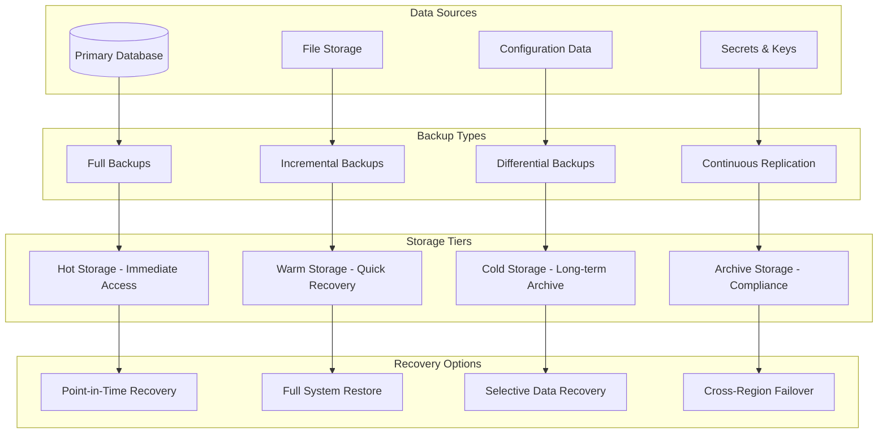

# Backup and Recovery Guide

This comprehensive guide covers backup strategies, disaster recovery procedures, and business continuity planning for Thorbis Business OS, ensuring data protection and rapid recovery from any system failures or disasters.

## Backup and Recovery Overview

### Multi-Tier Backup Strategy

Thorbis Business OS implements a comprehensive backup strategy with multiple layers of protection, including automated backups, point-in-time recovery, and geographically distributed storage.



### Backup Philosophy

#### 3-2-1 Backup Rule
```typescript
// backup/backup-strategy.ts
interface BackupStrategy {
  retention: RetentionPolicy
  scheduling: BackupSchedule
  encryption: EncryptionConfig
  compression: CompressionConfig
  verification: VerificationConfig
}

export const backupStrategy: BackupStrategy = {
  retention: {
    // 3-2-1 Rule Implementation
    copies: 3, // At least 3 copies of important data
    mediaTypes: 2, // Store on 2 different media types
    offsite: 1, // Keep 1 copy offsite
    
    // Retention periods by data type
    policies: {
      critical: {
        daily: 30,    // 30 days of daily backups
        weekly: 12,   // 12 weeks of weekly backups
        monthly: 12,  // 12 months of monthly backups
        yearly: 7     // 7 years of yearly backups
      },
      standard: {
        daily: 7,     // 7 days of daily backups
        weekly: 4,    // 4 weeks of weekly backups
        monthly: 6,   // 6 months of monthly backups
        yearly: 3     // 3 years of yearly backups
      },
      logs: {
        daily: 90,    // 90 days of daily log backups
        weekly: 0,    // No weekly log retention
        monthly: 0,   // No monthly log retention
        yearly: 0     // No yearly log retention
      }
    }
  },
  
  scheduling: {
    full: {
      frequency: 'weekly',
      time: '02:00', // 2 AM UTC Sunday
      window: '4h'   // 4-hour backup window
    },
    incremental: {
      frequency: 'daily',
      time: '01:00', // 1 AM UTC
      window: '2h'   // 2-hour backup window
    },
    continuous: {
      enabled: true,
      logShipping: true,
      maxDelay: '15m' // Maximum 15 minutes delay
    }
  },
  
  encryption: {
    algorithm: 'AES-256',
    keyRotation: '30d',
    keyStorage: 'hardware-security-module'
  },
  
  compression: {
    enabled: true,
    algorithm: 'lz4', // Fast compression for frequent backups
    level: 6          // Balance between speed and size
  },
  
  verification: {
    integrity: {
      checksums: 'sha256',
      verification: 'automatic',
      frequency: 'each-backup'
    },
    restoration: {
      testFrequency: 'monthly',
      automated: true,
      environments: ['staging', 'dr-test']
    }
  }
}
```

## Database Backup Procedures

### Supabase Database Backup

#### Automated Database Backup System
```typescript
// backup/database-backup.ts
interface DatabaseBackupConfig {
  source: DatabaseSource
  destinations: BackupDestination[]
  schedule: BackupSchedule
  retention: RetentionPolicy
  monitoring: MonitoringConfig
}

export class DatabaseBackupManager {
  private config: DatabaseBackupConfig
  private supabase: any
  private backupStorage: BackupStorageProvider
  
  constructor(config: DatabaseBackupConfig) {
    this.config = config
    this.supabase = createClient(
      process.env.SUPABASE_URL!,
      process.env.SUPABASE_SERVICE_ROLE_KEY!
    )
    this.backupStorage = new BackupStorageProvider(config.destinations)
  }
  
  async initializeBackupSystem(): Promise<void> {
    console.log('📦 Initializing database backup system...')
    
    // Setup backup schedules
    await this.setupBackupSchedules()
    
    // Initialize backup monitoring
    await this.setupBackupMonitoring()
    
    // Validate backup destinations
    await this.validateBackupDestinations()
    
    console.log('✅ Database backup system initialized')
  }
  
  private async setupBackupSchedules(): Promise<void> {
    console.log('⏰ Setting up backup schedules...')
    
    // Full backup schedule (weekly)
    const fullBackupCron = this.createCronJob(this.config.schedule.full, () => {
      this.performFullBackup()
    })
    
    // Incremental backup schedule (daily)
    const incrementalBackupCron = this.createCronJob(this.config.schedule.incremental, () => {
      this.performIncrementalBackup()
    })
    
    // Point-in-time backup (continuous)
    if (this.config.schedule.continuous?.enabled) {
      await this.enableContinuousBackup()
    }
    
    console.log('✅ Backup schedules configured')
  }
  
  async performFullBackup(): Promise<BackupResult> {
    console.log('🔄 Starting full database backup...')
    
    const backupId = this.generateBackupId('full')
    const startTime = Date.now()
    
    try {
      // Create database snapshot
      const snapshot = await this.createDatabaseSnapshot()
      
      // Export database with schema and data
      const exportResult = await this.exportDatabase({
        includeSchema: true,
        includeData: true,
        compress: true,
        encrypt: true
      })
      
      // Upload to backup destinations
      const uploadResults = await this.uploadToDestinations(exportResult, backupId)
      
      // Verify backup integrity
      const verification = await this.verifyBackupIntegrity(backupId)
      
      const duration = Date.now() - startTime
      
      const result: BackupResult = {
        id: backupId,
        type: 'full',
        status: 'completed',
        timestamp: new Date().toISOString(),
        duration,
        size: exportResult.size,
        destinations: uploadResults,
        verification,
        metadata: {
          snapshot: snapshot.id,
          tables: exportResult.tables,
          records: exportResult.recordCount
        }
      }
      
      // Record backup result
      await this.recordBackupResult(result)
      
      console.log(`✅ Full backup completed: ${backupId} (${duration}ms)`)
      
      return result
      
    } catch (error) {
      const result: BackupResult = {
        id: backupId,
        type: 'full',
        status: 'failed',
        timestamp: new Date().toISOString(),
        duration: Date.now() - startTime,
        error: error.message
      }
      
      await this.recordBackupResult(result)
      await this.notifyBackupFailure(result)
      
      throw error
    }
  }
  
  async performIncrementalBackup(): Promise<BackupResult> {
    console.log('📈 Starting incremental database backup...')
    
    const backupId = this.generateBackupId('incremental')
    const startTime = Date.now()
    
    try {
      // Find last successful backup
      const lastBackup = await this.getLastSuccessfulBackup()
      
      if (!lastBackup) {
        console.log('ℹ️  No previous backup found, performing full backup instead')
        return await this.performFullBackup()
      }
      
      // Export changes since last backup
      const changes = await this.exportChangesSince(lastBackup.timestamp)
      
      // Upload incremental backup
      const uploadResults = await this.uploadToDestinations(changes, backupId)
      
      // Verify backup integrity
      const verification = await this.verifyBackupIntegrity(backupId)
      
      const duration = Date.now() - startTime
      
      const result: BackupResult = {
        id: backupId,
        type: 'incremental',
        status: 'completed',
        timestamp: new Date().toISOString(),
        duration,
        size: changes.size,
        destinations: uploadResults,
        verification,
        metadata: {
          baseBackup: lastBackup.id,
          changesSince: lastBackup.timestamp,
          changes: changes.changeCount
        }
      }
      
      await this.recordBackupResult(result)
      
      console.log(`✅ Incremental backup completed: ${backupId} (${duration}ms)`)
      
      return result
      
    } catch (error) {
      const result: BackupResult = {
        id: backupId,
        type: 'incremental',
        status: 'failed',
        timestamp: new Date().toISOString(),
        duration: Date.now() - startTime,
        error: error.message
      }
      
      await this.recordBackupResult(result)
      await this.notifyBackupFailure(result)
      
      throw error
    }
  }
  
  private async createDatabaseSnapshot(): Promise<SnapshotResult> {
    console.log('📸 Creating database snapshot...')
    
    // In Supabase, we use pg_dump for consistent snapshots
    const dumpCommand = this.buildPgDumpCommand({
      format: 'custom',
      compression: 9,
      verbose: true,
      excludeTables: ['temp_*', 'cache_*'],
      includeBlobs: true
    })
    
    const snapshot = await this.executeBackupCommand(dumpCommand)
    
    return {
      id: this.generateSnapshotId(),
      timestamp: new Date().toISOString(),
      size: snapshot.size,
      checksum: snapshot.checksum,
      tables: snapshot.tables,
      recordCount: snapshot.recordCount
    }
  }
  
  private async exportChangesSince(timestamp: string): Promise<IncrementalExport> {
    console.log(`📊 Exporting changes since ${timestamp}...`)
    
    // Query all tables with updated_at >= timestamp
    const tables = await this.getTablesWithTimestamps()
    const changes: TableChanges[] = []
    
    for (const table of tables) {
      const tableChanges = await this.getTableChangesSince(table, timestamp)
      if (tableChanges.changeCount > 0) {
        changes.push(tableChanges)
      }
    }
    
    // Export changes to backup format
    const exportData = await this.serializeChanges(changes)
    
    return {
      timestamp: new Date().toISOString(),
      baseTimestamp: timestamp,
      changes,
      changeCount: changes.reduce((sum, c) => sum + c.changeCount, 0),
      size: exportData.length,
      data: exportData
    }
  }
  
  private async getTableChangesSince(table: string, timestamp: string): Promise<TableChanges> {
    const query = `
      SELECT * FROM ${table} 
      WHERE updated_at >= $1
      ORDER BY updated_at
    `
    
    const { data, error } = await this.supabase.rpc('execute_sql', {
      sql: query,
      params: [timestamp]
    })
    
    if (error) throw error
    
    return {
      table,
      changes: data,
      changeCount: data.length,
      lastUpdate: data.length > 0 ? data[data.length - 1].updated_at : timestamp
    }
  }
  
  async restoreFromBackup(backupId: string, options: RestoreOptions = {}): Promise<RestoreResult> {
    console.log(`🔄 Starting restore from backup: ${backupId}`)
    
    const startTime = Date.now()
    const restoreId = this.generateRestoreId()
    
    try {
      // Validate backup exists and is valid
      const backup = await this.validateBackup(backupId)
      
      // Create restore plan
      const restorePlan = await this.createRestorePlan(backup, options)
      
      // Execute restore
      const restoreResult = await this.executeRestore(restorePlan)
      
      // Verify restore integrity
      const verification = await this.verifyRestoreIntegrity(restoreResult)
      
      const duration = Date.now() - startTime
      
      const result: RestoreResult = {
        id: restoreId,
        backupId,
        status: 'completed',
        timestamp: new Date().toISOString(),
        duration,
        plan: restorePlan,
        verification,
        metadata: restoreResult.metadata
      }
      
      await this.recordRestoreResult(result)
      
      console.log(`✅ Restore completed: ${restoreId} (${duration}ms)`)
      
      return result
      
    } catch (error) {
      const result: RestoreResult = {
        id: restoreId,
        backupId,
        status: 'failed',
        timestamp: new Date().toISOString(),
        duration: Date.now() - startTime,
        error: error.message
      }
      
      await this.recordRestoreResult(result)
      throw error
    }
  }
}
```

### Point-in-Time Recovery (PITR)

#### Advanced PITR Implementation
```typescript
// backup/point-in-time-recovery.ts
export class PointInTimeRecovery {
  private supabase: any
  private walStorage: WALStorageProvider
  
  constructor() {
    this.supabase = createClient(
      process.env.SUPABASE_URL!,
      process.env.SUPABASE_SERVICE_ROLE_KEY!
    )
    this.walStorage = new WALStorageProvider()
  }
  
  async setupPITR(): Promise<void> {
    console.log('🕐 Setting up Point-in-Time Recovery...')
    
    // Enable WAL archiving
    await this.enableWALArchiving()
    
    // Setup continuous WAL backup
    await this.setupWALBackup()
    
    // Configure recovery parameters
    await this.configureRecoveryParameters()
    
    console.log('✅ Point-in-Time Recovery configured')
  }
  
  private async enableWALArchiving(): Promise<void> {
    console.log('📝 Enabling WAL archiving...')
    
    // Configure PostgreSQL for WAL archiving
    const walConfig = {
      archive_mode: 'on',
      archive_command: `aws s3 cp %p s3://thorbis-wal-archive/%f`,
      wal_level: 'replica',
      max_wal_senders: 3,
      wal_keep_segments: 32
    }
    
    // Apply configuration (would be done through Supabase management)
    await this.applyWALConfiguration(walConfig)
  }
  
  private async setupWALBackup(): Promise<void> {
    console.log('🔄 Setting up continuous WAL backup...')
    
    // Monitor WAL files and archive them
    setInterval(async () => {
      await this.archiveWALFiles()
    }, 60000) // Check every minute
    
    // Validate WAL archive integrity
    setInterval(async () => {
      await this.validateWALArchive()
    }, 300000) // Validate every 5 minutes
  }
  
  async performPITR(targetTime: Date, options: PITROptions = {}): Promise<PITRResult> {
    console.log(`🎯 Starting Point-in-Time Recovery to ${targetTime.toISOString()}`)
    
    const startTime = Date.now()
    const pitrId = this.generatePITRId()
    
    try {
      // Find base backup before target time
      const baseBackup = await this.findBaseBackupBefore(targetTime)
      
      if (!baseBackup) {
        throw new Error(`No base backup found before ${targetTime.toISOString()}`)
      }
      
      // Collect WAL files needed
      const walFiles = await this.collectWALFiles(baseBackup.timestamp, targetTime)
      
      // Create recovery environment
      const recoveryEnv = await this.createRecoveryEnvironment(options)
      
      // Restore base backup
      await this.restoreBaseBackup(baseBackup, recoveryEnv)
      
      // Apply WAL files up to target time
      const recoveryResult = await this.applyWALFiles(walFiles, targetTime, recoveryEnv)
      
      // Validate recovery
      const validation = await this.validatePITRResult(recoveryEnv, targetTime)
      
      const duration = Date.now() - startTime
      
      const result: PITRResult = {
        id: pitrId,
        targetTime: targetTime.toISOString(),
        actualTime: recoveryResult.actualTime,
        status: 'completed',
        timestamp: new Date().toISOString(),
        duration,
        baseBackup: baseBackup.id,
        walFilesApplied: walFiles.length,
        recoveryEnvironment: recoveryEnv.id,
        validation
      }
      
      await this.recordPITRResult(result)
      
      console.log(`✅ PITR completed: ${pitrId} (${duration}ms)`)
      
      return result
      
    } catch (error) {
      const result: PITRResult = {
        id: pitrId,
        targetTime: targetTime.toISOString(),
        status: 'failed',
        timestamp: new Date().toISOString(),
        duration: Date.now() - startTime,
        error: error.message
      }
      
      await this.recordPITRResult(result)
      throw error
    }
  }
  
  private async findBaseBackupBefore(targetTime: Date): Promise<BackupInfo | null> {
    console.log(`🔍 Finding base backup before ${targetTime.toISOString()}`)
    
    const backups = await this.getAvailableBackups()
    
    // Find the most recent full backup before target time
    const validBackups = backups
      .filter(b => b.type === 'full' && new Date(b.timestamp) <= targetTime)
      .sort((a, b) => new Date(b.timestamp).getTime() - new Date(a.timestamp).getTime())
    
    return validBackups.length > 0 ? validBackups[0] : null
  }
  
  private async collectWALFiles(startTime: string, endTime: Date): Promise<WALFile[]> {
    console.log(`📥 Collecting WAL files from ${startTime} to ${endTime.toISOString()}`)
    
    const walFiles = await this.walStorage.listWALFiles({
      startTime,
      endTime: endTime.toISOString()
    })
    
    // Sort WAL files by timeline and LSN
    walFiles.sort((a, b) => {
      if (a.timeline !== b.timeline) {
        return a.timeline - b.timeline
      }
      return a.lsn.localeCompare(b.lsn)
    })
    
    return walFiles
  }
  
  private async applyWALFiles(
    walFiles: WALFile[], 
    targetTime: Date, 
    recoveryEnv: RecoveryEnvironment
  ): Promise<WALApplicationResult> {
    console.log(`⚡ Applying ${walFiles.length} WAL files...`)
    
    let appliedCount = 0
    let actualRecoveryTime = targetTime
    
    for (const walFile of walFiles) {
      try {
        const applicationResult = await this.applyWALFile(walFile, recoveryEnv, targetTime)
        
        if (applicationResult.stopped) {
          actualRecoveryTime = applicationResult.stopTime
          break
        }
        
        appliedCount++
        
        // Progress reporting
        if (appliedCount % 10 === 0) {
          console.log(`📊 Applied ${appliedCount}/${walFiles.length} WAL files`)
        }
        
      } catch (error) {
        console.error(`❌ Failed to apply WAL file ${walFile.name}:`, error)
        throw new Error(`WAL application failed at file ${walFile.name}: ${error.message}`)
      }
    }
    
    return {
      appliedCount,
      totalCount: walFiles.length,
      actualTime: actualRecoveryTime.toISOString(),
      completed: appliedCount === walFiles.length
    }
  }
}
```

## File and Application Backup

### Application State Backup

#### Configuration and Application Data
```typescript
// backup/application-backup.ts
interface ApplicationBackupConfig {
  applications: ApplicationConfig[]
  storage: StorageConfig
  encryption: EncryptionConfig
  schedule: ScheduleConfig
}

export class ApplicationBackupManager {
  private config: ApplicationBackupConfig
  private storageProvider: BackupStorageProvider
  
  constructor(config: ApplicationBackupConfig) {
    this.config = config
    this.storageProvider = new BackupStorageProvider(config.storage)
  }
  
  async setupApplicationBackup(): Promise<void> {
    console.log('📱 Setting up application backup system...')
    
    // Setup backup for each application
    for (const app of this.config.applications) {
      await this.setupAppBackup(app)
    }
    
    // Setup backup scheduling
    await this.setupBackupScheduling()
    
    console.log('✅ Application backup system configured')
  }
  
  private async setupAppBackup(app: ApplicationConfig): Promise<void> {
    console.log(`📦 Setting up backup for ${app.name}...`)
    
    switch (app.type) {
      case 'nextjs':
        await this.setupNextJSBackup(app)
        break
      case 'static':
        await this.setupStaticSiteBackup(app)
        break
      case 'api':
        await this.setupAPIBackup(app)
        break
      default:
        console.warn(`Unsupported application type: ${app.type}`)
    }
  }
  
  private async setupNextJSBackup(app: ApplicationConfig): Promise<void> {
    const backupItems = [
      // Source code (from Git)
      {
        type: 'source',
        source: 'git',
        repository: app.repository,
        branch: app.branch || 'main'
      },
      
      // Environment configuration
      {
        type: 'config',
        source: 'vercel',
        projectId: app.vercelProjectId,
        items: ['environment-variables', 'domains', 'deployment-settings']
      },
      
      // Build artifacts
      {
        type: 'artifacts',
        source: 'vercel',
        items: ['builds', 'deployments', 'logs']
      },
      
      // User-uploaded files
      {
        type: 'files',
        source: 'storage',
        paths: app.filePaths || []
      }
    ]
    
    for (const item of backupItems) {
      await this.configureBackupItem(app.name, item)
    }
  }
  
  async performApplicationBackup(appName: string): Promise<ApplicationBackupResult> {
    console.log(`🔄 Starting application backup for ${appName}`)
    
    const app = this.config.applications.find(a => a.name === appName)
    if (!app) {
      throw new Error(`Application ${appName} not found`)
    }
    
    const backupId = this.generateBackupId(appName)
    const startTime = Date.now()
    
    try {
      // Backup source code
      const sourceBackup = await this.backupSourceCode(app)
      
      // Backup configuration
      const configBackup = await this.backupConfiguration(app)
      
      // Backup user files
      const filesBackup = await this.backupUserFiles(app)
      
      // Backup deployment state
      const deploymentBackup = await this.backupDeploymentState(app)
      
      // Create backup manifest
      const manifest = await this.createBackupManifest({
        id: backupId,
        application: appName,
        timestamp: new Date().toISOString(),
        components: {
          source: sourceBackup,
          config: configBackup,
          files: filesBackup,
          deployment: deploymentBackup
        }
      })
      
      // Upload backup to storage
      const uploadResult = await this.uploadBackup(manifest)
      
      const duration = Date.now() - startTime
      
      const result: ApplicationBackupResult = {
        id: backupId,
        application: appName,
        status: 'completed',
        timestamp: new Date().toISOString(),
        duration,
        size: uploadResult.size,
        components: manifest.components,
        storage: uploadResult.locations
      }
      
      await this.recordBackupResult(result)
      
      console.log(`✅ Application backup completed: ${backupId}`)
      
      return result
      
    } catch (error) {
      const result: ApplicationBackupResult = {
        id: backupId,
        application: appName,
        status: 'failed',
        timestamp: new Date().toISOString(),
        duration: Date.now() - startTime,
        error: error.message
      }
      
      await this.recordBackupResult(result)
      throw error
    }
  }
  
  private async backupSourceCode(app: ApplicationConfig): Promise<SourceBackupResult> {
    console.log(`📂 Backing up source code for ${app.name}`)
    
    // Clone repository
    const repoPath = await this.cloneRepository(app.repository, app.branch)
    
    // Create archive
    const archive = await this.createSourceArchive(repoPath, {
      excludePatterns: [
        'node_modules/**',
        '.git/**',
        '.next/**',
        'dist/**',
        '*.log',
        '.env*'
      ]
    })
    
    // Calculate checksums
    const checksum = await this.calculateChecksum(archive)
    
    return {
      type: 'source',
      repository: app.repository,
      branch: app.branch || 'main',
      commit: await this.getCommitHash(repoPath),
      size: archive.length,
      checksum,
      archive: archive
    }
  }
  
  private async backupConfiguration(app: ApplicationConfig): Promise<ConfigBackupResult> {
    console.log(`⚙️  Backing up configuration for ${app.name}`)
    
    const config = {
      // Environment variables (secrets masked)
      environment: await this.getEnvironmentConfig(app),
      
      // Vercel project settings
      vercel: await this.getVercelConfig(app),
      
      // DNS and domain configuration
      domains: await this.getDomainConfig(app),
      
      // Deployment settings
      deployment: await this.getDeploymentConfig(app)
    }
    
    // Encrypt sensitive configuration
    const encryptedConfig = await this.encryptSensitiveData(config)
    
    return {
      type: 'configuration',
      timestamp: new Date().toISOString(),
      config: encryptedConfig,
      checksum: await this.calculateChecksum(JSON.stringify(encryptedConfig))
    }
  }
}
```

### Secrets and Configuration Backup

#### Secure Configuration Management
```typescript
// backup/secrets-backup.ts
export class SecretsBackupManager {
  private keyManager: KeyManager
  private vaultProvider: VaultProvider
  
  constructor() {
    this.keyManager = new KeyManager()
    this.vaultProvider = new VaultProvider()
  }
  
  async backupSecrets(): Promise<SecretsBackupResult> {
    console.log('🔐 Starting secrets backup...')
    
    const backupId = this.generateSecretsBackupId()
    const startTime = Date.now()
    
    try {
      // Collect secrets from various sources
      const secrets = await this.collectSecrets()
      
      // Encrypt secrets with backup key
      const encryptedSecrets = await this.encryptSecrets(secrets)
      
      // Store in multiple secure locations
      const storageResults = await this.storeEncryptedSecrets(encryptedSecrets)
      
      // Create backup manifest
      const manifest = await this.createSecretsManifest({
        id: backupId,
        timestamp: new Date().toISOString(),
        secretsCount: secrets.length,
        encryptionInfo: encryptedSecrets.encryptionInfo,
        storageLocations: storageResults
      })
      
      const duration = Date.now() - startTime
      
      const result: SecretsBackupResult = {
        id: backupId,
        status: 'completed',
        timestamp: new Date().toISOString(),
        duration,
        secretsCount: secrets.length,
        storageLocations: storageResults.length,
        manifest
      }
      
      await this.recordSecretsBackup(result)
      
      console.log(`✅ Secrets backup completed: ${backupId}`)
      
      return result
      
    } catch (error) {
      console.error('❌ Secrets backup failed:', error)
      throw error
    }
  }
  
  private async collectSecrets(): Promise<SecretItem[]> {
    const secrets: SecretItem[] = []
    
    // GitHub repository secrets
    const githubSecrets = await this.getGitHubSecrets()
    secrets.push(...githubSecrets)
    
    // Vercel environment variables
    const vercelSecrets = await this.getVercelSecrets()
    secrets.push(...vercelSecrets)
    
    // Supabase configuration
    const supabaseSecrets = await this.getSupabaseSecrets()
    secrets.push(...supabaseSecrets)
    
    // Third-party API keys
    const apiKeys = await this.getAPIKeys()
    secrets.push(...apiKeys)
    
    return secrets
  }
  
  private async encryptSecrets(secrets: SecretItem[]): Promise<EncryptedSecretsResult> {
    console.log(`🔒 Encrypting ${secrets.length} secrets...`)
    
    // Generate new encryption key for this backup
    const encryptionKey = await this.keyManager.generateKey()
    
    // Encrypt each secret individually
    const encryptedSecrets = []
    for (const secret of secrets) {
      const encrypted = await this.keyManager.encrypt(secret.value, encryptionKey)
      encryptedSecrets.push({
        ...secret,
        value: encrypted.data,
        iv: encrypted.iv,
        tag: encrypted.tag
      })
    }
    
    // Encrypt the encryption key with master key
    const encryptedKey = await this.keyManager.encryptWithMasterKey(encryptionKey)
    
    return {
      secrets: encryptedSecrets,
      encryptionInfo: {
        algorithm: 'AES-256-GCM',
        keyId: encryptedKey.keyId,
        encryptedKey: encryptedKey.data
      }
    }
  }
  
  async restoreSecrets(backupId: string, targetEnvironment: string): Promise<SecretsRestoreResult> {
    console.log(`🔓 Restoring secrets from backup: ${backupId}`)
    
    const startTime = Date.now()
    
    try {
      // Retrieve backup manifest
      const manifest = await this.getSecretsManifest(backupId)
      
      // Decrypt secrets
      const decryptedSecrets = await this.decryptSecrets(manifest)
      
      // Restore secrets to target environment
      const restoreResults = await this.restoreSecretsToEnvironment(
        decryptedSecrets,
        targetEnvironment
      )
      
      const duration = Date.now() - startTime
      
      const result: SecretsRestoreResult = {
        backupId,
        targetEnvironment,
        status: 'completed',
        timestamp: new Date().toISOString(),
        duration,
        secretsRestored: restoreResults.successful.length,
        secretsFailed: restoreResults.failed.length,
        results: restoreResults
      }
      
      await this.recordSecretsRestore(result)
      
      console.log(`✅ Secrets restore completed: ${result.secretsRestored} successful, ${result.secretsFailed} failed`)
      
      return result
      
    } catch (error) {
      console.error('❌ Secrets restore failed:', error)
      throw error
    }
  }
}
```

## Disaster Recovery Planning

### Business Continuity Framework

#### Comprehensive DR Strategy
```typescript
// disaster-recovery/dr-planning.ts
interface DisasterRecoveryPlan {
  rto: number // Recovery Time Objective (minutes)
  rpo: number // Recovery Point Objective (minutes)
  tiers: RecoveryTier[]
  scenarios: DisasterScenario[]
  procedures: RecoveryProcedure[]
  testing: DRTestingSchedule
}

export const disasterRecoveryPlan: DisasterRecoveryPlan = {
  rto: 60, // 1 hour maximum recovery time
  rpo: 15, // Maximum 15 minutes of data loss
  
  tiers: [
    {
      name: 'Tier 1 - Critical',
      rto: 15, // 15 minutes
      rpo: 5,  // 5 minutes
      applications: ['payment-processing', 'user-authentication', 'core-api'],
      priority: 1
    },
    {
      name: 'Tier 2 - Important',
      rto: 60, // 1 hour
      rpo: 15, // 15 minutes
      applications: ['work-orders', 'invoicing', 'customer-portal'],
      priority: 2
    },
    {
      name: 'Tier 3 - Standard',
      rto: 240, // 4 hours
      rpo: 60,  // 1 hour
      applications: ['reporting', 'analytics', 'documentation'],
      priority: 3
    }
  ],
  
  scenarios: [
    {
      name: 'Database Failure',
      description: 'Primary database becomes unavailable',
      likelihood: 'medium',
      impact: 'high',
      triggers: ['database-connection-failure', 'database-corruption'],
      procedures: ['database-failover', 'point-in-time-recovery']
    },
    {
      name: 'Application Server Outage',
      description: 'Vercel platform or application servers fail',
      likelihood: 'low',
      impact: 'high',
      triggers: ['platform-outage', 'deployment-failure'],
      procedures: ['emergency-deployment', 'traffic-rerouting']
    },
    {
      name: 'Data Center Outage',
      description: 'Entire AWS region becomes unavailable',
      likelihood: 'low',
      impact: 'critical',
      triggers: ['region-outage', 'network-isolation'],
      procedures: ['cross-region-failover', 'emergency-communications']
    },
    {
      name: 'Security Breach',
      description: 'Security incident requiring system isolation',
      likelihood: 'medium',
      impact: 'critical',
      triggers: ['intrusion-detection', 'data-breach'],
      procedures: ['incident-isolation', 'forensic-preservation', 'clean-recovery']
    }
  ],
  
  procedures: [
    {
      name: 'database-failover',
      description: 'Failover to backup database',
      steps: [
        'Detect database failure',
        'Validate backup database integrity',
        'Update application connection strings',
        'Test application connectivity',
        'Update DNS/load balancer',
        'Monitor application health'
      ],
      estimatedTime: 15, // minutes
      automation: 'partial'
    },
    {
      name: 'cross-region-failover',
      description: 'Failover to secondary region',
      steps: [
        'Activate disaster recovery site',
        'Restore from latest backups',
        'Update DNS to secondary region',
        'Validate all services',
        'Notify stakeholders',
        'Begin primary region recovery'
      ],
      estimatedTime: 60, // minutes
      automation: 'manual'
    }
  ],
  
  testing: {
    drillFrequency: 'quarterly',
    testTypes: ['tabletop', 'walkthrough', 'full-simulation'],
    lastTest: '2025-01-15',
    nextTest: '2025-04-15'
  }
}

export class DisasterRecoveryManager {
  private plan: DisasterRecoveryPlan
  private monitoring: DRMonitoring
  
  constructor(plan: DisasterRecoveryPlan) {
    this.plan = plan
    this.monitoring = new DRMonitoring()
  }
  
  async initializeDisasterRecovery(): Promise<void> {
    console.log('🚨 Initializing disaster recovery system...')
    
    // Setup DR monitoring
    await this.setupDRMonitoring()
    
    // Validate recovery procedures
    await this.validateRecoveryProcedures()
    
    // Setup automated triggers
    await this.setupAutomatedTriggers()
    
    console.log('✅ Disaster recovery system initialized')
  }
  
  private async setupDRMonitoring(): Promise<void> {
    console.log('📡 Setting up DR monitoring...')
    
    // Monitor critical system health
    for (const tier of this.plan.tiers) {
      await this.setupTierMonitoring(tier)
    }
    
    // Monitor backup systems
    await this.setupBackupMonitoring()
    
    // Monitor external dependencies
    await this.setupDependencyMonitoring()
  }
  
  async triggerDisasterRecovery(scenario: string, manual: boolean = false): Promise<DRExecutionResult> {
    console.log(`🚨 DISASTER RECOVERY TRIGGERED: ${scenario}`)
    
    const executionId = this.generateDRExecutionId()
    const startTime = Date.now()
    
    try {
      // Find matching scenario
      const drScenario = this.plan.scenarios.find(s => s.name === scenario)
      if (!drScenario) {
        throw new Error(`Unknown DR scenario: ${scenario}`)
      }
      
      // Create incident record
      const incident = await this.createIncidentRecord(drScenario, manual)
      
      // Execute recovery procedures
      const recoveryResults = await this.executeRecoveryProcedures(drScenario)
      
      // Validate recovery
      const validation = await this.validateRecovery()
      
      const duration = Date.now() - startTime
      
      const result: DRExecutionResult = {
        id: executionId,
        scenario: scenario,
        manual,
        status: 'completed',
        startTime: new Date(startTime).toISOString(),
        duration,
        incident: incident.id,
        proceduresExecuted: recoveryResults.length,
        validation,
        rtoAchieved: duration <= (this.plan.rto * 60000), // Convert minutes to ms
        rpoAchieved: validation.dataLoss <= this.plan.rpo
      }
      
      await this.recordDRExecution(result)
      
      // Notify stakeholders
      await this.notifyDRCompletion(result)
      
      console.log(`✅ Disaster recovery completed: ${executionId} (${duration}ms)`)
      
      return result
      
    } catch (error) {
      const result: DRExecutionResult = {
        id: executionId,
        scenario: scenario,
        manual,
        status: 'failed',
        startTime: new Date(startTime).toISOString(),
        duration: Date.now() - startTime,
        error: error.message
      }
      
      await this.recordDRExecution(result)
      await this.escalateDRFailure(result)
      
      throw error
    }
  }
  
  private async executeRecoveryProcedures(scenario: DisasterScenario): Promise<ProcedureResult[]> {
    console.log(`⚡ Executing recovery procedures for ${scenario.name}`)
    
    const results: ProcedureResult[] = []
    
    for (const procedureName of scenario.procedures) {
      const procedure = this.plan.procedures.find(p => p.name === procedureName)
      if (!procedure) {
        console.warn(`⚠️  Procedure not found: ${procedureName}`)
        continue
      }
      
      const result = await this.executeProcedure(procedure)
      results.push(result)
      
      if (!result.success && procedure.critical) {
        throw new Error(`Critical procedure failed: ${procedureName} - ${result.error}`)
      }
    }
    
    return results
  }
  
  private async executeProcedure(procedure: RecoveryProcedure): Promise<ProcedureResult> {
    console.log(`🔧 Executing procedure: ${procedure.name}`)
    
    const startTime = Date.now()
    
    try {
      if (procedure.automation === 'full') {
        return await this.executeAutomatedProcedure(procedure)
      } else if (procedure.automation === 'partial') {
        return await this.executePartiallyAutomatedProcedure(procedure)
      } else {
        return await this.executeManualProcedure(procedure)
      }
    } catch (error) {
      return {
        procedure: procedure.name,
        success: false,
        duration: Date.now() - startTime,
        error: error.message
      }
    }
  }
  
  async performDRTest(testType: DRTestType): Promise<DRTestResult> {
    console.log(`🧪 Performing DR test: ${testType}`)
    
    const testId = this.generateDRTestId()
    const startTime = Date.now()
    
    try {
      let testResult: DRTestResult
      
      switch (testType) {
        case 'tabletop':
          testResult = await this.performTabletopTest()
          break
        case 'walkthrough':
          testResult = await this.performWalkthroughTest()
          break
        case 'full-simulation':
          testResult = await this.performFullSimulationTest()
          break
        default:
          throw new Error(`Unknown test type: ${testType}`)
      }
      
      const duration = Date.now() - startTime
      
      const result: DRTestResult = {
        id: testId,
        type: testType,
        status: 'completed',
        timestamp: new Date().toISOString(),
        duration,
        ...testResult,
        recommendations: this.generateTestRecommendations(testResult)
      }
      
      await this.recordDRTest(result)
      
      console.log(`✅ DR test completed: ${testId}`)
      
      return result
      
    } catch (error) {
      const result: DRTestResult = {
        id: testId,
        type: testType,
        status: 'failed',
        timestamp: new Date().toISOString(),
        duration: Date.now() - startTime,
        error: error.message
      }
      
      await this.recordDRTest(result)
      throw error
    }
  }
}
```

## Recovery Testing and Validation

### Automated Recovery Testing

#### Comprehensive Recovery Validation
```typescript
// disaster-recovery/recovery-testing.ts
export class RecoveryTestingFramework {
  private testEnvironments: TestEnvironment[]
  private validationSuite: ValidationSuite
  
  constructor() {
    this.testEnvironments = []
    this.validationSuite = new ValidationSuite()
  }
  
  async setupRecoveryTesting(): Promise<void> {
    console.log('🧪 Setting up recovery testing framework...')
    
    // Setup isolated test environments
    await this.setupTestEnvironments()
    
    // Configure validation suite
    await this.setupValidationSuite()
    
    // Schedule automated tests
    await this.scheduleAutomatedTests()
    
    console.log('✅ Recovery testing framework configured')
  }
  
  private async setupTestEnvironments(): Promise<void> {
    const environments = [
      {
        name: 'dr-test-primary',
        purpose: 'Primary recovery testing',
        configuration: 'production-like',
        isolation: 'complete'
      },
      {
        name: 'dr-test-secondary',
        purpose: 'Secondary region testing',
        configuration: 'minimal',
        isolation: 'network-only'
      }
    ]
    
    for (const envConfig of environments) {
      const environment = await this.createTestEnvironment(envConfig)
      this.testEnvironments.push(environment)
    }
  }
  
  async executeRecoveryTest(testConfig: RecoveryTestConfig): Promise<RecoveryTestResult> {
    console.log(`🔬 Executing recovery test: ${testConfig.name}`)
    
    const testId = this.generateTestId()
    const startTime = Date.now()
    
    try {
      // Prepare test environment
      const testEnv = await this.prepareTestEnvironment(testConfig)
      
      // Simulate disaster scenario
      const disasterSimulation = await this.simulateDisaster(testConfig.scenario, testEnv)
      
      // Execute recovery procedures
      const recoveryResult = await this.executeRecovery(testConfig.procedures, testEnv)
      
      // Validate recovery
      const validation = await this.validateRecovery(testConfig.validation, testEnv)
      
      // Cleanup test environment
      await this.cleanupTestEnvironment(testEnv)
      
      const duration = Date.now() - startTime
      
      const result: RecoveryTestResult = {
        id: testId,
        name: testConfig.name,
        scenario: testConfig.scenario,
        status: 'completed',
        timestamp: new Date().toISOString(),
        duration,
        disasterSimulation,
        recoveryResult,
        validation,
        rtoAchieved: recoveryResult.duration <= testConfig.rtoTarget,
        rpoAchieved: validation.dataLoss <= testConfig.rpoTarget,
        testEnvironment: testEnv.id
      }
      
      await this.recordTestResult(result)
      
      console.log(`✅ Recovery test completed: ${testId} (${duration}ms)`)
      
      return result
      
    } catch (error) {
      const result: RecoveryTestResult = {
        id: testId,
        name: testConfig.name,
        scenario: testConfig.scenario,
        status: 'failed',
        timestamp: new Date().toISOString(),
        duration: Date.now() - startTime,
        error: error.message
      }
      
      await this.recordTestResult(result)
      throw error
    }
  }
  
  private async simulateDisaster(scenario: DisasterScenario, testEnv: TestEnvironment): Promise<DisasterSimulationResult> {
    console.log(`💥 Simulating disaster: ${scenario.name}`)
    
    switch (scenario.type) {
      case 'database-failure':
        return await this.simulateDatabaseFailure(testEnv)
      case 'application-failure':
        return await this.simulateApplicationFailure(testEnv)
      case 'network-partition':
        return await this.simulateNetworkPartition(testEnv)
      case 'data-corruption':
        return await this.simulateDataCorruption(testEnv)
      default:
        throw new Error(`Unknown disaster scenario: ${scenario.type}`)
    }
  }
  
  private async simulateDatabaseFailure(testEnv: TestEnvironment): Promise<DisasterSimulationResult> {
    console.log('📊 Simulating database failure...')
    
    // Record pre-failure state
    const preFailureState = await this.captureSystemState(testEnv)
    
    // Simulate database failure
    await this.shutdownDatabase(testEnv)
    
    // Wait for failure detection
    const failureDetectionTime = await this.waitForFailureDetection(testEnv)
    
    return {
      type: 'database-failure',
      timestamp: new Date().toISOString(),
      preFailureState,
      failureDetectionTime,
      affectedServices: await this.getAffectedServices(testEnv),
      impactAssessment: await this.assessImpact(testEnv)
    }
  }
  
  private async validateRecovery(validationConfig: ValidationConfig, testEnv: TestEnvironment): Promise<ValidationResult> {
    console.log('✅ Validating recovery...')
    
    const validations: ValidationCheck[] = []
    
    // Application availability
    validations.push(await this.validateApplicationAvailability(testEnv))
    
    // Data integrity
    validations.push(await this.validateDataIntegrity(testEnv))
    
    // Performance benchmarks
    validations.push(await this.validatePerformance(testEnv))
    
    // Security posture
    validations.push(await this.validateSecurity(testEnv))
    
    // Business functionality
    validations.push(await this.validateBusinessFunctionality(testEnv))
    
    const passedValidations = validations.filter(v => v.passed).length
    const totalValidations = validations.length
    
    return {
      timestamp: new Date().toISOString(),
      validations,
      passedCount: passedValidations,
      totalCount: totalValidations,
      successRate: (passedValidations / totalValidations) * 100,
      dataLoss: await this.calculateDataLoss(testEnv),
      downtime: await this.calculateDowntime(testEnv)
    }
  }
  
  private async validateApplicationAvailability(testEnv: TestEnvironment): Promise<ValidationCheck> {
    console.log('🌐 Validating application availability...')
    
    const endpoints = [
      '/api/health',
      '/api/hs/health',
      '/api/rest/health', 
      '/api/auto/health',
      '/api/ret/health'
    ]
    
    const results = []
    
    for (const endpoint of endpoints) {
      try {
        const response = await fetch(`${testEnv.baseUrl}${endpoint}`, {
          timeout: 10000
        })
        
        results.push({
          endpoint,
          available: response.ok,
          responseTime: response.headers.get('x-response-time'),
          status: response.status
        })
      } catch (error) {
        results.push({
          endpoint,
          available: false,
          error: error.message
        })
      }
    }
    
    const availableEndpoints = results.filter(r => r.available).length
    const totalEndpoints = results.length
    
    return {
      name: 'Application Availability',
      passed: availableEndpoints === totalEndpoints,
      details: `${availableEndpoints}/${totalEndpoints} endpoints available`,
      results: results
    }
  }
}
```

## Next Steps

After completing backup and recovery setup:

1. **[Troubleshooting and Maintenance](./09-troubleshooting-maintenance.md)**: Ongoing maintenance procedures

## Backup and Recovery Resources

### Documentation References
- **Backup Strategy**: Comprehensive backup and recovery planning
- **Disaster Recovery**: Business continuity and disaster recovery procedures
- **Point-in-Time Recovery**: Advanced PITR implementation and testing
- **Recovery Testing**: Automated recovery validation and testing

### Tools and Services
- **Backup Management**: Automated backup scheduling and monitoring
- **Recovery Testing**: Comprehensive recovery validation framework
- **Disaster Recovery**: Business continuity and emergency procedures
- **Compliance Reporting**: Backup and recovery compliance documentation

---

*Last Updated: 2025-01-31*  
*Version: 1.0.0*  
*Previous: [Monitoring and Observability](./07-monitoring-observability.md) | Next: [Troubleshooting and Maintenance](./09-troubleshooting-maintenance.md)*