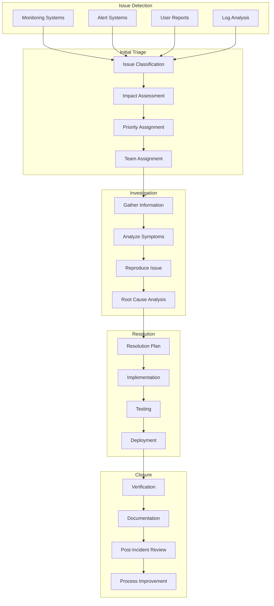

# Troubleshooting and Maintenance Guide

This comprehensive guide covers troubleshooting procedures, maintenance tasks, and operational best practices for maintaining optimal performance and reliability of Thorbis Business OS in production environments.

## Troubleshooting Overview

### Systematic Troubleshooting Approach

Thorbis Business OS employs a structured troubleshooting methodology that combines automated diagnostics, comprehensive logging, and escalation procedures to rapidly identify and resolve issues.



### Issue Classification Matrix

#### Priority and Impact Assessment
```typescript
// troubleshooting/issue-classification.ts
interface IssueClassification {
  severity: IssueSeverity
  priority: IssuePriority
  category: IssueCategory
  escalation: EscalationLevel
  sla: SLARequirements
}

type IssueSeverity = 'critical' | 'high' | 'medium' | 'low'
type IssuePriority = 'p1' | 'p2' | 'p3' | 'p4'

export const issueClassificationMatrix: Record<string, IssueClassification> = {
  'system-outage': {
    severity: 'critical',
    priority: 'p1',
    category: 'infrastructure',
    escalation: 'immediate',
    sla: {
      responseTime: '15m',
      resolutionTime: '1h',
      updateFrequency: '15m'
    }
  },
  
  'payment-processing-failure': {
    severity: 'critical',
    priority: 'p1',
    category: 'business-critical',
    escalation: 'immediate',
    sla: {
      responseTime: '10m',
      resolutionTime: '30m',
      updateFrequency: '10m'
    }
  },
  
  'database-performance-degradation': {
    severity: 'high',
    priority: 'p2',
    category: 'performance',
    escalation: 'within-1h',
    sla: {
      responseTime: '1h',
      resolutionTime: '4h',
      updateFrequency: '30m'
    }
  },
  
  'ui-rendering-issues': {
    severity: 'medium',
    priority: 'p3',
    category: 'user-experience',
    escalation: 'within-business-hours',
    sla: {
      responseTime: '4h',
      resolutionTime: '24h',
      updateFrequency: '4h'
    }
  },
  
  'documentation-updates': {
    severity: 'low',
    priority: 'p4',
    category: 'maintenance',
    escalation: 'next-sprint',
    sla: {
      responseTime: '1d',
      resolutionTime: '1w',
      updateFrequency: '1d'
    }
  }
}

export class IssueClassifier {
  classify(issueDescription: string, symptoms: string[]): IssueClassification {
    // AI-powered issue classification based on description and symptoms
    const analysisResult = this.analyzeIssue(issueDescription, symptoms)
    
    // Map to predefined classifications or create custom classification
    return this.mapToClassification(analysisResult)
  }
  
  private analyzeIssue(description: string, symptoms: string[]): IssueAnalysis {
    // Keywords that indicate severity and category
    const criticalKeywords = [
      'outage', 'down', 'crash', 'failure', 'unavailable', 
      'payment', 'security', 'data loss', 'corruption'
    ]
    
    const performanceKeywords = [
      'slow', 'timeout', 'lag', 'delay', 'performance', 
      'response time', 'high cpu', 'memory'
    ]
    
    const uiKeywords = [
      'display', 'rendering', 'layout', 'visual', 'ui', 
      'frontend', 'browser', 'responsive'
    ]
    
    const businessKeywords = [
      'invoice', 'payment', 'work order', 'customer', 
      'billing', 'integration', 'api'
    ]
    
    const text = (description + ' ' + symptoms.join(' ')).toLowerCase()
    
    return {
      hasCriticalKeywords: criticalKeywords.some(k => text.includes(k)),
      hasPerformanceKeywords: performanceKeywords.some(k => text.includes(k)),
      hasUIKeywords: uiKeywords.some(k => text.includes(k)),
      hasBusinessKeywords: businessKeywords.some(k => text.includes(k)),
      affectedServices: this.identifyAffectedServices(text),
      userImpact: this.assessUserImpact(text)
    }
  }
}
```

## Common Issues and Solutions

### Application Performance Issues

#### Performance Degradation Troubleshooting
```typescript
// troubleshooting/performance-issues.ts
export class PerformanceTroubleshooter {
  private metricsCollector: MetricsCollector
  private diagnostics: DiagnosticsRunner
  
  constructor() {
    this.metricsCollector = new MetricsCollector()
    this.diagnostics = new DiagnosticsRunner()
  }
  
  async diagnosePerformanceIssue(symptoms: PerformanceSymptoms): Promise<DiagnosisResult> {
    console.log('🔍 Diagnosing performance issue...')
    
    const diagnosis: DiagnosisResult = {
      timestamp: new Date().toISOString(),
      symptoms,
      findings: [],
      recommendations: [],
      severity: 'unknown'
    }
    
    // Collect current performance metrics
    const currentMetrics = await this.collectCurrentMetrics()
    diagnosis.currentMetrics = currentMetrics
    
    // Check for common performance bottlenecks
    diagnosis.findings.push(...await this.checkDatabasePerformance())
    diagnosis.findings.push(...await this.checkApplicationMetrics())
    diagnosis.findings.push(...await this.checkInfrastructureMetrics())
    diagnosis.findings.push(...await this.checkExternalDependencies())
    
    // Generate recommendations
    diagnosis.recommendations = this.generateRecommendations(diagnosis.findings)
    
    // Determine severity
    diagnosis.severity = this.calculateSeverity(diagnosis.findings)
    
    return diagnosis
  }
  
  private async checkDatabasePerformance(): Promise<DiagnosticFinding[]> {
    console.log('🔍 Checking database performance...')
    
    const findings: DiagnosticFinding[] = []
    
    // Check connection pool usage
    const connectionMetrics = await this.getDatabaseConnectionMetrics()
    if (connectionMetrics.utilizationPercentage > 80) {
      findings.push({
        category: 'database',
        severity: 'high',
        title: 'High Database Connection Usage',
        description: `Connection pool utilization at ${connectionMetrics.utilizationPercentage}%`,
        impact: 'New requests may be queued or rejected',
        recommendations: [
          'Increase connection pool size',
          'Optimize long-running queries',
          'Implement connection pooling at application level'
        ],
        metrics: connectionMetrics
      })
    }
    
    // Check slow queries
    const slowQueries = await this.getSlowQueries()
    if (slowQueries.length > 0) {
      findings.push({
        category: 'database',
        severity: 'medium',
        title: 'Slow Database Queries Detected',
        description: `${slowQueries.length} queries running slower than 1 second`,
        impact: 'Increased response times and resource usage',
        recommendations: [
          'Add database indexes for slow queries',
          'Optimize query execution plans',
          'Consider query result caching'
        ],
        data: slowQueries.slice(0, 5) // Top 5 slow queries
      })
    }
    
    // Check cache hit ratio
    const cacheStats = await this.getDatabaseCacheStats()
    if (cacheStats.hitRatio < 90) {
      findings.push({
        category: 'database',
        severity: 'medium',
        title: 'Low Database Cache Hit Ratio',
        description: `Cache hit ratio at ${cacheStats.hitRatio}%`,
        impact: 'Increased disk I/O and slower query responses',
        recommendations: [
          'Increase database shared_buffers',
          'Optimize frequently accessed queries',
          'Consider read replicas for read-heavy workloads'
        ],
        metrics: cacheStats
      })
    }
    
    return findings
  }
  
  private async checkApplicationMetrics(): Promise<DiagnosticFinding[]> {
    console.log('🔍 Checking application metrics...')
    
    const findings: DiagnosticFinding[] = []
    
    // Check response times
    const responseMetrics = await this.getResponseTimeMetrics()
    if (responseMetrics.p95 > 2000) { // 2 seconds
      findings.push({
        category: 'application',
        severity: responseMetrics.p95 > 5000 ? 'high' : 'medium',
        title: 'High Application Response Times',
        description: `95th percentile response time: ${responseMetrics.p95}ms`,
        impact: 'Poor user experience and potential timeouts',
        recommendations: [
          'Profile application bottlenecks',
          'Optimize slow API endpoints',
          'Implement response caching',
          'Consider horizontal scaling'
        ],
        metrics: responseMetrics
      })
    }
    
    // Check error rates
    const errorMetrics = await this.getErrorRateMetrics()
    if (errorMetrics.errorRate > 1) { // 1%
      findings.push({
        category: 'application',
        severity: errorMetrics.errorRate > 5 ? 'high' : 'medium',
        title: 'Elevated Application Error Rate',
        description: `Error rate: ${errorMetrics.errorRate}%`,
        impact: 'Users experiencing failures and poor reliability',
        recommendations: [
          'Investigate most common errors',
          'Improve error handling and retries',
          'Add circuit breakers for external services',
          'Monitor and alert on error spikes'
        ],
        metrics: errorMetrics,
        data: errorMetrics.topErrors
      })
    }
    
    // Check memory usage
    const memoryMetrics = await this.getMemoryMetrics()
    if (memoryMetrics.utilizationPercentage > 85) {
      findings.push({
        category: 'application',
        severity: memoryMetrics.utilizationPercentage > 95 ? 'high' : 'medium',
        title: 'High Memory Usage',
        description: `Memory utilization: ${memoryMetrics.utilizationPercentage}%`,
        impact: 'Risk of out-of-memory errors and performance degradation',
        recommendations: [
          'Profile memory usage patterns',
          'Check for memory leaks',
          'Optimize caching strategies',
          'Consider increasing memory allocation'
        ],
        metrics: memoryMetrics
      })
    }
    
    return findings
  }
  
  private async checkInfrastructureMetrics(): Promise<DiagnosticFinding[]> {
    console.log('🔍 Checking infrastructure metrics...')
    
    const findings: DiagnosticFinding[] = []
    
    // Check CDN performance
    const cdnMetrics = await this.getCDNMetrics()
    if (cdnMetrics.hitRate < 80) {
      findings.push({
        category: 'infrastructure',
        severity: 'medium',
        title: 'Low CDN Cache Hit Rate',
        description: `CDN hit rate: ${cdnMetrics.hitRate}%`,
        impact: 'Increased origin server load and slower content delivery',
        recommendations: [
          'Review cache headers and TTL settings',
          'Optimize cacheable content identification',
          'Consider cache warming strategies'
        ],
        metrics: cdnMetrics
      })
    }
    
    // Check edge function performance
    const edgeMetrics = await this.getEdgeFunctionMetrics()
    if (edgeMetrics.averageDuration > 100) { // 100ms
      findings.push({
        category: 'infrastructure',
        severity: 'medium',
        title: 'Slow Edge Function Execution',
        description: `Average edge function duration: ${edgeMetrics.averageDuration}ms`,
        impact: 'Increased request latency',
        recommendations: [
          'Profile edge function performance',
          'Optimize function code',
          'Consider reducing function complexity'
        ],
        metrics: edgeMetrics
      })
    }
    
    return findings
  }
  
  private async checkExternalDependencies(): Promise<DiagnosticFinding[]> {
    console.log('🔍 Checking external dependencies...')
    
    const findings: DiagnosticFinding[] = []
    const dependencies = [
      { name: 'Supabase API', url: process.env.NEXT_PUBLIC_SUPABASE_URL },
      { name: 'Stripe API', url: 'https://api.stripe.com' },
      { name: 'Anthropic API', url: 'https://api.anthropic.com' }
    ]
    
    for (const dep of dependencies) {
      const healthCheck = await this.checkDependencyHealth(dep)
      
      if (!healthCheck.healthy) {
        findings.push({
          category: 'external',
          severity: healthCheck.critical ? 'high' : 'medium',
          title: `${dep.name} Unavailable`,
          description: `${dep.name} health check failed: ${healthCheck.error}`,
          impact: 'Reduced functionality or complete service unavailability',
          recommendations: [
            'Check service status page',
            'Implement fallback mechanisms',
            'Add circuit breaker pattern',
            'Contact service provider if outage continues'
          ],
          data: healthCheck
        })
      } else if (healthCheck.responseTime > 2000) {
        findings.push({
          category: 'external',
          severity: 'medium',
          title: `Slow ${dep.name} Response`,
          description: `${dep.name} responding slowly: ${healthCheck.responseTime}ms`,
          impact: 'Increased overall request latency',
          recommendations: [
            'Monitor service provider status',
            'Implement request timeouts',
            'Add caching where appropriate',
            'Consider alternative providers'
          ],
          data: healthCheck
        })
      }
    }
    
    return findings
  }
  
  generateRecommendations(findings: DiagnosticFinding[]): TroubleshootingRecommendation[] {
    const recommendations: TroubleshootingRecommendation[] = []
    
    // Immediate actions
    const criticalFindings = findings.filter(f => f.severity === 'high')
    if (criticalFindings.length > 0) {
      recommendations.push({
        priority: 'immediate',
        category: 'emergency',
        title: 'Address Critical Performance Issues',
        description: 'Critical performance issues detected that require immediate attention',
        actions: criticalFindings.flatMap(f => f.recommendations),
        estimatedTimeToComplete: '1-2 hours',
        risksIfNotCompleted: 'System outage or severe performance degradation'
      })
    }
    
    // Database optimization
    const dbFindings = findings.filter(f => f.category === 'database')
    if (dbFindings.length > 0) {
      recommendations.push({
        priority: 'high',
        category: 'database',
        title: 'Database Performance Optimization',
        description: 'Multiple database performance issues identified',
        actions: [
          'Run EXPLAIN ANALYZE on slow queries',
          'Review and add missing indexes',
          'Consider connection pooling optimization',
          'Implement query result caching'
        ],
        estimatedTimeToComplete: '4-6 hours',
        risksIfNotCompleted: 'Continued slow response times and potential database overload'
      })
    }
    
    // Infrastructure scaling
    if (findings.some(f => f.title.includes('High') && f.category === 'application')) {
      recommendations.push({
        priority: 'medium',
        category: 'scaling',
        title: 'Consider Infrastructure Scaling',
        description: 'Resource utilization is approaching limits',
        actions: [
          'Review current resource allocation',
          'Consider horizontal scaling options',
          'Implement auto-scaling policies',
          'Monitor resource trends over time'
        ],
        estimatedTimeToComplete: '2-4 hours',
        risksIfNotCompleted: 'Performance degradation during peak usage'
      })
    }
    
    return recommendations
  }
}
```

### Database Issues

#### Database Troubleshooting Toolkit
```typescript
// troubleshooting/database-issues.ts
export class DatabaseTroubleshooter {
  private supabase: any
  
  constructor() {
    this.supabase = createClient(
      process.env.SUPABASE_URL!,
      process.env.SUPABASE_SERVICE_ROLE_KEY!
    )
  }
  
  async diagnoseDatabaseIssue(symptoms: DatabaseSymptoms): Promise<DatabaseDiagnosis> {
    console.log('🔍 Diagnosing database issue...')
    
    const diagnosis: DatabaseDiagnosis = {
      timestamp: new Date().toISOString(),
      symptoms,
      findings: [],
      queries: [],
      recommendations: []
    }
    
    // Run diagnostic queries
    diagnosis.queries.push(...await this.runConnectionDiagnostics())
    diagnosis.queries.push(...await this.runPerformanceDiagnostics())
    diagnosis.queries.push(...await this.runLockDiagnostics())
    diagnosis.queries.push(...await this.runIndexDiagnostics())
    
    // Analyze results and generate findings
    diagnosis.findings = this.analyzeQueryResults(diagnosis.queries)
    
    // Generate recommendations
    diagnosis.recommendations = this.generateDatabaseRecommendations(diagnosis.findings)
    
    return diagnosis
  }
  
  private async runConnectionDiagnostics(): Promise<DiagnosticQuery[]> {
    const queries: DiagnosticQuery[] = []
    
    // Active connections
    queries.push({
      name: 'active_connections',
      description: 'Current active database connections',
      sql: `
        SELECT 
          count(*) as total_connections,
          count(*) filter (where state = 'active') as active_connections,
          count(*) filter (where state = 'idle') as idle_connections,
          count(*) filter (where state = 'idle in transaction') as idle_in_transaction
        FROM pg_stat_activity
        WHERE pid != pg_backend_pid()
      `,
      result: await this.executeQuery(`
        SELECT 
          count(*) as total_connections,
          count(*) filter (where state = 'active') as active_connections,
          count(*) filter (where state = 'idle') as idle_connections,
          count(*) filter (where state = 'idle in transaction') as idle_in_transaction
        FROM pg_stat_activity
        WHERE pid != pg_backend_pid()
      `)
    })
    
    // Long-running queries
    queries.push({
      name: 'long_running_queries',
      description: 'Queries running for more than 5 minutes',
      sql: `
        SELECT 
          pid,
          now() - pg_stat_activity.query_start AS duration,
          query,
          state
        FROM pg_stat_activity 
        WHERE (now() - pg_stat_activity.query_start) > interval '5 minutes'
        AND state = 'active'
        ORDER BY duration DESC
      `,
      result: await this.executeQuery(`
        SELECT 
          pid,
          now() - pg_stat_activity.query_start AS duration,
          query,
          state
        FROM pg_stat_activity 
        WHERE (now() - pg_stat_activity.query_start) > interval '5 minutes'
        AND state = 'active'
        ORDER BY duration DESC
      `)
    })
    
    return queries
  }
  
  private async runPerformanceDiagnostics(): Promise<DiagnosticQuery[]> {
    const queries: DiagnosticQuery[] = []
    
    // Slow queries from pg_stat_statements
    queries.push({
      name: 'slow_queries',
      description: 'Top 10 slowest queries by average execution time',
      sql: `
        SELECT 
          query,
          calls,
          total_time,
          mean_time,
          min_time,
          max_time,
          stddev_time
        FROM pg_stat_statements 
        WHERE mean_time > 1000
        ORDER BY mean_time DESC 
        LIMIT 10
      `,
      result: await this.executeQuery(`
        SELECT 
          query,
          calls,
          total_time,
          mean_time,
          min_time,
          max_time,
          stddev_time
        FROM pg_stat_statements 
        WHERE mean_time > 1000
        ORDER BY mean_time DESC 
        LIMIT 10
      `).catch(() => ({ data: [], note: 'pg_stat_statements extension not available' }))
    })
    
    // Table sizes and bloat
    queries.push({
      name: 'table_sizes',
      description: 'Largest tables and potential bloat',
      sql: `
        SELECT 
          schemaname,
          tablename,
          pg_size_pretty(pg_total_relation_size(schemaname||'.'||tablename)) as size,
          pg_total_relation_size(schemaname||'.'||tablename) as size_bytes
        FROM pg_tables 
        WHERE schemaname NOT IN ('information_schema', 'pg_catalog')
        ORDER BY size_bytes DESC
        LIMIT 20
      `,
      result: await this.executeQuery(`
        SELECT 
          schemaname,
          tablename,
          pg_size_pretty(pg_total_relation_size(schemaname||'.'||tablename)) as size,
          pg_total_relation_size(schemaname||'.'||tablename) as size_bytes
        FROM pg_tables 
        WHERE schemaname NOT IN ('information_schema', 'pg_catalog')
        ORDER BY size_bytes DESC
        LIMIT 20
      `)
    })
    
    // Index usage statistics
    queries.push({
      name: 'index_usage',
      description: 'Index usage statistics and unused indexes',
      sql: `
        SELECT 
          schemaname,
          tablename,
          indexname,
          idx_scan,
          idx_tup_read,
          idx_tup_fetch,
          pg_size_pretty(pg_relation_size(indexname::regclass)) as index_size
        FROM pg_stat_user_indexes 
        ORDER BY idx_scan ASC, pg_relation_size(indexname::regclass) DESC
        LIMIT 20
      `,
      result: await this.executeQuery(`
        SELECT 
          schemaname,
          tablename,
          indexname,
          idx_scan,
          idx_tup_read,
          idx_tup_fetch,
          pg_size_pretty(pg_relation_size(indexname::regclass)) as index_size
        FROM pg_stat_user_indexes 
        ORDER BY idx_scan ASC, pg_relation_size(indexname::regclass) DESC
        LIMIT 20
      `)
    })
    
    return queries
  }
  
  private async runLockDiagnostics(): Promise<DiagnosticQuery[]> {
    const queries: DiagnosticQuery[] = []
    
    // Current locks and blocking queries
    queries.push({
      name: 'blocking_queries',
      description: 'Queries that are blocking other queries',
      sql: `
        SELECT 
          blocked_locks.pid AS blocked_pid,
          blocked_activity.usename AS blocked_user,
          blocking_locks.pid AS blocking_pid,
          blocking_activity.usename AS blocking_user,
          blocked_activity.query AS blocked_statement,
          blocking_activity.query AS blocking_statement
        FROM pg_catalog.pg_locks blocked_locks
        JOIN pg_catalog.pg_stat_activity blocked_activity ON blocked_activity.pid = blocked_locks.pid
        JOIN pg_catalog.pg_locks blocking_locks 
          ON blocking_locks.locktype = blocked_locks.locktype
          AND blocking_locks.DATABASE IS NOT DISTINCT FROM blocked_locks.DATABASE
          AND blocking_locks.relation IS NOT DISTINCT FROM blocked_locks.relation
          AND blocking_locks.page IS NOT DISTINCT FROM blocked_locks.page
          AND blocking_locks.tuple IS NOT DISTINCT FROM blocked_locks.tuple
          AND blocking_locks.virtualxid IS NOT DISTINCT FROM blocked_locks.virtualxid
          AND blocking_locks.transactionid IS NOT DISTINCT FROM blocked_locks.transactionid
          AND blocking_locks.classid IS NOT DISTINCT FROM blocked_locks.classid
          AND blocking_locks.objid IS NOT DISTINCT FROM blocked_locks.objid
          AND blocking_locks.objsubid IS NOT DISTINCT FROM blocked_locks.objsubid
          AND blocking_locks.pid != blocked_locks.pid
        JOIN pg_catalog.pg_stat_activity blocking_activity ON blocking_activity.pid = blocking_locks.pid
        WHERE NOT blocked_locks.granted
      `,
      result: await this.executeQuery(`
        SELECT 
          blocked_locks.pid AS blocked_pid,
          blocked_activity.usename AS blocked_user,
          blocking_locks.pid AS blocking_pid,
          blocking_activity.usename AS blocking_user,
          blocked_activity.query AS blocked_statement,
          blocking_activity.query AS blocking_statement
        FROM pg_catalog.pg_locks blocked_locks
        JOIN pg_catalog.pg_stat_activity blocked_activity ON blocked_activity.pid = blocked_locks.pid
        JOIN pg_catalog.pg_locks blocking_locks 
          ON blocking_locks.locktype = blocked_locks.locktype
          AND blocking_locks.DATABASE IS NOT DISTINCT FROM blocked_locks.DATABASE
          AND blocking_locks.relation IS NOT DISTINCT FROM blocked_locks.relation
          AND blocking_locks.page IS NOT DISTINCT FROM blocked_locks.page
          AND blocking_locks.tuple IS NOT DISTINCT FROM blocked_locks.tuple
          AND blocking_locks.virtualxid IS NOT DISTINCT FROM blocked_locks.virtualxid
          AND blocking_locks.transactionid IS NOT DISTINCT FROM blocked_locks.transactionid
          AND blocking_locks.classid IS NOT DISTINCT FROM blocked_locks.classid
          AND blocking_locks.objid IS NOT DISTINCT FROM blocked_locks.objid
          AND blocking_locks.objsubid IS NOT DISTINCT FROM blocked_locks.objsubid
          AND blocking_locks.pid != blocked_locks.pid
        JOIN pg_catalog.pg_stat_activity blocking_activity ON blocking_activity.pid = blocking_locks.pid
        WHERE NOT blocked_locks.granted
      `)
    })
    
    return queries
  }
  
  async fixCommonIssues(issue: string): Promise<DatabaseFixResult> {
    console.log(`🔧 Attempting to fix database issue: ${issue}`)
    
    const fixes: DatabaseFix[] = []
    
    switch (issue) {
      case 'high-connection-usage':
        fixes.push(...await this.fixHighConnectionUsage())
        break
      case 'slow-queries':
        fixes.push(...await this.fixSlowQueries())
        break
      case 'blocking-queries':
        fixes.push(...await this.fixBlockingQueries())
        break
      case 'unused-indexes':
        fixes.push(...await this.fixUnusedIndexes())
        break
      default:
        throw new Error(`Unknown database issue: ${issue}`)
    }
    
    return {
      issue,
      timestamp: new Date().toISOString(),
      fixes,
      successful: fixes.filter(f => f.success).length,
      failed: fixes.filter(f => !f.success).length
    }
  }
  
  private async fixHighConnectionUsage(): Promise<DatabaseFix[]> {
    const fixes: DatabaseFix[] = []
    
    // Kill idle connections older than 30 minutes
    fixes.push({
      name: 'kill_idle_connections',
      description: 'Terminate idle connections older than 30 minutes',
      sql: `
        SELECT pg_terminate_backend(pid)
        FROM pg_stat_activity 
        WHERE state = 'idle' 
        AND query_start < now() - interval '30 minutes'
        AND pid != pg_backend_pid()
      `,
      success: false,
      result: null
    })
    
    try {
      const result = await this.executeQuery(fixes[0].sql)
      fixes[0].success = true
      fixes[0].result = result
    } catch (error) {
      fixes[0].success = false
      fixes[0].error = error.message
    }
    
    return fixes
  }
  
  private async fixSlowQueries(): Promise<DatabaseFix[]> {
    const fixes: DatabaseFix[] = []
    
    // This would typically involve analyzing query plans and suggesting indexes
    // For now, we'll just gather information for manual review
    fixes.push({
      name: 'analyze_slow_queries',
      description: 'Analyze slow queries for optimization opportunities',
      sql: 'SELECT * FROM pg_stat_statements ORDER BY mean_time DESC LIMIT 5',
      success: true,
      result: { note: 'Manual review required for query optimization' }
    })
    
    return fixes
  }
  
  private async executeQuery(sql: string): Promise<any> {
    const { data, error } = await this.supabase.rpc('execute_sql', { sql })
    
    if (error) {
      throw new Error(error.message)
    }
    
    return { data }
  }
}
```

### Application Errors

#### Error Resolution Framework
```typescript
// troubleshooting/error-resolution.ts
export class ErrorResolutionManager {
  private sentry: any
  private errorKnowledgeBase: ErrorKnowledgeBase
  
  constructor() {
    this.errorKnowledgeBase = new ErrorKnowledgeBase()
  }
  
  async resolveError(errorId: string): Promise<ErrorResolutionResult> {
    console.log(`🔧 Resolving error: ${errorId}`)
    
    try {
      // Get error details from monitoring system
      const errorDetails = await this.getErrorDetails(errorId)
      
      // Search knowledge base for similar errors
      const knownSolutions = await this.searchKnowledgeBase(errorDetails)
      
      // If no known solutions, analyze error automatically
      if (knownSolutions.length === 0) {
        const analysis = await this.analyzeError(errorDetails)
        knownSolutions.push(...analysis.suggestedSolutions)
      }
      
      // Attempt automated fixes
      const fixResults = await this.attemptAutomatedFixes(errorDetails, knownSolutions)
      
      // Update knowledge base with results
      await this.updateKnowledgeBase(errorDetails, fixResults)
      
      return {
        errorId,
        errorDetails,
        knownSolutions,
        fixResults,
        resolved: fixResults.some(f => f.successful),
        timestamp: new Date().toISOString()
      }
      
    } catch (error) {
      throw new Error(`Error resolution failed: ${error.message}`)
    }
  }
  
  private async getErrorDetails(errorId: string): Promise<ErrorDetails> {
    // In a real implementation, this would fetch from Sentry or other error tracking
    return {
      id: errorId,
      message: 'Sample error message',
      stack: 'Sample stack trace',
      context: {},
      frequency: 10,
      firstSeen: '2025-01-31T00:00:00Z',
      lastSeen: '2025-01-31T12:00:00Z'
    }
  }
}

// Knowledge base for common errors and solutions
export class ErrorKnowledgeBase {
  private commonErrors: Record<string, ErrorSolution[]> = {
    'ECONNREFUSED': [
      {
        title: 'Database Connection Refused',
        description: 'Database server is not accepting connections',
        solutions: [
          'Check database server status',
          'Verify connection string configuration',
          'Check firewall and security group settings',
          'Restart database connection pool'
        ],
        successRate: 85
      }
    ],
    
    'TIMEOUT': [
      {
        title: 'Request Timeout',
        description: 'Request took longer than allowed timeout',
        solutions: [
          'Increase request timeout configuration',
          'Optimize slow database queries',
          'Check external service availability',
          'Implement request retry logic'
        ],
        successRate: 70
      }
    ],
    
    'MEMORY_LIMIT': [
      {
        title: 'Memory Limit Exceeded',
        description: 'Application exceeded available memory',
        solutions: [
          'Increase memory allocation',
          'Optimize memory usage patterns',
          'Implement memory leak detection',
          'Add memory monitoring and alerts'
        ],
        successRate: 90
      }
    ],
    
    'RATE_LIMIT': [
      {
        title: 'Rate Limit Exceeded',
        description: 'API rate limit has been exceeded',
        solutions: [
          'Implement exponential backoff',
          'Increase rate limit if possible',
          'Optimize API usage patterns',
          'Implement request queuing'
        ],
        successRate: 95
      }
    ]
  }
  
  async searchForSolutions(errorSignature: string): Promise<ErrorSolution[]> {
    // Simple keyword matching - in production would use more sophisticated matching
    for (const [key, solutions] of Object.entries(this.commonErrors)) {
      if (errorSignature.includes(key)) {
        return solutions
      }
    }
    
    return []
  }
}
```

## Maintenance Procedures

### Scheduled Maintenance

#### Comprehensive Maintenance Framework
```typescript
// maintenance/maintenance-scheduler.ts
interface MaintenanceTask {
  id: string
  name: string
  description: string
  frequency: MaintenanceFrequency
  category: MaintenanceCategory
  procedure: MaintenanceProcedure
  window: MaintenanceWindow
  automation: AutomationLevel
}

type MaintenanceFrequency = 'daily' | 'weekly' | 'monthly' | 'quarterly' | 'annual'
type MaintenanceCategory = 'security' | 'performance' | 'backup' | 'monitoring' | 'infrastructure'

export class MaintenanceScheduler {
  private tasks: Map<string, MaintenanceTask>
  private scheduler: TaskScheduler
  
  constructor() {
    this.tasks = new Map()
    this.scheduler = new TaskScheduler()
    this.loadMaintenanceTasks()
  }
  
  private loadMaintenanceTasks(): void {
    const tasks: MaintenanceTask[] = [
      // Daily tasks
      {
        id: 'daily-backup-verification',
        name: 'Daily Backup Verification',
        description: 'Verify that daily backups completed successfully',
        frequency: 'daily',
        category: 'backup',
        procedure: {
          steps: [
            'Check backup completion status',
            'Verify backup file integrity',
            'Test backup restoration on sample data',
            'Update backup status dashboard'
          ],
          estimatedDuration: '30m',
          requiresDowntime: false
        },
        window: {
          startTime: '06:00',
          timezone: 'UTC',
          duration: '1h'
        },
        automation: 'full'
      },
      
      {
        id: 'daily-log-rotation',
        name: 'Log File Rotation and Cleanup',
        description: 'Rotate and compress old log files',
        frequency: 'daily',
        category: 'infrastructure',
        procedure: {
          steps: [
            'Rotate application logs',
            'Compress archived logs',
            'Delete logs older than retention policy',
            'Update log monitoring configuration'
          ],
          estimatedDuration: '15m',
          requiresDowntime: false
        },
        window: {
          startTime: '02:00',
          timezone: 'UTC',
          duration: '30m'
        },
        automation: 'full'
      },
      
      // Weekly tasks
      {
        id: 'weekly-security-scan',
        name: 'Weekly Security Vulnerability Scan',
        description: 'Perform automated security scanning',
        frequency: 'weekly',
        category: 'security',
        procedure: {
          steps: [
            'Run dependency vulnerability scan',
            'Perform infrastructure security scan',
            'Check for security updates',
            'Generate security report'
          ],
          estimatedDuration: '2h',
          requiresDowntime: false
        },
        window: {
          startTime: '03:00',
          timezone: 'UTC',
          duration: '3h',
          dayOfWeek: 'sunday'
        },
        automation: 'full'
      },
      
      {
        id: 'weekly-performance-analysis',
        name: 'Weekly Performance Analysis',
        description: 'Analyze system performance trends',
        frequency: 'weekly',
        category: 'performance',
        procedure: {
          steps: [
            'Collect performance metrics',
            'Analyze performance trends',
            'Identify performance bottlenecks',
            'Generate performance report',
            'Create performance improvement recommendations'
          ],
          estimatedDuration: '1h',
          requiresDowntime: false
        },
        window: {
          startTime: '05:00',
          timezone: 'UTC',
          duration: '2h',
          dayOfWeek: 'sunday'
        },
        automation: 'partial'
      },
      
      // Monthly tasks
      {
        id: 'monthly-certificate-renewal',
        name: 'SSL Certificate Renewal Check',
        description: 'Check and renew SSL certificates as needed',
        frequency: 'monthly',
        category: 'security',
        procedure: {
          steps: [
            'Check certificate expiration dates',
            'Renew certificates expiring within 30 days',
            'Update certificate configuration',
            'Test certificate validity',
            'Update certificate monitoring'
          ],
          estimatedDuration: '1h',
          requiresDowntime: false
        },
        window: {
          startTime: '04:00',
          timezone: 'UTC',
          duration: '2h',
          dayOfMonth: 1
        },
        automation: 'partial'
      },
      
      {
        id: 'monthly-database-maintenance',
        name: 'Database Maintenance and Optimization',
        description: 'Perform database maintenance and optimization',
        frequency: 'monthly',
        category: 'performance',
        procedure: {
          steps: [
            'Analyze table statistics',
            'Update database statistics',
            'Check for unused indexes',
            'Analyze slow queries',
            'Perform database vacuum and analyze',
            'Update database monitoring thresholds'
          ],
          estimatedDuration: '3h',
          requiresDowntime: true,
          maintenanceWindow: '02:00-05:00 UTC'
        },
        window: {
          startTime: '02:00',
          timezone: 'UTC',
          duration: '4h',
          dayOfMonth: 15
        },
        automation: 'partial'
      },
      
      // Quarterly tasks
      {
        id: 'quarterly-disaster-recovery-test',
        name: 'Disaster Recovery Test',
        description: 'Test disaster recovery procedures',
        frequency: 'quarterly',
        category: 'backup',
        procedure: {
          steps: [
            'Prepare disaster recovery test environment',
            'Simulate disaster scenario',
            'Execute recovery procedures',
            'Validate recovered system',
            'Document test results',
            'Update disaster recovery procedures'
          ],
          estimatedDuration: '4h',
          requiresDowntime: false
        },
        window: {
          startTime: '09:00',
          timezone: 'UTC',
          duration: '6h',
          dayOfMonth: 1,
          monthsOfYear: [1, 4, 7, 10] // January, April, July, October
        },
        automation: 'manual'
      }
    ]
    
    for (const task of tasks) {
      this.tasks.set(task.id, task)
    }
  }
  
  async executeMaintenanceTask(taskId: string): Promise<MaintenanceResult> {
    console.log(`🔧 Executing maintenance task: ${taskId}`)
    
    const task = this.tasks.get(taskId)
    if (!task) {
      throw new Error(`Maintenance task not found: ${taskId}`)
    }
    
    const executionId = this.generateExecutionId()
    const startTime = Date.now()
    
    try {
      // Check maintenance window
      if (!this.isInMaintenanceWindow(task)) {
        throw new Error('Current time is outside maintenance window')
      }
      
      // Pre-maintenance checks
      await this.performPreMaintenanceChecks(task)
      
      // Execute maintenance steps
      const stepResults = await this.executeMaintenanceSteps(task)
      
      // Post-maintenance validation
      const validation = await this.performPostMaintenanceValidation(task)
      
      const duration = Date.now() - startTime
      
      const result: MaintenanceResult = {
        id: executionId,
        taskId,
        taskName: task.name,
        status: 'completed',
        startTime: new Date(startTime).toISOString(),
        duration,
        stepResults,
        validation,
        successful: stepResults.every(s => s.successful) && validation.passed
      }
      
      await this.recordMaintenanceResult(result)
      
      console.log(`✅ Maintenance task completed: ${taskId} (${duration}ms)`)
      
      return result
      
    } catch (error) {
      const result: MaintenanceResult = {
        id: executionId,
        taskId,
        taskName: task.name,
        status: 'failed',
        startTime: new Date(startTime).toISOString(),
        duration: Date.now() - startTime,
        error: error.message,
        successful: false
      }
      
      await this.recordMaintenanceResult(result)
      await this.handleMaintenanceFailure(task, error)
      
      throw error
    }
  }
  
  private async executeMaintenanceSteps(task: MaintenanceTask): Promise<MaintenanceStepResult[]> {
    const results: MaintenanceStepResult[] = []
    
    for (const [index, step] of task.procedure.steps.entries()) {
      console.log(`🔧 Executing step ${index + 1}: ${step}`)
      
      const stepStartTime = Date.now()
      
      try {
        const stepResult = await this.executeStep(task, step, index)
        
        results.push({
          stepNumber: index + 1,
          description: step,
          successful: true,
          duration: Date.now() - stepStartTime,
          result: stepResult
        })
        
      } catch (error) {
        results.push({
          stepNumber: index + 1,
          description: step,
          successful: false,
          duration: Date.now() - stepStartTime,
          error: error.message
        })
        
        // Stop execution on critical step failure
        if (task.procedure.continueOnError !== true) {
          throw error
        }
      }
    }
    
    return results
  }
}
```

### System Updates and Patches

#### Automated Update Management
```typescript
// maintenance/update-manager.ts
export class UpdateManager {
  private updateQueue: Update[] = []
  private testEnvironment: TestEnvironment
  
  constructor() {
    this.testEnvironment = new TestEnvironment()
  }
  
  async checkForUpdates(): Promise<UpdateCheckResult> {
    console.log('🔍 Checking for available updates...')
    
    const updateSources = [
      this.checkDependencyUpdates(),
      this.checkSecurityUpdates(),
      this.checkPlatformUpdates(),
      this.checkDockerImageUpdates()
    ]
    
    const results = await Promise.allSettled(updateSources)
    const availableUpdates = results
      .filter(r => r.status === 'fulfilled')
      .flatMap(r => (r as PromiseFulfilledResult<Update[]>).value)
    
    return {
      timestamp: new Date().toISOString(),
      totalUpdates: availableUpdates.length,
      securityUpdates: availableUpdates.filter(u => u.type === 'security').length,
      regularUpdates: availableUpdates.filter(u => u.type === 'regular').length,
      updates: availableUpdates
    }
  }
  
  async applyUpdates(updateIds: string[], options: UpdateOptions = {}): Promise<UpdateApplicationResult> {
    console.log(`🔄 Applying ${updateIds.length} updates...`)
    
    const results: UpdateResult[] = []
    
    for (const updateId of updateIds) {
      const update = this.updateQueue.find(u => u.id === updateId)
      if (!update) {
        results.push({
          updateId,
          status: 'failed',
          error: 'Update not found'
        })
        continue
      }
      
      try {
        // Test update in isolated environment
        if (options.testFirst !== false) {
          await this.testUpdate(update)
        }
        
        // Apply update
        const result = await this.applyUpdate(update)
        results.push(result)
        
        // Validate update
        await this.validateUpdate(update)
        
      } catch (error) {
        results.push({
          updateId,
          status: 'failed',
          error: error.message
        })
      }
    }
    
    return {
      timestamp: new Date().toISOString(),
      totalUpdates: updateIds.length,
      successful: results.filter(r => r.status === 'success').length,
      failed: results.filter(r => r.status === 'failed').length,
      results
    }
  }
  
  private async testUpdate(update: Update): Promise<void> {
    console.log(`🧪 Testing update: ${update.name}`)
    
    // Create test environment snapshot
    const snapshot = await this.testEnvironment.createSnapshot()
    
    try {
      // Apply update to test environment
      await this.testEnvironment.applyUpdate(update)
      
      // Run integration tests
      const testResults = await this.testEnvironment.runTests()
      
      if (!testResults.passed) {
        throw new Error(`Update testing failed: ${testResults.summary}`)
      }
      
    } finally {
      // Restore test environment
      await this.testEnvironment.restoreFromSnapshot(snapshot)
    }
  }
}
```

## Performance Optimization

### System Performance Tuning

#### NextFaster Performance Optimization
```typescript
// maintenance/performance-optimization.ts
export class PerformanceOptimizer {
  private metricsCollector: MetricsCollector
  private optimizationHistory: OptimizationRecord[] = []
  
  constructor() {
    this.metricsCollector = new MetricsCollector()
  }
  
  async optimizeSystemPerformance(): Promise<OptimizationResult> {
    console.log('⚡ Starting system performance optimization...')
    
    const baselineMetrics = await this.collectBaselineMetrics()
    const optimizations: OptimizationAction[] = []
    
    // Analyze current performance
    const analysis = await this.analyzePerformance(baselineMetrics)
    
    // Generate optimization recommendations
    const recommendations = this.generateOptimizationRecommendations(analysis)
    
    // Apply safe optimizations automatically
    for (const recommendation of recommendations) {
      if (recommendation.riskLevel === 'low' && recommendation.automatable) {
        const optimization = await this.applyOptimization(recommendation)
        optimizations.push(optimization)
      }
    }
    
    // Collect post-optimization metrics
    const optimizedMetrics = await this.collectBaselineMetrics()
    
    // Calculate improvement
    const improvement = this.calculateImprovement(baselineMetrics, optimizedMetrics)
    
    const result: OptimizationResult = {
      timestamp: new Date().toISOString(),
      baselineMetrics,
      optimizedMetrics,
      improvement,
      optimizations,
      recommendations: recommendations.filter(r => !r.automatable || r.riskLevel !== 'low')
    }
    
    // Record optimization history
    this.optimizationHistory.push(result)
    
    return result
  }
  
  private async analyzePerformance(metrics: PerformanceMetrics): Promise<PerformanceAnalysis> {
    return {
      coreWebVitals: {
        lcp: {
          current: metrics.lcp,
          target: 1800, // NextFaster target
          status: metrics.lcp <= 1800 ? 'good' : metrics.lcp <= 2500 ? 'needs-improvement' : 'poor'
        },
        fid: {
          current: metrics.fid,
          target: 100,
          status: metrics.fid <= 100 ? 'good' : metrics.fid <= 300 ? 'needs-improvement' : 'poor'
        },
        cls: {
          current: metrics.cls,
          target: 0.1,
          status: metrics.cls <= 0.1 ? 'good' : metrics.cls <= 0.25 ? 'needs-improvement' : 'poor'
        },
        tti: {
          current: metrics.tti,
          target: 300, // NextFaster target
          status: metrics.tti <= 300 ? 'good' : metrics.tti <= 1000 ? 'needs-improvement' : 'poor'
        }
      },
      
      bundleSizes: {
        javascript: {
          current: metrics.bundleSizes.javascript,
          target: 170 * 1024, // NextFaster 170KB budget
          status: metrics.bundleSizes.javascript <= 170 * 1024 ? 'good' : 'over-budget'
        },
        css: {
          current: metrics.bundleSizes.css,
          target: 50 * 1024, // 50KB CSS budget
          status: metrics.bundleSizes.css <= 50 * 1024 ? 'good' : 'over-budget'
        }
      },
      
      serverMetrics: {
        responseTime: {
          current: metrics.serverResponseTime,
          target: 200,
          status: metrics.serverResponseTime <= 200 ? 'good' : 'needs-improvement'
        },
        throughput: {
          current: metrics.throughput,
          capacity: metrics.maxThroughput,
          utilizationPercentage: (metrics.throughput / metrics.maxThroughput) * 100
        }
      }
    }
  }
  
  private generateOptimizationRecommendations(analysis: PerformanceAnalysis): OptimizationRecommendation[] {
    const recommendations: OptimizationRecommendation[] = []
    
    // Core Web Vitals optimizations
    if (analysis.coreWebVitals.lcp.status !== 'good') {
      recommendations.push({
        category: 'core-web-vitals',
        title: 'Optimize Largest Contentful Paint',
        description: 'LCP is slower than NextFaster target of 1.8s',
        impact: 'high',
        riskLevel: 'low',
        automatable: true,
        actions: [
          'Optimize critical resource loading',
          'Implement image preloading',
          'Optimize server response time',
          'Use efficient image formats (AVIF, WebP)'
        ],
        estimatedImprovement: '500-1000ms reduction in LCP'
      })
    }
    
    if (analysis.bundleSizes.javascript.status === 'over-budget') {
      recommendations.push({
        category: 'bundle-optimization',
        title: 'Reduce JavaScript Bundle Size',
        description: 'JavaScript bundle exceeds NextFaster 170KB budget',
        impact: 'high',
        riskLevel: 'medium',
        automatable: false,
        actions: [
          'Analyze bundle composition',
          'Remove unused dependencies',
          'Implement dynamic imports',
          'Optimize third-party library usage'
        ],
        estimatedImprovement: '20-40% reduction in bundle size'
      })
    }
    
    return recommendations
  }
}
```

## Next Steps

The Deployment directory is now complete with comprehensive guides covering all aspects of deployment, from environment setup to troubleshooting and maintenance. This completes the deployment documentation phase.

Next logical steps in the systematic documentation creation would be:

1. **Operations Directory**: Create comprehensive operational procedures and runbooks
2. **Industries Directory**: Create industry-specific implementation guides
3. **Configuration Documentation**: Create detailed configuration guides for all systems

## Troubleshooting and Maintenance Resources

### Documentation References
- **Performance Optimization**: NextFaster performance tuning and optimization
- **Database Troubleshooting**: Comprehensive database issue resolution
- **Error Resolution**: Automated error analysis and resolution procedures
- **Maintenance Procedures**: Systematic maintenance and update management

### Tools and Utilities
- **Diagnostic Tools**: Automated system diagnostics and analysis
- **Performance Monitoring**: Real-time performance tracking and optimization
- **Maintenance Automation**: Automated maintenance task execution
- **Error Resolution**: Intelligent error analysis and resolution

---

*Last Updated: 2025-01-31*  
*Version: 1.0.0*  
*Previous: [Backup and Recovery](./08-backup-recovery.md) | Next: [Operations Guide](../operations/README.md)*