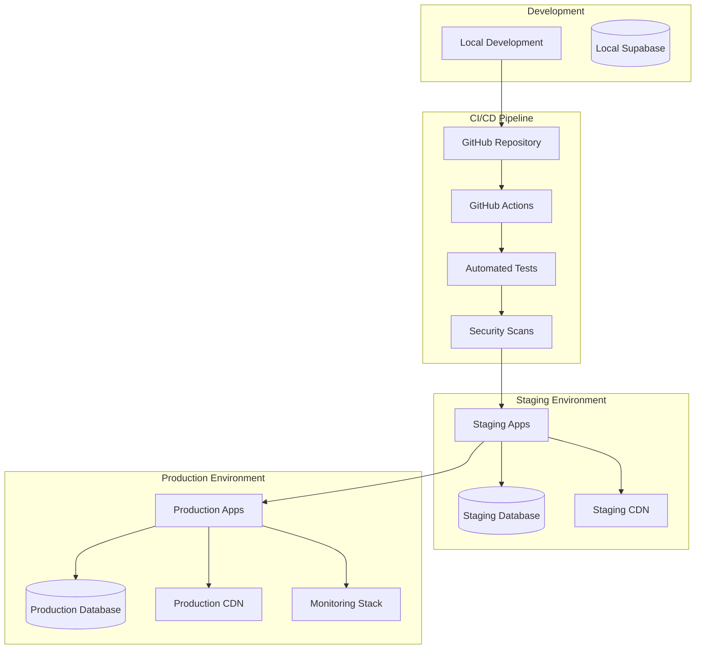

# Deployment Documentation

This directory contains comprehensive deployment guides, infrastructure configuration, and operational procedures for deploying and maintaining Thorbis Business OS applications in production environments.

## Overview

The Thorbis Business OS deployment architecture is designed for scalability, reliability, and performance. Our deployment strategy leverages modern cloud infrastructure, containerization, and automated CI/CD pipelines to ensure consistent, reliable deployments across all environments.

### Deployment Philosophy

- **Infrastructure as Code**: All infrastructure defined in version-controlled configuration
- **Automated Pipelines**: Fully automated CI/CD with comprehensive testing gates
- **Multi-Environment Strategy**: Development → Staging → Production progression
- **Zero-Downtime Deployments**: Blue-green and rolling deployment strategies
- **Monitoring-First**: Comprehensive observability from day one
- **Security by Default**: Security hardening at every layer

## Quick Start

### Prerequisites
- Access to Vercel deployment platform
- GitHub repository with proper permissions  
- Supabase project for database services
- Environment-specific configuration files

### Basic Deployment Process
1. **Environment Setup** - Configure deployment environments
2. **CI/CD Pipeline** - Set up automated testing and deployment
3. **Infrastructure Provisioning** - Deploy supporting services
4. **Application Deployment** - Deploy applications to target environment
5. **Post-Deployment Verification** - Validate deployment success
6. **Monitoring Setup** - Configure observability and alerting

## Documentation Structure

### 📋 Deployment Guides

#### [01. Environment Setup](./01-environment-setup.md)
Comprehensive guide for configuring deployment environments across development, staging, and production.

**Contents:**
- Environment configuration management
- Secrets and credentials handling
- Infrastructure prerequisites
- Network and security setup

#### [02. CI/CD Pipeline Configuration](./02-cicd-pipeline.md)
Complete CI/CD pipeline setup with automated testing, security scanning, and deployment.

**Contents:**
- GitHub Actions workflow configuration
- Automated testing integration
- Security and vulnerability scanning
- Deployment automation strategies

#### [03. Infrastructure Provisioning](./03-infrastructure-provisioning.md)
Infrastructure setup and provisioning using Infrastructure as Code principles.

**Contents:**
- Vercel platform configuration
- Database infrastructure setup
- CDN and edge network configuration
- Monitoring infrastructure deployment

#### [04. Application Deployment](./04-application-deployment.md)
Step-by-step application deployment procedures for all Thorbis Business OS applications.

**Contents:**
- Multi-app deployment strategies
- Industry-specific deployment considerations
- Environment-specific configurations
- Deployment verification procedures

#### [05. Database Migration](./05-database-migration.md)
Database schema management and migration procedures for production environments.

**Contents:**
- Migration strategy and planning
- Production migration procedures
- Rollback and recovery processes
- Data integrity verification

#### [06. Security Hardening](./06-security-hardening.md)
Production security configuration and hardening procedures.

**Contents:**
- Security headers and policies
- SSL/TLS certificate management
- Access control and authentication
- Security monitoring and alerting

#### [07. Monitoring and Observability](./07-monitoring-observability.md)
Comprehensive monitoring, logging, and observability setup for production environments.

**Contents:**
- Application performance monitoring
- Infrastructure monitoring
- Log aggregation and analysis
- Alert configuration and management

#### [08. Backup and Recovery](./08-backup-recovery.md)
Backup strategies and disaster recovery procedures for production systems.

**Contents:**
- Automated backup procedures
- Recovery planning and procedures
- Business continuity strategies
- Disaster recovery testing

#### [09. Troubleshooting and Maintenance](./09-troubleshooting-maintenance.md)
Common deployment issues, troubleshooting procedures, and ongoing maintenance tasks.

**Contents:**
- Common deployment issues
- Debugging deployment problems
- Performance troubleshooting
- Routine maintenance procedures

## Architecture Overview

### Deployment Architecture



### Technology Stack

#### **Platform Services**
- **Vercel**: Application hosting and edge network
- **Supabase**: Database and backend services
- **GitHub**: Source control and CI/CD
- **Cloudflare**: DNS and additional CDN services

#### **Monitoring and Observability**
- **Sentry**: Error tracking and performance monitoring
- **DataDog**: Infrastructure and application monitoring
- **LogRocket**: User session recording and debugging
- **Uptime Robot**: Uptime monitoring and alerting

#### **Security Services**
- **Vercel Security**: Built-in security features
- **GitHub Security**: Vulnerability scanning
- **Let's Encrypt**: SSL certificate management
- **OWASP ZAP**: Security testing and scanning

## Environment Strategy

### Environment Hierarchy

```typescript
interface DeploymentEnvironment {
  name: 'development' | 'staging' | 'production'
  purpose: string
  infrastructure: InfrastructureConfig
  security: SecurityConfig
  monitoring: MonitoringConfig
}

const environments: DeploymentEnvironment[] = [
  {
    name: 'development',
    purpose: 'Local development and feature testing',
    infrastructure: {
      hosting: 'local',
      database: 'local-supabase',
      cdn: 'disabled'
    },
    security: {
      level: 'relaxed',
      ssl: false,
      monitoring: 'minimal'
    }
  },
  {
    name: 'staging',
    purpose: 'Integration testing and pre-production validation',
    infrastructure: {
      hosting: 'vercel-preview',
      database: 'supabase-staging',
      cdn: 'vercel-edge'
    },
    security: {
      level: 'standard',
      ssl: true,
      monitoring: 'comprehensive'
    }
  },
  {
    name: 'production',
    purpose: 'Live customer-facing applications',
    infrastructure: {
      hosting: 'vercel-production',
      database: 'supabase-production',
      cdn: 'vercel-edge-global'
    },
    security: {
      level: 'maximum',
      ssl: true,
      monitoring: 'real-time'
    }
  }
]
```

### Deployment Flow

1. **Development** → Feature development and local testing
2. **Integration** → Automated testing and code quality checks
3. **Staging** → Integration testing and user acceptance testing
4. **Production** → Live deployment with monitoring and rollback capability

## Security Considerations

### Deployment Security

- **Secrets Management**: Environment variables and API keys secured
- **Access Control**: Role-based access to deployment resources
- **Network Security**: Proper firewall and network segmentation
- **Data Protection**: Encryption in transit and at rest
- **Compliance**: SOC 2, GDPR, and industry-specific requirements

### Security Checklist

- [ ] All secrets stored in secure environment variables
- [ ] SSL/TLS certificates properly configured
- [ ] Security headers implemented and tested
- [ ] Database access restricted and monitored
- [ ] API endpoints secured with proper authentication
- [ ] Regular security scans and vulnerability assessments
- [ ] Incident response procedures documented and tested

## Performance Optimization

### NextFaster Deployment

Our deployment strategy implements the NextFaster performance doctrine:

- **Sub-300ms Navigation**: Aggressive prefetching and edge caching
- **170KB JavaScript Budget**: Optimized bundles and code splitting
- **Server-First Rendering**: Minimize client-side hydration
- **Edge Computing**: Global CDN with intelligent caching

### Performance Monitoring

- **Core Web Vitals**: Continuous monitoring of LCP, FID, CLS
- **Bundle Analysis**: Automated bundle size tracking
- **Performance Budgets**: Automated alerts for performance regressions
- **Real User Monitoring**: Production performance metrics

## Operational Excellence

### Deployment Best Practices

1. **Automated Testing**: Comprehensive test coverage before deployment
2. **Gradual Rollouts**: Canary deployments and feature flags
3. **Monitoring First**: Observability setup before application deployment
4. **Rollback Ready**: Always maintain rollback capabilities
5. **Documentation**: Keep deployment procedures up-to-date

### Quality Gates

- **Code Quality**: Linting, type checking, and code review
- **Security**: Vulnerability scanning and security testing
- **Performance**: Bundle size and performance testing
- **Functionality**: Automated integration and E2E testing
- **Compatibility**: Cross-browser and device testing

## Getting Started

### For New Deployments

1. **Review Prerequisites**: Ensure all required services and access
2. **Environment Setup**: Configure deployment environments
3. **Pipeline Configuration**: Set up CI/CD automation
4. **Infrastructure Deployment**: Provision required infrastructure
5. **Application Deployment**: Deploy applications with verification
6. **Monitoring Setup**: Configure observability and alerting

### For Existing Deployments

1. **Review Current State**: Assess current deployment configuration
2. **Update Documentation**: Ensure procedures are current
3. **Validate Security**: Review and update security configurations
4. **Performance Audit**: Check performance against targets
5. **Disaster Recovery Test**: Validate backup and recovery procedures

## Support and Resources

### Documentation Resources
- [Development Guide](../development/README.md) - Development setup and workflows
- [Operations Guide](../operations/README.md) - Ongoing operational procedures
- [Security Architecture](../core/SECURITY-ARCHITECTURE.md) - Security implementation details
- [API Documentation](../core/API-ARCHITECTURE.md) - API design and integration

### External Resources
- [Vercel Documentation](https://vercel.com/docs) - Platform-specific deployment guides
- [Supabase Deployment](https://supabase.com/docs/guides/platform) - Database deployment
- [Next.js Deployment](https://nextjs.org/docs/deployment) - Application deployment optimization
- [GitHub Actions](https://docs.github.com/en/actions) - CI/CD automation

### Support Channels
- **Internal Slack**: #deployment-support for immediate assistance
- **GitHub Issues**: Report deployment issues and improvements
- **Deployment Wiki**: Internal knowledge base and troubleshooting
- **On-Call Support**: 24/7 support for production issues

---

*This documentation is continuously updated to reflect the current deployment procedures and best practices. For questions or suggestions, please reach out through the appropriate support channels.*

**Last Updated:** 2025-01-31  
**Version:** 1.0.0  
**Next Update:** As needed based on platform changes