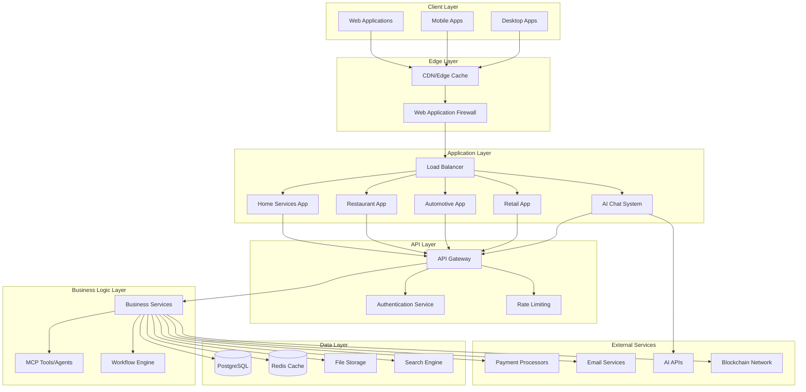

# Architecture Overview

This guide provides a comprehensive overview of the Thorbis Business OS architecture, covering system design patterns, technology choices, and architectural principles that guide development decisions.

## System Architecture

### High-Level Architecture



### Architectural Principles

#### 1. Industry Separation
**Principle**: Each business vertical operates as a separate application with shared infrastructure.

```typescript
// Industry-specific routing structure
const industryRoutes = {
  homeServices: '/hs/*',
  restaurant: '/rest/*', 
  automotive: '/auto/*',
  retail: '/ret/*'
} as const

// Shared infrastructure, separate business logic
interface IndustryApp {
  routes: string
  database: DatabaseSchema
  apis: APINamespace
  components: ComponentLibrary
}
```

**Benefits**:
- **Focused Development**: Teams can specialize in specific industries
- **Customized UX**: Tailored interfaces for different business needs
- **Scalable Architecture**: Independent scaling per industry
- **Reduced Complexity**: Simplified code organization and maintenance

#### 2. Multi-Tenant by Design
**Principle**: Every data operation includes tenant isolation at the database level.

```sql
-- All business tables include tenant isolation
CREATE TABLE customers (
  id UUID PRIMARY KEY DEFAULT gen_random_uuid(),
  business_id UUID NOT NULL REFERENCES businesses(id),
  name TEXT NOT NULL,
  email TEXT,
  created_at TIMESTAMPTZ DEFAULT now(),
  updated_at TIMESTAMPTZ DEFAULT now()
);

-- Row Level Security policies enforce tenant isolation
CREATE POLICY "Users can only see their business customers" 
ON customers 
FOR ALL 
USING (business_id = get_current_business_id());
```

**Implementation**:
- **Database Level**: RLS policies on all tables
- **Application Level**: Automatic tenant context injection
- **API Level**: Tenant validation in all endpoints
- **UI Level**: Tenant-scoped data display

#### 3. NextFaster Performance
**Principle**: Sub-300ms navigation with aggressive optimization strategies.

```typescript
// NextFaster implementation patterns
export const NextFasterConfig = {
  // Bundle size limits
  javascriptBudget: '170KB',
  cssBudget: '50KB',
  
  // Performance targets
  timeToInteractive: '300ms',
  firstContentfulPaint: '1.8s',
  
  // Optimization strategies
  serverFirst: true,
  aggressivePrefetching: true,
  staleWhileRevalidate: true,
  noLoadingSpinners: true
} as const
```

**Techniques**:
- **Server-First Rendering**: Minimize client-side hydration
- **Aggressive Prefetching**: Preload likely navigation targets
- **Bundle Optimization**: Code splitting and tree shaking
- **Edge Caching**: CDN with intelligent cache policies

#### 4. Security-First Design
**Principle**: Zero-trust architecture with verification at every layer.

```typescript
// Security layers implementation
interface SecurityLayer {
  authentication: 'Supabase Auth with 2FA'
  authorization: 'Row Level Security + RBAC'
  dataProtection: 'Encryption at rest and in transit'
  apiSecurity: 'Rate limiting + input validation'
  auditTrail: 'Complete action logging'
  blockchain: 'Critical operation verification'
}
```

## Monorepo Structure

### Repository Organization

```
thorbis-business-os/
├── apps/                           # Industry-specific applications
│   ├── hs/                        # Home Services (/hs/ routes)
│   │   ├── src/
│   │   │   ├── app/               # Next.js 15 App Router
│   │   │   │   ├── (dashboard)/   # Dashboard layout group
│   │   │   │   ├── api/hs/        # Industry-specific APIs
│   │   │   │   └── globals.css    # Odixe design system styles
│   │   │   ├── components/        # Industry-specific components
│   │   │   ├── lib/               # Utilities and helpers
│   │   │   └── types/             # TypeScript definitions
│   │   ├── next.config.js         # Next.js configuration
│   │   ├── tailwind.config.js     # Industry-customized Tailwind
│   │   └── package.json           # App dependencies
│   │
│   ├── rest/                      # Restaurant (/rest/ routes)
│   ├── auto/                      # Automotive (/auto/ routes)  
│   ├── ret/                       # Retail (/ret/ routes)
│   ├── site/                      # Marketing site (root routes)
│   └── ai/                        # AI Chat interface
│
├── packages/                      # Shared libraries
│   ├── ui/                        # Odixe Design System
│   │   ├── src/
│   │   │   ├── components/        # Reusable UI components
│   │   │   ├── hooks/             # Custom React hooks
│   │   │   ├── utils/             # UI utilities
│   │   │   └── index.ts           # Public API
│   │   ├── tailwind.config.js     # Base Tailwind configuration
│   │   └── package.json           # UI package dependencies
│   │
│   ├── design/                    # Design tokens and themes
│   │   ├── tokens/                # Odixe design tokens
│   │   ├── themes/                # Dark/light theme configurations
│   │   └── animations/            # Animation definitions
│   │
│   ├── schemas/                   # Validation schemas
│   │   ├── customers/             # Customer-related schemas
│   │   ├── orders/                # Order/job schemas
│   │   └── shared/                # Common validation patterns
│   │
│   ├── auth/                      # Authentication utilities
│   ├── billing/                   # Stripe integration
│   ├── agent/                     # MCP tools and AI agents
│   └── blockchain/                # Blockchain integration
│
├── database/                      # Database schema and migrations
│   ├── migrations/                # Supabase migrations
│   ├── functions/                 # PostgreSQL functions
│   ├── types/                     # Generated TypeScript types
│   └── seed/                      # Sample data scripts
│
├── docs/                          # Documentation
├── tools/                         # Development and build tools
└── .github/                       # GitHub Actions and workflows
```

### Package Dependencies

#### Application Dependencies
```json
{
  "name": "@thorbis/hs",
  "dependencies": {
    "@thorbis/ui": "workspace:*",
    "@thorbis/design": "workspace:*", 
    "@thorbis/schemas": "workspace:*",
    "@thorbis/auth": "workspace:*",
    "next": "15.0.0",
    "react": "18.2.0",
    "typescript": "5.0.0"
  },
  "devDependencies": {
    "@thorbis/tooling": "workspace:*",
    "tailwindcss": "3.3.0",
    "vitest": "1.0.0"
  }
}
```

#### Shared Package Structure
```typescript
// packages/ui/src/index.ts - Public API
export * from './components'
export * from './hooks'
export * from './utils'
export * from './types'

// Component exports
export {
  Button,
  Input,
  DataTable,
  EntityForm,
  AppLayout,
  Navigation
} from './components'

// Hook exports
export {
  useAuth,
  useToast,
  useLocalStorage,
  useDebounce
} from './hooks'
```

## Technology Stack

### Frontend Technologies

#### Core Framework
```typescript
// Next.js 15 with App Router
const nextConfig = {
  experimental: {
    appDir: true,
    serverComponentsExternalPackages: ['@supabase/supabase-js']
  },
  
  // NextFaster optimizations
  swcMinify: true,
  compress: true,
  
  // Bundle analysis
  bundleAnalyzer: {
    enabled: process.env.ANALYZE === 'true'
  }
}
```

#### Styling System
```typescript
// Tailwind CSS with Odixe design tokens
const tailwindConfig = {
  content: ['./src/**/*.{js,ts,jsx,tsx}'],
  
  theme: {
    extend: {
      colors: {
        // Odixe color system
        primary: {
          50: '#eff6ff',
          500: '#1C8BFF', // Odixe Electric Blue
          900: '#0f172a'
        },
        
        // Dark-first neutral palette
        surface: {
          primary: '#0A0B0D',    // Odixe Base
          secondary: '#0D0F13',   // Odixe Surface
          elevated: '#171A21'     // Odixe Elevated
        }
      },
      
      // Odixe typography scale
      fontSize: {
        'display': ['2rem', { lineHeight: '2.375rem' }],
        'h1': ['1.5rem', { lineHeight: '1.875rem' }],
        'body': ['0.875rem', { lineHeight: '1.25rem' }]
      }
    }
  }
}
```

#### State Management
```typescript
// React Server Components + Client State
interface AppState {
  // Server state (from database)
  customers: Customer[]
  orders: Order[]
  
  // Client state (UI interactions)
  selectedCustomer: Customer | null
  isLoading: boolean
  
  // Optimistic updates
  optimisticUpdates: OptimisticUpdate[]
}

// Custom hooks for state management
export function useCustomers() {
  const [customers, setCustomers] = useState<Customer[]>([])
  
  // Server state synchronization
  useEffect(() => {
    const subscription = supabase
      .channel('customers')
      .on('postgres_changes', { 
        event: '*', 
        schema: 'public', 
        table: 'customers' 
      }, handleCustomerChange)
      .subscribe()
      
    return () => subscription.unsubscribe()
  }, [])
  
  return { customers, setCustomers }
}
```

### Backend Technologies

#### Database Architecture
```sql
-- PostgreSQL with Row Level Security
-- Multi-tenant architecture with complete isolation

-- Business table (tenant boundary)
CREATE TABLE businesses (
  id UUID PRIMARY KEY DEFAULT gen_random_uuid(),
  name TEXT NOT NULL,
  industry TEXT NOT NULL CHECK (industry IN ('home-services', 'restaurant', 'automotive', 'retail')),
  settings JSONB DEFAULT '{}',
  created_at TIMESTAMPTZ DEFAULT now(),
  updated_at TIMESTAMPTZ DEFAULT now()
);

-- Customer table with tenant isolation
CREATE TABLE customers (
  id UUID PRIMARY KEY DEFAULT gen_random_uuid(),
  business_id UUID NOT NULL REFERENCES businesses(id) ON DELETE CASCADE,
  name TEXT NOT NULL,
  email TEXT UNIQUE,
  phone TEXT,
  address JSONB,
  metadata JSONB DEFAULT '{}',
  created_at TIMESTAMPTZ DEFAULT now(),
  updated_at TIMESTAMPTZ DEFAULT now()
);

-- RLS policies for tenant isolation
ALTER TABLE customers ENABLE ROW LEVEL SECURITY;

CREATE POLICY "tenant_isolation" ON customers
  FOR ALL USING (business_id = current_setting('app.current_business_id')::UUID);
```

#### API Layer
```typescript
// Industry-specific API namespaces
const apiRoutes = {
  homeServices: {
    customers: '/api/hs/customers',
    workOrders: '/api/hs/work-orders',
    scheduling: '/api/hs/scheduling',
    invoices: '/api/hs/invoices'
  },
  
  restaurant: {
    customers: '/api/rest/customers', 
    orders: '/api/rest/orders',
    menu: '/api/rest/menu',
    reservations: '/api/rest/reservations'
  }
} as const

// API middleware stack
export async function apiHandler(
  request: Request,
  { params }: { params: { industry: string; endpoint: string } }
) {
  // 1. Authentication
  const user = await authenticateUser(request)
  
  // 2. Authorization 
  await authorizeAccess(user, params.industry)
  
  // 3. Rate limiting
  await checkRateLimit(user.id, request.url)
  
  // 4. Tenant context
  await setTenantContext(user.businessId)
  
  // 5. Business logic
  return await executeBusinessLogic(params.endpoint, request)
}
```

### AI and Automation

#### Model Context Protocol (MCP)
```typescript
// MCP tool definitions for business operations
interface MCPTool {
  name: string
  description: string
  inputSchema: JSONSchema
  handler: (input: unknown) => Promise<unknown>
}

const businessTools: MCPTool[] = [
  {
    name: 'get_customer_info',
    description: 'Retrieve customer information and history',
    inputSchema: {
      type: 'object',
      properties: {
        customerId: { type: 'string' },
        includeHistory: { type: 'boolean' }
      }
    },
    handler: async ({ customerId, includeHistory }) => {
      return await getCustomerWithHistory(customerId, includeHistory)
    }
  },
  
  {
    name: 'create_work_order',
    description: 'Create a new work order for a customer',
    inputSchema: {
      type: 'object',
      properties: {
        customerId: { type: 'string' },
        serviceType: { type: 'string' },
        description: { type: 'string' },
        priority: { type: 'string' }
      }
    },
    handler: async (input) => {
      // Confirmation required for write operations
      return await createWorkOrderWithConfirmation(input)
    }
  }
]
```

#### AI Safety Framework
```typescript
interface AISafetyConfig {
  // All write operations require confirmation
  confirmationRequired: boolean
  
  // Budget limits per user/tenant
  dailyBudget: number
  monthlyBudget: number
  
  // Audit all AI interactions
  auditTrail: boolean
  
  // Content filtering
  contentFilters: string[]
  
  // Rate limiting
  requestsPerMinute: number
  requestsPerDay: number
}

const aiSafetyConfig: AISafetyConfig = {
  confirmationRequired: true,
  dailyBudget: 1000,
  monthlyBudget: 10000,
  auditTrail: true,
  contentFilters: ['pii', 'financial', 'sensitive'],
  requestsPerMinute: 60,
  requestsPerDay: 1000
}
```

## Data Architecture

### Database Design Patterns

#### Multi-Tenancy Implementation
```sql
-- Shared schema with tenant isolation
-- Pattern: All tables have business_id foreign key

-- Helper function for tenant context
CREATE OR REPLACE FUNCTION get_current_business_id()
RETURNS UUID AS $$
BEGIN
  RETURN current_setting('app.current_business_id', true)::UUID;
EXCEPTION WHEN OTHERS THEN
  RETURN NULL;
END;
$$ LANGUAGE plpgsql;

-- RLS policy template
CREATE OR REPLACE FUNCTION create_tenant_policy(table_name TEXT)
RETURNS VOID AS $$
BEGIN
  EXECUTE format('
    ALTER TABLE %I ENABLE ROW LEVEL SECURITY;
    
    CREATE POLICY "tenant_isolation" ON %I
      FOR ALL 
      USING (business_id = get_current_business_id());
      
    CREATE POLICY "service_role_bypass" ON %I
      FOR ALL
      USING (current_setting(''role'') = ''service_role'');
  ', table_name, table_name, table_name);
END;
$$ LANGUAGE plpgsql;
```

#### Industry-Specific Extensions
```sql
-- Home Services specific tables
CREATE TABLE work_orders (
  id UUID PRIMARY KEY DEFAULT gen_random_uuid(),
  business_id UUID NOT NULL REFERENCES businesses(id),
  customer_id UUID NOT NULL REFERENCES customers(id),
  service_type TEXT NOT NULL,
  status TEXT NOT NULL DEFAULT 'scheduled',
  scheduled_at TIMESTAMPTZ,
  completed_at TIMESTAMPTZ,
  technician_id UUID REFERENCES users(id),
  parts_used JSONB DEFAULT '[]',
  labor_hours DECIMAL(5,2),
  total_amount DECIMAL(10,2),
  created_at TIMESTAMPTZ DEFAULT now()
);

-- Restaurant specific tables  
CREATE TABLE orders (
  id UUID PRIMARY KEY DEFAULT gen_random_uuid(),
  business_id UUID NOT NULL REFERENCES businesses(id),
  customer_id UUID REFERENCES customers(id),
  table_number INTEGER,
  order_type TEXT NOT NULL CHECK (order_type IN ('dine_in', 'takeout', 'delivery')),
  items JSONB NOT NULL,
  status TEXT NOT NULL DEFAULT 'pending',
  total_amount DECIMAL(10,2) NOT NULL,
  created_at TIMESTAMPTZ DEFAULT now()
);
```

### Caching Strategy

#### Multi-Layer Caching
```typescript
interface CacheStrategy {
  // L1: In-memory cache (React state)
  memoryCache: Map<string, CachedData>
  
  // L2: Browser cache (localStorage/sessionStorage)
  browserCache: BrowserStorage
  
  // L3: Redis cache (server-side)
  redisCache: RedisClient
  
  // L4: CDN cache (edge locations)
  cdnCache: CDNConfig
}

// Cache implementation
export class DataCache implements CacheStrategy {
  async get<T>(key: string): Promise<T | null> {
    // Try L1 cache first
    if (this.memoryCache.has(key)) {
      return this.memoryCache.get(key) as T
    }
    
    // Try L2 browser cache  
    const browserData = await this.browserCache.get(key)
    if (browserData) {
      this.memoryCache.set(key, browserData)
      return browserData as T
    }
    
    // Try L3 Redis cache
    const redisData = await this.redisCache.get(key)
    if (redisData) {
      this.browserCache.set(key, redisData)
      this.memoryCache.set(key, redisData)
      return redisData as T
    }
    
    return null
  }
  
  async set<T>(key: string, data: T, ttl: number): Promise<void> {
    // Set in all cache layers
    this.memoryCache.set(key, data)
    await this.browserCache.set(key, data, ttl)
    await this.redisCache.set(key, data, ttl)
  }
}
```

## Security Architecture

### Authentication and Authorization

#### Supabase Auth Integration
```typescript
// Authentication configuration
const supabaseConfig = {
  url: process.env.NEXT_PUBLIC_SUPABASE_URL,
  anonKey: process.env.NEXT_PUBLIC_SUPABASE_ANON_KEY,
  
  auth: {
    // Multi-factor authentication
    mfa: {
      enabled: true,
      factorType: 'totp'
    },
    
    // Session configuration  
    sessionRefresh: true,
    sessionTimeout: 3600, // 1 hour
    
    // Password requirements
    passwordPolicy: {
      minLength: 12,
      requireUppercase: true,
      requireLowercase: true, 
      requireNumbers: true,
      requireSymbols: true
    }
  }
}

// Role-based access control
interface UserRole {
  name: 'owner' | 'manager' | 'staff' | 'viewer' | 'api_partner'
  permissions: Permission[]
  restrictions: Restriction[]
}

const roleDefinitions: Record<string, UserRole> = {
  owner: {
    name: 'owner',
    permissions: ['*'], // Full access
    restrictions: []
  },
  
  manager: {
    name: 'manager', 
    permissions: [
      'customers:*',
      'orders:*',
      'reports:read',
      'settings:limited'
    ],
    restrictions: [
      'no_billing_access',
      'no_user_management'
    ]
  },
  
  staff: {
    name: 'staff',
    permissions: [
      'customers:read',
      'customers:update', 
      'orders:create',
      'orders:update'
    ],
    restrictions: [
      'no_delete_access',
      'no_financial_data'
    ]
  }
}
```

### Data Protection

#### Encryption at Rest and in Transit
```typescript
// Encryption configuration
const encryptionConfig = {
  // Database encryption
  database: {
    atRest: 'AES-256',
    inTransit: 'TLS 1.3',
    columnLevel: ['pii_data', 'financial_data']
  },
  
  // API encryption  
  api: {
    transport: 'HTTPS',
    payloads: 'JWE',
    keys: 'RS256'
  },
  
  // File storage encryption
  storage: {
    atRest: 'AES-256',
    inTransit: 'TLS 1.3',
    clientSide: true
  }
}

// PII detection and protection
export function detectAndProtectPII(data: unknown): unknown {
  const piiPatterns = {
    ssn: /\b\d{3}-\d{2}-\d{4}\b/g,
    creditCard: /\b\d{4}[\s-]?\d{4}[\s-]?\d{4}[\s-]?\d{4}\b/g,
    phone: /\b\d{3}[-.]?\d{3}[-.]?\d{4}\b/g,
    email: /\b[A-Za-z0-9._%+-]+@[A-Za-z0-9.-]+\.[A-Z|a-z]{2,}\b/g
  }
  
  let protectedData = JSON.stringify(data)
  
  Object.entries(piiPatterns).forEach(([type, pattern]) => {
    protectedData = protectedData.replace(pattern, `[REDACTED_${type.toUpperCase()}]`)
  })
  
  return JSON.parse(protectedData)
}
```

## Performance Architecture

### NextFaster Implementation

#### Bundle Optimization
```typescript
// webpack.config.js - NextFaster optimizations
const nextFasterConfig = {
  // Code splitting strategy
  splitChunks: {
    chunks: 'all',
    cacheGroups: {
      // Vendor bundle optimization
      vendor: {
        test: /[\\/]node_modules[\\/]/,
        name: 'vendors',
        chunks: 'all',
        maxSize: 170000 // 170KB limit
      },
      
      // Industry-specific bundles
      homeServices: {
        test: /[\\/]apps[\\/]hs[\\/]/,
        name: 'hs',
        chunks: 'all'
      }
    }
  },
  
  // Tree shaking optimization
  usedExports: true,
  sideEffects: false,
  
  // Minification
  minimize: true,
  minimizer: [
    new TerserPlugin({
      terserOptions: {
        compress: {
          drop_console: true,
          drop_debugger: true
        }
      }
    })
  ]
}
```

#### Prefetching Strategy  
```typescript
// Intelligent prefetching implementation
interface PrefetchConfig {
  // Prefetch likely navigation targets
  routes: {
    probability: number
    route: string
    priority: 'high' | 'medium' | 'low'
  }[]
  
  // Prefetch data based on user behavior
  data: {
    entity: string
    conditions: string[]
    cacheTime: number
  }[]
}

export class IntelligentPrefetcher {
  async prefetchLikelyRoutes(currentRoute: string, userRole: string) {
    const predictions = await this.getPredictions(currentRoute, userRole)
    
    predictions.forEach(({ route, probability, priority }) => {
      if (probability > 0.7) {
        // High probability routes - prefetch immediately
        this.prefetchRoute(route, priority)
      } else if (probability > 0.4) {
        // Medium probability - prefetch on hover/focus
        this.setupHoverPrefetch(route)
      }
    })
  }
  
  private async prefetchRoute(route: string, priority: string) {
    if ('requestIdleCallback' in window) {
      requestIdleCallback(() => {
        // Prefetch during browser idle time
        import(/* webpackChunkName: "[request]" */ `@/pages${route}`)
      })
    }
  }
}
```

## Next Steps

After understanding the architecture overview:

1. **[API Development](./03-api-development.md)**: Learn about building RESTful APIs with industry namespaces
2. **[Frontend Development](./04-frontend-development.md)**: Understand Next.js patterns and Odixe design system
3. **[Database Development](./05-database-development.md)**: Master PostgreSQL with RLS and multi-tenancy
4. **[Testing Strategy](./06-testing-strategy.md)**: Implement comprehensive testing approaches

## Architecture Resources

### Design Documents
- **Architecture Decision Records (ADRs)**: Historical design decisions
- **System Design Documents**: Detailed system specifications  
- **Performance Requirements**: NextFaster compliance guidelines
- **Security Architecture**: Zero-trust implementation details

### Tools and Utilities
- **Architecture Diagrams**: Mermaid and Lucidchart diagrams
- **Dependency Analysis**: Tools for analyzing package dependencies
- **Performance Monitoring**: Real-time architecture health monitoring
- **Security Scanning**: Automated architecture security analysis

---

*Last Updated: 2025-01-31*  
*Version: 1.0.0*  
*Previous: [Local Development Setup](./01-local-development-setup.md) | Next: [API Development](./03-api-development.md)*