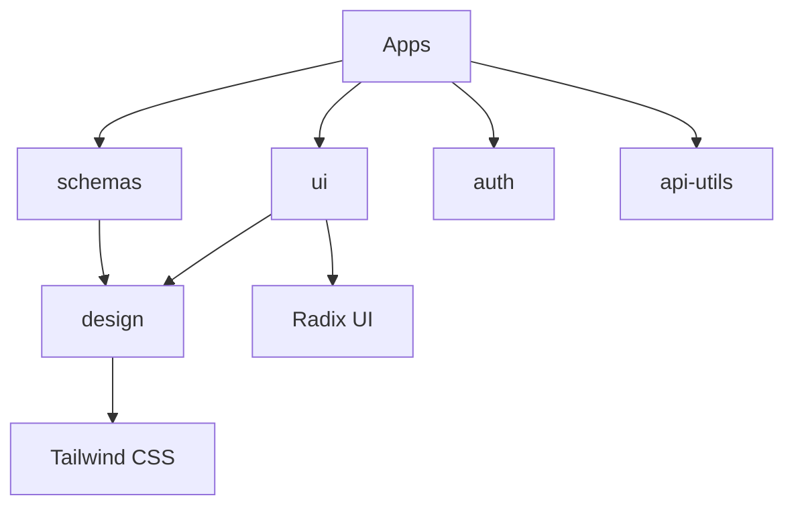

# Shared Package Development Guide

> **Complete guide for developing and maintaining shared packages in the Thorbis Business OS monorepo**
>
> **Time to extend existing package**: 15 minutes  
> **Time to create new package**: 1-2 hours

## 📦 Shared Package Architecture

The Thorbis Business OS uses shared packages to maintain consistency and reduce code duplication across industry applications:

### Current Shared Packages

```
packages/
├── ui/                 # Odixe design system components
├── design/             # Design tokens and themes
├── schemas/            # Industry-specific Zod schemas
├── auth/               # Authentication utilities
├── api-utils/          # API helper functions
├── database/           # Database utilities and types
└── capabilities/       # MCP tools and AI integrations
```

### Package Dependencies



## 🚀 Extending Existing Packages

### Example: Adding a New UI Component

#### Step 1: Navigate to UI Package

```bash
cd packages/ui
```

#### Step 2: Create Component

**packages/ui/src/components/metric-card.tsx**:
```tsx
import React from 'react'
import { cn } from '@/lib/utils'
import { Card } from './card'
import { Badge } from './badge'

interface MetricCardProps {
  title: string
  value: string | number
  change?: {
    value: string | number
    type: 'increase' | 'decrease' | 'neutral'
    period: string
  }
  icon?: React.ReactNode
  description?: string
  className?: string
}

export function MetricCard({
  title,
  value,
  change,
  icon,
  description,
  className,
}: MetricCardProps) {
  const getChangeColor = (type: 'increase' | 'decrease' | 'neutral') => {
    switch (type) {
      case 'increase':
        return 'text-green-600 bg-green-50'
      case 'decrease':
        return 'text-red-600 bg-red-50'
      case 'neutral':
      default:
        return 'text-gray-600 bg-gray-50'
    }
  }

  const getChangeSymbol = (type: 'increase' | 'decrease' | 'neutral') => {
    switch (type) {
      case 'increase':
        return '↗'
      case 'decrease':
        return '↘'
      case 'neutral':
      default:
        return '→'
    }
  }

  return (
    <Card className={cn('p-6', className)}>
      <div className="flex items-center justify-between">
        <div className="flex-1">
          <div className="flex items-center space-x-2">
            {icon && (
              <div className="flex-shrink-0 text-neutral-600">
                {icon}
              </div>
            )}
            <p className="text-sm font-medium text-neutral-600 uppercase tracking-wide">
              {title}
            </p>
          </div>
          
          <p className="mt-2 text-3xl font-bold text-neutral-900">
            {value}
          </p>
          
          {description && (
            <p className="mt-1 text-sm text-neutral-500">
              {description}
            </p>
          )}
        </div>

        {change && (
          <div className="flex-shrink-0">
            <Badge 
              className={cn(
                'px-2 py-1 text-xs font-semibold',
                getChangeColor(change.type)
              )}
            >
              <span className="mr-1">
                {getChangeSymbol(change.type)}
              </span>
              {change.value}
            </Badge>
            <p className="mt-1 text-xs text-neutral-500 text-right">
              vs {change.period}
            </p>
          </div>
        )}
      </div>
    </Card>
  )
}
```

#### Step 3: Export Component

**packages/ui/src/components/index.ts**:
```tsx
// ... existing exports
export { MetricCard } from './metric-card'
```

**packages/ui/src/index.ts**:
```tsx
// ... existing exports
export { MetricCard } from './components/metric-card'
```

#### Step 4: Build and Test

```bash
# From packages/ui directory
pnpm build

# Test in an app
cd ../../apps/hs
pnpm dev
```

#### Step 5: Use in Applications

```tsx
// apps/hs/src/components/dashboard/metrics.tsx
import { MetricCard } from '@thorbis/ui'
import { Users, Calendar, DollarSign, TrendingUp } from 'lucide-react'

export function DashboardMetrics() {
  return (
    <div className="grid grid-cols-1 gap-6 md:grid-cols-2 lg:grid-cols-4">
      <MetricCard
        title="Total Customers"
        value="2,341"
        icon={<Users className="h-5 w-5" />}
        change={{
          value: "+12.5%",
          type: "increase",
          period: "last month"
        }}
      />
      
      <MetricCard
        title="Active Jobs"
        value="156"
        icon={<Calendar className="h-5 w-5" />}
        change={{
          value: "+8.2%",
          type: "increase",
          period: "last week"
        }}
      />
      
      <MetricCard
        title="Revenue"
        value="$54,231"
        icon={<DollarSign className="h-5 w-5" />}
        change={{
          value: "-2.1%",
          type: "decrease",
          period: "last month"
        }}
      />
      
      <MetricCard
        title="Efficiency"
        value="94.2%"
        icon={<TrendingUp className="h-5 w-5" />}
        description="Average completion rate"
        change={{
          value: "+5.4%",
          type: "increase",
          period: "last quarter"
        }}
      />
    </div>
  )
}
```

### Example: Adding Schema Validation

#### Step 1: Add Industry Schema

**packages/schemas/src/hs/metrics.ts**:
```tsx
import { z } from 'zod'

export const metricSchema = z.object({
  title: z.string(),
  value: z.union([z.string(), z.number()]),
  change: z.object({
    value: z.union([z.string(), z.number()]),
    type: z.enum(['increase', 'decrease', 'neutral']),
    period: z.string(),
  }).optional(),
  icon: z.string().optional(),
  description: z.string().optional(),
})

export const dashboardMetricsSchema = z.object({
  metrics: z.array(metricSchema),
  period: z.string(),
  refreshedAt: z.string().datetime(),
})

export type Metric = z.infer<typeof metricSchema>
export type DashboardMetrics = z.infer<typeof dashboardMetricsSchema>
```

#### Step 2: Export from Industry Package

**packages/schemas/src/hs/index.ts**:
```tsx
// ... existing exports
export * from './metrics'
```

#### Step 3: Use in Applications

```tsx
import { metricSchema, type Metric } from '@thorbis/schemas/hs'

function validateMetric(data: unknown): Metric {
  return metricSchema.parse(data)
}

// Use with API responses
const metrics = await fetch('/api/metrics')
  .then(res => res.json())
  .then(data => data.map(validateMetric))
```

## 🏗️ Creating a New Shared Package

### Example: Creating a `notifications` Package

#### Step 1: Create Package Structure

```bash
mkdir -p packages/notifications
cd packages/notifications

# Create directory structure
mkdir -p src/{components,hooks,lib,types}
mkdir -p src/__tests__
```

#### Step 2: Initialize Package

**packages/notifications/package.json**:
```json
{
  "name": "@thorbis/notifications",
  "version": "0.1.0",
  "description": "Real-time notification system for Thorbis Business OS",
  "main": "dist/index.js",
  "types": "dist/index.d.ts",
  "exports": {
    ".": {
      "import": "./dist/index.js",
      "require": "./dist/index.js",
      "types": "./dist/index.d.ts"
    },
    "./components/*": {
      "import": "./dist/components/*.js",
      "require": "./dist/components/*.js",
      "types": "./dist/components/*.d.ts"
    },
    "./hooks/*": {
      "import": "./dist/hooks/*.js",
      "require": "./dist/hooks/*.js",
      "types": "./dist/hooks/*.d.ts"
    }
  },
  "files": [
    "dist",
    "components",
    "hooks"
  ],
  "scripts": {
    "build": "tsup",
    "dev": "tsup --watch",
    "type-check": "tsc --noEmit",
    "lint": "eslint src --ext .ts,.tsx",
    "test": "vitest",
    "clean": "rm -rf dist"
  },
  "dependencies": {
    "@thorbis/ui": "workspace:*",
    "@supabase/supabase-js": "^2.47.10",
    "lucide-react": "^0.263.1",
    "zustand": "^4.4.1"
  },
  "peerDependencies": {
    "react": "^19.1.0",
    "react-dom": "^19.1.0"
  },
  "devDependencies": {
    "@types/react": "^19.0.2",
    "@types/react-dom": "^19.0.2",
    "eslint": "^9.17.0",
    "tsup": "^7.2.0",
    "typescript": "^5.7.2",
    "vitest": "^1.0.0"
  }
}
```

#### Step 3: Configure Build Tool

**packages/notifications/tsup.config.ts**:
```tsx
import { defineConfig } from 'tsup'

export default defineConfig({
  entry: [
    'src/index.ts',
    'src/components/index.ts',
    'src/hooks/index.ts',
  ],
  format: ['esm'],
  dts: true,
  sourcemap: true,
  clean: true,
  external: ['react', 'react-dom'],
  esbuildOptions(options) {
    options.jsx = 'automatic'
  },
})
```

#### Step 4: Configure TypeScript

**packages/notifications/tsconfig.json**:
```json
{
  "extends": "../../tsconfig.json",
  "compilerOptions": {
    "baseUrl": ".",
    "paths": {
      "@/*": ["./src/*"]
    },
    "declaration": true,
    "declarationMap": true,
    "outDir": "dist"
  },
  "include": [
    "src/**/*"
  ],
  "exclude": [
    "node_modules",
    "dist",
    "**/*.test.*"
  ]
}
```

#### Step 5: Create Core Types

**packages/notifications/src/types/index.ts**:
```tsx
export interface Notification {
  id: string
  type: 'info' | 'success' | 'warning' | 'error'
  title: string
  message?: string
  actions?: NotificationAction[]
  persistent?: boolean
  timeout?: number
  createdAt: Date
  readAt?: Date
  metadata?: Record<string, any>
}

export interface NotificationAction {
  label: string
  action: () => void | Promise<void>
  style?: 'primary' | 'secondary' | 'danger'
}

export interface NotificationStore {
  notifications: Notification[]
  unreadCount: number
  addNotification: (notification: Omit<Notification, 'id' | 'createdAt'>) => void
  removeNotification: (id: string) => void
  markAsRead: (id: string) => void
  markAllAsRead: () => void
  clearAll: () => void
}

export interface NotificationProviderProps {
  children: React.ReactNode
  maxNotifications?: number
  defaultTimeout?: number
}
```

#### Step 6: Create Store

**packages/notifications/src/lib/store.ts**:
```tsx
import { create } from 'zustand'
import { persist } from 'zustand/middleware'
import { Notification, NotificationStore } from '../types'

export const useNotificationStore = create<NotificationStore>()(
  persist(
    (set, get) => ({
      notifications: [],
      unreadCount: 0,

      addNotification: (notificationData) => {
        const notification: Notification = {
          ...notificationData,
          id: crypto.randomUUID(),
          createdAt: new Date(),
        }

        set((state) => ({
          notifications: [notification, ...state.notifications],
          unreadCount: state.unreadCount + 1,
        }))

        // Auto-remove non-persistent notifications
        if (!notification.persistent) {
          const timeout = notification.timeout || 5000
          setTimeout(() => {
            get().removeNotification(notification.id)
          }, timeout)
        }
      },

      removeNotification: (id) => {
        set((state) => ({
          notifications: state.notifications.filter((n) => n.id !== id),
          unreadCount: state.notifications.find((n) => n.id === id && !n.readAt)
            ? state.unreadCount - 1
            : state.unreadCount,
        }))
      },

      markAsRead: (id) => {
        set((state) => ({
          notifications: state.notifications.map((n) =>
            n.id === id ? { ...n, readAt: new Date() } : n
          ),
          unreadCount: state.notifications.find((n) => n.id === id && !n.readAt)
            ? state.unreadCount - 1
            : state.unreadCount,
        }))
      },

      markAllAsRead: () => {
        set((state) => ({
          notifications: state.notifications.map((n) => ({
            ...n,
            readAt: n.readAt || new Date(),
          })),
          unreadCount: 0,
        }))
      },

      clearAll: () => {
        set({ notifications: [], unreadCount: 0 })
      },
    }),
    {
      name: 'thorbis-notifications',
      partialize: (state) => ({
        notifications: state.notifications.filter((n) => n.persistent),
      }),
    }
  )
)
```

#### Step 7: Create Components

**packages/notifications/src/components/notification-toast.tsx**:
```tsx
import React from 'react'
import { X, Info, CheckCircle, AlertTriangle, XCircle } from 'lucide-react'
import { Button } from '@thorbis/ui/components/button'
import { Card } from '@thorbis/ui/components/card'
import { cn } from '@thorbis/ui/lib/utils'
import { Notification } from '../types'

interface NotificationToastProps {
  notification: Notification
  onClose: () => void
}

export function NotificationToast({ notification, onClose }: NotificationToastProps) {
  const icons = {
    info: Info,
    success: CheckCircle,
    warning: AlertTriangle,
    error: XCircle,
  }

  const colors = {
    info: 'border-blue-200 bg-blue-50 text-blue-900',
    success: 'border-green-200 bg-green-50 text-green-900',
    warning: 'border-yellow-200 bg-yellow-50 text-yellow-900',
    error: 'border-red-200 bg-red-50 text-red-900',
  }

  const IconComponent = icons[notification.type]

  return (
    <Card className={cn(
      'p-4 border-l-4 shadow-lg animate-in slide-in-from-right-full',
      colors[notification.type]
    )}>
      <div className="flex items-start space-x-3">
        <IconComponent className="h-5 w-5 flex-shrink-0 mt-0.5" />
        
        <div className="flex-1 min-w-0">
          <h4 className="font-semibold text-sm">
            {notification.title}
          </h4>
          
          {notification.message && (
            <p className="mt-1 text-sm opacity-80">
              {notification.message}
            </p>
          )}
          
          {notification.actions && notification.actions.length > 0 && (
            <div className="mt-3 flex space-x-2">
              {notification.actions.map((action, index) => (
                <Button
                  key={index}
                  size="sm"
                  variant={action.style === 'primary' ? 'default' : 'outline'}
                  onClick={action.action}
                >
                  {action.label}
                </Button>
              ))}
            </div>
          )}
        </div>
        
        <Button
          variant="ghost"
          size="sm"
          onClick={onClose}
          className="flex-shrink-0 h-6 w-6 p-0 hover:bg-black/10"
        >
          <X className="h-4 w-4" />
        </Button>
      </div>
    </Card>
  )
}
```

**packages/notifications/src/components/notification-provider.tsx**:
```tsx
'use client'

import React, { useEffect } from 'react'
import { createPortal } from 'react-dom'
import { NotificationToast } from './notification-toast'
import { useNotificationStore } from '../lib/store'
import { NotificationProviderProps } from '../types'

export function NotificationProvider({
  children,
  maxNotifications = 5,
}: NotificationProviderProps) {
  const {
    notifications,
    removeNotification,
    markAsRead,
  } = useNotificationStore()

  // Show only recent notifications
  const visibleNotifications = notifications
    .slice(0, maxNotifications)
    .filter((n) => !n.readAt)

  useEffect(() => {
    // Listen for system notifications (optional)
    if ('Notification' in window) {
      Notification.requestPermission()
    }
  }, [])

  const toastContainer = (
    <div className="fixed top-4 right-4 z-50 space-y-2 max-w-sm">
      {visibleNotifications.map((notification) => (
        <NotificationToast
          key={notification.id}
          notification={notification}
          onClose={() => {
            markAsRead(notification.id)
            if (!notification.persistent) {
              removeNotification(notification.id)
            }
          }}
        />
      ))}
    </div>
  )

  return (
    <>
      {children}
      {typeof document !== 'undefined' && createPortal(toastContainer, document.body)}
    </>
  )
}
```

#### Step 8: Create Hooks

**packages/notifications/src/hooks/use-notifications.ts**:
```tsx
import { useCallback } from 'react'
import { useNotificationStore } from '../lib/store'
import { Notification } from '../types'

export function useNotifications() {
  const store = useNotificationStore()

  const notify = useCallback((
    notification: Omit<Notification, 'id' | 'createdAt'>
  ) => {
    store.addNotification(notification)
  }, [store])

  const success = useCallback((title: string, message?: string) => {
    notify({ type: 'success', title, message })
  }, [notify])

  const error = useCallback((title: string, message?: string) => {
    notify({ type: 'error', title, message, persistent: true })
  }, [notify])

  const warning = useCallback((title: string, message?: string) => {
    notify({ type: 'warning', title, message })
  }, [notify])

  const info = useCallback((title: string, message?: string) => {
    notify({ type: 'info', title, message })
  }, [notify])

  return {
    notify,
    success,
    error,
    warning,
    info,
    notifications: store.notifications,
    unreadCount: store.unreadCount,
    markAsRead: store.markAsRead,
    markAllAsRead: store.markAllAsRead,
    remove: store.removeNotification,
    clearAll: store.clearAll,
  }
}
```

#### Step 9: Create Main Exports

**packages/notifications/src/index.ts**:
```tsx
// Types
export type * from './types'

// Components
export { NotificationProvider } from './components/notification-provider'
export { NotificationToast } from './components/notification-toast'

// Hooks
export { useNotifications } from './hooks/use-notifications'

// Store
export { useNotificationStore } from './lib/store'
```

#### Step 10: Add Tests

**packages/notifications/src/__tests__/use-notifications.test.ts**:
```tsx
import { renderHook, act } from '@testing-library/react'
import { useNotifications } from '../hooks/use-notifications'

describe('useNotifications', () => {
  beforeEach(() => {
    // Clear store before each test
    const { result } = renderHook(() => useNotifications())
    act(() => {
      result.current.clearAll()
    })
  })

  it('should add a notification', () => {
    const { result } = renderHook(() => useNotifications())

    act(() => {
      result.current.success('Test Success', 'This is a test message')
    })

    expect(result.current.notifications).toHaveLength(1)
    expect(result.current.notifications[0].type).toBe('success')
    expect(result.current.notifications[0].title).toBe('Test Success')
    expect(result.current.unreadCount).toBe(1)
  })

  it('should mark notification as read', () => {
    const { result } = renderHook(() => useNotifications())

    let notificationId: string

    act(() => {
      result.current.info('Test Info')
      notificationId = result.current.notifications[0].id
    })

    act(() => {
      result.current.markAsRead(notificationId)
    })

    expect(result.current.notifications[0].readAt).toBeDefined()
    expect(result.current.unreadCount).toBe(0)
  })

  it('should remove notification', () => {
    const { result } = renderHook(() => useNotifications())

    let notificationId: string

    act(() => {
      result.current.error('Test Error')
      notificationId = result.current.notifications[0].id
    })

    act(() => {
      result.current.remove(notificationId)
    })

    expect(result.current.notifications).toHaveLength(0)
    expect(result.current.unreadCount).toBe(0)
  })
})
```

#### Step 11: Build Package

```bash
# From packages/notifications directory
pnpm build

# Run tests
pnpm test

# Check types
pnpm type-check

# Lint code
pnpm lint
```

#### Step 12: Update Root Package Manager

**pnpm-workspace.yaml** (should already include `packages/*`):
```yaml
packages:
  - "apps/*"
  - "packages/*"
```

#### Step 13: Use in Applications

**apps/hs/src/app/layout.tsx**:
```tsx
import { NotificationProvider } from '@thorbis/notifications'

export default function RootLayout({
  children,
}: {
  children: React.ReactNode
}) {
  return (
    <html lang="en">
      <body>
        <NotificationProvider>
          {children}
        </NotificationProvider>
      </body>
    </html>
  )
}
```

**apps/hs/src/components/work-orders/work-order-form.tsx**:
```tsx
import { useNotifications } from '@thorbis/notifications'

export function WorkOrderForm() {
  const { success, error } = useNotifications()

  const handleSubmit = async (data: WorkOrderData) => {
    try {
      await createWorkOrder(data)
      success('Work Order Created', 'The work order has been successfully created.')
    } catch (err) {
      error('Failed to Create Work Order', 'Please try again or contact support.')
    }
  }

  return (
    // Form component
    <form onSubmit={handleSubmit}>
      {/* Form fields */}
    </form>
  )
}
```

## 🔄 Package Versioning and Publishing

### Semantic Versioning

Follow semantic versioning for all packages:

- **Patch** (0.1.0 → 0.1.1): Bug fixes, no breaking changes
- **Minor** (0.1.0 → 0.2.0): New features, backward compatible
- **Major** (0.1.0 → 1.0.0): Breaking changes

### Version Management

**packages/notifications/package.json**:
```json
{
  "version": "0.2.0",
  "dependencies": {
    "@thorbis/ui": "workspace:^0.1.0"
  }
}
```

### Update Dependencies

When updating a shared package, update dependent packages:

```bash
# Update all apps that use the package
pnpm update @thorbis/notifications

# Or manually in each app's package.json
"@thorbis/notifications": "workspace:^0.2.0"
```

## 🧪 Testing Shared Packages

### Unit Testing

**vitest.config.ts** (in package root):
```tsx
import { defineConfig } from 'vitest/config'

export default defineConfig({
  test: {
    environment: 'jsdom',
    setupFiles: ['./src/__tests__/setup.ts'],
  },
  esbuild: {
    jsx: 'automatic',
  },
})
```

### Integration Testing

Test packages in the context of applications:

```bash
# Build package
cd packages/notifications
pnpm build

# Test in app
cd ../../apps/hs
pnpm test

# Run E2E tests
pnpm test:e2e
```

### Package-Specific Tests

```tsx
// packages/notifications/src/__tests__/components/notification-toast.test.tsx
import { render, screen, fireEvent } from '@testing-library/react'
import { NotificationToast } from '../components/notification-toast'

const mockNotification = {
  id: '1',
  type: 'success' as const,
  title: 'Test Notification',
  message: 'This is a test',
  createdAt: new Date(),
}

describe('NotificationToast', () => {
  it('renders notification content', () => {
    const onClose = jest.fn()
    
    render(
      <NotificationToast 
        notification={mockNotification} 
        onClose={onClose} 
      />
    )

    expect(screen.getByText('Test Notification')).toBeInTheDocument()
    expect(screen.getByText('This is a test')).toBeInTheDocument()
  })

  it('calls onClose when close button is clicked', () => {
    const onClose = jest.fn()
    
    render(
      <NotificationToast 
        notification={mockNotification} 
        onClose={onClose} 
      />
    )

    fireEvent.click(screen.getByRole('button'))
    expect(onClose).toHaveBeenCalled()
  })
})
```

## 📈 Performance Considerations

### Bundle Size Optimization

1. **Tree Shaking**: Ensure proper exports for tree shaking
2. **External Dependencies**: Mark React/Next.js as external
3. **Code Splitting**: Split large packages into multiple entry points

### Build Optimization

**tsup.config.ts**:
```tsx
import { defineConfig } from 'tsup'

export default defineConfig({
  entry: {
    index: 'src/index.ts',
    components: 'src/components/index.ts',
    hooks: 'src/hooks/index.ts',
  },
  format: ['esm'],
  dts: true,
  sourcemap: process.env.NODE_ENV === 'development',
  clean: true,
  splitting: true,
  treeshake: true,
  external: ['react', 'react-dom', '@thorbis/ui'],
  esbuildOptions(options) {
    options.jsx = 'automatic'
    options.drop = process.env.NODE_ENV === 'production' ? ['console', 'debugger'] : []
  },
})
```

### Runtime Performance

```tsx
// Use React.memo for expensive components
export const NotificationToast = React.memo(function NotificationToast({
  notification,
  onClose,
}: NotificationToastProps) {
  // Component implementation
})

// Use useCallback for event handlers
const handleClose = useCallback(() => {
  markAsRead(notification.id)
  onClose()
}, [notification.id, markAsRead, onClose])
```

## 🔍 Debugging Shared Packages

### Development Mode

```bash
# Watch mode for package development
cd packages/notifications
pnpm dev

# In another terminal, run app
cd ../../apps/hs
pnpm dev
```

### Linking Issues

```bash
# Check if package is properly linked
ls -la node_modules/@thorbis/notifications

# Rebuild packages if needed
pnpm build:packages
```

### Common Issues

1. **Module Resolution**: Check tsconfig.json paths
2. **Peer Dependencies**: Ensure React versions match
3. **Build Order**: Dependencies must build before dependents

## 📚 Best Practices

### Package Design

1. **Single Responsibility**: Each package has one clear purpose
2. **Minimal Dependencies**: Only include necessary dependencies
3. **Clear API**: Export only what's needed
4. **Type Safety**: Full TypeScript coverage

### Code Organization

```
packages/[name]/
├── src/
│   ├── components/          # React components
│   │   ├── index.ts         # Component exports
│   │   └── [component].tsx
│   ├── hooks/               # React hooks
│   │   ├── index.ts
│   │   └── use-[name].ts
│   ├── lib/                 # Utilities and logic
│   │   └── [utility].ts
│   ├── types/               # TypeScript definitions
│   │   └── index.ts
│   ├── __tests__/           # Test files
│   └── index.ts             # Main exports
├── package.json             # Package configuration
├── tsconfig.json           # TypeScript config
├── tsup.config.ts          # Build configuration
└── README.md               # Package documentation
```

### Documentation

Each package should include:

1. **README.md**: Installation, usage, and API docs
2. **CHANGELOG.md**: Version history
3. **API Documentation**: JSDoc comments
4. **Examples**: Usage examples in apps

### Maintenance

1. **Regular Updates**: Keep dependencies current
2. **Breaking Changes**: Properly communicate and version
3. **Performance Monitoring**: Track bundle size and runtime performance
4. **Usage Analytics**: Monitor usage across applications

## 🎯 Next Steps

After creating or extending shared packages:

1. **Update Documentation**: Add to package README and main docs
2. **Add Examples**: Create usage examples in applications
3. **Write Tests**: Comprehensive test coverage
4. **Monitor Usage**: Track adoption across applications
5. **Gather Feedback**: Get input from other developers
6. **Optimize Performance**: Regular performance audits

## 📖 Related Resources

- [Industry App Development Guide](./INDUSTRY-APP-DEVELOPMENT-GUIDE.md)
- [Performance Optimization Guide](./PERFORMANCE-OPTIMIZATION-GUIDE.md)
- [TypeScript Best Practices](https://typescript-eslint.io/rules/)
- [React Component Design Patterns](https://react-typescript-cheatsheet.netlify.app/docs/basic/recommended/component-patterns)

---

*This guide covers the complete lifecycle of shared package development. For questions about specific patterns or implementations, refer to existing packages or reach out to the development team.*