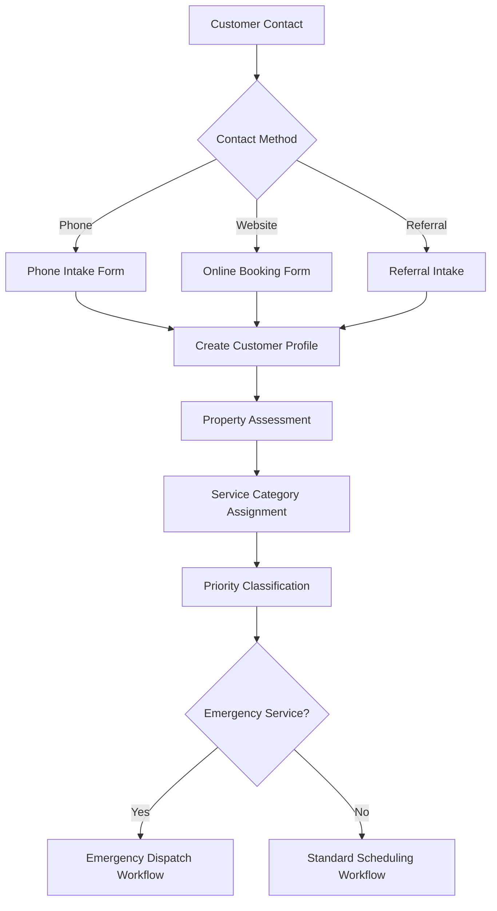
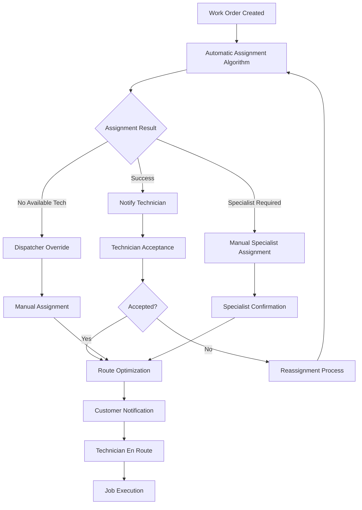
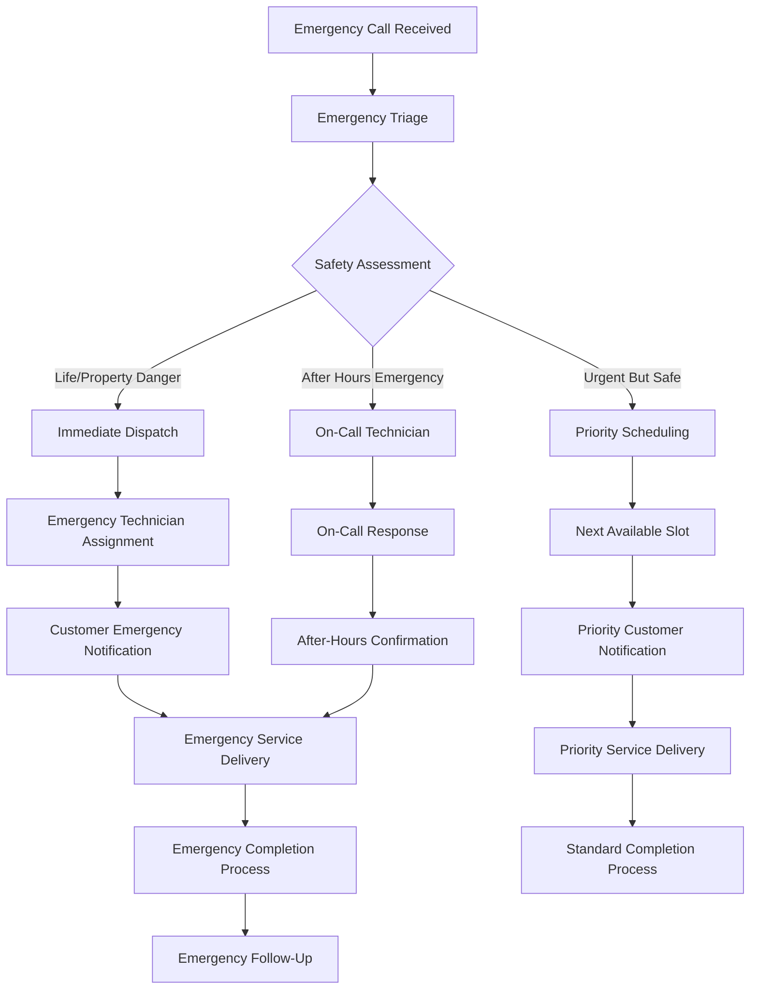
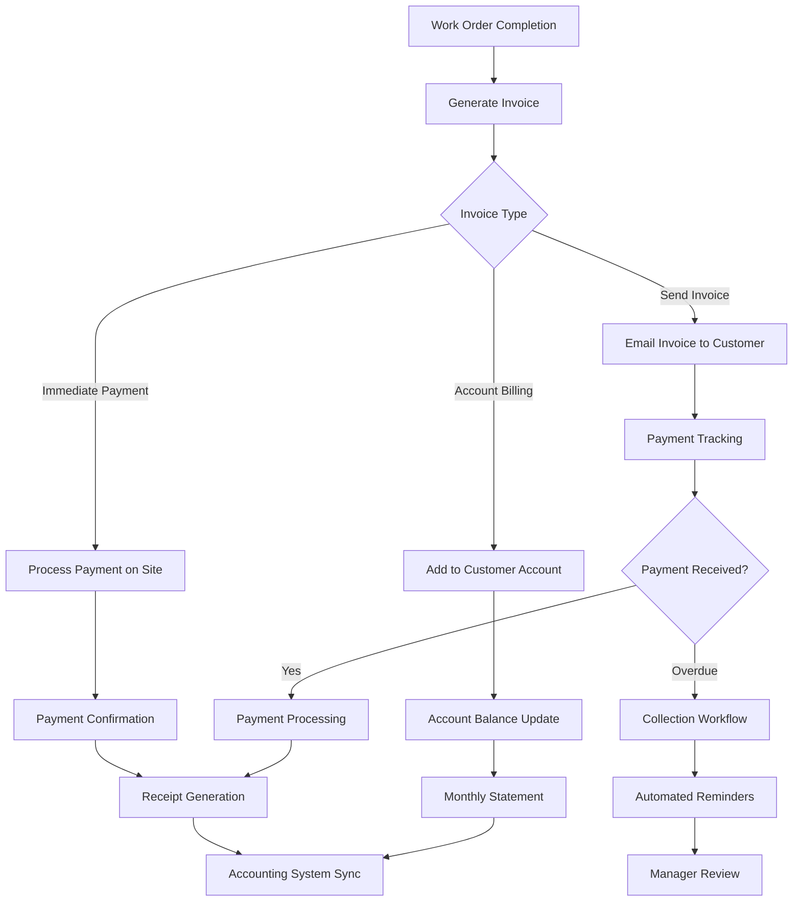

# Home Services Workflows

> **Version**: 1.0.0  
> **Last Updated**: January 2025  
> **Maintained By**: Thorbis Home Services Team  
> **Review Schedule**: Bi-annually  

## Overview

This comprehensive workflow documentation outlines all standard business processes for home services operations within the Thorbis Business OS platform. These workflows are designed to optimize field service delivery, customer satisfaction, and operational efficiency across HVAC, plumbing, electrical, and general maintenance services.

## Core Workflow Categories

### Customer Lifecycle Workflows
- **Lead to Customer**: Converting prospects into customers
- **Service Delivery**: End-to-end service fulfillment
- **Customer Retention**: Ongoing relationship management
- **Emergency Response**: Urgent service request handling

### Operational Workflows
- **Scheduling and Dispatch**: Optimizing technician assignments
- **Inventory Management**: Parts and materials tracking
- **Quality Assurance**: Service quality monitoring
- **Financial Processing**: Billing and payment workflows

## Lead to Customer Workflow

### Initial Customer Contact


### Customer Information Collection
```typescript
interface CustomerIntakeProcess {
  basicInformation: {
    personalDetails: {
      name: 'Full name and preferred name',
      contactInfo: 'Phone, email, secondary contact',
      address: 'Service location with detailed access instructions',
      emergencyContact: 'Alternative contact for emergencies'
    },
    propertyDetails: {
      propertyType: 'Single family, multi-family, commercial',
      ownershipStatus: 'Owner, tenant, property manager',
      accessInstructions: 'Entry codes, key location, special instructions',
      petInformation: 'Pets on property and behavioral notes'
    }
  },
  
  serviceInformation: {
    issueDescription: 'Detailed description of the problem or service needed',
    urgencyLevel: 'Emergency, urgent, routine, scheduled maintenance',
    equipmentInformation: 'Make, model, age of relevant equipment',
    previousService: 'Prior service history with company or others',
    preferredScheduling: 'Time preferences and availability windows'
  },
  
  businessPreferences: {
    communicationMethod: 'Phone, SMS, email preferences',
    invoiceDelivery: 'Email, mail, or in-person preference',
    paymentMethods: 'Credit card, check, financing options',
    marketingOptIn: 'Future promotional communications consent'
  }
}
```

### Lead Qualification Process
```sql
-- Lead Qualification Workflow
CREATE OR REPLACE FUNCTION qualify_lead(
    customer_id UUID,
    service_type VARCHAR,
    urgency_level VARCHAR,
    property_details JSONB
) RETURNS VARCHAR AS $$
DECLARE
    qualification_score INTEGER := 0;
    qualification_result VARCHAR;
BEGIN
    -- Service area check
    IF is_in_service_area(property_details->>'zip_code') THEN
        qualification_score := qualification_score + 25;
    END IF;
    
    -- Service capability check
    IF service_type IN (SELECT unnest(settings->'service_types') FROM businesses WHERE id = (
        SELECT business_id FROM customers WHERE id = customer_id
    )) THEN
        qualification_score := qualification_score + 25;
    END IF;
    
    -- Urgency and availability match
    CASE urgency_level
        WHEN 'emergency' THEN
            IF has_emergency_availability() THEN
                qualification_score := qualification_score + 30;
            END IF;
        WHEN 'urgent' THEN
            IF has_same_day_availability() THEN
                qualification_score := qualification_score + 25;
            END IF;
        ELSE
            qualification_score := qualification_score + 20;
    END CASE;
    
    -- Property accessibility
    IF property_details->>'access_difficulty' = 'standard' THEN
        qualification_score := qualification_score + 20;
    ELSIF property_details->>'access_difficulty' = 'moderate' THEN
        qualification_score := qualification_score + 10;
    END IF;
    
    -- Determine qualification result
    IF qualification_score >= 80 THEN
        qualification_result := 'highly_qualified';
    ELSIF qualification_score >= 60 THEN
        qualification_result := 'qualified';
    ELSIF qualification_score >= 40 THEN
        qualification_result := 'conditionally_qualified';
    ELSE
        qualification_result := 'not_qualified';
    END IF;
    
    -- Log qualification result
    INSERT INTO lead_qualification_logs (
        customer_id, qualification_score, result, created_at
    ) VALUES (
        customer_id, qualification_score, qualification_result, NOW()
    );
    
    RETURN qualification_result;
END;
$$ LANGUAGE plpgsql;
```

## Service Delivery Workflow

### Work Order Creation and Assignment
```typescript
interface WorkOrderWorkflow {
  creation: {
    automaticCreation: {
      triggers: [
        'Qualified lead conversion',
        'Recurring maintenance schedule',
        'Equipment warranty callback',
        'Customer portal booking'
      ],
      dataInheritance: 'Customer profile, property details, service history'
    },
    
    manualCreation: {
      dispatcher: 'Full work order creation with all details',
      manager: 'Priority work order creation with advanced options',
      customer: 'Self-service work order through customer portal'
    }
  },
  
  assignment: {
    automaticAssignment: {
      criteria: [
        'Technician specialization and certifications',
        'Geographic proximity and travel time',
        'Current workload and availability',
        'Customer preference and history'
      ],
      algorithm: 'AI-powered optimization considering multiple factors'
    },
    
    manualAssignment: {
      dispatcher: 'Override automatic assignment with manual selection',
      emergency: 'Immediate assignment to available emergency technician',
      specialist: 'Assignment to specific specialist for complex jobs'
    }
  }
}
```

### Technician Dispatch Process


### Job Execution Workflow
```typescript
interface JobExecutionWorkflow {
  arrival: {
    checkIn: 'GPS-based automatic check-in when arriving at location',
    customerContact: 'Notify customer of arrival via SMS/call',
    siteAssessment: 'Initial assessment and safety evaluation',
    accessConfirmation: 'Verify access to work area and equipment'
  },
  
  diagnostics: {
    problemIdentification: 'Systematic diagnosis using checklists and tools',
    equipmentInspection: 'Comprehensive equipment evaluation',
    safetyCheck: 'Safety hazard identification and mitigation',
    documentationCapture: 'Photos and notes of current condition'
  },
  
  customerConsultation: {
    problemExplanation: 'Clear explanation of issues found',
    solutionOptions: 'Multiple repair/replacement options with costs',
    estimatePresentation: 'Digital estimate with photos and details',
    customerApproval: 'Digital signature for work authorization'
  },
  
  workExecution: {
    partsVerification: 'Confirm parts availability and compatibility',
    workPerformance: 'Execute approved work with quality standards',
    progressUpdates: 'Regular updates to customer and office',
    safetyCompliance: 'Maintain safety protocols throughout work'
  },
  
  completion: {
    qualityInspection: 'Final quality check and testing',
    customerWalkthrough: 'Demonstrate completed work to customer',
    documentationCompletion: 'Final photos and completion notes',
    paymentCollection: 'Process payment and generate receipt',
    followUpScheduling: 'Schedule any necessary follow-up visits'
  }
}
```

### Mobile Workflow Implementation
```typescript
// Mobile App Job Execution Workflow
export class JobExecutionManager {
  private workOrder: WorkOrder;
  private location: GeolocationPosition;
  
  async startJob(workOrderId: string): Promise<void> {
    this.workOrder = await this.fetchWorkOrder(workOrderId);
    await this.performCheckin();
    await this.notifyCustomerArrival();
    await this.startJobTimer();
  }
  
  async performCheckin(): Promise<void> {
    // GPS-based check-in
    this.location = await this.getCurrentLocation();
    
    const checkinData = {
      workOrderId: this.workOrder.id,
      technicianId: this.getCurrentTechnician().id,
      location: this.location,
      checkinTime: new Date(),
      travelDistance: await this.calculateTravelDistance()
    };
    
    await this.api.post('/api/hs/app/v1/work-orders/checkin', checkinData);
    
    // Update work order status
    await this.updateWorkOrderStatus('technician_arrived');
  }
  
  async capturePhotos(stage: PhotoStage): Promise<Photo[]> {
    const photos: Photo[] = [];
    
    for (let i = 0; i < this.getRequiredPhotoCount(stage); i++) {
      const photo = await this.cameraService.capturePhoto({
        quality: 0.8,
        watermark: {
          text: `${this.workOrder.id} - ${stage} - ${new Date().toLocaleString()}`,
          position: 'bottom-right'
        }
      });
      
      // Upload photo with metadata
      const uploadedPhoto = await this.uploadPhoto(photo, {
        workOrderId: this.workOrder.id,
        stage,
        timestamp: new Date(),
        location: this.location
      });
      
      photos.push(uploadedPhoto);
    }
    
    return photos;
  }
  
  async createEstimate(items: EstimateItem[]): Promise<Estimate> {
    const estimate = {
      workOrderId: this.workOrder.id,
      customerId: this.workOrder.customerId,
      items,
      subtotal: this.calculateSubtotal(items),
      tax: this.calculateTax(items),
      total: this.calculateTotal(items),
      validUntil: this.addDays(new Date(), 30),
      createdBy: this.getCurrentTechnician().id
    };
    
    const createdEstimate = await this.api.post('/api/hs/app/v1/estimates', estimate);
    
    // Generate PDF and send to customer
    await this.sendEstimateToCustomer(createdEstimate);
    
    return createdEstimate;
  }
  
  async collectCustomerSignature(signatureType: SignatureType): Promise<Signature> {
    const signature = await this.signatureService.collectSignature({
      title: this.getSignatureTitle(signatureType),
      description: this.getSignatureDescription(signatureType),
      requiredFields: ['name', 'date']
    });
    
    const signatureData = {
      workOrderId: this.workOrder.id,
      type: signatureType,
      signature: signature.dataURL,
      customerName: signature.customerName,
      timestamp: new Date()
    };
    
    return await this.api.post('/api/hs/app/v1/signatures', signatureData);
  }
  
  async completeJob(): Promise<void> {
    // Final quality check
    await this.performQualityCheck();
    
    // Capture completion photos
    await this.capturePhotos('after');
    
    // Generate invoice
    const invoice = await this.generateInvoice();
    
    // Collect payment if required
    if (this.workOrder.paymentRequired) {
      await this.processPayment(invoice);
    }
    
    // Customer satisfaction survey
    await this.sendSatisfactionSurvey();
    
    // Update work order to completed
    await this.updateWorkOrderStatus('completed');
    
    // Sync inventory usage
    await this.syncInventoryUsage();
    
    // Check out and calculate total time
    await this.performCheckout();
  }
}
```

## Emergency Service Workflow

### Emergency Response Process


### Emergency Service Classifications
```typescript
interface EmergencyClassifications {
  level1Critical: {
    description: 'Immediate life safety or major property damage risk',
    responseTime: '60 minutes maximum',
    examples: [
      'Gas leak with odor present',
      'Electrical fire or sparking',
      'Major water leak causing flooding',
      'Complete HVAC failure in extreme weather',
      'Sewage backup in living areas'
    ],
    pricing: 'Emergency rate + after-hours surcharge if applicable',
    technician: 'Immediate dispatch of nearest qualified technician'
  },
  
  level2Urgent: {
    description: 'Significant discomfort or potential damage',
    responseTime: '4 hours maximum',
    examples: [
      'Complete loss of heat/cooling',
      'Major plumbing fixture failure',
      'Power outage in specific areas',
      'Water heater complete failure',
      'Refrigeration system failure'
    ],
    pricing: 'Emergency rate during business hours, surcharge after hours',
    technician: 'Priority scheduling with appropriate specialist'
  },
  
  level3Priority: {
    description: 'Inconvenience but no immediate risk',
    responseTime: '24 hours maximum',
    examples: [
      'Partial HVAC system malfunction',
      'Minor plumbing leaks',
      'Intermittent electrical issues',
      'Appliance performance issues',
      'Comfort system inefficiency'
    ],
    pricing: 'Standard rates with possible urgency fee',
    technician: 'Next available appointment with qualified technician'
  }
}
```

## Recurring Maintenance Workflow

### Preventive Maintenance Scheduling
```typescript
interface PreventiveMaintenanceWorkflow {
  equipmentRegistration: {
    newInstallation: 'Register equipment during installation work orders',
    existingEquipment: 'Customer-provided equipment information',
    importData: 'Bulk import from previous service records'
  },
  
  maintenanceScheduleCreation: {
    manufacturerRecommendations: 'Standard maintenance intervals by equipment type',
    customSchedules: 'Customer-specific maintenance agreements',
    seasonalConsiderations: 'Weather-based scheduling adjustments',
    regulatoryRequirements: 'Code-required inspection schedules'
  },
  
  automaticScheduling: {
    scheduleGeneration: 'Auto-create work orders based on maintenance schedules',
    technicianAssignment: 'Assign based on route optimization and specialization',
    customerNotification: 'Automated reminders and scheduling confirmations',
    reschedulingHandling: 'Flexible rescheduling with minimal disruption'
  }
}
```

### Maintenance Agreement Management
```sql
-- Maintenance Agreement Workflow Functions
CREATE OR REPLACE FUNCTION create_maintenance_agreement(
    customer_id UUID,
    agreement_type VARCHAR,
    service_frequency VARCHAR,
    equipment_ids UUID[],
    start_date DATE
) RETURNS UUID AS $$
DECLARE
    agreement_id UUID := gen_random_uuid();
    equipment_id UUID;
    next_service_date DATE;
BEGIN
    -- Create the maintenance agreement
    INSERT INTO maintenance_agreements (
        id, customer_id, agreement_type, service_frequency,
        start_date, status, created_at
    ) VALUES (
        agreement_id, customer_id, agreement_type, service_frequency,
        start_date, 'active', NOW()
    );
    
    -- Add equipment to the agreement
    FOREACH equipment_id IN ARRAY equipment_ids LOOP
        INSERT INTO agreement_equipment (
            agreement_id, equipment_id, created_at
        ) VALUES (
            agreement_id, equipment_id, NOW()
        );
    END LOOP;
    
    -- Calculate and schedule next service dates
    next_service_date := calculate_next_service_date(start_date, service_frequency);
    
    -- Create initial scheduled work orders
    PERFORM schedule_maintenance_work_orders(agreement_id, next_service_date);
    
    RETURN agreement_id;
END;
$$ LANGUAGE plpgsql;

CREATE OR REPLACE FUNCTION schedule_maintenance_work_orders(
    agreement_id UUID,
    service_date DATE
) RETURNS VOID AS $$
DECLARE
    agreement_record RECORD;
    equipment_record RECORD;
    work_order_id UUID;
BEGIN
    -- Get agreement details
    SELECT * INTO agreement_record 
    FROM maintenance_agreements 
    WHERE id = agreement_id;
    
    -- Create work orders for each piece of equipment
    FOR equipment_record IN 
        SELECT e.* FROM customer_equipment e
        JOIN agreement_equipment ae ON e.id = ae.equipment_id
        WHERE ae.agreement_id = agreement_id
    LOOP
        work_order_id := gen_random_uuid();
        
        INSERT INTO work_orders (
            id, customer_id, business_id, title, description,
            work_order_type, scheduled_date, status, created_at
        ) VALUES (
            work_order_id,
            agreement_record.customer_id,
            (SELECT business_id FROM customers WHERE id = agreement_record.customer_id),
            'Preventive Maintenance - ' || equipment_record.equipment_type,
            'Scheduled maintenance for ' || equipment_record.make || ' ' || equipment_record.model,
            'maintenance',
            service_date,
            'scheduled',
            NOW()
        );
        
        -- Link work order to maintenance agreement
        INSERT INTO work_order_maintenance_agreements (
            work_order_id, agreement_id, created_at
        ) VALUES (
            work_order_id, agreement_id, NOW()
        );
    END LOOP;
END;
$$ LANGUAGE plpgsql;
```

## Inventory and Parts Management Workflow

### Parts Usage and Restocking
```typescript
interface PartsManagementWorkflow {
  jobPlanning: {
    partsEstimation: 'Pre-job parts requirement assessment',
    stockVerification: 'Check truck and warehouse inventory',
    preStaging: 'Stage parts for next-day jobs',
    specialOrders: 'Order specialty parts for scheduled work'
  },
  
  fieldUsage: {
    realTimeTracking: 'Mobile app parts usage logging',
    wasteTracking: 'Track and minimize parts waste',
    customerApproval: 'Customer approval for additional parts needed',
    returnProcessing: 'Handle unused and defective part returns'
  },
  
  restockingProcess: {
    automaticReordering: 'Auto-reorder based on minimum stock levels',
    vendorIntegration: 'Direct ordering from preferred suppliers',
    deliveryScheduling: 'Coordinate deliveries with job schedules',
    qualityControl: 'Incoming parts inspection and verification'
  }
}
```

### Inventory Optimization
```sql
-- Inventory Optimization Functions
CREATE OR REPLACE FUNCTION analyze_parts_usage(
    business_id UUID,
    analysis_period INTERVAL DEFAULT '90 days'
) RETURNS TABLE (
    part_id UUID,
    part_name VARCHAR,
    usage_frequency DECIMAL,
    avg_monthly_usage DECIMAL,
    current_stock INTEGER,
    recommended_stock INTEGER,
    reorder_point INTEGER
) AS $$
BEGIN
    RETURN QUERY
    WITH usage_stats AS (
        SELECT 
            wop.inventory_item_id as part_id,
            ii.name as part_name,
            COUNT(*) as usage_count,
            COUNT(*) / (EXTRACT(days FROM analysis_period) / 30.0) as avg_monthly_usage
        FROM work_order_parts wop
        JOIN work_orders wo ON wop.work_order_id = wo.id
        JOIN inventory_items ii ON wop.inventory_item_id = ii.id
        WHERE wo.business_id = analyze_parts_usage.business_id
        AND wo.completed_date >= NOW() - analysis_period
        GROUP BY wop.inventory_item_id, ii.name
    ),
    stock_levels AS (
        SELECT 
            id as part_id,
            quantity_on_hand as current_stock,
            reorder_point
        FROM inventory_items
        WHERE business_id = analyze_parts_usage.business_id
    )
    SELECT 
        us.part_id,
        us.part_name,
        us.usage_count / EXTRACT(days FROM analysis_period) as usage_frequency,
        us.avg_monthly_usage,
        sl.current_stock,
        CEIL(us.avg_monthly_usage * 2) as recommended_stock,  -- 2 months safety stock
        CEIL(us.avg_monthly_usage * 0.5) as reorder_point     -- Reorder at 2 weeks usage
    FROM usage_stats us
    JOIN stock_levels sl ON us.part_id = sl.part_id
    ORDER BY us.avg_monthly_usage DESC;
END;
$$ LANGUAGE plpgsql;

CREATE OR REPLACE FUNCTION generate_reorder_recommendations(
    business_id UUID
) RETURNS TABLE (
    part_id UUID,
    part_name VARCHAR,
    current_stock INTEGER,
    reorder_point INTEGER,
    recommended_order_quantity INTEGER,
    priority_level VARCHAR
) AS $$
BEGIN
    RETURN QUERY
    WITH reorder_analysis AS (
        SELECT 
            ii.id as part_id,
            ii.name as part_name,
            ii.quantity_on_hand as current_stock,
            ii.reorder_point,
            GREATEST(ii.reorder_quantity, 
                    (SELECT recommended_stock 
                     FROM analyze_parts_usage(business_id) apu 
                     WHERE apu.part_id = ii.id)) as recommended_order_quantity,
            CASE 
                WHEN ii.quantity_on_hand = 0 THEN 'critical'
                WHEN ii.quantity_on_hand <= ii.reorder_point * 0.5 THEN 'urgent'
                WHEN ii.quantity_on_hand <= ii.reorder_point THEN 'standard'
                ELSE 'low'
            END as priority_level
        FROM inventory_items ii
        WHERE ii.business_id = generate_reorder_recommendations.business_id
        AND ii.quantity_on_hand <= ii.reorder_point
    )
    SELECT * FROM reorder_analysis
    ORDER BY 
        CASE priority_level 
            WHEN 'critical' THEN 1
            WHEN 'urgent' THEN 2  
            WHEN 'standard' THEN 3
            ELSE 4
        END,
        part_name;
END;
$$ LANGUAGE plpgsql;
```

## Quality Assurance Workflow

### Service Quality Control
```typescript
interface QualityAssuranceWorkflow {
  preServiceQuality: {
    technicianPreparation: 'Verify technician has required tools and parts',
    customerExpectationSetting: 'Clear communication about service scope and timeline',
    safetyCompliance: 'Confirm all safety protocols are followed',
    equipmentCalibration: 'Ensure diagnostic equipment is properly calibrated'
  },
  
  duringServiceQuality: {
    workStandardsCompliance: 'Adherence to company and industry standards',
    customerCommunication: 'Regular updates and explanation of work being performed',
    propertyProtection: 'Use drop cloths, shoe covers, and protective measures',
    wasteMaterialHandling: 'Proper disposal of waste materials and old parts'
  },
  
  postServiceQuality: {
    workInspection: 'Thorough inspection of completed work',
    systemTesting: 'Comprehensive testing of repaired/installed systems',
    customerEducation: 'Explanation of work performed and maintenance recommendations',
    followUpScheduling: 'Schedule any necessary follow-up visits or maintenance'
  },
  
  qualityMetrics: {
    customerSatisfaction: 'Post-service satisfaction surveys',
    firstCallResolution: 'Percentage of issues resolved in single visit',
    callbackRate: 'Percentage of jobs requiring return visits',
    complianceScores: 'Adherence to quality standards and protocols'
  }
}
```

### Customer Satisfaction Management
```sql
-- Customer Satisfaction Workflow Functions
CREATE OR REPLACE FUNCTION send_satisfaction_survey(
    work_order_id UUID
) RETURNS VOID AS $$
DECLARE
    wo_record RECORD;
    survey_id UUID := gen_random_uuid();
BEGIN
    -- Get work order details
    SELECT wo.*, c.name, c.email, c.phone 
    INTO wo_record
    FROM work_orders wo
    JOIN customers c ON wo.customer_id = c.id
    WHERE wo.id = work_order_id;
    
    -- Create survey record
    INSERT INTO satisfaction_surveys (
        id, work_order_id, customer_id, business_id,
        survey_type, sent_at, status, created_at
    ) VALUES (
        survey_id, work_order_id, wo_record.customer_id, wo_record.business_id,
        'post_service', NOW(), 'sent', NOW()
    );
    
    -- Send survey via preferred communication method
    PERFORM send_survey_communication(survey_id, wo_record);
    
END;
$$ LANGUAGE plpgsql;

CREATE OR REPLACE FUNCTION process_satisfaction_response(
    survey_id UUID,
    responses JSONB
) RETURNS VOID AS $$
DECLARE
    overall_rating INTEGER;
    survey_record RECORD;
BEGIN
    -- Extract overall rating
    overall_rating := (responses->>'overall_rating')::INTEGER;
    
    -- Update survey with responses
    UPDATE satisfaction_surveys SET
        responses = responses,
        overall_rating = overall_rating,
        completed_at = NOW(),
        status = 'completed'
    WHERE id = survey_id
    RETURNING * INTO survey_record;
    
    -- Process low satisfaction scores
    IF overall_rating <= 3 THEN
        PERFORM handle_low_satisfaction(survey_record);
    END IF;
    
    -- Update customer satisfaction history
    INSERT INTO customer_satisfaction_history (
        customer_id, work_order_id, rating, 
        created_at
    ) VALUES (
        survey_record.customer_id, survey_record.work_order_id, 
        overall_rating, NOW()
    );
    
    -- Update technician performance metrics
    PERFORM update_technician_satisfaction_metrics(
        survey_record.work_order_id, overall_rating
    );
    
END;
$$ LANGUAGE plpgsql;
```

## Financial Processing Workflow

### Billing and Payment Process


### Payment Processing Integration
```typescript
interface PaymentProcessingWorkflow {
  paymentMethods: {
    creditCard: {
      onSite: 'Mobile card reader for immediate payment',
      online: 'Secure online payment portal',
      recurring: 'Automated recurring payment setup',
      verification: 'Address and CVV verification'
    },
    
    ach: {
      bankTransfer: 'Direct bank account transfers',
      recurringACH: 'Automated monthly/quarterly payments',
      verification: 'Micro-deposit verification process',
      fees: 'Lower processing fees for larger amounts'
    },
    
    check: {
      onSite: 'Check acceptance with mobile deposit',
      mailed: 'Traditional mailed check processing',
      verification: 'Check verification services',
      deposit: 'Automated deposit processing'
    },
    
    financing: {
      creditApproval: 'Real-time financing approval',
      partnerIntegration: 'Integration with financing partners',
      promotionalRates: 'Special financing offers',
      paperwork: 'Digital financing agreement signing'
    }
  }
}
```

This comprehensive workflow documentation provides detailed guidance for all major business processes in home services operations, ensuring consistent service delivery, operational efficiency, and customer satisfaction across all service categories.