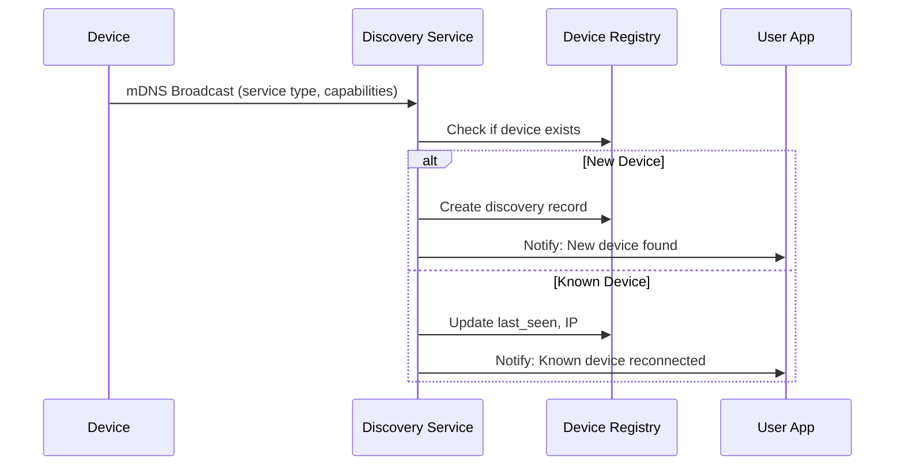

# Thorbis Hardware Device Pairing Flows

Comprehensive device pairing, authentication, and lifecycle management for Thorbis Business OS hardware integration.

## Core Pairing Architecture

### Overview
- **Zero-config discovery**: Devices auto-discovered via mDNS/Bonjour
- **Signed session authentication**: JWT-based device sessions with tenant scoping
- **Self-test verification**: Automated hardware validation during pairing
- **Ephemeral security**: No long-term secrets stored on devices
- **Industry agnostic**: Works across HS, Restaurant, Auto, Retail verticals

### Device Registry Schema

```typescript
interface DeviceRegistryEntry {
  // Core Identity
  device_id: string                    // hw_device_{uuid}
  tenant_id: string                    // Business/organization ID
  device_type: HardwareDeviceType      // thermal_printer | kds_display | barcode_scanner | payment_terminal
  
  // Discovery & Network
  mac_address: string                  // Physical network identifier
  local_ip: string                     // Current LAN IP
  discovery_method: 'mdns' | 'manual' | 'usb' | 'bluetooth'
  network_interface: string            // eth0, wlan0, usb0, etc.
  
  // Device Profile
  manufacturer: string                 // Epson, Star, Zebra, etc.
  model: string                        // TM-T88V, TSP143III, etc.
  firmware_version: string             // Device firmware
  capabilities: string[]               // cut_paper, cash_drawer, two_color, etc.
  
  // Pairing Status
  pairing_status: 'discovered' | 'pairing' | 'paired' | 'expired' | 'revoked'
  paired_at: string                    // ISO timestamp
  paired_by: string                    // User ID who paired device
  last_seen: string                    // Last communication timestamp
  session_expires_at: string           // Session expiration
  
  // Physical Location
  location_name?: string               // "Kitchen Station 2", "Register 3"
  location_tags: string[]              // ['pos', 'kitchen', 'office']
  physical_position?: {                // For KDS/display positioning
    x: number
    y: number
    rotation: number
  }
  
  // Configuration
  print_settings?: {
    paper_width: 58 | 80               // mm
    cut_behavior: 'auto' | 'manual' | 'none'
    drawer_kick: boolean
    logo_enabled: boolean
  }
  display_settings?: {
    brightness: number                 // 1-100
    orientation: 'portrait' | 'landscape'
    timeout_seconds: number
  }
  scanner_settings?: {
    scan_modes: string[]               // ['1d', '2d', 'qr']
    beep_enabled: boolean
    trigger_mode: 'auto' | 'manual'
  }
  
  // Health & Diagnostics
  health_status: 'healthy' | 'warning' | 'error' | 'offline'
  last_self_test: string               // ISO timestamp
  error_count_24h: number
  paper_status?: 'ok' | 'low' | 'out' | 'jam'
  
  // Security
  public_key?: string                  // Device's public key for verification
  certificate_fingerprint?: string    // TLS cert fingerprint
  security_level: 'basic' | 'enhanced' | 'enterprise'
  
  // Metadata
  created_at: string
  updated_at: string
  created_by: string                   // User who registered device
}

type HardwareDeviceType = 
  | 'thermal_printer'
  | 'kds_display' 
  | 'barcode_scanner'
  | 'payment_terminal'
  | 'cash_drawer'
  | 'scale'
  | 'label_printer'
  | 'signature_pad'
```

## Pairing Flow Phases

### Phase 1: Discovery


**Discovery Protocol**:
```
Service Type: _thorbis-hw._tcp.local
TXT Records:
  - device_type=thermal_printer
  - manufacturer=Epson
  - model=TM-T88V
  - capabilities=cut_paper,cash_drawer
  - api_version=1.2
  - pairing_required=true
```

### Phase 2: Pairing Initiation
```typescript
// User initiates pairing in Thorbis app
async function initiatePairing(deviceId: string, userId: string) {
  // 1. Generate pairing challenge
  const pairingChallenge = await generatePairingChallenge(deviceId)
  
  // 2. Display pairing code to user
  const pairingCode = generateHumanReadableCode(pairingChallenge)
  
  // 3. Send pairing request to device
  const pairingRequest: PairingRequest = {
    challenge: pairingChallenge,
    tenant_id: getCurrentTenant(),
    expires_at: new Date(Date.now() + 5 * 60 * 1000), // 5 minutes
    permissions: getDevicePermissions(deviceType),
    callback_url: `https://api.thorbis.com/v1/hardware/pairing-response`
  }
  
  await sendPairingRequest(deviceId, pairingRequest)
  
  return {
    pairing_code: pairingCode,
    expires_in_seconds: 300
  }
}

interface PairingRequest {
  challenge: string
  tenant_id: string
  expires_at: Date
  permissions: string[]
  callback_url: string
}
```

### Phase 3: Device Authentication
```typescript
// Device responds to pairing challenge
interface PairingResponse {
  challenge_response: string           // HMAC of challenge + device secret
  device_certificate?: string         // Optional: device TLS cert
  device_capabilities: DeviceCapability[]
  self_test_results: SelfTestResult[]
}

interface DeviceCapability {
  name: string                        // 'print_receipt', 'cut_paper', etc.
  enabled: boolean
  parameters?: Record<string, any>
}

interface SelfTestResult {
  test_name: string                   // 'paper_feed', 'cutter', 'connectivity'
  status: 'pass' | 'fail' | 'warning'
  details?: string
  timestamp: string
}

async function processPairingResponse(response: PairingResponse) {
  // 1. Verify challenge response
  const isValidResponse = await verifyChallengeResponse(
    response.challenge_response
  )
  
  if (!isValidResponse) {
    throw new Error('PAIRING_CHALLENGE_FAILED')
  }
  
  // 2. Validate self-test results
  const criticalTests = ['connectivity', 'basic_function']
  const failedCriticalTests = response.self_test_results
    .filter(test => criticalTests.includes(test.test_name) && test.status === 'fail')
  
  if (failedCriticalTests.length > 0) {
    throw new Error('DEVICE_SELF_TEST_FAILED', { tests: failedCriticalTests })
  }
  
  // 3. Generate device session token
  const sessionToken = await generateDeviceSession({
    device_id: deviceId,
    tenant_id: tenantId,
    permissions: response.device_capabilities.map(c => c.name),
    expires_in: 24 * 60 * 60 // 24 hours
  })
  
  // 4. Update device registry
  await updateDeviceRegistry(deviceId, {
    pairing_status: 'paired',
    paired_at: new Date().toISOString(),
    capabilities: response.device_capabilities.map(c => c.name),
    last_self_test: new Date().toISOString(),
    session_expires_at: new Date(Date.now() + 24 * 60 * 60 * 1000).toISOString()
  })
  
  return {
    session_token: sessionToken,
    device_config: await getDeviceConfiguration(deviceId)
  }
}
```

### Phase 4: Self-Test Verification

#### Thermal Printer Self-Tests
```typescript
interface ThermalPrinterSelfTest {
  async runSelfTests(): Promise<SelfTestResult[]> {
    const results: SelfTestResult[] = []
    
    // Paper feed test
    try {
      await this.feedPaper(10) // 10mm
      results.push({
        test_name: 'paper_feed',
        status: 'pass',
        timestamp: new Date().toISOString()
      })
    } catch (error) {
      results.push({
        test_name: 'paper_feed', 
        status: 'fail',
        details: error.message,
        timestamp: new Date().toISOString()
      })
    }
    
    // Paper status check
    const paperStatus = await this.checkPaperStatus()
    results.push({
      test_name: 'paper_status',
      status: paperStatus === 'out' ? 'fail' : 'pass',
      details: `Paper status: ${paperStatus}`,
      timestamp: new Date().toISOString()
    })
    
    // Cutter test (if available)
    if (this.capabilities.includes('cut_paper')) {
      try {
        await this.testCutter()
        results.push({
          test_name: 'cutter',
          status: 'pass',
          timestamp: new Date().toISOString()
        })
      } catch (error) {
        results.push({
          test_name: 'cutter',
          status: 'fail', 
          details: error.message,
          timestamp: new Date().toISOString()
        })
      }
    }
    
    // Print quality test
    try {
      await this.printTestPattern()
      results.push({
        test_name: 'print_quality',
        status: 'pass',
        timestamp: new Date().toISOString()
      })
    } catch (error) {
      results.push({
        test_name: 'print_quality',
        status: 'fail',
        details: error.message,
        timestamp: new Date().toISOString()
      })
    }
    
    return results
  }
}
```

#### KDS Display Self-Tests
```typescript
interface KDSDisplaySelfTest {
  async runSelfTests(): Promise<SelfTestResult[]> {
    const results: SelfTestResult[] = []
    
    // Display connectivity
    try {
      await this.ping()
      results.push({
        test_name: 'connectivity',
        status: 'pass',
        timestamp: new Date().toISOString()
      })
    } catch (error) {
      results.push({
        test_name: 'connectivity',
        status: 'fail',
        details: error.message,
        timestamp: new Date().toISOString()
      })
    }
    
    // Screen test pattern
    try {
      await this.displayTestPattern()
      await this.sleep(2000)
      await this.clearScreen()
      results.push({
        test_name: 'display_output',
        status: 'pass',
        timestamp: new Date().toISOString()
      })
    } catch (error) {
      results.push({
        test_name: 'display_output',
        status: 'fail',
        details: error.message,
        timestamp: new Date().toISOString()
      })
    }
    
    // Touch response (if touchscreen)
    if (this.capabilities.includes('touch_input')) {
      try {
        const touchResponse = await this.testTouchResponse()
        results.push({
          test_name: 'touch_response',
          status: touchResponse ? 'pass' : 'fail',
          timestamp: new Date().toISOString()
        })
      } catch (error) {
        results.push({
          test_name: 'touch_response',
          status: 'fail',
          details: error.message,
          timestamp: new Date().toISOString()
        })
      }
    }
    
    return results
  }
}
```

#### Barcode Scanner Self-Tests
```typescript
interface BarcodeScannerSelfTest {
  async runSelfTests(): Promise<SelfTestResult[]> {
    const results: SelfTestResult[] = []
    
    // Scanner connectivity
    try {
      await this.ping()
      results.push({
        test_name: 'connectivity',
        status: 'pass',
        timestamp: new Date().toISOString()
      })
    } catch (error) {
      results.push({
        test_name: 'connectivity',
        status: 'fail',
        details: error.message,
        timestamp: new Date().toISOString()
      })
    }
    
    // Laser/LED test
    try {
      await this.testScanner()
      results.push({
        test_name: 'scanner_hardware',
        status: 'pass',
        timestamp: new Date().toISOString()
      })
    } catch (error) {
      results.push({
        test_name: 'scanner_hardware',
        status: 'fail',
        details: error.message,
        timestamp: new Date().toISOString()
      })
    }
    
    // Decode capability test
    if (this.capabilities.includes('test_decode')) {
      try {
        const testBarcode = await this.decodeTestPattern()
        const expectedValue = "TEST123456789"
        results.push({
          test_name: 'decode_capability',
          status: testBarcode === expectedValue ? 'pass' : 'fail',
          details: `Decoded: ${testBarcode}`,
          timestamp: new Date().toISOString()
        })
      } catch (error) {
        results.push({
          test_name: 'decode_capability',
          status: 'fail',
          details: error.message,
          timestamp: new Date().toISOString()
        })
      }
    }
    
    return results
  }
}
```

## Session Management

### Device Session JWT Claims
```typescript
interface DeviceSessionClaims {
  // Standard JWT claims
  iss: 'thorbis-hardware-service'      // Issuer
  sub: string                          // device_id
  aud: 'thorbis-api'                   // Audience
  exp: number                          // Expiration timestamp
  iat: number                          // Issued at timestamp
  jti: string                          // JWT ID
  
  // Thorbis-specific claims
  tenant_id: string                    // Business/organization
  device_type: HardwareDeviceType
  permissions: string[]                // ['print_receipt', 'cut_paper']
  location_tags: string[]              // ['pos', 'kitchen']
  session_type: 'device'               // Always 'device' for hardware
  
  // Security context
  ip_address: string                   // Device IP for validation
  mac_address: string                  // MAC for additional validation
  pairing_fingerprint: string         // Unique pairing session ID
}

async function generateDeviceSession(params: {
  device_id: string
  tenant_id: string
  permissions: string[]
  expires_in: number
}): Promise<string> {
  const claims: DeviceSessionClaims = {
    iss: 'thorbis-hardware-service',
    sub: params.device_id,
    aud: 'thorbis-api',
    exp: Math.floor(Date.now() / 1000) + params.expires_in,
    iat: Math.floor(Date.now() / 1000),
    jti: generateUniqueId(),
    
    tenant_id: params.tenant_id,
    device_type: await getDeviceType(params.device_id),
    permissions: params.permissions,
    location_tags: await getDeviceLocationTags(params.device_id),
    session_type: 'device',
    
    ip_address: await getCurrentDeviceIP(params.device_id),
    mac_address: await getDeviceMAC(params.device_id),
    pairing_fingerprint: await getPairingFingerprint(params.device_id)
  }
  
  return jwt.sign(claims, getHardwareJWTSecret(), {
    algorithm: 'HS256'
  })
}
```

## Revocation & Rotation

### Device Session Revocation
```typescript
async function revokeDevice(deviceId: string, reason: RevocationReason): Promise<void> {
  // 1. Update device registry
  await updateDeviceRegistry(deviceId, {
    pairing_status: 'revoked',
    revoked_at: new Date().toISOString(),
    revocation_reason: reason
  })
  
  // 2. Add to JWT revocation list
  const deviceSessions = await getActiveDeviceSessions(deviceId)
  for (const session of deviceSessions) {
    await addToRevocationList(session.jti, session.exp)
  }
  
  // 3. Notify device of revocation
  try {
    await sendDeviceCommand(deviceId, {
      command: 'session_revoked',
      reason: reason,
      message: getRevocationMessage(reason)
    })
  } catch (error) {
    // Device may be offline - revocation still effective
    console.log(`Could not notify device ${deviceId} of revocation:`, error)
  }
  
  // 4. Audit log
  await auditLogger.log({
    event: 'device_revoked',
    device_id: deviceId,
    reason: reason,
    tenant_id: await getDeviceTenant(deviceId),
    timestamp: new Date().toISOString()
  })
}

type RevocationReason = 
  | 'user_initiated'          // User manually revoked
  | 'security_compromise'     // Suspected security issue
  | 'device_replaced'         // Hardware replaced
  | 'location_change'         // Device moved to different location
  | 'session_expired'         // Natural expiration
  | 'admin_action'            // Admin/support action
  | 'failed_health_check'     // Device health deteriorated
```

### Session Rotation
```typescript
async function rotateDeviceSession(deviceId: string): Promise<string> {
  const currentSession = await getCurrentDeviceSession(deviceId)
  
  if (!currentSession) {
    throw new Error('No active session to rotate')
  }
  
  // 1. Generate new session with extended expiration
  const newSessionToken = await generateDeviceSession({
    device_id: deviceId,
    tenant_id: currentSession.tenant_id,
    permissions: currentSession.permissions,
    expires_in: 24 * 60 * 60 // 24 hours
  })
  
  // 2. Add old session to revocation list (with grace period)
  await addToRevocationList(
    currentSession.jti, 
    Math.floor(Date.now() / 1000) + (5 * 60) // 5 minute grace period
  )
  
  // 3. Update device registry
  await updateDeviceRegistry(deviceId, {
    session_expires_at: new Date(Date.now() + 24 * 60 * 60 * 1000).toISOString(),
    last_rotation: new Date().toISOString()
  })
  
  // 4. Notify device of new session
  await sendDeviceCommand(deviceId, {
    command: 'session_rotated',
    new_token: newSessionToken,
    grace_period_seconds: 300
  })
  
  return newSessionToken
}

// Automatic rotation schedule
async function scheduleSessionRotation(deviceId: string): Promise<void> {
  const device = await getDeviceRegistry(deviceId)
  const rotationInterval = getRotationInterval(device.security_level)
  
  // Schedule next rotation
  await scheduleJob(`rotate_session_${deviceId}`, {
    delay: rotationInterval,
    job: () => rotateDeviceSession(deviceId)
  })
}

function getRotationInterval(securityLevel: string): number {
  switch (securityLevel) {
    case 'basic': return 7 * 24 * 60 * 60 * 1000  // 7 days
    case 'enhanced': return 24 * 60 * 60 * 1000   // 24 hours  
    case 'enterprise': return 4 * 60 * 60 * 1000  // 4 hours
    default: return 24 * 60 * 60 * 1000
  }
}
```

## Error Recovery & Health Monitoring

### Connection Drop Recovery
```typescript
interface DeviceHealthMonitor {
  private deviceId: string
  private healthCheckInterval: NodeJS.Timeout
  private reconnectAttempts: number = 0
  private maxReconnectAttempts: number = 5
  
  startHealthMonitoring(): void {
    this.healthCheckInterval = setInterval(async () => {
      try {
        const isHealthy = await this.performHealthCheck()
        
        if (!isHealthy) {
          await this.handleUnhealthyDevice()
        } else {
          // Reset reconnect attempts on successful health check
          this.reconnectAttempts = 0
          await this.updateHealthStatus('healthy')
        }
      } catch (error) {
        await this.handleHealthCheckError(error)
      }
    }, 30000) // Check every 30 seconds
  }
  
  private async performHealthCheck(): Promise<boolean> {
    try {
      // 1. Basic connectivity test
      const pingResult = await this.pingDevice(5000) // 5 second timeout
      if (!pingResult) return false
      
      // 2. Device-specific health checks
      const deviceType = await this.getDeviceType()
      
      switch (deviceType) {
        case 'thermal_printer':
          return await this.checkPrinterHealth()
        case 'kds_display':
          return await this.checkDisplayHealth()
        case 'barcode_scanner':
          return await this.checkScannerHealth()
        default:
          return true // Basic connectivity passed
      }
    } catch (error) {
      console.error(`Health check failed for device ${this.deviceId}:`, error)
      return false
    }
  }
  
  private async checkPrinterHealth(): Promise<boolean> {
    try {
      const status = await this.getDeviceStatus()
      
      // Critical: printer offline or paper jam
      if (status.connection === 'offline' || status.paper_status === 'jam') {
        return false
      }
      
      // Warning: low paper (still healthy but needs attention)
      if (status.paper_status === 'low') {
        await this.updateHealthStatus('warning')
      }
      
      return status.connection === 'online'
    } catch (error) {
      return false
    }
  }
  
  private async handleUnhealthyDevice(): Promise<void> {
    this.reconnectAttempts++
    
    if (this.reconnectAttempts <= this.maxReconnectAttempts) {
      console.log(`Attempting reconnection ${this.reconnectAttempts}/${this.maxReconnectAttempts} for device ${this.deviceId}`)
      
      // Progressive backoff: 5s, 10s, 20s, 40s, 80s
      const backoffDelay = Math.min(5000 * Math.pow(2, this.reconnectAttempts - 1), 80000)
      
      setTimeout(async () => {
        try {
          await this.attemptReconnection()
        } catch (error) {
          console.error(`Reconnection attempt ${this.reconnectAttempts} failed:`, error)
        }
      }, backoffDelay)
    } else {
      // Max attempts reached - mark device as offline
      await this.markDeviceOffline()
      await this.notifyDeviceOffline()
    }
  }
  
  private async attemptReconnection(): Promise<void> {
    // 1. Try to re-establish connection
    const reconnected = await this.reconnectDevice()
    
    if (reconnected) {
      // 2. Verify device still paired and session valid
      const sessionValid = await this.validateSession()
      
      if (!sessionValid) {
        // Session expired during downtime - trigger re-pairing
        await this.triggerRepairing()
      } else {
        // 3. Run abbreviated self-test
        await this.runQuickSelfTest()
        await this.updateHealthStatus('healthy')
        
        console.log(`Device ${this.deviceId} successfully reconnected`)
      }
    }
  }
  
  private async markDeviceOffline(): Promise<void> {
    await updateDeviceRegistry(this.deviceId, {
      health_status: 'offline',
      last_error: new Date().toISOString(),
      error_count_24h: await this.incrementErrorCount()
    })
  }
  
  private async notifyDeviceOffline(): Promise<void> {
    const device = await getDeviceRegistry(this.deviceId)
    
    // Notify users/admins of critical device failure
    await sendNotification({
      type: 'device_offline',
      severity: 'high',
      title: `${device.device_type} Offline`,
      message: `${device.location_name || device.device_id} has been offline for ${this.maxReconnectAttempts} connection attempts`,
      tenant_id: device.tenant_id,
      device_id: this.deviceId,
      suggested_actions: [
        'Check device power and network connection',
        'Restart device',
        'Re-pair device if restart doesn\'t resolve'
      ]
    })
  }
}
```

### Paper-Out Recovery
```typescript
interface PaperOutRecovery {
  async handlePaperOutEvent(deviceId: string): Promise<void> {
    // 1. Update device status
    await updateDeviceRegistry(deviceId, {
      paper_status: 'out',
      health_status: 'warning'
    })
    
    // 2. Queue pending print jobs
    const pendingJobs = await getPendingPrintJobs(deviceId)
    for (const job of pendingJobs) {
      await queuePrintJob({
        ...job,
        status: 'queued_paper_out',
        queued_at: new Date().toISOString()
      })
    }
    
    // 3. Notify users
    await sendNotification({
      type: 'paper_out',
      severity: 'medium',
      title: 'Printer Paper Out',
      message: `${await getDeviceLocationName(deviceId)} is out of paper. ${pendingJobs.length} jobs queued.`,
      tenant_id: await getDeviceTenant(deviceId),
      device_id: deviceId,
      actions: [
        { text: 'Mark Paper Replaced', action: 'paper_replaced' }
      ]
    })
    
    // 4. Start paper status monitoring
    this.startPaperStatusMonitoring(deviceId)
  }
  
  async handlePaperReplacedEvent(deviceId: string): Promise<void> {
    // 1. Verify paper is actually loaded
    const paperStatus = await checkPaperStatus(deviceId)
    
    if (paperStatus !== 'ok') {
      throw new Error(`Paper status still shows: ${paperStatus}`)
    }
    
    // 2. Update device status
    await updateDeviceRegistry(deviceId, {
      paper_status: 'ok',
      health_status: 'healthy'
    })
    
    // 3. Process queued print jobs
    const queuedJobs = await getQueuedPrintJobs(deviceId)
    
    for (const job of queuedJobs) {
      try {
        await processPrintJob(job)
        await updatePrintJobStatus(job.id, 'completed')
      } catch (error) {
        await updatePrintJobStatus(job.id, 'failed', error.message)
      }
    }
    
    // 4. Notify completion
    await sendNotification({
      type: 'paper_replaced', 
      severity: 'low',
      title: 'Printer Ready',
      message: `${await getDeviceLocationName(deviceId)} is back online. Processed ${queuedJobs.length} queued jobs.`,
      tenant_id: await getDeviceTenant(deviceId),
      device_id: deviceId
    })
  }
  
  private startPaperStatusMonitoring(deviceId: string): void {
    const interval = setInterval(async () => {
      try {
        const status = await checkPaperStatus(deviceId)
        
        if (status === 'ok') {
          // Paper has been replaced
          clearInterval(interval)
          await this.handlePaperReplacedEvent(deviceId)
        }
      } catch (error) {
        // Device might be offline - continue monitoring
        console.log(`Paper status check failed for ${deviceId}:`, error)
      }
    }, 10000) // Check every 10 seconds
    
    // Stop monitoring after 1 hour
    setTimeout(() => {
      clearInterval(interval)
    }, 60 * 60 * 1000)
  }
}
```

## Test Plan & Validation

### Comprehensive Test Scenarios

#### 1. Paper-Out Recovery Test
```typescript
describe('Paper-Out Recovery', () => {
  test('handles paper out during active printing', async () => {
    // Setup: printer with active print job
    const printer = await setupTestPrinter('thermal_58mm')
    const printJob = await createTestPrintJob('receipt', receiptData)
    
    // Start print job
    const printPromise = printer.print(printJob)
    
    // Simulate paper out mid-job
    await printer.simulatePaperOut()
    
    // Verify: job is queued, status updated, notification sent
    const jobStatus = await getPrintJobStatus(printJob.id)
    expect(jobStatus.status).toBe('queued_paper_out')
    
    const deviceStatus = await getDeviceStatus(printer.deviceId)
    expect(deviceStatus.paper_status).toBe('out')
    expect(deviceStatus.health_status).toBe('warning')
    
    // Simulate paper replacement
    await printer.simulatePaperReplacement()
    
    // Verify: job completes, printer back online
    await expect(printPromise).resolves.toBeDefined()
    
    const finalStatus = await getDeviceStatus(printer.deviceId)
    expect(finalStatus.paper_status).toBe('ok')
    expect(finalStatus.health_status).toBe('healthy')
  })
  
  test('queues multiple jobs when paper out', async () => {
    const printer = await setupTestPrinter('thermal_80mm')
    
    // Simulate paper out
    await printer.simulatePaperOut()
    
    // Submit multiple print jobs
    const jobs = await Promise.all([
      createTestPrintJob('receipt', receiptData1),
      createTestPrintJob('receipt', receiptData2), 
      createTestPrintJob('label', labelData)
    ])
    
    // Verify all jobs are queued
    for (const job of jobs) {
      const status = await getPrintJobStatus(job.id)
      expect(status.status).toBe('queued_paper_out')
    }
    
    // Replace paper and verify all jobs process
    await printer.simulatePaperReplacement()
    await waitForJobsCompletion(jobs.map(j => j.id))
    
    for (const job of jobs) {
      const status = await getPrintJobStatus(job.id)
      expect(status.status).toBe('completed')
    }
  })
})
```

#### 2. Connection Drop Recovery Test
```typescript
describe('Connection Drop Recovery', () => {
  test('recovers from network interruption', async () => {
    const device = await setupTestDevice('kds_display')
    
    // Start health monitoring
    const monitor = new DeviceHealthMonitor(device.deviceId)
    monitor.startHealthMonitoring()
    
    // Simulate network drop
    await device.simulateNetworkDrop()
    
    // Wait for health check failure detection
    await waitForHealthStatus(device.deviceId, 'error')
    
    // Restore network
    await device.simulateNetworkRestore()
    
    // Verify recovery
    await waitForHealthStatus(device.deviceId, 'healthy', 60000) // 1 minute timeout
    
    const deviceStatus = await getDeviceStatus(device.deviceId)
    expect(deviceStatus.connection).toBe('online')
  })
  
  test('handles session expiration during downtime', async () => {
    const device = await setupTestDevice('barcode_scanner')
    
    // Set short session expiration for testing
    await setDeviceSessionExpiration(device.deviceId, 30) // 30 seconds
    
    // Simulate extended network outage
    await device.simulateNetworkDrop(45000) // 45 seconds
    
    // Restore network - session should have expired
    await device.simulateNetworkRestore()
    
    // Verify re-pairing is triggered
    const pairingStatus = await getPairingStatus(device.deviceId)
    expect(pairingStatus.pairing_required).toBe(true)
    
    // Complete re-pairing
    await completeRepairing(device.deviceId)
    
    // Verify device is healthy again
    const finalStatus = await getDeviceStatus(device.deviceId)
    expect(finalStatus.health_status).toBe('healthy')
  })
  
  test('progressive backoff on repeated failures', async () => {
    const device = await setupTestDevice('thermal_printer')
    const monitor = new DeviceHealthMonitor(device.deviceId)
    
    // Track reconnection attempts
    const reconnectAttempts: Date[] = []
    monitor.on('reconnect_attempt', () => {
      reconnectAttempts.push(new Date())
    })
    
    // Simulate persistent connection issues
    await device.simulatePersistentFailure()
    monitor.startHealthMonitoring()
    
    // Wait for max reconnection attempts
    await waitForCondition(() => reconnectAttempts.length >= 5, 300000) // 5 minutes
    
    // Verify progressive backoff timing
    for (let i = 1; i < reconnectAttempts.length; i++) {
      const timeDiff = reconnectAttempts[i].getTime() - reconnectAttempts[i-1].getTime()
      const expectedDelay = Math.min(5000 * Math.pow(2, i-1), 80000)
      expect(timeDiff).toBeGreaterThanOrEqual(expectedDelay - 1000) // Allow 1s tolerance
    }
    
    // Verify device marked offline
    const finalStatus = await getDeviceStatus(device.deviceId)
    expect(finalStatus.health_status).toBe('offline')
  })
})
```

#### 3. Pairing Flow Validation Tests
```typescript
describe('Device Pairing', () => {
  test('complete pairing flow with self-tests', async () => {
    // 1. Discovery phase
    const device = await simulateDeviceDiscovery({
      device_type: 'thermal_printer',
      manufacturer: 'Epson',
      model: 'TM-T88V'
    })
    
    // Verify device discovered
    const discovered = await getDiscoveredDevices()
    expect(discovered.some(d => d.device_id === device.deviceId)).toBe(true)
    
    // 2. Initiate pairing
    const pairing = await initiatePairing(device.deviceId, 'test_user')
    expect(pairing.pairing_code).toMatch(/^\d{6}$/) // 6-digit code
    
    // 3. Device authentication
    const response = await device.respondToPairing(pairing.pairing_code)
    expect(response.session_token).toBeDefined()
    
    // 4. Verify self-tests passed
    const selfTests = await getDeviceSelfTests(device.deviceId)
    const criticalTests = selfTests.filter(t => 
      ['connectivity', 'paper_feed', 'print_quality'].includes(t.test_name)
    )
    expect(criticalTests.every(t => t.status === 'pass')).toBe(true)
    
    // 5. Verify device registered
    const registry = await getDeviceRegistry(device.deviceId)
    expect(registry.pairing_status).toBe('paired')
    expect(registry.capabilities).toContain('print_receipt')
  })
  
  test('pairing fails with invalid challenge response', async () => {
    const device = await simulateDeviceDiscovery({ device_type: 'kds_display' })
    const pairing = await initiatePairing(device.deviceId, 'test_user')
    
    // Simulate invalid response
    await expect(
      device.respondToPairing('invalid_code')
    ).rejects.toThrow('PAIRING_CHALLENGE_FAILED')
    
    // Verify device not paired
    const registry = await getDeviceRegistry(device.deviceId)
    expect(registry.pairing_status).toBe('discovered')
  })
  
  test('pairing fails with failed self-tests', async () => {
    const device = await simulateDeviceDiscovery({ device_type: 'thermal_printer' })
    
    // Configure device to fail critical self-test
    await device.configureSelfTestFailure('connectivity')
    
    const pairing = await initiatePairing(device.deviceId, 'test_user')
    
    await expect(
      device.respondToPairing(pairing.pairing_code)
    ).rejects.toThrow('DEVICE_SELF_TEST_FAILED')
    
    const registry = await getDeviceRegistry(device.deviceId)
    expect(registry.pairing_status).toBe('discovered')
  })
})
```

#### 4. Revocation & Rotation Tests
```typescript
describe('Session Management', () => {
  test('device revocation invalidates session', async () => {
    const device = await setupPairedDevice('barcode_scanner')
    
    // Verify device can make API calls
    const scanResult = await device.performTestScan()
    expect(scanResult.success).toBe(true)
    
    // Revoke device
    await revokeDevice(device.deviceId, 'user_initiated')
    
    // Verify API calls are rejected
    await expect(device.performTestScan()).rejects.toThrow('DEVICE_SESSION_REVOKED')
    
    // Verify registry updated
    const registry = await getDeviceRegistry(device.deviceId)
    expect(registry.pairing_status).toBe('revoked')
  })
  
  test('session rotation maintains functionality', async () => {
    const device = await setupPairedDevice('thermal_printer')
    const oldToken = await device.getSessionToken()
    
    // Perform rotation
    const newToken = await rotateDeviceSession(device.deviceId)
    
    // Update device with new token
    await device.updateSessionToken(newToken)
    
    // Verify device functionality maintained
    const printResult = await device.printTestReceipt()
    expect(printResult.success).toBe(true)
    
    // Verify old token is revoked after grace period
    await sleep(6000) // Wait for 5-minute grace period + buffer
    
    const deviceWithOldToken = await createDeviceWithToken(device.deviceId, oldToken)
    await expect(deviceWithOldToken.printTestReceipt()).rejects.toThrow('DEVICE_SESSION_EXPIRED')
  })
  
  test('automatic rotation based on security level', async () => {
    const enterpriseDevice = await setupPairedDevice('payment_terminal', { 
      security_level: 'enterprise' 
    })
    
    const basicDevice = await setupPairedDevice('thermal_printer', { 
      security_level: 'basic' 
    })
    
    // Monitor rotation schedules
    const enterpriseRotations = await getScheduledRotations(enterpriseDevice.deviceId)
    const basicRotations = await getScheduledRotations(basicDevice.deviceId)
    
    // Enterprise should rotate every 4 hours, basic every 7 days
    expect(enterpriseRotations[0].next_rotation).toBeLessThan(
      Date.now() + (5 * 60 * 60 * 1000) // Within 5 hours
    )
    
    expect(basicRotations[0].next_rotation).toBeGreaterThan(
      Date.now() + (6 * 24 * 60 * 60 * 1000) // More than 6 days
    )
  })
})
```

### Performance & Load Testing

```typescript
describe('Performance Tests', () => {
  test('concurrent print jobs handling', async () => {
    const printer = await setupTestPrinter('thermal_80mm')
    
    // Submit 100 concurrent print jobs
    const jobs = Array.from({ length: 100 }, (_, i) => 
      createTestPrintJob('receipt', { order_id: i })
    )
    
    const startTime = Date.now()
    
    const results = await Promise.allSettled(
      jobs.map(job => printer.print(job))
    )
    
    const endTime = Date.now()
    const duration = endTime - startTime
    
    // Verify all jobs completed successfully
    const successful = results.filter(r => r.status === 'fulfilled').length
    expect(successful).toBe(100)
    
    // Verify reasonable performance (less than 10 seconds for 100 jobs)
    expect(duration).toBeLessThan(10000)
    
    console.log(`100 print jobs completed in ${duration}ms (${duration/100}ms avg)`)
  })
  
  test('device health monitoring under load', async () => {
    const devices = await Promise.all([
      setupTestDevice('thermal_printer'),
      setupTestDevice('kds_display'),
      setupTestDevice('barcode_scanner'),
      setupTestDevice('thermal_printer'),
      setupTestDevice('kds_display')
    ])
    
    // Start health monitoring for all devices
    const monitors = devices.map(device => {
      const monitor = new DeviceHealthMonitor(device.deviceId)
      monitor.startHealthMonitoring()
      return monitor
    })
    
    // Generate load for 5 minutes
    const loadTest = startLoadTest(devices, {
      duration: 5 * 60 * 1000,
      operations_per_second: 10
    })
    
    await loadTest
    
    // Verify all devices maintain healthy status
    for (const device of devices) {
      const status = await getDeviceStatus(device.deviceId)
      expect(status.health_status).toBe('healthy')
    }
    
    // Cleanup
    monitors.forEach(monitor => monitor.stop())
  })
})
```

## Industry-Specific Considerations

### Restaurant Industry
- **KDS Integration**: Kitchen display systems for order management
- **Receipt Printers**: Customer receipts and kitchen tickets
- **Payment Terminals**: POS system integration
- **Scale Integration**: For ingredient measurement and pricing

### Retail Industry  
- **Barcode Scanners**: Product scanning and inventory
- **Label Printers**: Price tags and shipping labels
- **Receipt Printers**: Customer transaction receipts
- **Cash Drawers**: Automated cash management

### Home Services Industry
- **Mobile Printers**: On-site work order and invoice printing
- **Signature Pads**: Customer signature capture
- **Tablet Integration**: Field technician devices
- **Photo Documentation**: Camera integration for before/after photos

### Auto Services Industry
- **Diagnostic Equipment**: OBD-II scanner integration
- **Part Scanners**: Inventory and parts identification
- **Work Order Printers**: Service documentation
- **Payment Processing**: Mobile payment acceptance

## API Integration Examples

### Print Job API
```typescript
// POST /api/v1/hardware/print
interface PrintJobRequest {
  device_id: string
  template_type: 'receipt' | 'label' | 'ticket' | 'invoice'
  data: Record<string, any>
  options?: {
    copies?: number
    paper_cut?: boolean
    cash_drawer?: boolean
    priority?: 'low' | 'normal' | 'high'
  }
}

// Example usage
const printJob = await thorbisSdk.hardware.print({
  device_id: 'hw_device_printer_001',
  template_type: 'receipt',
  data: {
    order_id: 'ord_123',
    items: [...],
    total: 45.99,
    payment_method: 'credit_card'
  },
  options: {
    copies: 1,
    paper_cut: true,
    cash_drawer: false
  }
})
```

### Device Status API
```typescript
// GET /api/v1/hardware/devices/{device_id}/status
interface DeviceStatusResponse {
  device_id: string
  health_status: 'healthy' | 'warning' | 'error' | 'offline'
  connection: 'online' | 'offline'
  last_seen: string
  
  // Device-specific status
  printer_status?: {
    paper_status: 'ok' | 'low' | 'out' | 'jam'
    temperature: 'normal' | 'high'
    cutter_status: 'ok' | 'error'
  }
  
  display_status?: {
    brightness: number
    active_content: string
    touch_responsive: boolean
  }
  
  scanner_status?: {
    scan_engine: 'ready' | 'scanning' | 'error'
    last_scan: string
    battery_level?: number
  }
}
```

This comprehensive pairing flow system provides enterprise-grade device management with security, reliability, and comprehensive error recovery for all Thorbis hardware integrations.
