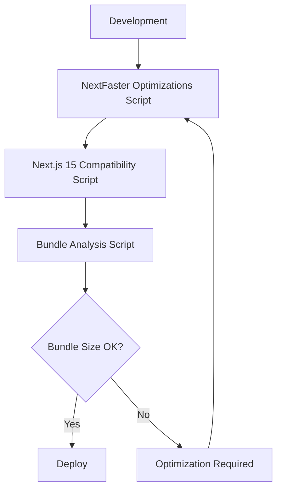
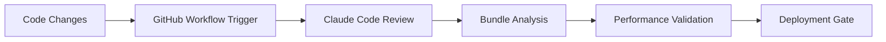
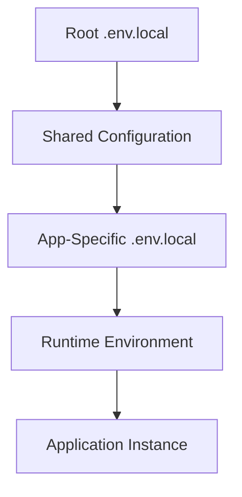

# Thorbis Business OS Infrastructure Documentation

## Overview

This directory contains comprehensive documentation for all critical infrastructure files that power the Thorbis Business OS development, deployment, and maintenance pipeline. These files ensure NextFaster compliance, automate performance optimization, and maintain security across the entire monorepo.

## Infrastructure Architecture

### Core Components

```
thorbis-business-os/
├── scripts/                    # Automation and optimization scripts
│   ├── bundle-analysis.js     # NextFaster performance enforcement
│   ├── apply-nextfaster-optimizations.js  # Performance optimization automation
│   └── fix-nextjs15-configs.js           # Next.js compatibility maintenance
├── .github/workflows/         # CI/CD and automation workflows  
│   ├── claude-code-review.yml # Automated PR code review
│   └── claude.yml            # Interactive Claude Code assistance
├── .env.local                # Central environment configuration
├── apps/ai/.env.example      # AI app configuration template
├── apps/ai/.env.local        # AI app development configuration
└── .gitignore               # Comprehensive file exclusion patterns
```

## Documentation Files

### 1. [Bundle Analysis Script](./BUNDLE-ANALYSIS-SCRIPT.md)
**NextFaster Performance Compliance Enforcement**
- 170KB JavaScript budget enforcement
- 50KB CSS budget compliance
- Multi-app bundle size monitoring
- CI/CD performance validation
- Optimization recommendation engine

### 2. [NextFaster Optimizations Script](./NEXTFASTER-OPTIMIZATIONS-SCRIPT.md)
**Automated Performance Implementation**
- Next.js configuration generation with performance settings
- Webpack optimization for 170KB budget compliance
- Stale-while-revalidate caching implementation
- Code splitting and tree shaking automation
- Performance monitoring tool integration

### 3. [Next.js 15 Compatibility Script](./NEXTJS15-COMPATIBILITY-SCRIPT.md)
**Framework Compatibility Maintenance**
- Deprecated configuration removal
- Configuration syntax migration
- Server external packages configuration
- Build system compatibility validation

### 4. [GitHub Workflows](./GITHUB-WORKFLOWS.md)
**CI/CD Pipeline and AI-Powered Development**
- Automated Claude Code review workflow
- Interactive development assistance
- Performance validation integration
- Security-first workflow configuration

### 5. [Environment Configuration](./ENVIRONMENT-CONFIGURATION.md)
**Comprehensive Configuration Management**
- Central environment variable management
- App-specific configuration inheritance
- Security best practices and credential management
- Production deployment procedures

### 6. [Git Ignore Configuration](./GITIGNORE-CONFIGURATION.md)
**Repository Optimization and Security**
- Monorepo-aware file exclusion patterns
- Performance optimization through file exclusion
- Security-first sensitive data prevention
- Development workflow optimization

## System Integration

### NextFaster Compliance Pipeline



### Performance Monitoring Flow



### Configuration Management Hierarchy



## Key Features & Benefits

### Performance Optimization
- **Sub-300ms Navigation**: NextFaster methodology enforcement
- **170KB JavaScript Budget**: Strict bundle size compliance
- **Automated Optimization**: Script-based performance improvements
- **Continuous Monitoring**: Real-time performance validation

### Development Experience
- **AI-Powered Reviews**: Claude Code integration for automated code review
- **Interactive Assistance**: @claude mentions for development help
- **Automated Workflows**: GitHub Actions for CI/CD automation
- **Configuration Management**: Centralized environment variable management

### Security & Compliance
- **Sensitive Data Protection**: Comprehensive .gitignore patterns
- **Environment Variable Security**: Secure credential management
- **Audit Trail**: Complete workflow and change tracking
- **Access Control**: Role-based permissions and review processes

### Monorepo Architecture Support
- **Multi-App Coordination**: Works across all industry-specific apps
- **Shared Package Management**: Consistent configuration across packages
- **Scalable Workflows**: Supports growing application portfolio
- **Centralized Maintenance**: Single point of configuration management

## Usage Patterns

### Development Workflow
```bash
# 1. Apply NextFaster optimizations
node scripts/apply-nextfaster-optimizations.js

# 2. Fix Next.js compatibility issues
node scripts/fix-nextjs15-configs.js

# 3. Validate bundle sizes
node scripts/bundle-analysis.js

# 4. Run full build validation
pnpm build
```

### Performance Monitoring
```bash
# Check specific app performance
node scripts/bundle-analysis.js --app=hs

# Enforce performance budgets (CI/CD mode)
node scripts/bundle-analysis.js --enforce

# Analyze bundle composition
pnpm bundle:analyze
```

### Environment Management
```bash
# Copy environment template
cp .env.example .env.local

# Validate environment configuration
SKIP_ENV_VALIDATION=false pnpm build

# App-specific environment setup
cd apps/ai && cp .env.example .env.local
```

## Integration Points

### Next.js Applications
- **App Router**: Full Next.js 15 App Router support
- **Server Components**: Optimal server/client component balance
- **Image Optimization**: AVIF/WebP format support
- **Performance Headers**: Stale-while-revalidate caching

### Database Integration
- **Supabase**: Multi-tenant database with Row Level Security
- **Type Safety**: Generated TypeScript types
- **Real-time**: Live data synchronization
- **Storage**: File upload and management

### AI Services
- **Anthropic Claude**: Primary AI provider integration
- **Voyage AI**: Embeddings and vector search
- **Tool Execution**: Business logic automation
- **Performance Monitoring**: AI usage tracking

### Development Tools
- **Turbo**: Monorepo build orchestration
- **pnpm**: Package management and workspace support
- **TypeScript**: Strict type checking and validation
- **ESLint/Prettier**: Code quality and formatting

## Maintenance Procedures

### Regular Updates
1. **Weekly**: Monitor bundle size trends across all apps
2. **Monthly**: Review and update environment configurations
3. **Quarterly**: Rotate API keys and secrets
4. **Per Release**: Validate Next.js compatibility

### Performance Monitoring
1. **Continuous**: Bundle size validation in CI/CD
2. **Daily**: Performance metric collection
3. **Weekly**: Optimization opportunity identification
4. **Monthly**: Performance trend analysis

### Security Audits
1. **Continuous**: Automated security scanning
2. **Weekly**: Environment variable audit
3. **Monthly**: Access control review
4. **Quarterly**: Comprehensive security assessment

## Troubleshooting

### Common Issues

#### Bundle Size Violations
```bash
# Check current bundle sizes
node scripts/bundle-analysis.js

# Identify largest contributors
pnpm bundle:analyze

# Apply optimizations
node scripts/apply-nextfaster-optimizations.js
```

#### Configuration Issues
```bash
# Fix Next.js compatibility
node scripts/fix-nextjs15-configs.js

# Validate environment
SKIP_ENV_VALIDATION=false pnpm build

# Check workflow status
gh workflow list
```

#### Development Environment
```bash
# Reset development environment
rm -rf node_modules .next
pnpm install
pnpm dev

# Validate configuration files
pnpm lint:config
```

### Support Channels

- **GitHub Issues**: Bug reports and feature requests
- **Claude Code**: Interactive development assistance via @claude
- **Documentation**: Comprehensive guides in `/docs` directory
- **Workflow Logs**: GitHub Actions execution history

## Future Roadmap

### Planned Enhancements
- **Advanced Performance Monitoring**: Real-time performance dashboards
- **Automated Optimization**: ML-powered optimization recommendations  
- **Enhanced Security**: Advanced credential management integration
- **Extended AI Integration**: More sophisticated development assistance

### Architecture Evolution
- **Microservice Support**: Enhanced multi-service architecture
- **Edge Computing**: CDN and edge optimization
- **Real-time Monitoring**: Live performance and error tracking
- **Advanced Caching**: Intelligent caching strategies

## Related Resources

- [CLAUDE.md](../../CLAUDE.md) - Project-specific Claude Code instructions
- [Monorepo Architecture](../business-docs/core/API-ARCHITECTURE.md) - System architecture overview
- [Security Guidelines](../business-docs/core/SECURITY-ARCHITECTURE.md) - Security architecture documentation
- [Performance Optimization](../business-docs/training/customer-success/PERFORMANCE-OPTIMIZATION.md) - Performance best practices

This infrastructure documentation provides the foundation for maintaining, optimizing, and scaling the Thorbis Business OS development pipeline while ensuring performance, security, and developer experience excellence.